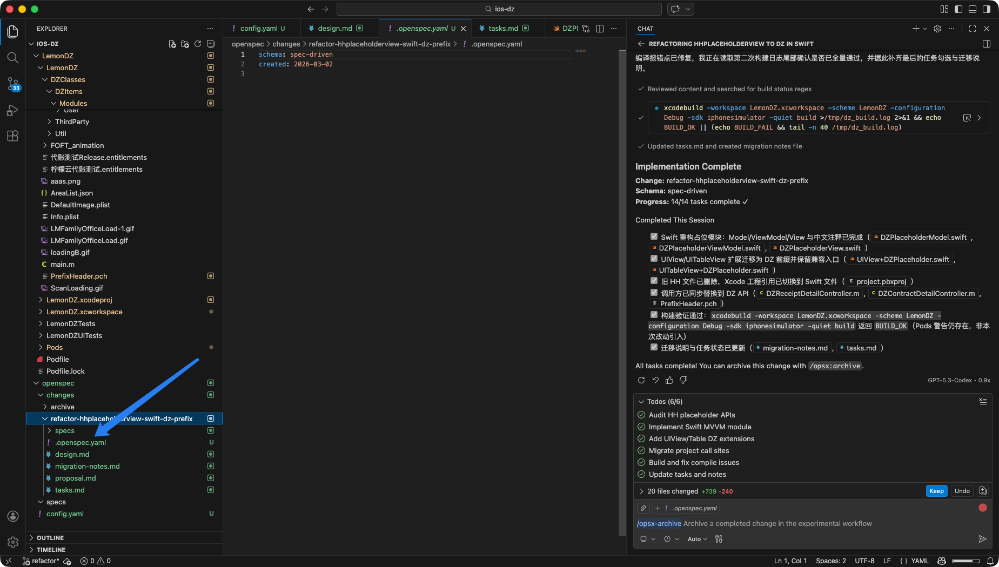
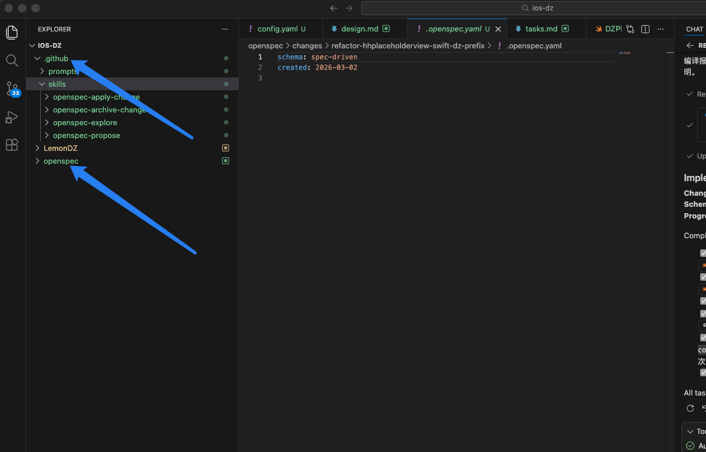

# OpenSpec

即适合0-1的项目，又适合1-N的项目。它是一个专门用于解决AI编程中“幻觉”或需求偏移问题的规范驱动开发工具，核心是“先定规范，再写代码”。

下面的表格整理了它的核心信息和主要用途：

| 项目         | 说明                                                         |
| :----------- | :----------------------------------------------------------- |
| **是什么**   | 一个用于AI智能体（如Claude Code、Cursor、GitHub Copilot等）的**开源、轻量级规范驱动开发框架和命令行工具**。 |
| **核心思想** | **规范驱动开发**：在动手写代码之前，先与AI共同撰写并锁定一份机器可读的详细规范（Spec），作为开发的“唯一事实来源”。 |
| **主要用途** | 1. **AI辅助开发项目管理**：为每个功能变更提供结构化的提案、审查、实施、归档流程。<br>2. **提升代码一致性**：确保AI生成的代码严格遵循既定规范，减少偏差。<br>3. **现有项目维护**：特别擅长在已有代码库中修改或增加功能（1→n开发）。 |
| **工具无关** | 支持主流的AI编程助手，不锁定特定工具。                       |

### 🛠️ 快速开始使用 OpenSpec
它的使用流程非常清晰，分为四个阶段：

1.  **安装与初始化**
    首先确保安装了 Node.js (版本 ≥ 20.19.0)，然后通过命令行安装并初始化 OpenSpec：
    
    ```bash
    # 使用 Homebrew 安装 Node.js，而 npm 会作为其中的一部分一并安装好 。
    brew install node
    # 验证安装：
    node -v
    npm -v
    
    # 1. 全局安装CLI工具
    npm install -g @fission-ai/openspec@latest
    # 2. 进入你的项目目录
    cd your-project
    # 3. 初始化，它会创建 openspec/ 目录并配置AI助手
    openspec init
    ```
    
2.  **起草变更提案**
    在你的AI编程助手（如Cursor的聊天框）中，使用命令或自然语言描述你想要的功能。例如：“`/openspec:proposal 添加用户登录功能`”。AI会根据你的描述，在 `openspec/changes/` 目录下生成一个包含 `proposal.md` (提案)、`tasks.md` (任务清单) 和 `spec.md` (规范详情) 的结构化文件夹。

3.  **审查与对齐**
    仔细检查AI生成的规范文件，与你的AI助手讨论并进行修改，直到所有人对“要构建什么”达成一致。你可以使用 `openspec show <变更名>` 来查看详情。

4.  **实施与归档**
    
    - **实施**：使用命令如 `“/openspec:apply <变更名>”`，AI会严格依据锁定好的 `tasks.md` 和 `spec.md` 来编写代码，极大减少偏离。
    - **归档**：代码完成并验证后，使用 `“/openspec:archive <变更名>”` 命令。该操作会将本次变更中批准的规范内容，合并更新到总的“事实来源”目录 `openspec/specs/` 中，标志着本次变更闭环。

## 命令和操作流程

所有的命令都是在commands文件夹下。

- `/opsx:explore`：无结构地思考想法
- `/opsx-new`：新建需求提案。
  - 创建skill工作流：spec-driven（提案 --> 设计 --> 规格 -->任务）
    1. proposal.md：提案（草案）
    2. design.md：设计（将提案详细化，做成一个设计）
    3. specs：规格
    4. tasks：任务清单
  
- `/opsx-continue`：一步一步去做。
- `/opsx-ff`：fast forward一次性全部做完。
- `/opsx-apply`：实现task.md里的任务。
- `/opsx-archive`：讲上面四步的文件放到archive文件夹。
- 完成部署spec更新。归档完成会更新spec说明。

```
简单明确需求:
/opsx:new ──► /opsx:ff ──► /opsx:apply ──► /opsx:verify ──► /opsx:archive
需求表达不出来:
/opsx:explore ──► /opsx:new ──► /opsx:continue ──► ... ──► /opsx:apply ──► /opsx:archive
```

推荐开发流程： 

1. 先 /opsx:explore，提出完整需求，让AI帮助补充意见。
1. 然后 /opsx:ff 创建好所有 artifact 文档，并人工审核，继续和AI沟通调整，AI会修改所有 artifact，直到没有需要调整的点。
1. /opsx:apply 让AI写代码。
1. 人工测试验证，继续修改需求或debug，如果AI更新代码后没有同步更新 artifact 文档，最后要人工补充一句：“更新所有文档”，以确保和代码同步。
1. 所有测试验证完毕后，手工将 tasks.md 中的 测试验证部分 标记为 【x】，再 /opsx:archive。注意：一旦 archive 后，就只能新开一个 change 了。

### 关于修改

只要变更**尚未归档**，其所有的工件（Artifacts）都是可以迭代和修改的。

#### 1. 如果是修改已有的设计或计划
可以直接编辑变更目录下的相关文件，OpenSpec 的工作流完全支持这种迭代。
*   **修改 `proposal.md`**：只是一个初始草案，目的是快速搭建框架。自己可以根据实际需求调整内容，使其更贴合项目目标。
*   **修改 `design.md`**：更新技术方案或决策。
*   **修改 `tasks.md`**：增加、删除或调整实施任务清单。
*   **操作建议**：直接使用文本编辑器修改对应的 `*.md` 文件即可。

#### 2. 如果是增加新的功能需求
如果“修改需求”意味着在已有的规范（Specs）基础上增加新的要求，需要更新变更目录下的增量规范文件（Delta Specs）。
*   **定位文件**：找到 `openspec/changes/<你的变更名>/specs/<相关能力>/spec.md` 文件。
*   **编辑内容**：在该文件中，根据需求的性质，在对应的操作区添加内容：
    *   **新增功能**：在 `## ADDED Requirements` 区块下添加新的 `### Requirement` 及其 `#### Scenario`。
    *   **修改现有功能**：在 `## MODIFIED Requirements` 区块下，**完整地**重写修改后的需求内容（包含所有场景），OpenSpec 会进行内容级别的替换，而不是打补丁。
    *   **删除功能**：在 `## REMOVED Requirements` 区块下列出要删除的需求名称。

#### 重要提示：修改后的归档
当完成所有修改并通过 `openspec validate <change-id>` 验证格式后，最终归档（`openspec archive <change-id>`）时，系统会自动将你变更目录 `specs/` 下的增量内容，合并更新到主规范目录 `openspec/specs/` 中。因此，**只要变更还没归档，就依然处于可以反复修改的“草稿”状态，放心调整即可。**


### `/opsx-propose`和`/opsx-explore`

`/opsx:explore` 和 `/opsx:propose` 代表了在**动手编码之前**两个不同的阶段。主要区别在于：`/opsx:explore` 是一个只读的、无固定形式的**思考模式**，而 `/opsx:propose` 则是创建一个具体变更的**第一步**。

为了让你更清晰地理解，我把它们的具体区别整理成了下面的表格：

| 维度           | `/opsx:explore` (探索模式)                                   | `/opsx:propose` (提议模式，实际指 `/opsx:new`)               |
| :------------- | :----------------------------------------------------------- | :----------------------------------------------------------- |
| **核心目的**   | **自由思考、调研和澄清问题**。它是一个“思考伙伴”，帮助你在动手前理清思路。 | **启动一项新工作**。它标志着一次**变更（Change）**的正式开始。 |
| **主要动作**   | - **只读操作**：可以阅读代码、搜索项目、绘制ASCII图表、比较不同方案。<br>- **禁止**：绝对不允许编写任何实现代码。 | - **创建目录**：在 `openspec/changes/` 下创建一个以变更名称命名的新文件夹。<br>- **生成元数据**：创建 `.openspec.yaml` 文件来记录变更的基本信息（如使用的Schema）。 |
| **产出物**     | 没有强制性的产出物。可能会产生一些想法的记录、对话摘要或ASCII图表，但**不会创建**标准的OpenSpec工件（如`proposal.md`）。 | **创建变更结构**。运行后，你会在文件系统里看到一个为这次变更准备的新目录，但此时里面可能还是空的或者只有配置文件，还没有具体的规划文档。 |
| **工作流位置** | **完全可选**的前置阶段。可以在开始任何变更之前使用，也可以在变更进行到一半时（例如通过`/opsx:explore <change-name>`）用来重新审视某个问题。 | **所有变更的起点**。它是任何新工作的第一个正式命令，是进入规划阶段的入口。 |
| **用户意图**   | “我对**XX功能**有个模糊的想法，帮我分析一下可行性。”<br>“帮我比较一下用**Redis**和**内存缓存**的优缺点。” | “我们开始做**用户登录功能**吧。”<br>“为**修复支付Bug**创建一个新变更。” |

简单来说，你可以把 `/opsx:explore` 想象成一张**草稿纸**，你可以随意在上面写写画画、计算推演，但最终不会把它交出去。而 `/opsx:propose`（通过 `/opsx:new` 命令实现）则是在你决定好之后，正式创建一个**文件夹**，准备往里面填写正式的提案文档。

## config.yaml

`config.yaml`上下文会**主动注入到每个 OpenSpec 规划请求中**。这意味着你的项目约定、技术栈和规则在 AI 创建产物时始终存在。可靠性更高。

因为上下文会注入到每个请求中，你需要保持简洁。专注于真正重要的内容：

- 技术栈和关键约定
- AI 需要知道的非显而易见的约束
- 之前经常被忽略的规则

根据你的项目要求，我来帮你编写一个完整的 `openspec/config.yaml` 配置文件。这个配置会让 AI 在生成所有代码时都遵循你的技术栈和规范。

## 📁 完整的 config.yaml 配置

```yaml
# OpenSpec 项目配置文件
schema: spec-driven  # 使用 spec-driven 工作流

# 项目背景信息 - 会注入到所有 AI 生成的指令中
context: |
  # 技术栈要求
  - 编程语言: Swift
  - UI 布局: SnapKit (纯代码布局，不使用 Storyboard 或 XIB)
  - 架构模式: MVVM (Model-View-ViewModel)
  - 注释要求: 所有代码必须包含中文注释
  
  # MVVM 架构规范
  - Model: 负责数据模型和业务逻辑
  - View: 负责 UI 展示，使用 SnapKit 构建约束
  - ViewModel: 负责视图状态和业务逻辑处理，使用数据绑定机制
  
  # SnapKit 使用规范
  - 所有 UI 约束必须使用 SnapKit 的链式语法
  - 优先使用 makeConstraints，需要更新时使用 updateConstraints
  - 约束定义在 setupUI 方法中统一管理
  
  # 代码注释规范
  - 类/结构体定义前必须添加注释说明其用途
  - 复杂方法必须添加注释说明参数、返回值和功能
  - 关键业务逻辑必须有注释说明
  - 属性定义前添加注释说明其作用
  
  # 文件组织规范
  - 每个模块按 MVVM 分层组织: ModuleName/View/, ModuleName/ViewModel/, ModuleName/Model/
  - 文件命名规范: 功能名+类型，如 LoginView.swift, LoginViewModel.swift

# 特定产出物的规则要求
rules:
  proposal:  # 提案文档规则
    - "必须说明新功能涉及哪些 MVVM 组件"
    - "必须说明 UI 布局的复杂度和 SnapKit 约束方案"
    - "必须评估对现有代码的影响"
  
  design:    # 设计文档规则
    - "必须提供完整的 ViewModel 接口定义"
    - "必须包含关键 UI 组件的 SnapKit 约束示例"
    - "必须说明数据流向和绑定方式"
    - "必须包含中文注释示例"
  
  change:    # 变更文档规则
    - "必须列出新增的 MVVM 组件文件"
    - "必须包含关键代码片段和注释"
    - "必须说明 SnapKit 约束的实现细节"
  
  review:    # 审查文档规则
    - "重点检查 MVVM 职责划分是否清晰"
    - "检查 SnapKit 约束是否合理"
    - "确认中文注释是否充分且准确"
```

## 💡 配置说明

### 1. context 字段详解
这是最核心的部分，整合了所有要求：

- **技术栈声明**：明确 Swift、SnapKit、MVVM 的组合
- **架构规范**：详细说明 MVVM 各层的职责
- **代码规范**：SnapKit 使用方式和注释要求
- **文件组织**：方便 AI 生成符合项目结构的代码

### 2. rules 字段详解
针对不同产出物设置特定要求：

- **proposal**：用于新功能提案阶段，确保前期设计考虑周全
- **design**：用于技术设计文档，指导具体的实现方案
- **change**：用于代码变更说明，记录实现细节
- **review**：用于代码审查，确保质量

## 🚀 使用效果

配置生效后，当你运行 OpenSpec 命令时：

1. **生成新功能提案**：
   
   ```bash
   openspec new proposal "添加用户登录功能"
   ```
   生成的提案会自动包含 MVVM 组件分析和 SnapKit 约束方案的说明。
   
2. **生成代码变更**：
   
   ```bash
   openspec new change "实现登录界面"
   ```
   生成的代码会：
   - 使用 Swift 语言
   - 按照 MVVM 分层创建文件
   - UI 约束使用 SnapKit
   - 包含中文注释

## 📝 建议的后续步骤

1. **保存配置**：将上面的内容保存到 `openspec/config.yaml`
2. **验证配置**：运行 `openspec status` 检查配置是否生效
3. **开始使用**：运行 `openspec new proposal "你的功能"` 开始第一个任务

这个配置确保了 AI 生成的所有内容都符合你的技术栈要求。如果你需要调整某些规则，随时可以再次修改这个文件，修改后立即生效。

### 某个需求模块的单独规则



## 代码提交

`.github`文件夹不需要提交，因为`OpenSpec`版本可能不一样。只提交openspec文件夹。


