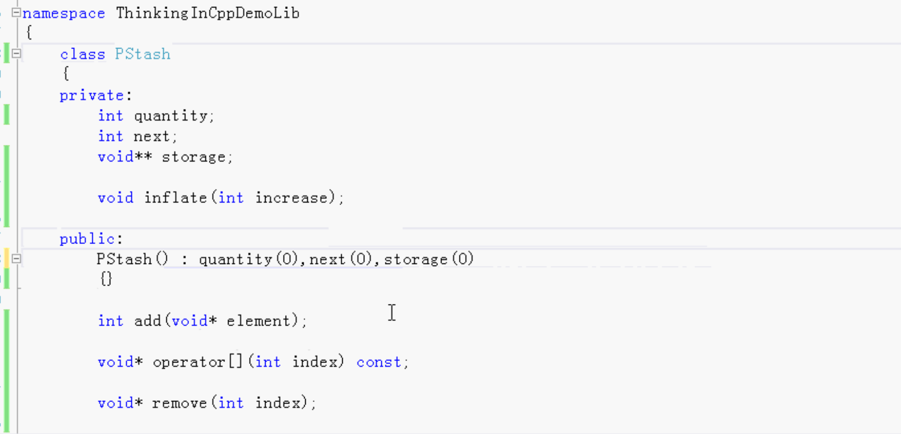
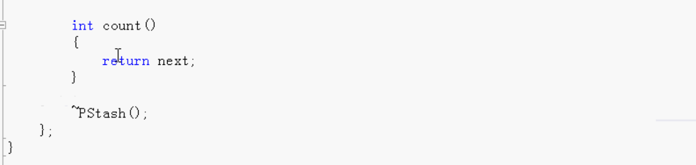
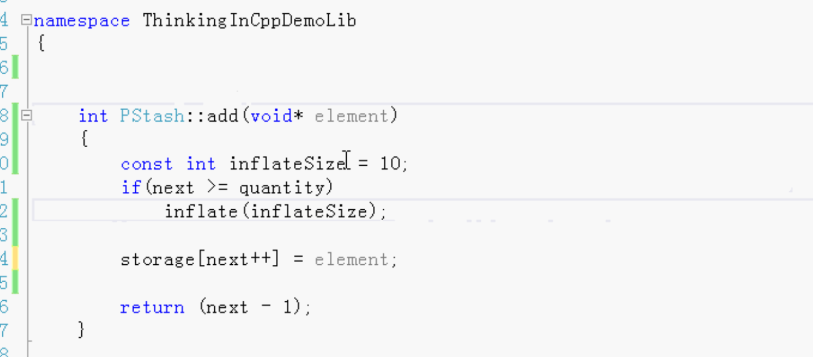
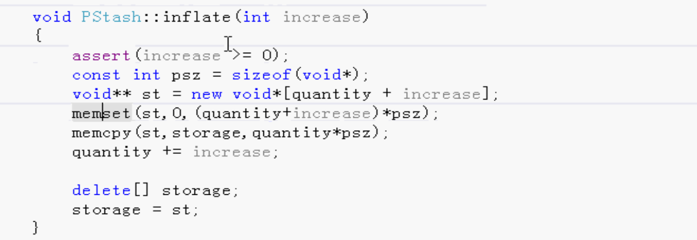
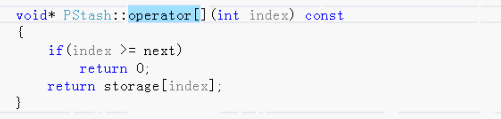
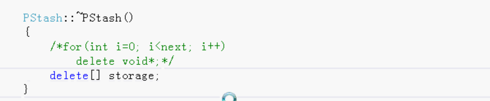
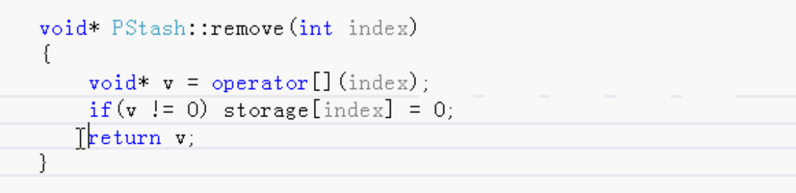
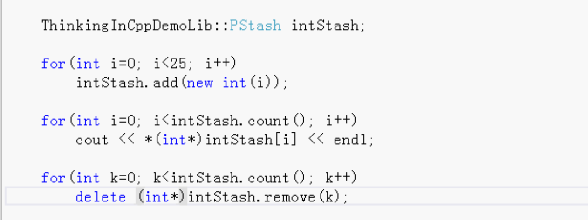
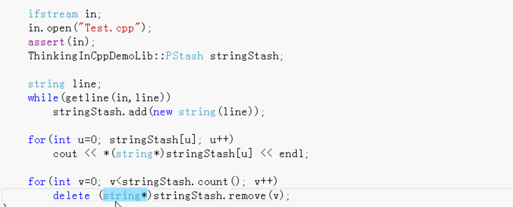

# 指针的stash

### 以前的Stash

```c++
struct Stash
{
    int size;// 每一个是多大。存字符串的话就是最多的存多少字符。
    int quantity;// 数量。一共可以保存多少个。
    int next;// 已经保存了多少个。
    unsigned char* storage;// 指针
};
```

### 指针的Stash

```c++
PStash
{
    int quantity;
    int next;
    void* storage; //通过指针 在堆上动态的创建对象。
};
```

指针的stash，用void*  

通过指针 在堆上动态的创建对象，分配内存。可以是整型数据，字符串数据等各种类型。

普通的stach有size大小，指针的stach没有size，因为是void*  大小是一个指针的大小。

### .h头文件





使用remove移除。因为里面有void*，delete的时候 可能不走析构函数

### .m源文件

### add添加数据



add先判断大小。不够了需要重新分配内存。增大内存。

#### 追加内存的方法：



把原来的数据copy到新的内存里。原来的内存空间删除。

### 读取数据：

像操作数组那样根据下标读取数据

重写方法 

下标操作符重载



### 析构函数

析构函数不能delete动态创建的对象 void*

delete由客户端去delete，谁使用谁delete。因为析构函数中delete void*有问题。



所以做一个remove。客户端可以使用remove，通过operator拿到指定下标的指针然后进行delete。



把指针返回并且清零。

客户端拿到指针，进行delete。

### 调用测试：



读取文件，把文件的内容一行一行的add到stash中，然后读取出来，最后通过remove函数拿到指针，delete释放内存。




C++还有更好的方法	使用模版代替void *


