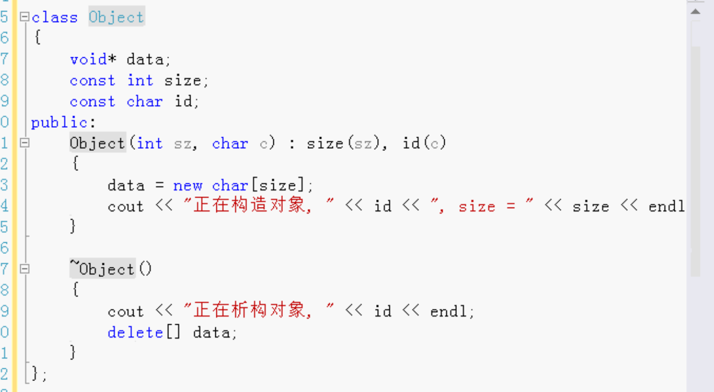
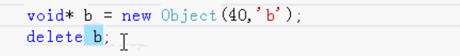

# delete_可能会出错

## C++常见出错：delete忘了写，new和delete必须成对出现

## delete void* 可能会出错

- 除非void* 指针所指向的内容非常简单，否则可能会出错
- 因为delete void* 不执行析构函数
- 经验
  - 如果程序中发现内存丢失的情况，那么就搜索所有的delete语句，如果delete删除的是void* 类型，则可能是引起内存丢失的原因。


void* 是万能指针。可以用来指向任意类型的数据。

做设计的时候就喜欢用void* 类型，因为可以做通用存储类型，操作所有类型的数据。

## 例：

定义一个类Object

- id  标识
- 构造函数
  - 构造函数里 new 创建对象
- 析构函数
  - 构造函数有new所以析构函数需要delete



### 调用：

```
Object *a = new Object(40, 'a');//new就调用构造函数

delete a;//上面new了就需要delete。不会内存泄漏
```

可能会出错情况：



new了会创建对象，调用构造函数。 delete做了delete操作但是**不会调析构函数**。上面例子中的data动态分配的内存就没有delete释放掉，只delete了b。所以就有内存泄漏。

b不是指向简单类型的数据。

总结：

上面的new一个Object就是分配一个内存，Object里面又有一个data，构造函数里又new一个data。不会调用析构函数则data会不释放。内存泄漏。


