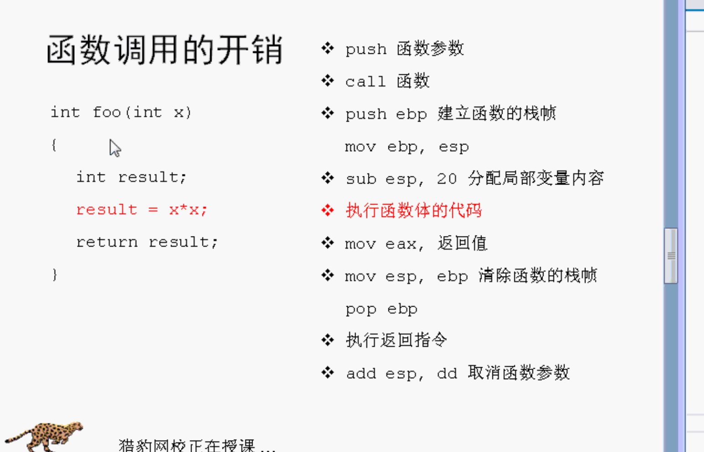
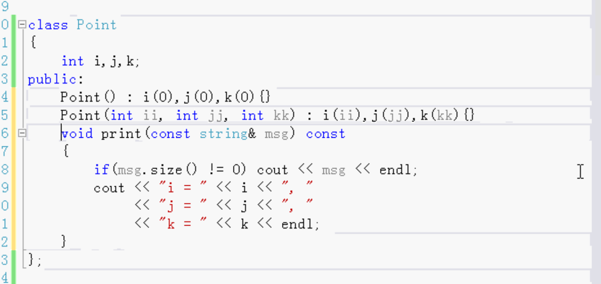
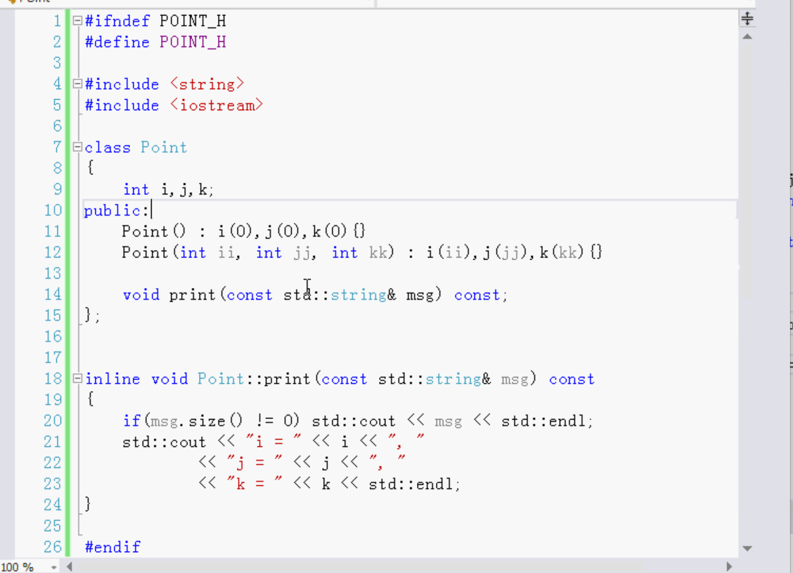

- 函数调用的开销
- 预处理器宏的优点和缺点
- inline
- 类内部的内联函数

### 内联函数与宏函数

C++为了和C语言一样快，而做的措施。

内联函数是其中的一种。

在所有的语言中，C语言是最快的。

预处理器宏 是C语言里的。优点是快，但是也有缺点。

宏函数有缺点。

## 函数调用的开销：

在函数中调用其他函数。

每一次函数调用 都有开销。电脑CPU都要做操作。

准备操作 执行操作 收尾操作。

C语言有预处理器宏。预处理函数。使得C语言运行很快。

预处理宏 一般大写。 在C语言里也把它叫函数。

要多加一些小括号。避免发生错误。

和普通函数不一样。

在预处理阶段进行了文本替换。而不是再写一个函数，避免函数调用的开销，所以就快。

有缺点，因为是普通文本替换，容易出错。

所以C++提供更好的方法：内联函数。

内联函数和预处理宏函数速度一样。

在函数前面加inline 那就是内联函数。其他的都不用变。

C++编译的时候，检查保证没有错误，然后进行替换。也不是函数调用，没有调用的开销。

C预处理宏 没有办法进行检查，因为是在预处理阶段。

C++inline函数取代C语言的宏函数。

C++ inline更安全。

## 内联函数不一定内联

- 函数过大
- 函数递归
- 语法不对
- 编译器没有启用内联，或没有内联功能

内联函数不能写成像普通函数那样 一个声明 一个定义。

内联函数只能有一个，写在最前面。

内联函数 不需要源文件，只写在头文件里。不能分成两部分。和普通函数不一样。

## 类内部的内联函数：

C++的功能 

宏函数是不可能写在类里

类的成员函数没有宏函数这样的。

类中只能写inline 内联函数。

根据需要写内联函数

比较小的函数写成内联函数，例如简单的构造函数，比较大的写了也没有用 函数里面代码很多的时候，可以写 但是写了C++编译器也不做内联。

在类里面定义的 就是内联函数，前面不需要加inline。

一个类 普通情况下：

头文件写声明 源文件写定义。

如果写内联函数的话就不能在源文件中写了。

普通函数可以放在.cpp源文件中，把内联函数放到头文件中。或者直接写到类的内部。

头文件中 要写std::   名称空间