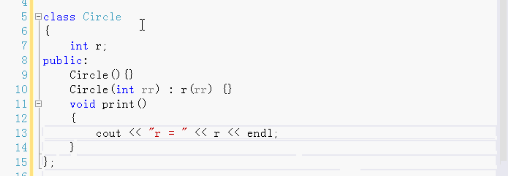
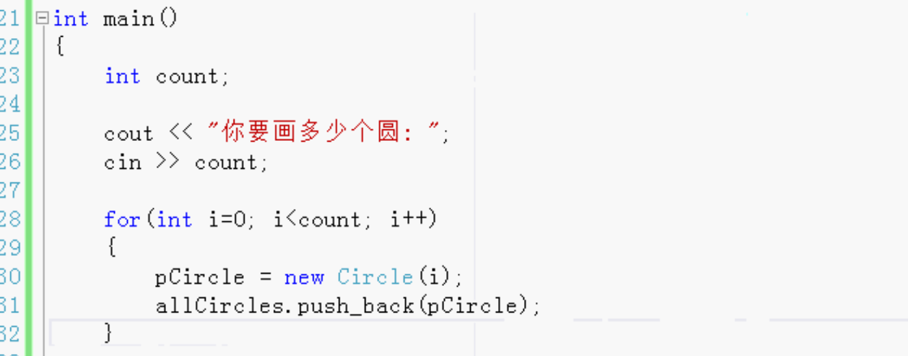
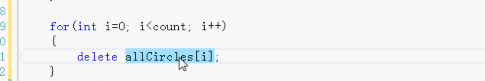
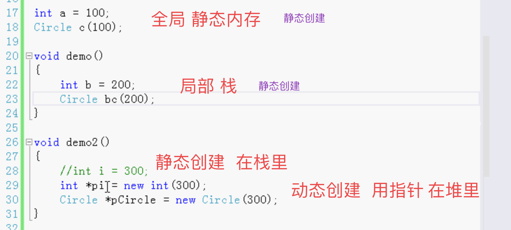
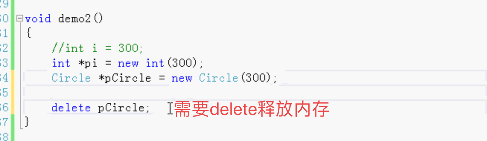
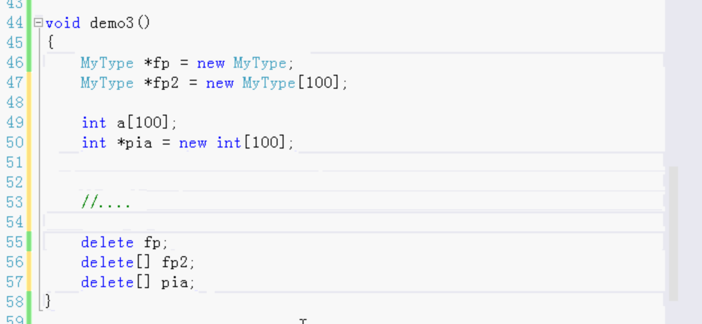

# 动态创建对象

有些程序设计需要用动态创建对象

例：

1. 开发空中交通指挥软件，有可能指挥很多飞机，有时候飞机多，有时候飞机少，需要动态创建对象的方法。

2. 一个网络软件，规模可能很大可能很小，都需要使用动态创建对象。

- C语言动态内存分配
  - malloc()
  - free()
- C++动态创建对象
  - new
  - delete
  - delete[]

例：word中创建表格，表格可能大也可能小，根据行数和列数大小动态创建。

或者画图，有可能画很多圆，不可能知道用户会画多少个圆，所以需要使用动态创建对象的方法，根据用户操作创建对象。非常灵活。

例子：

画圆

定义一个圆类

- 半径
- 构造函数

动态的创建

动态的创建就需要指针。定义一个指针。

用vector保存起来，存的都是指针

用new创建的返回的是指针

根据输入的个数，动态创建圆对象。

动态的创建 使用new，返回的是一个指针。

用new操作符就可以动态的创建对象。

动态创建对象是在堆里。

内存有三个重要的部分，是编程中用到的。

1. 静态内存

   不能动态创建对象

2. 栈

   不能动态创建对象

3. 堆

   只有堆上可以动态分配内存创建对象

全局变量在静态内存

当程序开始运行时就存在。程序结束时才消失。生命期很长。

局部变量在栈里。

在堆里 用指针。基本类型也可以用指针动态的创建。自定义类型和基本类型都可以用new动态创建。

动态创建是在运行的时候在堆上创建的，全局变量在静态内存和局部变量在栈里是编译的时候创建的。

demo中，当作用域函数结束之后，C++会自动结束变量生命。自动释放销毁，收回内存。

动态创建的，当作用域结束之后，C++不回自动收回。必须自己写delete，删除。

可以在析构函数是否被调用测试是否被销毁。

使用了new不delete的话。内存泄漏。电脑死机。

动态创建对象非常的灵活，既可以动态创建对象，也可以动态创建数组。

数组指针指向的是数组中的第一个元素对象。释放的时候只delete的话只是释放的第一个。需要使用delete[]，把所有的元素对象都释放掉。

