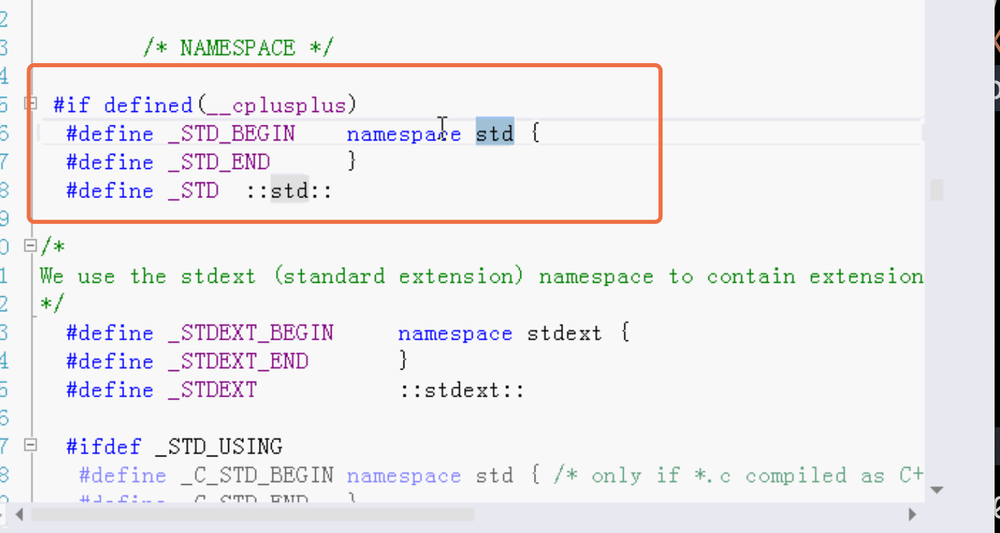
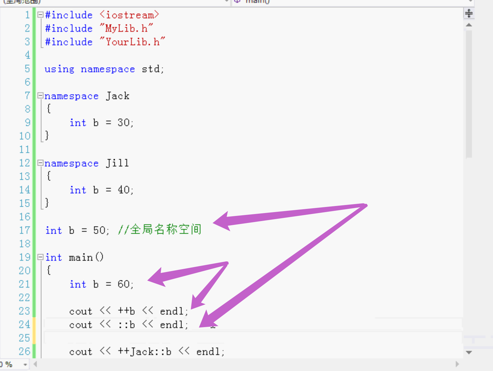
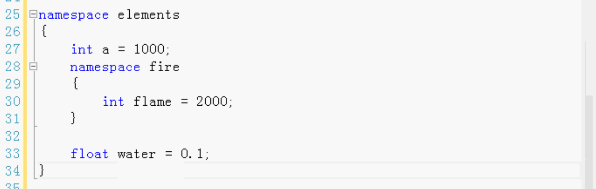
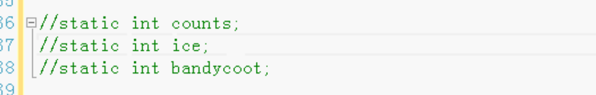
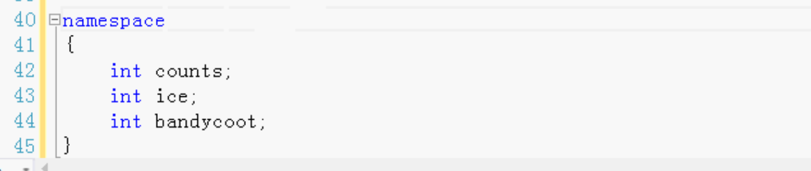

# 名称空间

- namespace，使用名称空间避免名称发生冲突
- 使用名称空间避免名称发生冲突
  - 全局函数名称
  - 全局变量名称
  - 全局类名
  - 全局结构名
  - 全局枚举名
  - 全局联合名
- 全局的名称空间
- 嵌套的名称空间
- 未命名的名称空间

主要是类 结构 枚举等名字的冲突。

C语言没有名称空间。

如果是全局的，可能会重名。

第三方 别人做好的，引用之后可能和自己的重名，所以做dll的时候创建名称空间。要有名称空间。

写的文件中要加入名称空间。自己定义一个名称空间的名字。然后一对大括号。这就是名称空间。

大括号后面没有分号。

然后把整个类（也可以是函数，变量等）的代码放到大括号里。

```
namespace MyDemoLib
{

}
```

不同的文件可以定义相同的名称空间的名字。那么这两个是同一个名称空间。

一个名称空间可以分开写，也可以写在不同的文件中。

.h .m都加上名称空间。


# 名称空间：

- 创建名称空间
- 使用名称空间的三种方法
  - using指令
  - using声明
  - 完全限定名称

#### 使用的时候：

在使用类的时候就必须用上名称空间。

### using指令：

```
using namespace <#名称空间的名字#>
```

例如：

系统的std命名空间

点进源文件可以找到源文件：




### using声明：

using指令不是很好的 会把所有的都导入进来

最好是用什么导入什么。

```
using <#名称空间的名字#> <#用到的名称空间里的名称#>
```

比using指令好，using指令会把名称空间所有的名称都导进来。

### 完全限定名称：

使用的时候吧名称空间的名称写上，加上四个点`::`	范围解析。


当把一个类放到名称空间里，它的完整的名：名称空间的名加上它自己的名。

名称空间里的变量也是 先写上名称空间的名，四个点，然后再加上变量的名。这就是它的全名。完全限定名。


完全限定名比较啰嗦，写的东西比较多一些。


完全限定名比较长，可以用一个临时的别名替换。简单一些。

例：

```
namespace <#别名#> = <#长的名称空间名#>;
namespace TIC = ThinkingInCppDemoLib;
```


#### 特殊情况：

如果在头文件里，使用cout，那么就不能写`using namespace std;`

因为这样写会把std所有文件都导进来，这个头文件又会被其它源文件多次包含。

在头文件不要使用using，头文件里使用完全限定名。

在源文件可以。


## 名称空间：

主要目的是避免名称冲突。

多人开发，用相同的名称就会冲突。

每个人都定义全局变量`extern int a;`


两个文件都定义同一个名字的类class。同一个名字的全局变量a。就会发生重定义，重名报错问题。

要想避免重名，可以使用名称空间，我写的加一个名称空间，你写的加一个名称空间。名称空间相当于作用域。

头文件和源文件都要加头文件保护：.h和.m都要加上下面这两行。C++会把它俩合成一个名称空间。

```
namespace MyLib
{
///中间写代码
}
```

全部变量不是全局变量，是名称空间里的。

使用的时候先写名称空间再写名字。中间四个点`::`。


名称空间可以避免发生冲突。


在同一个文件里可以定义多个不同的名称空间。



全局名称空间的可以直接使用，但是如果有同名的局部的变量，那么全局的就加上四个点`::`。

全局名称空间 没有名称。直接四个点。

名称空间可以分开写，写几个。在一个文件写几个，也可以写在多个文件。C++会合并在一起。

一个名称空间可以嵌套另一个名称空间。




#### 静态变量：

C语言：



C++：没有名称的名称空间，未命名的名称空间




用C++做dll，给别人用的时候，要使用名称空间。因为要避免使用的人的名称和dll里的名称冲突。

多人开发也使用名称空间。