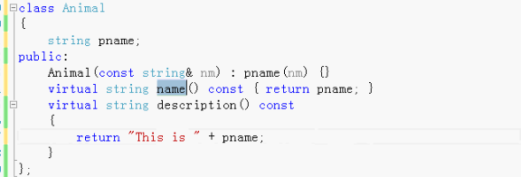
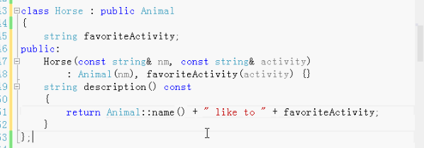
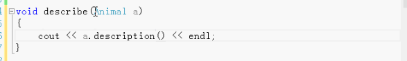
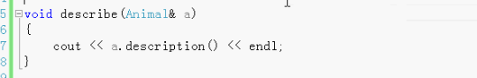
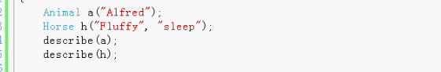

# 多态性和虚函数

封装、继承、多态（面向对象的三个重要特性）

实现多态的三个条件

1. 要有继承
2. 要有虚函数的重写
3. 要有父类指针（引用）指向子类对象

多态可以使用（调用）后来人写的代码。

C语言的指针和C十十的多态 柤抗横

指针 地址 赋值

多态是在继承的基础上通过向上类型转换同时使用虚函数。使用了虚函数，C++就做晚绑定。

## 乐器演奏音乐

### 乐器基类

创建一个乐器类class

不需要用乐器创建对象，那么就可以把乐器类做成抽象类。

抽象类：虚函数是纯虚函数。

抽象类不能创建对象。抽象类可以用来做接口使用。把它的子类传进来向上类型转换，转变成抽象基类的类型。抽象类是做接口使用的。用来做接口的抽象基类可以是纯抽象类可以不是纯抽象类。

一般情况下，纯虚函数不需要定义函数体。特殊的情况可以给纯虚函数做纯虚定义。

### 管乐器，弦乐器，打击乐器

不同类别的乐器做成乐器类的子类：  弦乐器（琴，吉他）， 管乐器（小号）， 打击乐器（鼓）

管乐器又分木管乐器和铜管乐器

- 成员函数 play 参数是枚举（低音，中音，高音）

管乐器继承乐器类，重写play方法。

### 全局函数

创建一个全局函数t，参数是乐器类，调用乐器类play某个音调（中调C）。

### 调用

创建一个具体的管乐器对象，调用全局函数t参数具体的传管乐器对象，因为全局函数t的参数是乐器类型，所以会向上类型转换。这里还是调用的乐器基类的play。

只需要把乐器基类中的play变成虚函数（前面加`virtual`），虚函数可以被重新定义，重写。这样全局函数t参数传管乐器对象，就会调用管乐器的play方法。这就实现了多态。

继承把继承下来的虚函数重写，重写的时候可以写virtual可以不写，一般不写。

木管乐和铜管乐继承管乐器，可以重写play方法。因为play方法是虚函数。

可以创建不同的乐器对象，调用全局函数t参数传不同的乐器对象，调用乐器对象的play方法。

多态就是同一个方法，不同的子类有各自的实现。

需要多态就做成虚函数。不需要多态就不需要做成虚函数。

## 早绑定 晚绑定

虚函数就是晚绑定。在运行的时候才判断调用哪个函数，而不是编译的时候。

早绑定是编译时进行绑定。编译时就知道函数如何调用。

## VTABLE、VPTR

C++实现晚绑定通过一个虚表，虚指针，在虚表里找方法。

一个类只要有虚函数，C++就会给这个类创建一个虚表VTABLE。

子类继承基类，基类有虚函数，子类也会把虚函数继承下来。

当这些类创建对象的时候，因为类有一个虚表，创建的对象里就有一虚指针VPTR，通过虚指针在运行的时候动态的查看虚表，在虚表里查找应该调用哪个函数。

C++内部使用的是虚表虚指针，实现晚绑定，体现多态。

C++为每一个有虚函数的类设置VTABLE初始化VPTR，为虚函数的调用插入一些代码。这些都是自动的。编程的时候只需要在基类里写virtual，子类里一般不写，写了显得多余。

使用了虚函数的类会比没有使用的稍微慢一点。

一般情况下，做面向对象编程可以多使用虚函数多态，不会慢。更好的程序设计，扩展性更强。

这样就可以不改变原来的类而改变方法的实现，继承添加新的类。调用的都是自己实现的方法。灵活可扩展性强的程序设计。

- 抽象基类和纯虚函数
- 纯抽象类
- 纯虚定义
- 对象切片：传值和传地址是不同的

可以把虚函数做成纯虚函数，如果基类里有纯虚函数，那么这个基类就是抽象基类。

不能够使用抽象基类创建对象，基类做接口使用，可以把基类所有成员函数做成纯虚函数，那个这个基类就是纯抽象类。

有普通虚函数的类就不是纯抽象类。

纯抽象类和非纯抽象类都是做接口使用。

#### 宠物

两个纯虚函数

- eat
- speek

可以在宠物类的外部做eat，speak定义。这两个纯虚定义不是做多态用的，只是把公共的方法放在这里。可以被多个子类重复调用。

#### 使用的时候 用继承 

#### 狗继承宠物类

重写eat和speek虚函数，方法的实现中调用宠物基类的eat，speek两个公共方法的实现。

#### 猫继承宠物类

重定义虚函数，调用公共代码。

## 对象切片

多态必须是传地址，也就是传指针或引用。传值的就不是多态。

#### Animal

- 构造函数
- 虚函数

#### Horse（马）继承Animal

- 自己的数据成员
- 构造函数 （ 初始化列表中 初始化基类）
- 虚函数重写

##### 使用

使用的时候做一个多态

多态必须用指针或者引用，如果直接传值就不是多态，因为传值会产生对象切片，就不是多态。

不是多态：

这种不是多态，是错误的。

这种是多态：

测试：

第一种不会调用Horse的describe，调用的是基类的describe方法实现，所以不是多态。

第二种会调用Horse的describe，是多态。

子类继承的基类，又添加自己特有的，所以子类比基类要大，子类向上类型转换成基类，一部分转换（可以认为是把重写的虚函数切割了）。

只有传引用或指针，使用地址在虚表中查找虚函数。

有一种方法可以避免这种情况：

基类中的虚函数做成纯虚函数，只要有一个是纯虚函数，那么就可以避免传值的这种错误情况。避免对象切片。

