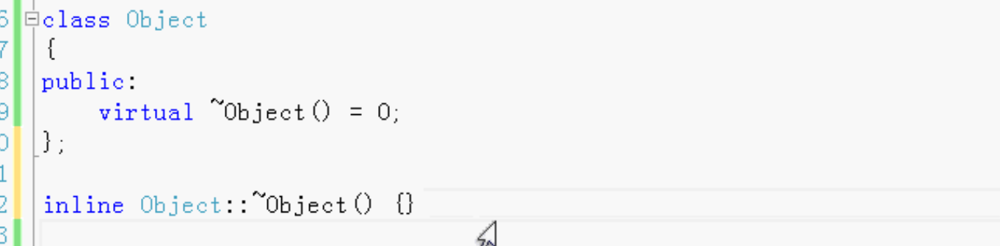
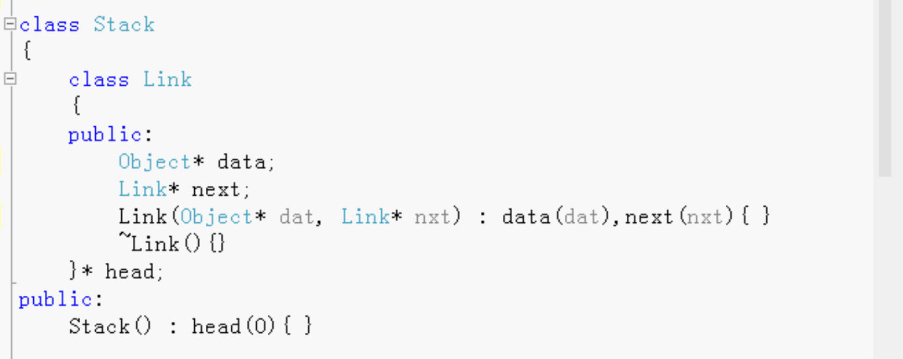
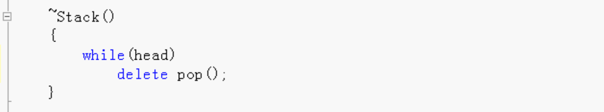
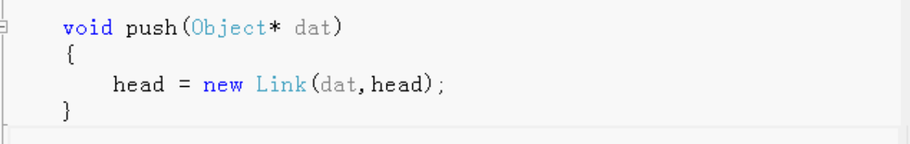
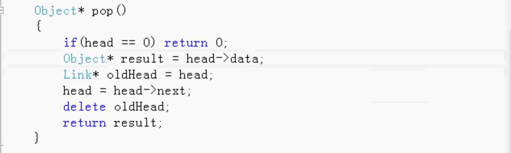
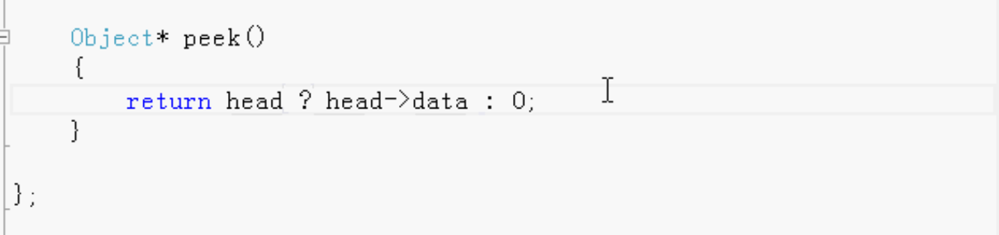
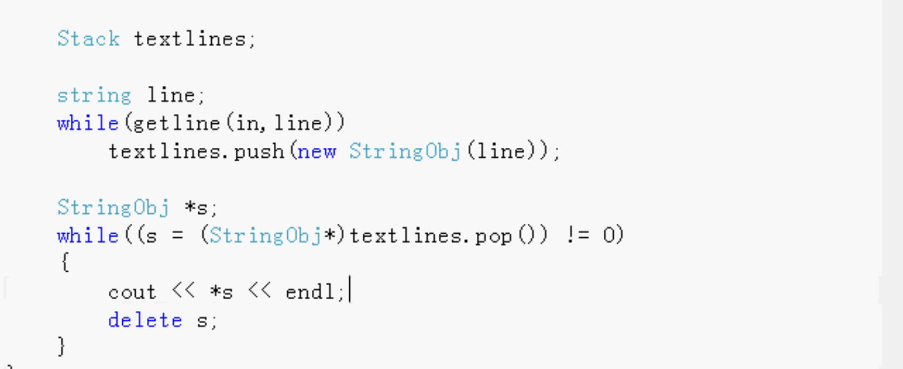
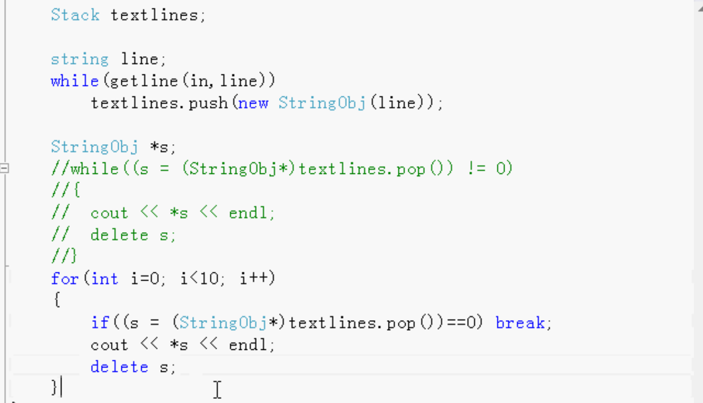

# 多态性和虚函数

利用多态性和虚函数做一个例子：Stack

1. 用万能指针保存堆栈数据 有缺点：在delete的时候不能delete void*
2. 用组合的方法，把原来的stack作为成员，组合在新的成员里。也不太好：堆栈要做成一个通用的，各种类型都可以使用，这种方法针对每一种类型都要做一个class，比较繁琐。
3. 基于对象的继承，多态性和虚函数。
   1. 堆栈Stack里的数据类型是Object。通过继承，Object子子孙孙都可以放到堆栈里。
4. 使用模版（最好的方法）

把之前的void*万能指针改成Object。

先写一个Object

- 只有一个纯虚析构函数，用它来做接口使用。用的时候通过继承就可以使用堆栈了。

- 纯虚析构函数必须写一个纯虚定义

  

Stack

把原来的void* 改成Object* 好处：析构的时候可以delete。

peak：如果是空的就返回0，不是空的就返回堆栈中的数据

堆栈里的数据都是Object。

测试：

需要做一个StringObject继承Object还要继承String

继承Object，则都可以放到堆栈里。

需要给它写一个析构函数，析构函数里看到被调用了被析构delete了。

构造函数：传一个字符串，调用基类的构造函数。

这种比组合方式简单。

读取10行，把这10行进行delete。堆栈里剩下的数据会在函数结束的时候，堆栈析构，析构函数里会析构。

