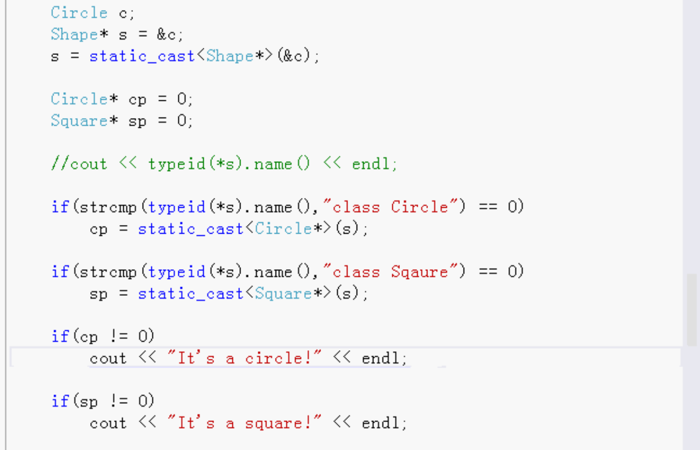

# 多态性和虚函数

- 运算符重载（虚运算符重载）
- 向下类型转换

## 运算符重载（虚运算符重载）

虚运算符重载一般做数学相关的编程软件开发，矩阵，向量等。

例子：

乘法运算符重载

数学类Math 抽象类做接口

- 纯虚函数 乘法
- 还需要析构函数

矩阵 继承 数学

- 实现运算符重载。重写虚函数。 这就是多态。

标量 继承 数学

- 重写虚函数

向量 继承 数学

- 重写虚函数

需要多次指态。

然后就可以做矩阵，向量，标量之间的乘法。

## 向下类型转换

一般都是向上类型转换，向上类型转换一般都是自动隐式的。

向下类型转换必须显式的。

例：

- 宠物类
  - 纯虚析构函数

- 狗 继承 宠物
- 猫 继承 宠物

向上转换：

猫可以转换成宠物

向下转换：

猫转换成宠物，再转换成狗。这种是错误的转换。指针是0.

`dynamic_cast`是类型安全的向下类型转换，能转就转，失败就是0指针。

猫转换成宠物，宠物再转换成猫，这种是正确的。指针有值。

`dynamic_cast`安全的但是运行的时候会消耗资源速度慢。

如果有大量的`dynamic_cast`向下转型：可能设计不好，不需要大量转型。如果确实需要转型，可以换成静态的向下转型`static_cast`。

例：

- 图形 Shape类
- 环形 Circle 继承Shape

- 方形 Circle 继承Shape

- 其它图形

```
Circle c;
Shape* s = &c;//向上转型 直接转
s = static_cast<Shape *>(&c);//静态转，和上面的`Shape* s = &c;`一样。
```

//向下转型 使用静态转，首先需要判断类型是否相等，类型不相等不能转，会出错。和`dynamic_cast`不一样，`dynamic_cast`向下转换失败 不会报错。



`static_cast`速度快，强制转换。一个类只能转换继承它的子类型，不能是其它类型。


向上转型永远是成功的

C语言有强制类型转换，可以转任何类型。不建议。


