# 拷贝构造函数-copy constructor

- 使用拷贝构造函数的几种情况
- 默认拷贝构造函数
- 什么时候需要定义自己的拷贝构造函数
- 禁止拷贝

C++编程，创建class，用class创建对象的时候，一般情况使用通常的构造函数，特殊情况下，做对象的copy的时候，必须使用拷贝构造函数（复制构造函数）。

例：

```
class Person
{

}
```

调用普通的构造函数创建p1

```
Person p1;
```

创建p2的时候用p1创建,，把p1拷贝复制成p2

```
Person p2(p1)
```

```
Person p3 = p1;//这也是拷贝p1，p1拷贝变成了p3。
```

还有一种情况：

这是p1赋值给p4，不是拷贝。这个叫赋值操作。

```
Person p4;
p4 = p1;
```


C++类如果没有写构造函数，C++会帮我们写构造函数，包括普通构造函数和拷贝构造函数。

拷贝构造函数：参数是类的引用。必须是引用，可以加上const。

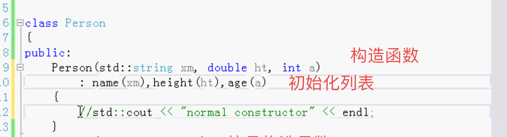

拷贝构造函数，把所有的数据都拷贝过去。

把son也拷贝过去

第一种

拷贝的是地址 指针。这种是共用的一个son。浅复制。

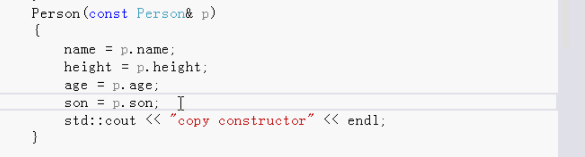

第二种

这种，拷贝的话son就是各自不同的。深复制。

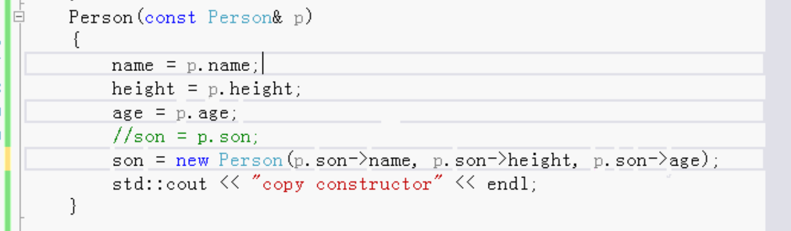


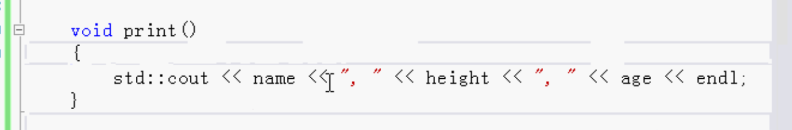

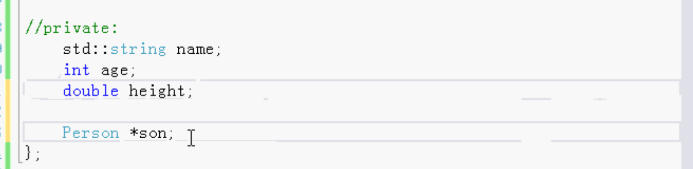

测试调用：

p1

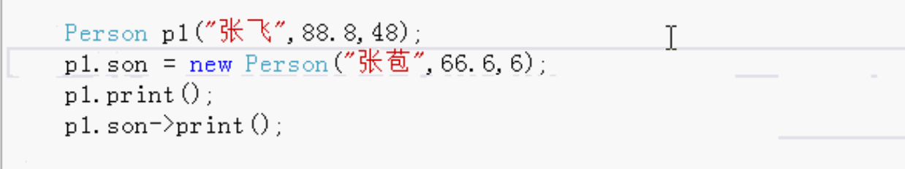

p2拷贝p1

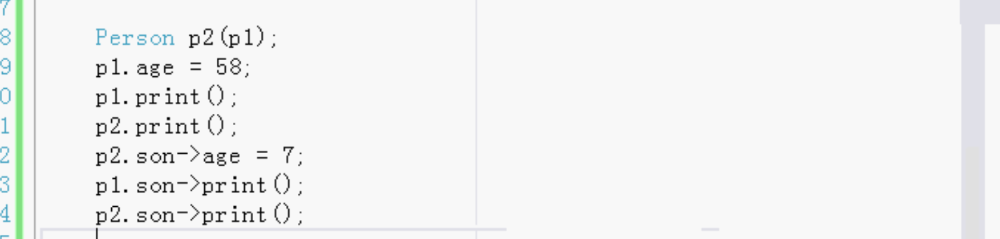

修改p1的age，不影响p2，这两个互不影响。


浅复制只复制的指针，两个对象的son是同一个。

深复制是新的。两个对象的son是各自拥有的。


C++默认做的拷贝构造函数是浅复制。

做深复制的时候需要我们自己写。

当有一个指针的数据成员的时候，C++自动写的复制构造函数只复制指针，需要我们自己写复制构造函数。


还有一种情况用到复制

参数的传递。按值传递，就是复制。调用对象的复制构造函数，结束之后会调用析构函数。所以按值传递的效率较低，因为它要调用复制构造函数。而且对象不使用了还要调用它的析构函数。

如果函数还有一个返回值。返回的时候还是复制。

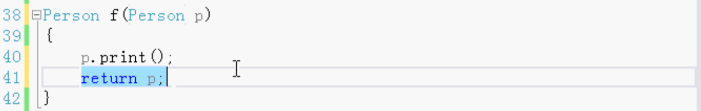

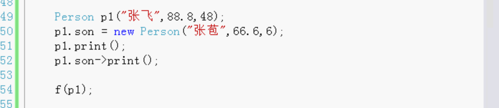

上面这种的效果都是比较低的，最好都是传参传引用，返回值返回引用。就不需要调用复制构造函数和析构函数。

所以传引用或者指针，比传值要好很多。

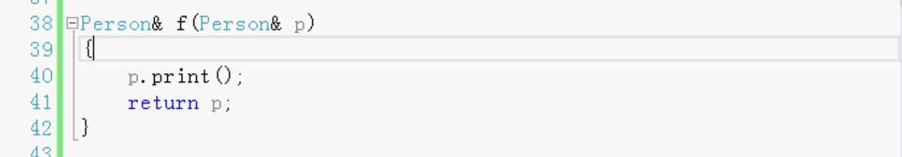


## 静态的成员

用静态成员记录一共创建了多少个对象。

在构造函数中++ 在析构的时候--。

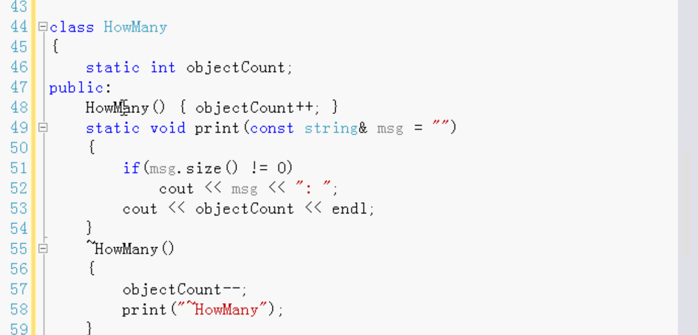


静态成员的定义写在外面。初始为0。


测试调用：

用复制构造函数C++默认的复制构造函数，计数器不对。不会++。

默认的复制构造函数是错误的。不会加加。

所以自己写复制构造函数

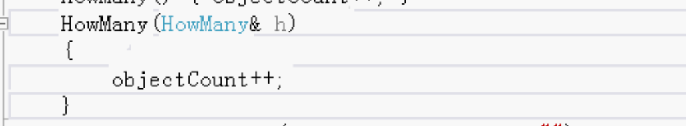


写一个函数，供测试调用

1. 按值传递

   会有一个复制，所以计数也会加1。

   函数结束之后，会调用析构，计数减减。

2. 有返回值

   也会调用一次复制构造函数。

   return的时候调用一次复制构造函数，加加。return之后就析构了，再减减。


测试：

按值传递，会有一个复制，所以计数也会加1。

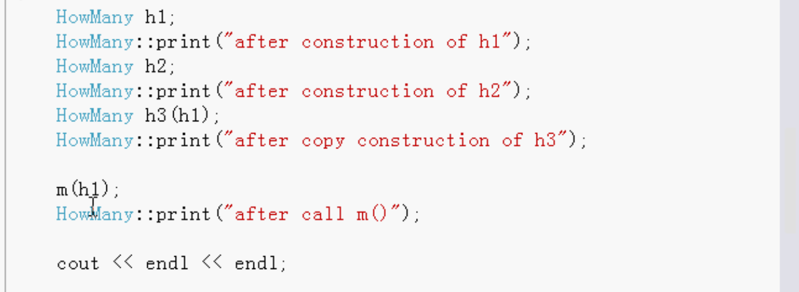


复制构造函数用处：

参数传递的时候使用

参数传递：

- 使用传值方式传递非常小的对象（内置基本类型）

  不管是大的还是小的，只要是class就会调用复制构造函数和析构函数，所以只要是类类型的话，最好传常量引用。

- 使用传常量引用方式 传递不需要修改的 大对象（类类型）

- 函数要修改参数原始对象，才使用传引用方式（使用指针更好）

修改的话传引用，最好是传指针。

不修改的话就传常量引用。


写一个类 禁止复制，使用的时候就不可以按值传递，只能传引用。

复制构造函数写出私有的。

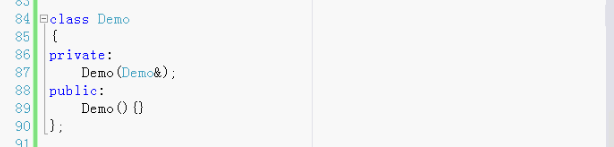

如果调用复制就会报错。


单例模式就把复制构造函数做成私有的，这样就不会复制有多个对象。

C++默认的复制构造函数

1. 计数不会加1
2. 对象如果有指针成员，默认的是浅复制，深拷贝的话需要自己写成深拷贝。