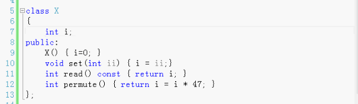
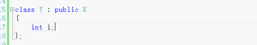
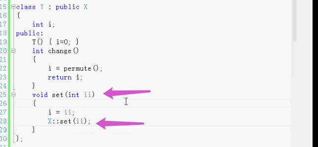

# 继承语法

C++是面向对象的语言

面向对象最重要的就是继承

一个类继承另一个类。用冒号表示继承。

三种继承： public，私有的。受保护的。

Y有两个i，一个是Y自己的，一个是继承的。但是继承的那个是私有的i，Y不能直接使用。

Y也可以自己添加成员函数，名字可以和X的一样：那么就是不要父类X的，而是用自己的函数。重定义。也可以使用X的， 不过要写上`X::`

一个类继承另一个类。会继承数据成员和成员函数，根据需要添加新的功能，自己的成员，或者把继承下来的重定义。

使用继承效率比较高。拿来直接用。

