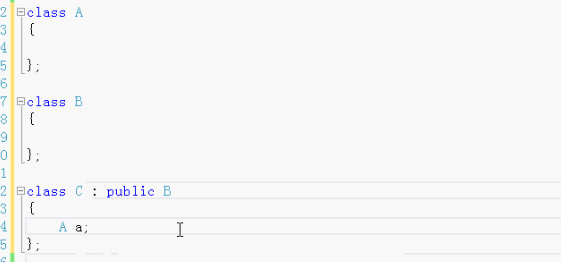

# 继承和组合

两种常用的程序设计方法

- 组合与继承的选择

  判断类和类之间的关系 

  - has-a  	有一个 则组合，
  - is-a。      是一个 则继承。

- 组合和继承的联合

### 组合的例子：

汽车发动机

成员方法：

- 启动
- 后退
- 停止

汽车轮胎

- 充气

汽车车窗

- 打开
- 关闭

汽车车门

- 车门有车窗
- 打开车门
- 关闭车门

汽车  组合

- 发动机
- 4个轮胎
- 两个门

##### 附：

上面的组合还可以加上继承

- 新型的发动机 继承发动机
- 新型的轮胎 继承轮胎

汽车 （既有组合 又有继承）

	- 新型的发动机
	- 新型轮胎

### 继承的例子：

- 图形形状
  - 填充颜色
  - 线的颜色
  - 线的宽度
  - 画图形
- 圆 继承形状
  - 添加 半径
- 长方形 继承图形形状
  - 宽度
  - 高度
- 三角形 继承图形形状
- 圆角矩形 继承圆和矩形 双继承 C++可以多继承

### 组合和继承的联合

#### 例

C继承B（继承）， C里有A（组合）。既有继承又有组合。

