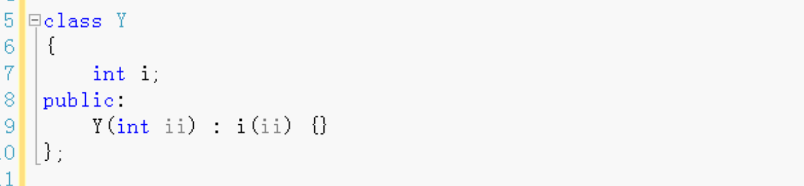
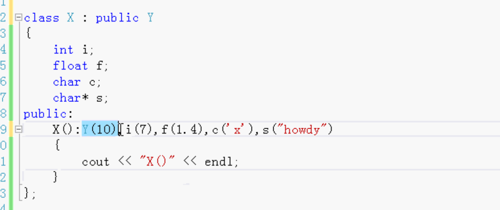
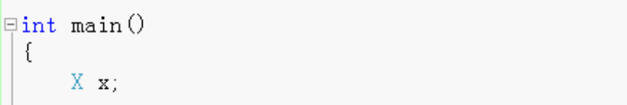
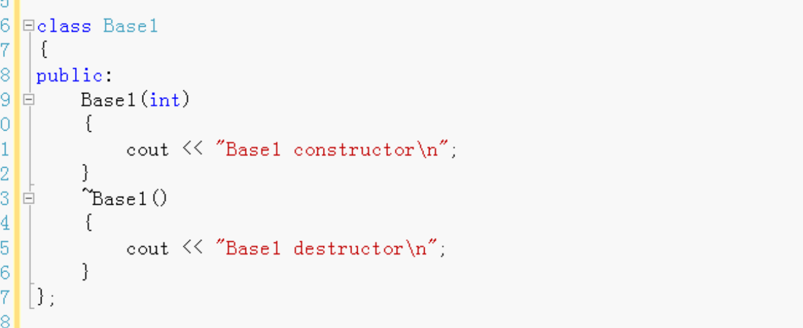
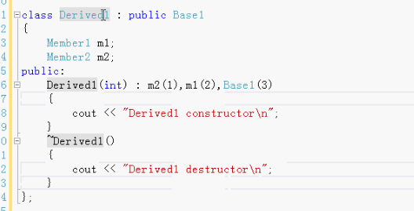
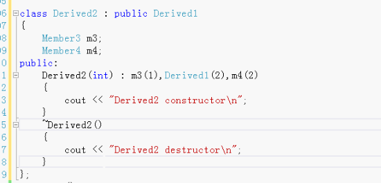
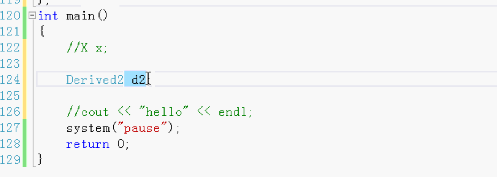

# 继承中的构造和析构

- 构造函数的初始化表达式列表
- 构造函数和析构函数调用的次序
- 自动调用构造函数
- 自动调用析构函数

C++可以在初始化列表中初始化，值用小括号括起来。

没有写初始化列表，C++会默认的初始化。全是默认值。

在构造函数中对成员变量进行初始化有点晚了，也不对，因为C++会默认的有初始化，相当于初始化了两遍。

两个类

Y 父类

X 继承 Y

创建X的对象的时候要先把Y创建了，调用X构造函数也要调用Y的构造函数。

在X的初始化列表里 调用Y的构造函数，把Y构造出来。Y在初始化列表的位置可以随便写，顺序不固定。一般习惯写前面。

如果在X的初始化列表里 没有写Y， 则自动的调用Y的没有参数的构造函数（默认的构造函数）

基类 超类 父类，  派生类 子类

高级：

Derived1的构造函数的初始化列表顺序可以随便写，但是执行调用的时候会先调用Base1的构造函数，然后调用m1，再调用m2。因为成员变量Member1定义在Member2前面。

调用

只调用了`Derived2 d2`。因为存在继承则会调用父类Derived1构造方法，Base1构造方法，初始化Derived1数据成员，Base1数据成员。这一行代码，会调用很多东西。

最先调用Base1构造方法，然后调用Derived1构造函数，然后调用Derived2自己的。

析构函数的调用和构造方法的顺序是完全相反的。

这些都是自动的。

子类和父类有同名的成员函数，子类调用函数的时候，调用自己的函数不会调用父类的。不会调用自己的还调父类的。

如果子类没有该函数 父类有该函数，子类调用函数的时候就会调用父类的。

构造函数会都调 调用父类的 自己的， 普通函数只调一个。