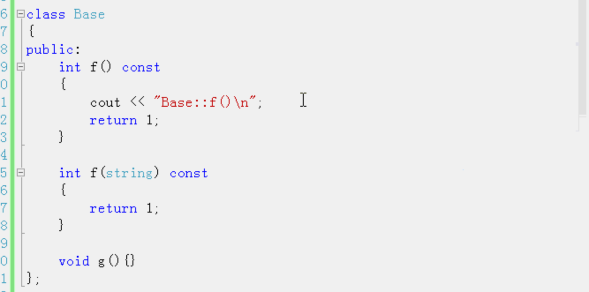
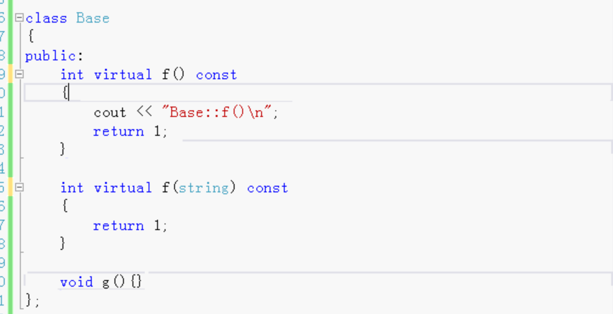
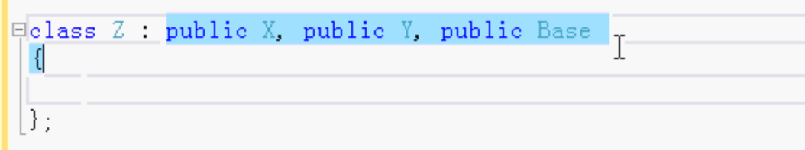

# 继承的其它要点

- 名字隐藏
- 虚函数
- 非自动继承的函数
- 私有继承，保护继承
- 多重继承

### 基类 

三个成员函数

### 子类 

继承基类

1. 子类`Derived2`   继承base类

   重写成员函数g()  

2. 子类`Derived2`   继承base类

   把f重写 重新定义

   `Derived2` 调用f的话。是调用的自己的。

   调用f(字符串)，方法就会报错，因为名为`f`的所有函数都隐藏了。

3. 子类`Derived3`   继承base类

   `Derived3`重定义f，并且返回值类型改为`void`，即使不一样，这也会把重名称都隐藏。有返回值的，带参数的都隐藏了。

4. 子类`Derived3`   继承base类

   重定义f，参数类型变了。和基类的参数类型都不一样，但是名称一样，还是会隐藏所有名字为f的函数。只能用自己的函数f，不能用基类的函数f了。

这些函数隐藏针对的都是针对非虚函数。

## 如果是虚函数重新定义

在多态中用

## 非自动继承的函数

- 可以自动继承
  - 数据成员
  - 函数成员

- 不可以继承。自己用自己的。基类有，子类也不可以使用。
  - 构造函数
  - 析构函数
  - 重载`=`运算符

- 其它的重载运算符 可以继承

子类可以添加自己的数据成员，函数成员，构造函数，析构函数。

## 私有继承，保护继承

一般是用公有继承

继承相当于把基类中的所有成员拷贝下来

- 公有继承

  原来是私有的还是私有的 原来是受保护的还是受保护的 原来是公有的还是公有的。

- 私有继承

  子类拷贝基类成员，成员都变成私有的。  如果不写哪种继承默认是私有继承。

- 保护继承

  相当于子类拷贝基类成员，成员都变成受保护的。

私有继承，保护继承没有用。仅做了解。

## 多重继承

多继承比较复杂，容易出问题。