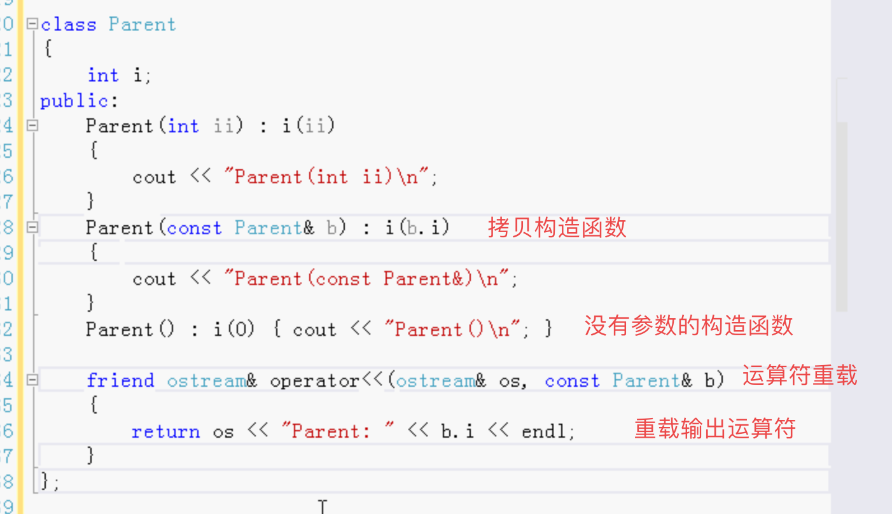
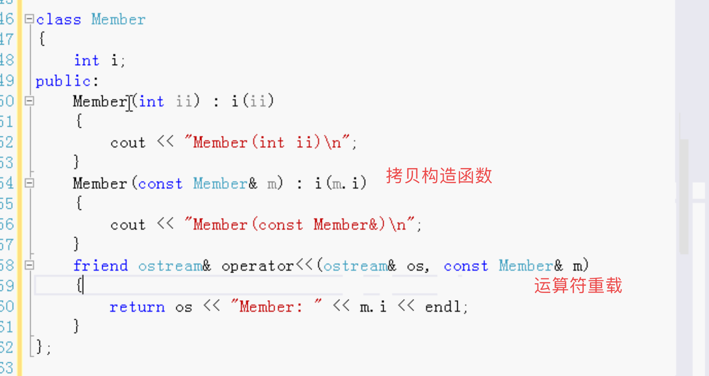
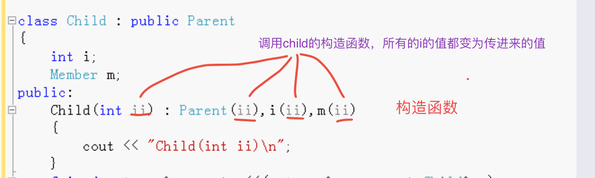
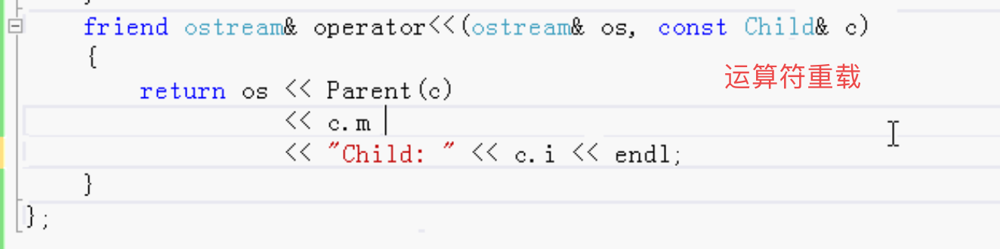

# 继承中的向上类型转换

- 向上类型转换
- 基类与新类之间的关系：新类属于原有类的类型
- 向上类型转换和拷贝构造函数

继承 倒立的树形图表示，不断的继承，最上面的类叫根。

把子类型向上转为它的基类。

例：

- 乐器类
  - 成员函数play 参数是一个枚举  中音、高音、低音

- 长笛 继承 乐器
- 创建一个函数 参数是乐器，调用乐器去play。

测试

创建一个乐器对象，调用函数参数传乐器对象

创建一个长笛对象，调用函数 参数传长笛对象。C++会自动的向上转型，把长笛转变为乐器类型。

可以利用这个特点， 写一些通用的函数。例：上面的play就是通用的函数，长笛，钢琴，大鼓都可以play。

## 向上类型转换和拷贝构造函数









测试

```
Child c(2); //调用Child的构造函数 Parent的i为2，Child的i为2，Member的i为2.
cout << c; //会输出三个2

Child c2 = c; //调用拷贝构造函数
cout << c2;//还是三个2  因为没有写Child的拷贝构造函数，只写了parent和Member的拷贝构造函数，会调用C++默认添加的拷贝构造函数。
```

如果要写Child的拷贝构造函数的话 不能随便写，否则可能出错。

在使用Child类的时候，用到向上转型时，则Child的拷贝构造函数也要构造父类Parent。