# 自动类型转换

- 方法一：构造函数
- 方法二：运算符
- 优点
- 缺点

## 第一种方法：使用构造函数进行自动类型转换

两个类，calss One和class Two， class Two的构造函数参数传一个One。那么就可以把类One转为类Two。

如果不想构造函数进行自动类型转换可以在前面加`explicit`，这种构造函数只能进行创建对象，不能自动类型转换。

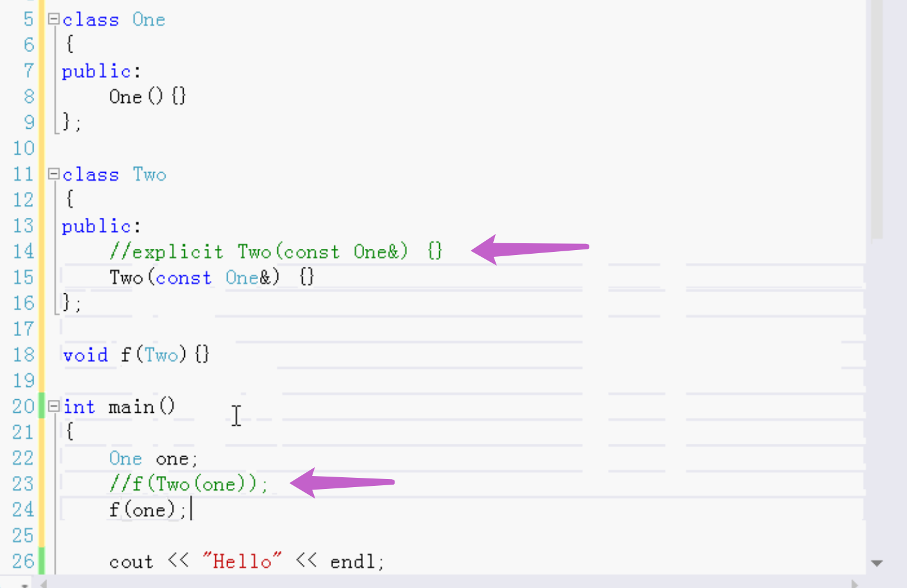

## 第二种方法：使用运算符进行自动类型转换，类似运算符重载

例 

把Four变成Three

参数传four会自动的转变为three

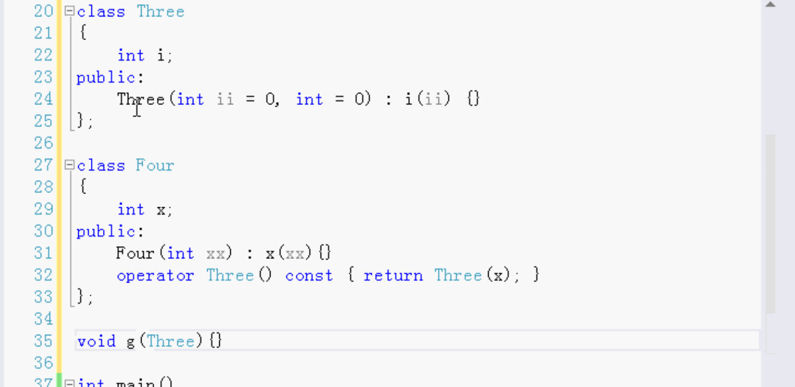

调用：

four变成three是用的上面的利用运算符转换

1变成three是用的Three的构造函数

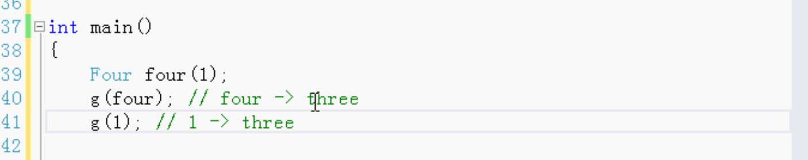

都发生了自动类型转换。

例

1. 整型转为Number类型
2. 定义加法运算符重载

3. 减法做成友元

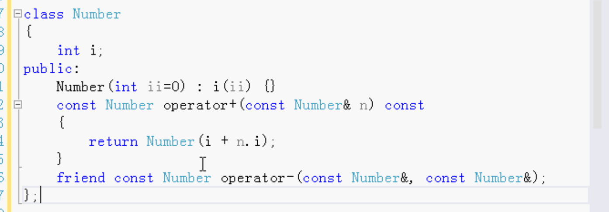

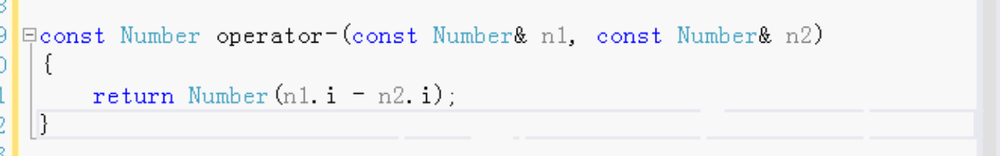

调用测试：

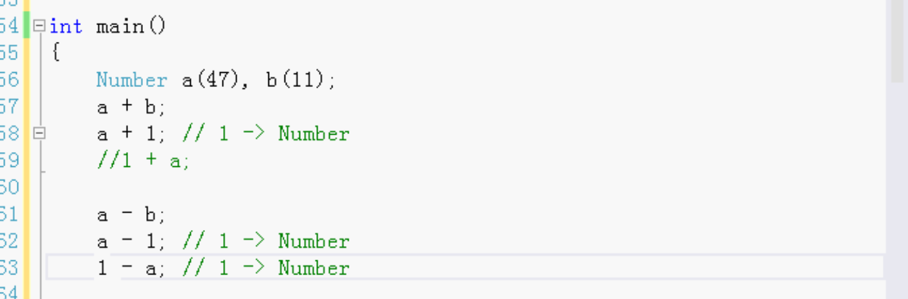

1+a不可以。加法是一个成员函数 只有一个参数

1-a可以，减法是友元，全局函数，两个参数。1会变成Number。

## 自动类型有优点有缺点

### 优点

自定义的字符串类，字符串类有很多方法，长度，字符串比较等等。要把所有的字符串操作函数都做出来就太多了。

如果使用自动类型转换就不用写那么多方法了。

使用自动类型转换，变成C语言的字符串。

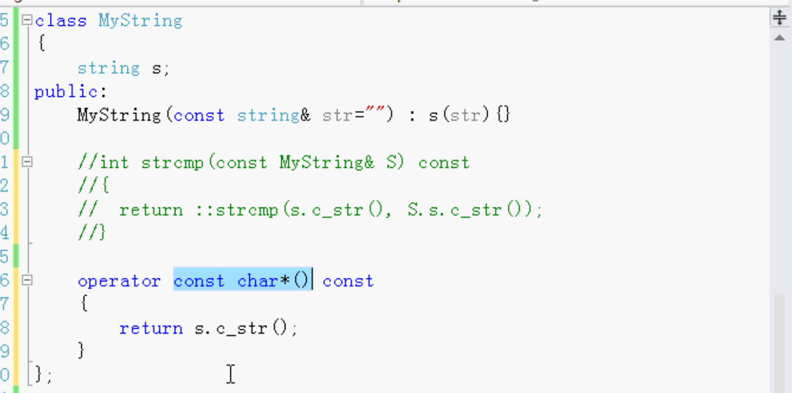

然后就可以直接使用标准库里的函数去比较。

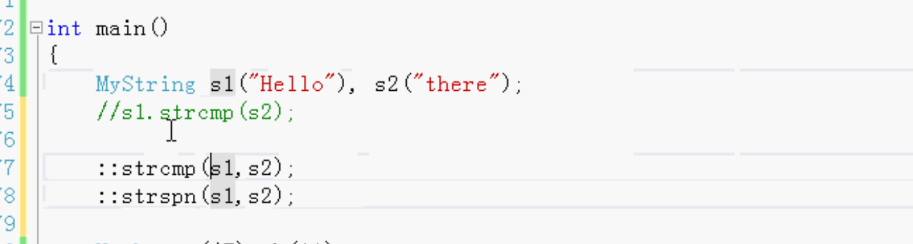

库函数都可以使用。不用在新定义的类里面重写一遍。重写一遍很繁琐。

### 缺点

把苹果变成橘子

1. 利用运算符把苹果变成橘子
2. 利用构造函数把苹果变成橘子

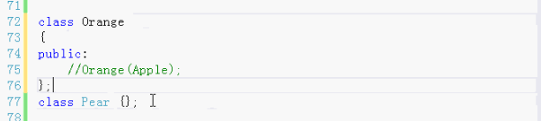

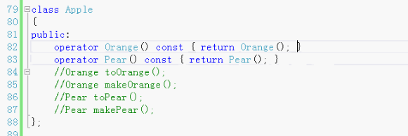

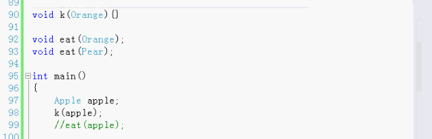

两种方法都有的时候，C++不知道使用哪个方法把苹果变成橘子

 解决方法就是不要写两种方法，只用一种就可以了。

苹果可以变成橘子，苹果可以变成梨。吃苹果的时候，C++不知道变哪个。不做成自动类型转换。用成员函数明确的显示的转换。而不是自动类型转换。

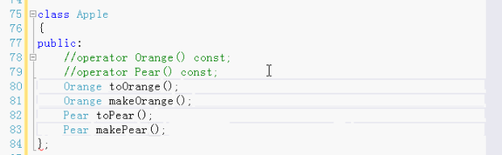

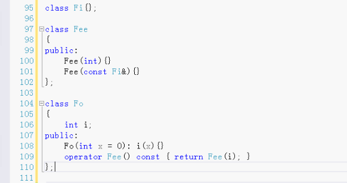

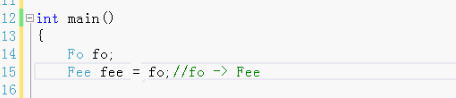

fo转换成Fee。Fee有C++默认赋值运算符重载。非常灵活。

只做必要的类型转换，不要做过多的类型转换，容易出错。合理使用。

