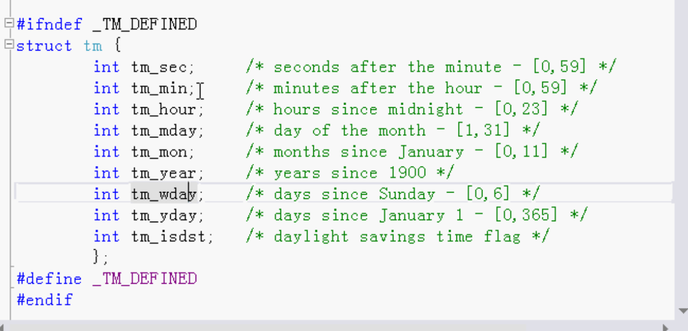
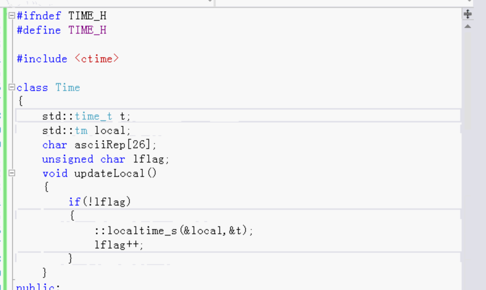
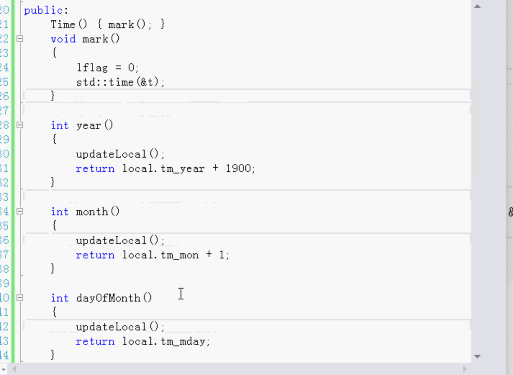
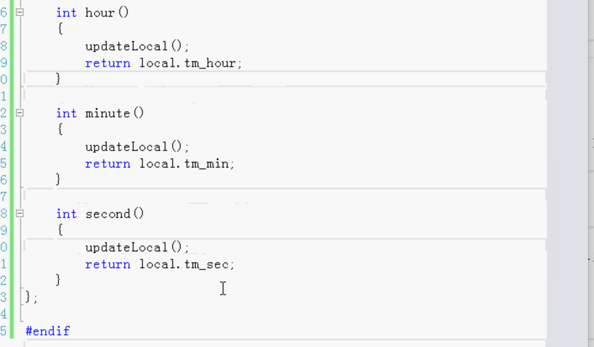

# 访问函数

- 类中的访问函数
  - 访问器
  - 修改器
- 一般都是使用内联函数编写访问函数

C++是面向对象的语言，面向对象最重要的功能就是封装。封装数据。

如果把数据成员做成public就破坏了封装。所以C++封装的时候成员函数做成私有的，通过成员函数去使用。

已经封装了数据，不能直接对数据操作。

用一些成员函数对类的数据进行操作。

这些函数就叫访问函数。通过访问函数对数据进行访问和修改。

访问器和修改器都比较短小，所以做成内联函数比较好。速度更快。

可以为每一个数据成员写一个访问器，修改器。

数据成员前面加一个下划线`_`，访问器和修改器都可以写不加下划线的同一个名字。

C和C++保留了这种写法，所以自己最好不要用下划线的这种方法。

几种方法：

- 用不同的单词，成员变量和访问器修改器名字不一样。（名字不容易写，词汇量有要求）

- 数据成员前面加下划线 （被C和C++保留了，自己最好不要用）
- 数据成员前面加两个下划线`__`  （不常见）
- 数据成员前面加`m_`
- 不修改数据成员，修改访问器和修改器的名字，前面加get和set，并且数据成员第一个字母改成大写。

例：

日期获取年，月，日，时，分，秒，等。

算法：

创建一个类，几个函数来获取年，月，日，时，分，秒，等。

使用一个flag标记是否把时间戳转换成日期格式，在构造函数中flag为0，转化之后加1，这样之后取的每一个都不需要每次都转一下，只需要转一次即可。

转之前会先判断flag，如果没转过才转，转过就不转了。

电脑时间变成当地时间，当地时间再转为字符串。

同样使用一个flag去标记是否已经把电脑时间变为当地时间，如果没变就变成当地时间，

还可以写其他的访问函数：计算两个时间的时间差（可用于计算时长）。

## 总结：

C++时面向对象的语言，面向对象最重要的就是封装，封装就要用到访问函数。