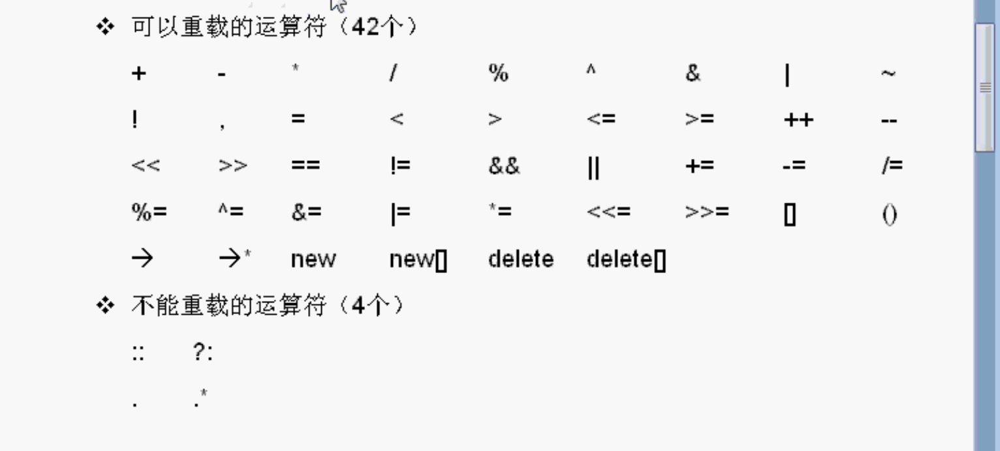

# 运算符重载

同一个符号有不同作用，运算符重载是C++里的高级功能。很多语言都没有运算符重载，例如java就不能，只能写一个普通的成员函数，C语言也没有运算符重载。

运算符重载就是一个函数。



C++有四十多个运算符，绝大多数都可以重载，`=`赋值 `<<`流输出` ()`函数调用 等等。

只有4个不可以重载。`.*` 对指针进行操作的运算符。

## 重载加号运算符

三个类，Dog，Cat，Person。

```c++
class Dog
{
public:
    int d;
};

class Cat
{
public:
    int c;
};

class Person
{
public:
    int p;
};

//运算符重载实际上就是一个函数
Cat operator+(const Person& p, const Dog& d)
{
    Cat cat;
    cat.c = p.p + d.d;
    return cat;
}

void testOperator()
{
    Dog d;
    Cat c;
    Person x;

    d.d = 100;
    x.p = 200;

    c = x + d;
    //也可以直接调用
    //c = x.operator+(d);

    cout << c.c << endl;
}
```

上面的运算符重载函数是个全局函数，也可以做成一个成员函数。

```c++
class Person
{
public:
    Cat operator+(const Dog& d)
    {
        Cat cat;
        cat.c = p + d.d;
        return cat;
    }
public:
    int p;
};
```

例：C++重载字符串加号运算符，拼接字符串。

例：

销售卖书，两个销售一共卖多少，每个销售卖的数量和卖了多少钱不一样。计算一共卖了多少本，一共卖了多少钱。

```c++
class Sale
{
    //友元函数 可以访问类中的私有成员
    friend Sale operator+(const Sale &left, const Sale &right);
public:
    
    /// 构造函数
    /// - Parameters:
    ///   - book: 什么书
    ///   - units: 卖多少本
    ///   - price: 卖多少钱
    Sale(const string &book, unsigned units, double price)
    : name(book),units_sold(units),revenue(units * price)
    {}
    
    
    /// 求平均每本多少钱
    double avg_price() const
    {
        return revenue / units_sold;
    }
    
//成员变量 为了调试，需要改成public
//private:
public:
    string name;
    unsigned units_sold;
    double revenue;
};

//运算符重载函数做成全局的函数
Sale operator+(const Sale &left, const Sale &right)
{
    Sale sale(left);
    sale.units_sold += right.units_sold;
    sale.revenue += right.revenue;
    return sale;
}

//调用
void test()
{
    Sale sale1("C++ Programming",10,50.0);
    Sale sale2("C++ Programming",2,60.0);
    Sale sale3 = sale1 + sale2;
    cout << sale3.units_sold << ", " << sale3.avg_price() << endl;
}
```

运算符重载函数做成 成员还是非成员函数


很多时候，我们写的类不需要运算符重载，只是少数情况可能需求。当自己做的类需要哪个运算符就做哪一个。

函数的名称要加上`operator`。

使用了运算符重载，为了使用起来方便。增强功能。