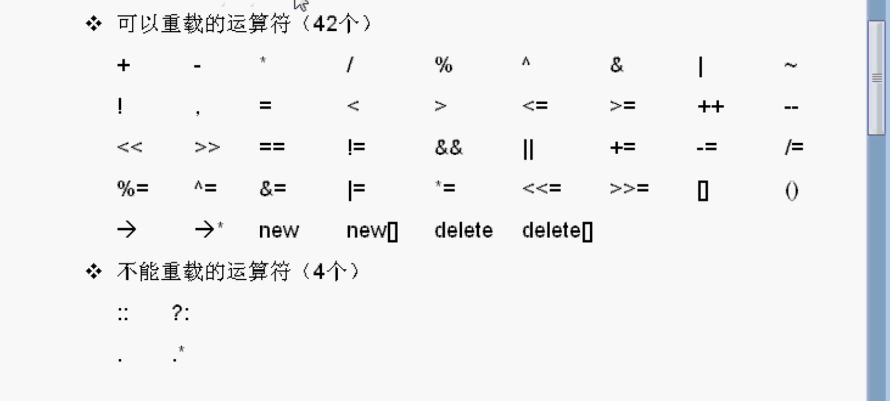
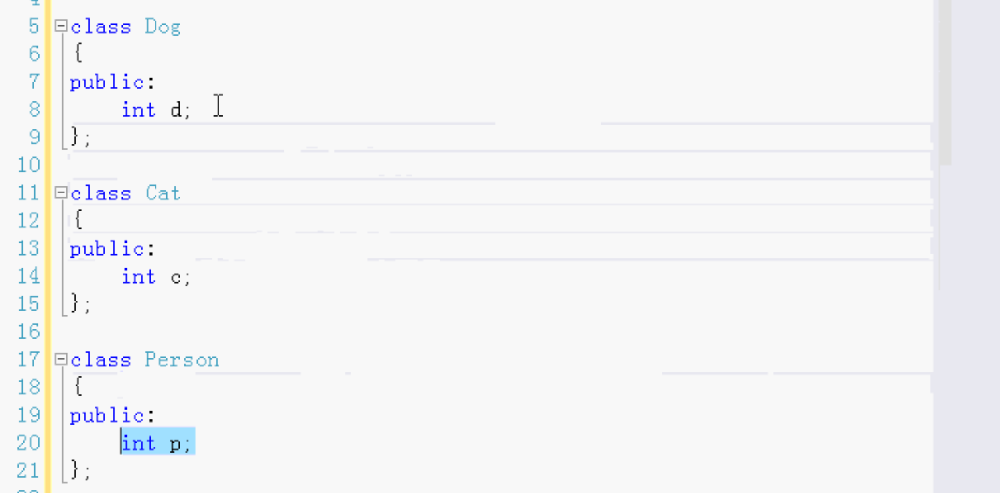
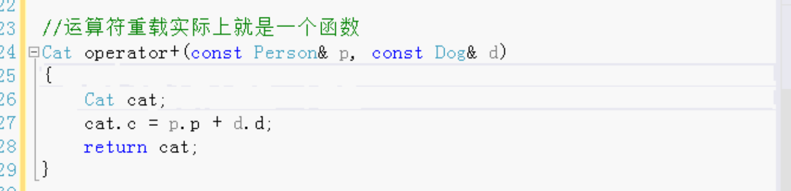
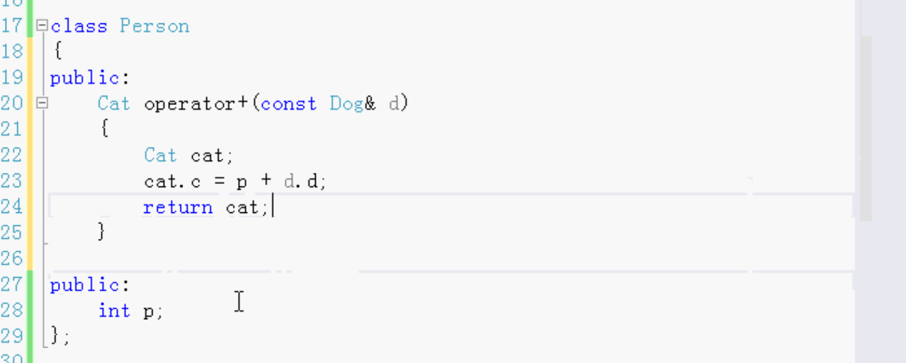
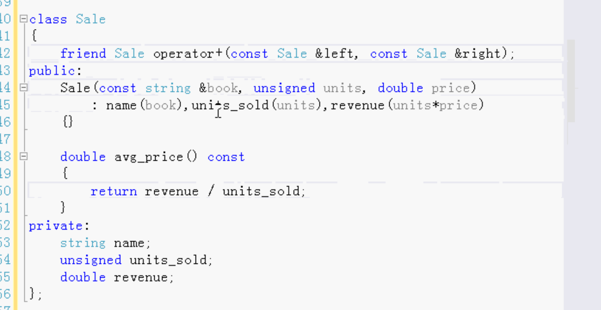
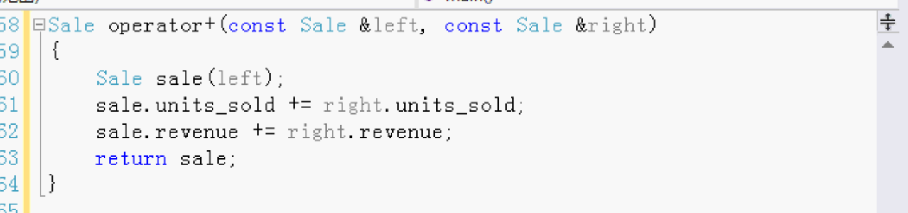
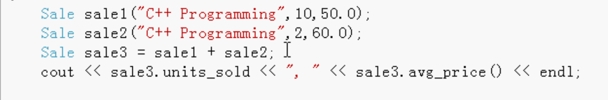
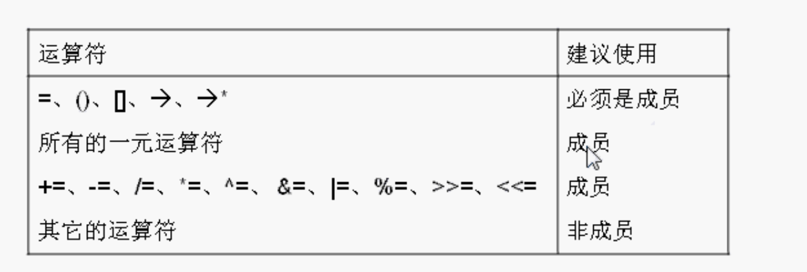

# 运算符重载

运算符重载是C++里的高级功能，很多语言都没有运算符重载，例如java就不能，只能写一个普通的成员函数。

运算符重载就是一个函数。



C++有四十多个运算符，绝大多数都可以重载，`=`赋值 `<<`流输出` ()`函数调用 等等。

只有那四个不可以重载。`.*` 对指针进行操作的运算符。

## 例

重载加号运算符。

三个类，Dog，Cat，Person。





```
Dog d;
Cat c;
Person x;

d.d = 100;
x.p = 200;

c = x + d;
//也可以直接调用
//c = x.operator+(d);

cout << c.c << endl;
```

上面的运算符重载函数是个全局函数，也可以做成一个成员函数。




运算符重载很少使用到，当自己做的类需要的时候再做，需要哪个运算符就做哪一个。

例：C++重载字符串加号运算符，拼接字符串。

运算符重载用的很少。

例：

销售卖书，两个销售一共卖多少，每个销售卖的数量和卖了多少钱不一样。计算一共卖了多少本，一共卖了多少钱。



- 友元函数 可以访问类中的私有成员
- 构造函数
  - 什么书
  - 卖多少本
  - 卖多少钱
- 求平均每本多少钱
- 成员变量 为了调试，需要改成publish
  - 书名

运算符重载函数做成全局的函数



调用：



运算符重载函数做成 成员还是非成员函数




很多时候，我们写的类不需要运算符重载，只是少数情况可能需求。

函数的名称要加上`operator`。

使用了运算符重载，为了使用起来方便。增强功能。