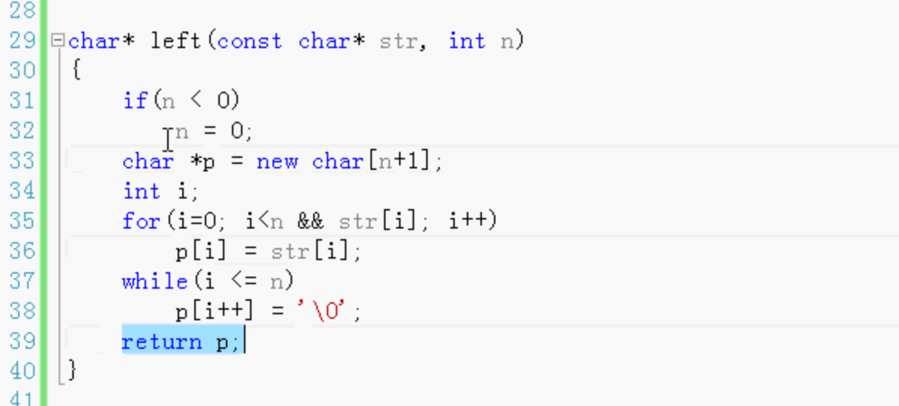

两种特殊的参数：

- 默认参数（参数的默认值）
- 占位符参数

函数实现：

函数里面分配了内存 所以上面的调用之后 需要delete删除释放。

默认值只允许在声明里，不允许在定义里。

默认参数后面的参数都要是默认参数。

## 占位符参数

C++还输声明和函数实现 参数的名字可以不一样

函数声明 参数的名字也可以不写。只写类型。写参数的名字是为了人看了，程序员可以看懂参数代表的是什么意思。

函数的定义（实现）里面也可以不写（实现里面没有使用时）。这就叫占位符参数。

适用：

之前使用的参数 后来通过不断的重构修改，不需要了，为了兼容老的调用代码，可能很多地方都调用这个函数方法，所以写成空的。

#### 在函数声明里所有的参数名都可以省略不写，包括默认值的参数。

最好写上。并且和定义写一样的名称。