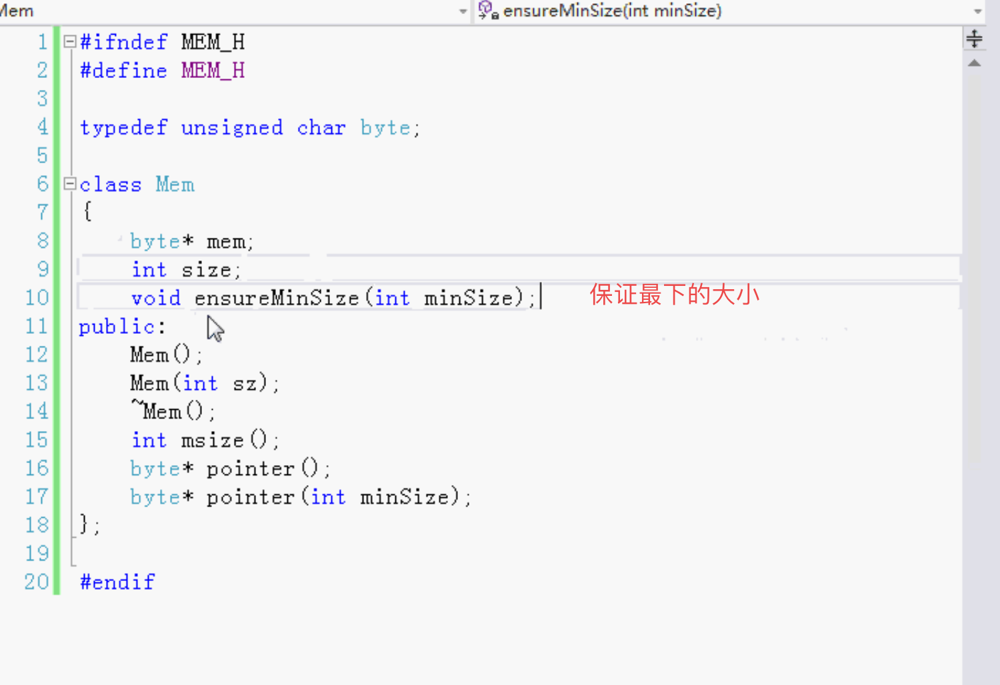
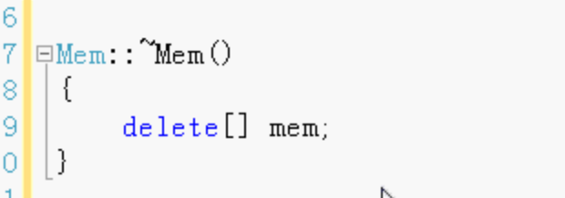
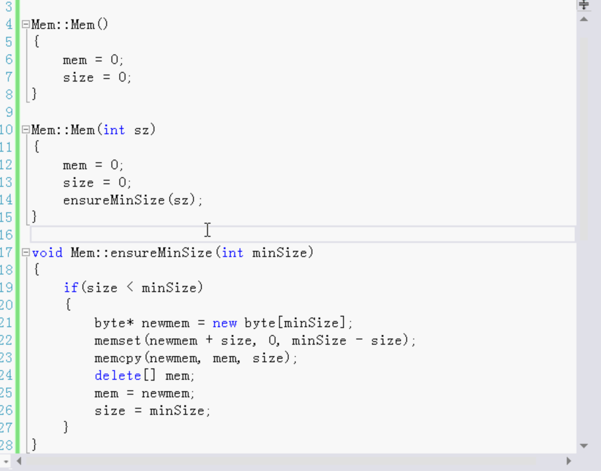
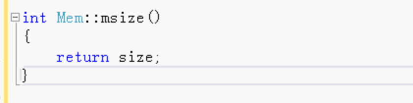
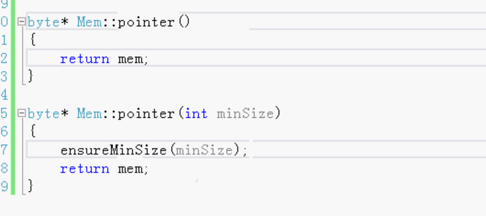

默认参数or函数重载

- 容易使用
- 方便重用
- 接口清晰

指针可以动态的分配大小 

#### 保存

保存到自定义的MEM类中

头文件：

### 源文件：

析构函数：

### 规则：

##### 不要把默认参数作为一个判断标识，去决定执行代码。

一般函数重载比较多。

默认参数应用：

很长时间后 要修改，参数改了原来的就不能用了，使用新的参数 新的参数用默认参数。老代码可以用，新代码也可以使用。