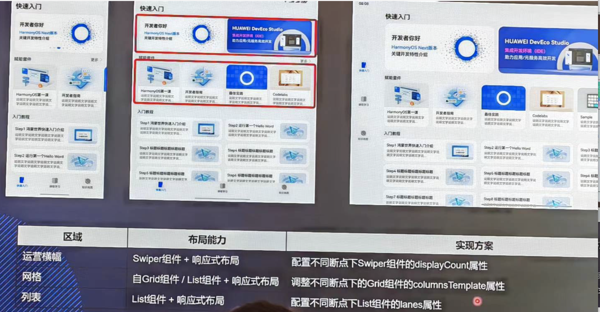
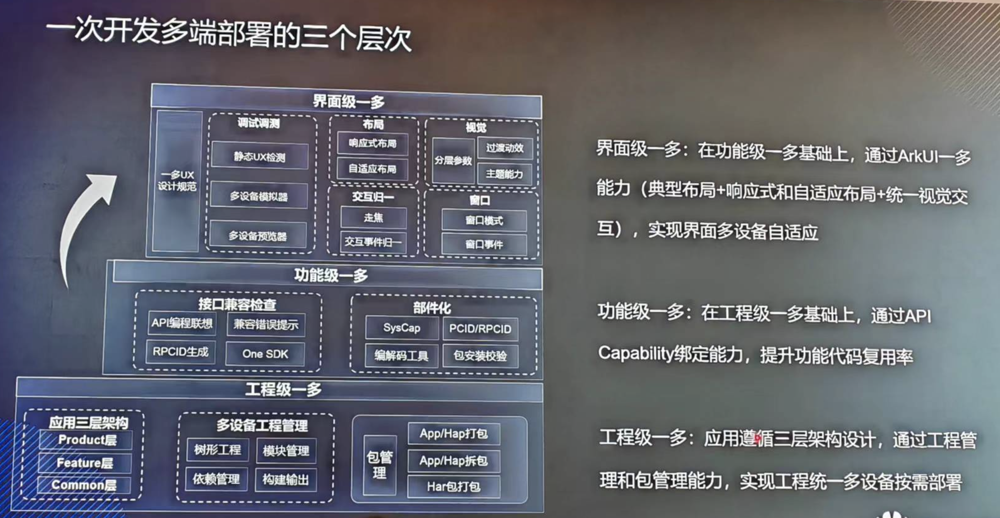
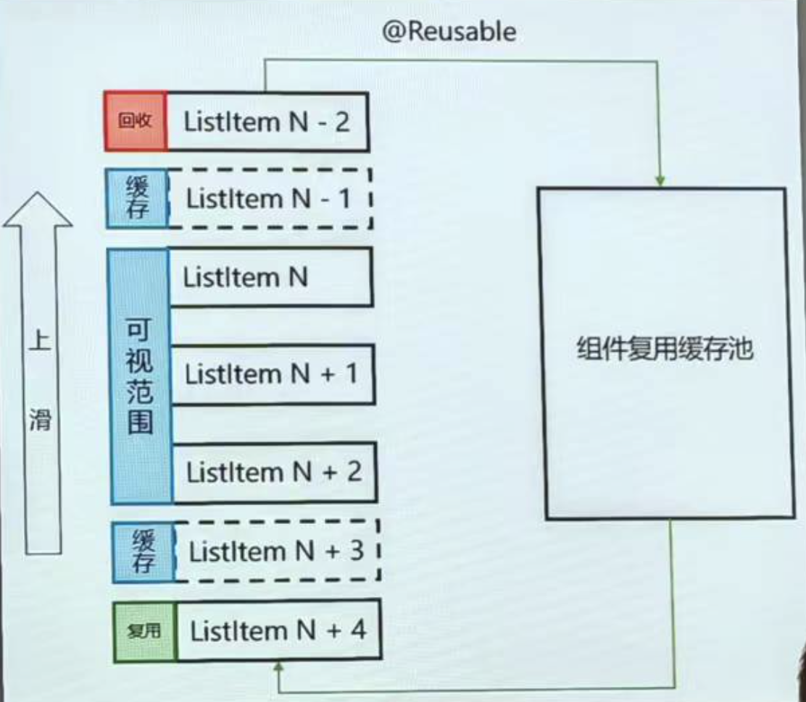

# Harmony

Harmony OS应用开发使用ArkTS语言，ArkTS是在TypeScript基础上的扩展，TS是JS的超集。

## 网址

- 华为开发者联盟：https://developer.huawei.com/consumer/cn/
- 下载工具：https://developer.huawei.com/consumer/cn/download/
- OpenHarmony三方库中心仓：https://ohpm.openharmony.cn/#/cn/home
- 三方库资源：https://gitee.com/openharmony-tpc/tpc_resource
- Gitee安全开发指南：https://gitee.com/openharmony/docs/tree/master/zh-cn/application-dev/security

三方框架

- Flutter项目：https://gitee.com/openharmony-sig/flutter_samples/tree/master/ohos/docs
- Taro：https://ohpm.openharmony.cn/#/cn/detail/@hybrid%2Fweb-container
- ArkUI-X：https://gitee.com/arkui-x

## 实训营

CMakeLists.txt编译配置

drawing画图；图形 文字 位图（图像）

多目标产物：专业版、免费版

链式`.`

## Stage模型

应用的生命周期、开发者的舞台。

### Stage模型设计思想

**平衡应用能力与系统管控成本**

- 严格的后台管控
- 基于场景的服务机制
- 严格进程模型

**原生支持组件级的迁移和协同**

- UIAbility与UI分离
- UI展示与服务能力合一的应用组件

**支持多设备形态和多窗口形态**

- UIAbility生命周期定义
- 组件管理和窗口管理解耦

## 布局能力

- 响应式布局（条件触发），解决页面整体局部差异
- 自适应布局（连续变化），解决页面各区域内的局部差异





## 一次开发多端部署的三个层次



## 编译打包

**App Pack (Application Package)**
应用上架格式，发布到应用市场的基本单元可以包含多设备的编译产物(HAP、HSP)

**HAP (Harmony Ability Package)**
应用安装和运行的基本单元

主要使用场景

- Entry:应用的主模块，用于实现应用的入口界面、入口图标、主特性功能等
- Feature:应用的特性模块，用于实现应用的特性功能

**HSP(Harmony shared Package)动态共享包，运行时复用**

主要使用场景

- 多模块(HAP或者HSP)共用的代码、资源可以使用HSP，提高代码的可重用性和可维护性
- 按需加载，HSP包在运行时再按需加载
- 元服务分包预加载

不常用的功能，封装成一个独立的HSP模块按需加载。

**HAR(Harmony Archive)静态共享包，编译态复用**

主要使用场景

- 作为二方库，发布到OHPM私仓，供公司内部其他应用依赖使用
- 作为三方库，发布到OHPM鸿蒙中心仓，供其他应用依赖使用

## 组件

先写数据定义，后写UI。

LazyForEach列表懒加载

- Scroll容器：滚动视图
- Swiper容器：轮播图效果
- Grid容器：网格布局
- List容器：列表容器
- WaterFlow瀑布流
- Tabs容器 底部导航

@state 通知

**组件复用功能和场景介绍**

原理介绍：

1. 当一个自定义组件销毁时，如果标记了@Reusable，就会进入这个自定义组件所在父组件的复用缓存池
2. 复用缓存池是一个Map套Array的数据结构，以reuseld为key，具有相同reuseld的组件在同一个Array中，reuseld默认是自定义组件的名字。
3. 发生复用行为时，会自动递归调用复用池中取出的自定义组件的aboutToReuse回调，应用可以在这个时候刷新数据



## 编辑器

**代码补全：**

`.`运算符后可以自动联想出组件的属性。

**自动导包：**

Alt+Shift+Enter。

**代码查找：**

两次Shift。

**代码检查：**

在源代码文件中，点击鼠标右键，选择Code Linter。

**函数重构：**

将函数或类方法等区域内的代码块表达式提取为新函数、常量或接口。如果方法过长，可以将组件或属性提取出来，优化可读性。

**使用方式**：选中需要提取的组件或属性，右键单击**Refactor**，选择**Extract Method...**。组件私有属性可提取为@Extend装饰的方法，通用属性可提取为@Styles或@Extend装饰的方法。

## ArkTS

**强化静态类型检查**：ArkTS要求所有类型在程序实际运行前都是已知的，**减少运行时的类型检测**，提升性能。

**限制在运行时改变对象布局**：为实现最大性能，ArkTS要求在程序执行期间不能更改对象布局。

### ArkTS对UI的扩展

UI描述

UI描述提供了各种装饰器、自定义组件和UI描述机制，组件的事件以及属性方法等。

状态管理

为了支持状态在应用中的共享，提供了状态管理语法，满足状态的传递共享机制。

### 空安全

在ArkTS中变量的值可以为null。

变量声明时可为空值，使用联合类型包含null类型，使用时需要非空校验。

```typescript
let name: string | null = null;
```

非空校验

1. if (name != null) {} else {}

2. 空值合并表达式，`??`左边的值为null时会返回表达式右边的值

   ```typescript
   const res = name ?? '';
   ```

3. 使用?可选链进行安全调用，尤其是当访问对象的属性或方法时，如果作用于`null`，运算符会返回`undefined`。

   ```typescript
   let len = name?.length;
   ```

类型安全的语言，IDE在编辑态时就会对类型进行实时检查，当赋值类型与实际类型不匹配时，就会提示错误信息，提升开发效率，避免在编译时期才发现异常。

### 语句

**For-of语句**

使用for-of语句可遍历数组或字符串。示例如下：

```typescript
for (student of students) { 
    console.log(student);
}
```

**Continue语句**

continue语句会停止当前循环迭代的执行，并将控制传递给下一个迭代。

示例：

```typescript
let sum = 0;
for (let x = 0; x < 100; x++) { 
    if (x % 2 == 0) { 
        continue
    }  
    sum += x;
}
```

**Throw和Try语句**

throw语句用于抛出异常或错误：

```typescript
throw new Error('this error')
```

try语句用于捕获和处理异常或错误：

```typescript
try { 
    // 可能发生异常的语句块
} catch (e) { 
    // 异常处理
}
```

下面的示例中throw和try语句用于处理除数为0的错误：

```typescript
class ZeroDivisor extends Error {}
function divide (a: number, b: number): number{  
    if (b == 0) throw new ZeroDivisor();  
    return a / b;
}
function process (a: number, b: number) {
    try {  
        let res = divide(a, b); 
        console.log('result: ' + res); 
    } catch (x) { 
        console.log('some error'); 
    }
}
```

支持finally语句：

```typescript
function processData(s: string) { 
    let error: Error | null = null;
  
    try {    
        console.log('Data processed: ' + s);  
        // ...   
        // 可能发生异常的语句 
        // ...  
    } catch (e) {  
        error = e as Error; 
        // ...  
        // 异常处理 
        // ... 
    } finally { 
        if (error != null) {  
            console.log(`Error caught: input='${s}', message='${error.message}'`); 
        } 
    }
}
```

### 函数

```typescript
function 方法名(参数列表): 返回类型 {
    //函数体
}
```

#### 箭头函数（lambda表达式）

简化函数声明，通常用于需要一个简单函数的地方，**并且该函数在其它地方不会重复调用。**

```ty
(参数列表): 返回类型 => {函数体}
```

箭头函数的返回类型可以省略，返回类型通过函数体推断

```ty
(name: string): void => { console.log(name) };
```

函数体只有一行时可以省略花括号，并且可以将箭头函数赋值给一个变量：

```typescript
const printInfo = (name: string) => console.log(name);
printInfo('xiaoming');
```

箭头函数常用于回调函数使用

例如：forEach方法中传入一个箭头函数，用于遍历操作。

```typescript
let students: string[] = ['zzz', 'xxx', 'ccc'];
students.forEach((student: string) => console.log(student));
```

### 闭包

一个函数可以将另一个函数当作返回值，保留对内部作用域的访问。

在下例中，z是执行f时创建的g箭头函数实例的引用。g的实例维持了对它的环境的引用（变量count存在其中）。因此，当z被调用时，变量count仍可用。

```typescript
function f(): () => number { //返回值类型是一个函数类型
    let count = 0;  
    let g = (): number => {
        count++;
        return count;
    }; 
    return g;//返回一个函数
}
let invoker = f();
invoker(); // 返回：1
invoker(); // 返回：2

//如果多个地方都用到这个函数类型，就可以使用type对返回的类型进行取名，方便后续的管理。
type returnType = () => number；
function f(): returnType { //返回值类型是一个函数类型
    // 函数体
}
```

### 函数重载

可以通过编写重载，指定函数的不同调用方式。具体方法为，为同一个函数写入多个同名但签名不同的函数头，函数实现紧随其后。

```typescript
function foo(x: number): void;            /* 第一个函数定义 */
function foo(x: string): void;            /* 第二个函数定义 */
function foo(x: number | string): void {  /* 函数实现 */
}
foo(123);     //  OK，使用第一个定义
foo('aa'); // OK，使用第二个定义
```

不允许重载函数有相同的名字以及参数列表，否则将会编译报错。
