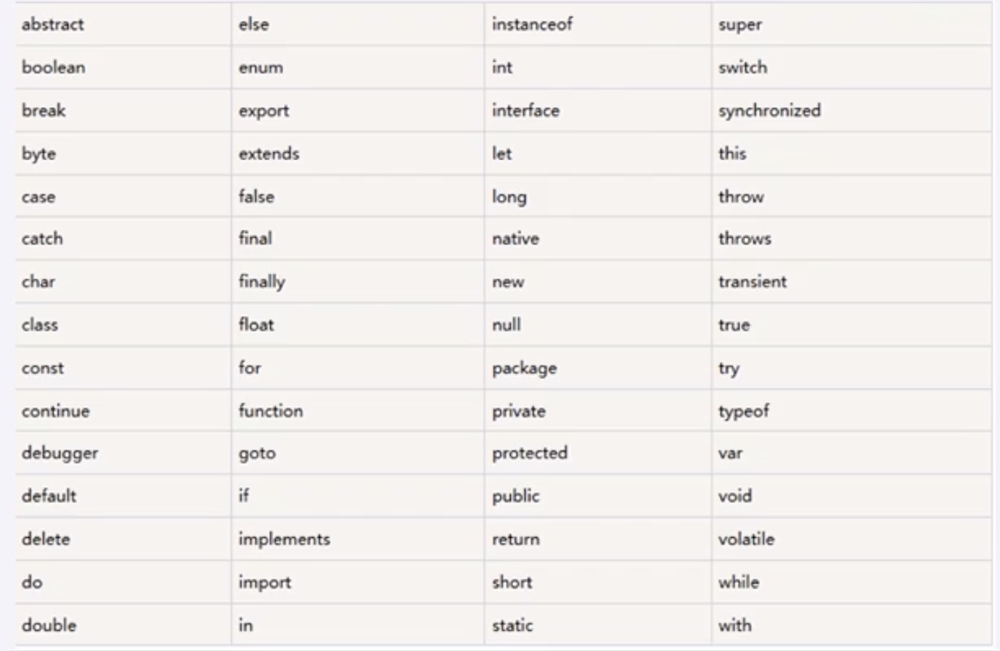

# JavaScript简介

JavaScript是NetScape公司为Navigator浏览器开发的，是现实HTML文件中的一种脚本语言，能实现网页内容的交互现实。当用户在客户端显示该网页时，浏览器就会执行JavaScript程序，用户通过交互的操作来改变网页的内容，来实现HTML页岩无法实现的效果。

js是客户端语言，由浏览器执行的。

JavaScript是用来制作web页面交互效果，提升用户体验。

例如：

- 轮播图。
- 楼层选择。
- tab栏（选项卡），页面切换。
- 表单验证（密码格式）
- 其它功能等等。

## web前端三层

1. 结构层：HTML        从语义的角度，描述页面结构。
2. 样式层：CSS            从审美的角度，美化页面。
3. 行为层：JavaScript 从交互的角度，提升用户体验。

现在的浏览器中只运行一种脚本语言就是javascript。

ECMAScript不是一门语言，而是一个标准

符合这个标准的有两个：

1. javaScript
2. Action Script（Flash中用的语言）

2003年之前，JavaScript被认为“牛皮癣”，页面上的广告，弹窗，漂浮的广告等

2004年，谷歌开始重视**Ajax**技术，Ajax技术就是JavaScript的一个应用（不是一个语言），异步交互技术。**提升用户体验**。页面不刷新的情况下，能够与服务器进行数据的交换。

如：智能感应，输入内容，下拉框弹出一系列相关内容。及时反应。Ajax技术其实就是用js写的东西。

2007年，iPhone移动应用也需要js，javascript在移动页面中也是不可或缺的。

并且这一年互联网开始标准化，按照W3C规则三层分离，越来越重视JavaScript。

2010年，html5推出了Canvas（画布），可以在canvas上进行游戏制作。

2011年，Node.js诞生，就是一个用JavaScript开发服务器的东西。

web App，用网页开发手机应用。

C语言：白底黑字。没有界面。枯燥。

JavaScript有可见的效果。

JavaScript是弱变量类型的语言，变量只需要用一个var来声明。

JavaScript不用关心一些其它的事情，比如内存的释放，指针。只需要关心自己的业务。

1. 语言核心：变量、表达式、运算符、函数、if语句、for语句
2. DOM：控制HTML中的元素，比如让盒子移动、变色、轮播图
3. BOM：控制浏览器的一些东西，比如让浏览器自动滚动。

## 如何使用JavaScript

1. 通过<script></script>中直接编写
2. 通过<script src ='目标文档的URL'></script>链接外部的js文件（公共的）
3. 作为某个元素的事件属性值或者是超链接的href属性值

## 代码屏蔽

1. 浏览器不支持js的话 <!--  //-->里面的代码会被屏蔽掉。

```javascript
<script type="text/javascript">
  <!--
  js代码
//-->
</script>
```

2. 如果浏览器不支持js，可以使用<noscript></noscript>标签，显示noscript中的内容。

## JavaScript基础语法

- 首字符必须是字母、下划线（-）或美元符号（$）

- javaScript执行顺序

  JavaScript执行在浏览器中的，JavaScript执行顺序是按照在HTML文件中出现的顺序依次执行。

  如果需要在HTML文件执行函数或者全局变量，最好将其放在HTML的头部中。

- JavaScript严格区分大小写。

- 忽略空白符和换行符

  JavaScript会忽略关键字、变量名、数字、函数名或其它各种元素之间的空格、制表符或换行符

  可以使用缩进、换行来使代码整齐，提高可读性

- 语句分隔符

  使用;结束语句

  可以把多个语句写在一行

  最后一个语句的分号可以省略，但尽量不要省略

  可以使用{}括成一个语句组，形成一个块block

- **通过\对代码进行折行操作**

  ```
  document.write('this is\
  a test');
  ```

- 注释

  单行注释`//`

  多行注释`/*注释内容*/`

- JavaScript的保留字

  

  起标识符或变量名的时候，避免使用保留字，会冲突报错。

- 通过document.write()向文档书写内容

- 通过console.log()向控制台书写内容

- JavaScript中的错误

  语法错误：通过控制台进行调试

  逻辑错误：通过alert()进行调试


