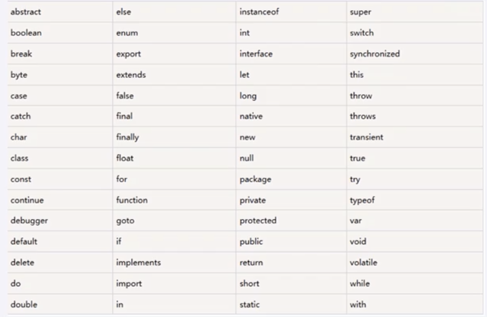

## JavaScript简介

JavaScript是NetScape公司为Navigator浏览器开发的，是现实HTML文件中的一种脚本语言，能实现网页内容的交互现实。当用户在客户端显示该网页时，浏览器就会执行JavaScript程序，用户通过交互的操作来改变网页的内容，来实现HTM L页岩无法实现的效果。

js是客户端语言，由浏览器执行的。

## 如何使用JavaScript

3种方式：

1. 通过<script></script>中直接编写
2. 通过<script src ='目标文档的URL'></script>script>链接外部的js文件（公共的）
3. 作为某个元素的事件属性值或者是超链接的href属性值

## 代码屏蔽

1. 浏览器不支持js的话 <!--  //-->里面的代码会被屏蔽掉。

```
	<script type="text/javascript">
			<!--
				js代码
			//-->
		</script>
```

2. 如果浏览器不支持js，可以使用<noscript></noscript>标签，显示noscript中的内容。

## JavaScript基础语法

- javaScript执行顺序

  JavaScript执行在浏览器中的，JavaScript执行顺序是按照在HTML文件中出现的顺序依次执行。

  如果需要在HTML文件执行函数或者全局变量，最好将其放在HTML的头部中。

- 大小写敏感

  JavaScript严格区分大小写，。

- 忽略空白符和换行符

  JavaScript会忽略关键字、变量名、数字、函数名或其它各种元素之间的空格、制表符或换行符

  可以使用缩进、换行来使代码整齐，提高可读性

- 语句分隔符

  使用;结束语句

  可以把多个语句写在一行

  最后一个语句的分号可以省略，但尽量不要省略

  可以使用{}括成一个语句组，形成一个块block

- **通过\对代码进行折行操作**

  ```
  document.write('this is\
  a test');
  ```

- 注释

  单行注释//

  多行注释/*注释内容*/

- JavaScript的保留字

  

  起标识符或变量名的时候，避免使用保留字，会冲突报错。

- 通过document.write()向文档书写内容

- 通过console.log()向控制台书写内容

- JavaScript中的错误

  语法错误：通过控制台进行调试

  逻辑错误：通过alert()进行调试


