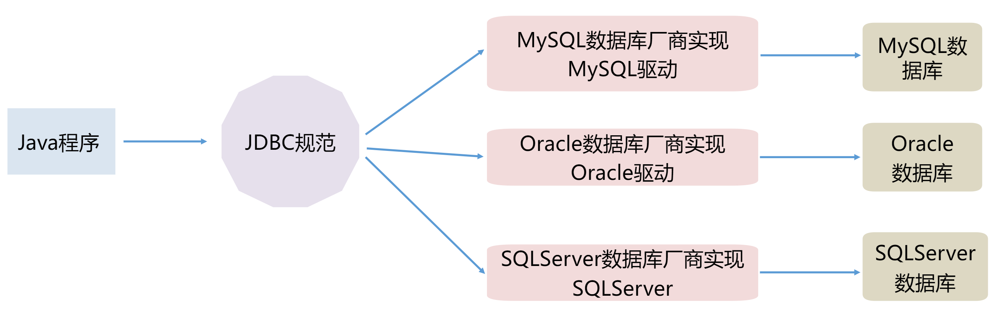

# JDBC

JDBC（Java DataBase Connectivity - Java数据库连接），是SUN公司定义的一套接口（规范）



## 在程序中加入驱动jar包

Project项目下创建Module，Module相当于一个个小项目，Module下创建lib文件夹。

删除的时候右键`Remove Module`。

- `Project\Module\lib\mysql-connector-java-8.0.11.jar`
- `ProjectName\ModuleName\lib\dom4j-2.1.3.jar`
- 然后右键jar包->`Add as Library`

## JDBC访问数据库编码步骤

1：加载Driver驱动

2：获取数据库**连接**（Connection）

3：**创建会话**-SQL命令发送器（Statement）

4：通过Statement**发送SQL**命令并得到结果

5：**处理结果**

6：关闭数据库资源 （ResultSet、Statement、Connection）

```java
package com.msb.test01;

import java.sql.Connection;
import java.sql.DriverManager;
import java.sql.SQLException;
import java.sql.Statement;

public class Test {
    public static void main(String[] args) throws ClassNotFoundException, SQLException {
        
        //加载驱动：
        Class.forName("com.mysql.cj.jdbc.Driver");
        
        //获取连接：
        String url = "jdbc:mysql://127.0.0.1:3306/msb?useSSL=false&useUnicode=true&characterEncoding=UTF-8&serverTimezone=Asia/Shanghai&allowPublicKeyRetrieval=true";
        String username = "root";
        String password = "asdf123456";
        Connection conn = DriverManager.getConnection(url, username, password);
        
        //创建会话：
        Statement sta = conn.createStatement();
        
        //插入数据
        //发送SQL：
        int i = sta.executeUpdate("insert into t_book (id,name,author,price) values (3,'红高粱','莫言',49)");
        //处理结果：
        if(i > 0){//证明对数据库的数据条数有影响
            System.out.println("插入成功！");
        }else{
            System.out.println("插入失败！");
        }
        
        //查询数据
    	//发送SQL：ResultSet结果集合 - 结果集
        ResultSet rs = sta.executeQuery("select * from t_book where price < 40");
        //处理结果：
        while(rs.next()){//判断是否有记录存在
            System.out.println(rs.getInt("id") + "---" + rs.getString("name") + "--" + rs.getString("author") + "--" + rs.getDouble("price"));
        }

        //关闭资源：
        sta.close();
        conn.close();
    }
}
```

**getConnection方法url参数**

```java
String url="jdbc:mysql://127.0.0.1:3306/数据库名称?useSSL=false&useUnicode=true&characterEncoding=UTF-8&serverTimezone=Asia/Shanghai&allowPublicKeyRetrieval=true";
```

- `jdbc:mysql:` mysql协议
- `127.0.0.1:3306` ip和端口号
- `useSSL`：是否使用SSL认证机制-不使用 false
- `useUnicode`：是否unicode字符集-使用
- `characterEncoding=UTF-8`：使用unicode 的utf-8策略
- `serverTimezone=Asia/Shanghai`：时区参数-东八区
- `allowPublicKeyRetrieval=true`：允许客户端从服务器获取公钥

