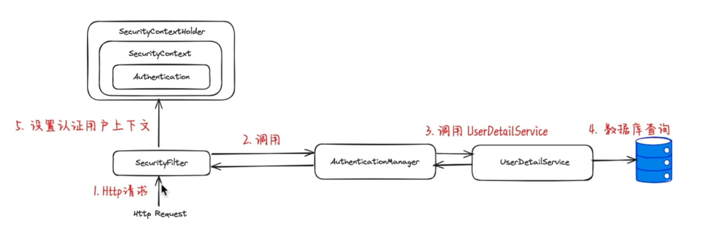

# JWT

用户在浏览器输入用户名和密码进行验证，服务器验证通过之后，用户信息在服务器保存，服务器向用户返回唯一的sessionID，

## 身份认证

身份认证即用户去访问系统资源时系统要求验证用户的身份信息，身份合法方可继续访问。常见的用户身份认证的表现形式有：用户名密码登录，微信扫码等方式。

认证通过由认证服务向给用户颁发令牌，相当于访问系统的通行证，用户拿着令牌去访问系统的资源。

### 第三方认证

为了提高用户体验，很多网站有扫码登录的功能，如：微信扫码登录、QQ扫码登录等。扫码登录的好处是用户不用输入账号和密码，操作简便，另外一个好处就是有利于用户信息的共享，互联网的优势就是资源共享，用户也是一种资源，对于一个新网站如果让用户去注册是很困难的，如果提供了微信扫码登录将省去用户注册的成本，是一种非常有效的推广手段。

## 用户授权

用户认证通过后去访问系统的资源，系统会判断用户是否拥有访问资源的权限，只允许访问有权限的系统资源，没有权限的资源将无法访问，这个过程叫用户授权。

比如：用户去发布课程，系统首先进行用户身份认证，认证通过后继续判断用户是否有发布课程的权限，如果没有权限则拒绝继续访问系统，如果有权限则继续发布课程。

## 单点登录

本项目基于微服务架构构建，微服务包括：内容管理服务、媒资管理服务、学习中心服务、系统管理服务等，为了提高用户体验性，用户只需要认证一次便可以在多个拥有访问权限的系统中访问，这个功能叫做单点登录。

> 单点登录（Single Sign On），简称为 SSO，是目前比较流行的企业业务整合的解决方案之一。SSO的定义是在多个应用系统中，用户只需要登录一次就可以访问所有相互信任的应用系统。

## Spring Security

认证功能几乎是每个项目都要具备的功能，并且它与业务无关，市面上有很多认证框架，如：Apache Shiro、CAS、Spring Security等。

由于本项目基于Spring Cloud技术构建，Spring Security是spring家族的一份子且和Spring Cloud集成的很好，所以本项目选用Spring Security作为认证服务的技术框架。

Spring Security 是一个功能强大且高度可定制的身份验证和访问控制框架，它是一个专注于为 Java 应用程序提供身份验证和授权的框架。

项目主页：https://spring.io/projects/spring-security

Spring cloud Security： https://spring.io/projects/spring-cloud-security

### Spring Security原理

Spring Security所解决的问题就是**安全访问控制**。

安全访问控制功能其实就是对所有进入系统的请求进行拦截，校验每个请求是否能够访问它所期望的资源。根据前边知识的学习，可以通过Filter或AOP等技术来实现，Spring Security对Web资源的保护是靠Filter实现的，所以从这个Filter来入手，逐步深入Spring Security原理。

当初始化Spring Security时，会创建一个名为`SpringSecurityFilterChain`的Servlet过滤器，类型为 org.springframework.security.web.FilterChainProxy，它实现了javax.servlet.Filter，因此外部的请求会经过此类，下图是Spring Security过虑器链结构图：


FilterChainProxy是一个代理，真正起作用的是FilterChainProxy中SecurityFilterChain所包含的各个Filter，同时这些Filter作为Bean被Spring管理，它们是Spring Security核心，各有各的职责，但他们并不直接处理用户的**认证**，也不直接处理用户的**授权**，而是把它们交给了认证管理器（AuthenticationManager）和决策管理器（AccessDecisionManager）进行处理。


整合Spring Security实现JWT资源访问的认证和权限控制。

- 实现注册接口，创建新用户
- 实现登录接口，用于下发JWT Token
- 使用JWT Filter验证带有Token的请求访问头
- 利用Spring Security保护应用的资源API

SpringBoot Security

- 使用MyBatisX插件生成数据访问层的代码
- 使用Spring Security实现用户登录注册
- Jwt跨域认证

Spring Security整体架构：



SecurityFilter有下面几个主要的类

- AuthenticationFilter
- AuthenticationManager
- UserDetailsService
- SecurityContext

通过AuthenticationFilter拦截用户请求并提取认证信息（用户名、密码、token），然后调用AuthenticationManager处理认证逻辑，认证逻辑会调用UserDetailsService来加载用户的详情信息（密码，用户名等），一旦认证成功，用户的信息会被设置到SecurityContext中，供后续的请求访问。

整个流程确保了应用的安全性，通过对用户的身份验证和权限校验，来决定用户是否可以访问应用中特定的资源。

## JWT

jwt是一种开放的标准，定义了一种紧凑且自包含的方式，用于在各方之间以json对象的形式来安全的传输信息。

jwt由下面三个部分构成：

- Header头部
- payload载荷
- signature签名

Header包含令牌的类型和使用的签名算法

payload包含过期时间

signature是对header和signature的数字验证，验证消息的发送者是谁和**确保消息没有被篡改**。由头部指定的签名算法和密钥生成。

因为JWT的信息是自包含的，非常适合跨域认证的场景，客户端在登录之后会收到JWT的一个token，之后每次请求通过http头部来带上这个token，服务器来验证签名来确认用户是否有权限。

## 登陆注册

添加Spring Security和JWT的依赖：

```xml
<?xml version="1.0" encoding="UTF-8"?>
<project xmlns="http://maven.apache.org/POM/4.0.0"
         xmlns:xsi="http://www.w3.org/2001/XMLSchema-instance"
         xsi:schemaLocation="http://maven.apache.org/POM/4.0.0 http://maven.apache.org/xsd/maven-4.0.0.xsd">
    <modelVersion>4.0.0</modelVersion>

    <groupId>com.hh</groupId>
    <artifactId>LoginRegister</artifactId>
    <version>1.0-SNAPSHOT</version>


    <properties>
        <java.version>1.8</java.version>
        <project.build.sourceEncoding>UTF-8</project.build.sourceEncoding>
        <project.reporting.outputEncoding>UTF-8</project.reporting.outputEncoding>
        <spring-boot.version>2.6.13</spring-boot.version>
    </properties>
    <dependencies>
        <dependency>
            <groupId>org.springframework.boot</groupId>
            <artifactId>spring-boot-starter-web</artifactId>
        </dependency>

        <dependency>
            <groupId>com.mysql</groupId>
            <artifactId>mysql-connector-j</artifactId>
            <scope>runtime</scope>
        </dependency>

        <dependency>
            <groupId>com.baomidou</groupId>
            <artifactId>mybatis-plus-boot-starter</artifactId>
            <version>3.5.5</version>
        </dependency>

        <dependency>
            <groupId>org.springframework.boot</groupId>
            <artifactId>spring-boot-starter-test</artifactId>
            <scope>test</scope>
        </dependency>

        <dependency>
            <groupId>cn.hutool</groupId>
            <artifactId>hutool-core</artifactId>
            <version>5.8.26</version>
        </dependency>


        <dependency>
            <groupId>org.springframework.boot</groupId>
            <artifactId>spring-boot-starter-security</artifactId>
        </dependency>
        <dependency>
            <groupId>io.jsonwebtoken</groupId>
            <artifactId>jjwt-api</artifactId>
            <version>0.11.5</version>
        </dependency>
        <dependency>
            <groupId>io.jsonwebtoken</groupId>
            <artifactId>jjwt-impl</artifactId>
            <version>0.11.5</version>
        </dependency>
        <dependency>
            <groupId>io.jsonwebtoken</groupId>
            <artifactId>jjwt-jackson</artifactId>
            <version>0.11.5</version>
        </dependency>
        <dependency>
            <groupId>org.projectlombok</groupId>
            <artifactId>lombok</artifactId>
        </dependency>

        <dependency>
            <groupId>org.springframework.boot</groupId>
            <artifactId>spring-boot-devtools</artifactId>
            <scope>runtime</scope>
        </dependency>


        <!--引入日志-->
        <dependency>
            <groupId>ch.qos.logback</groupId>
            <artifactId>logback-classic</artifactId>
            <version>1.2.6</version>
        </dependency>

        <dependency>
            <groupId>io.springfox</groupId>
            <artifactId>springfox-swagger2</artifactId>
            <version>2.9.2</version>
        </dependency>

        <dependency>
            <groupId>io.springfox</groupId>
            <artifactId>springfox-swagger-ui</artifactId>
            <version>2.9.2</version>
        </dependency>

        <dependency>
            <groupId>com.alibaba</groupId>
            <artifactId>fastjson</artifactId>
            <version>2.0.49</version>
        </dependency>

    </dependencies>
    <dependencyManagement>
        <dependencies>
            <dependency>
                <groupId>org.springframework.boot</groupId>
                <artifactId>spring-boot-dependencies</artifactId>
                <version>${spring-boot.version}</version>
                <type>pom</type>
                <scope>import</scope>
            </dependency>
        </dependencies>
    </dependencyManagement>

    <build>
        <plugins>
            <plugin>
                <groupId>org.apache.maven.plugins</groupId>
                <artifactId>maven-compiler-plugin</artifactId>
                <version>3.8.1</version>
                <configuration>
                    <source>1.8</source>
                    <target>1.8</target>
                    <encoding>UTF-8</encoding>
                </configuration>
            </plugin>
            <plugin>
                <groupId>org.springframework.boot</groupId>
                <artifactId>spring-boot-maven-plugin</artifactId>
                <version>${spring-boot.version}</version>
                <configuration>
                    <mainClass>com.example.demo.DemoApplication</mainClass>
                </configuration>
                <executions>
                    <execution>
                        <id>repackage</id>
                        <goals>
                            <goal>repackage</goal>
                        </goals>
                    </execution>
                </executions>
            </plugin>
        </plugins>
    </build>

</project>
```

