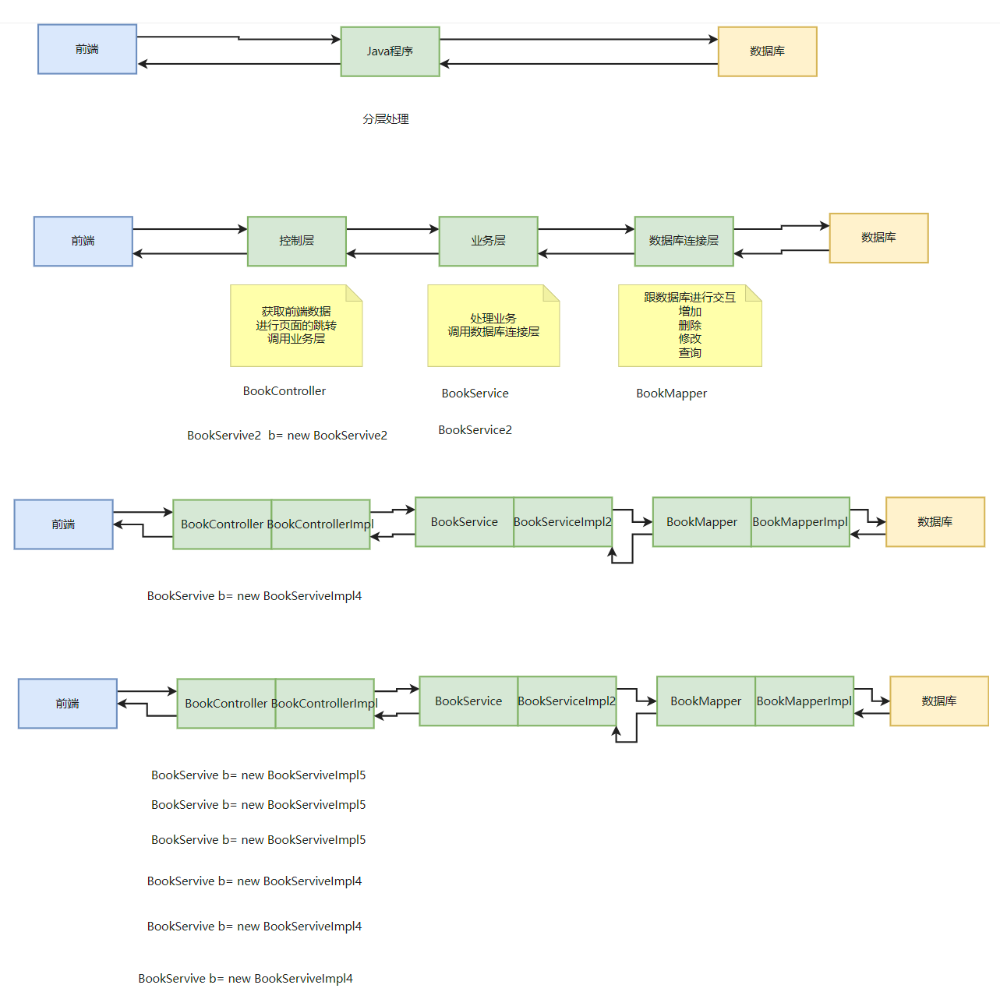
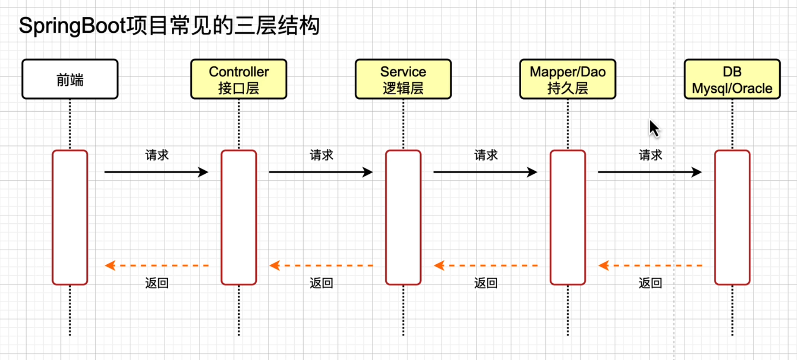

## Java程序分层处理

从前端获取的数据到从数据库处理之前，所有的逻辑都在java里面，各种功能在一起，程序臃肿，需要划分。

### 1、Controller接口层

用来做接口的，接口层负责跟外部做对接，对外提供项目入口，接口层是跟外部做交互的。

- 获取前端数据
- 控制页面跳转（例：登录成功返回成功，失败返回失败，前面跳转对应页面）
- 调用业务层

### 2、Service业务逻辑层

逻辑层用来做逻辑的，比如：对日期格式做转换，对金额做计算，对列表排序，写一些算法等等。逻辑层写各种各样的功能，写这些功能的时候需要的数据的时候，就去访问一下持久层。不需要关系底层数据库是怎么设计的，用的mysql还是Oracle，要什么数据，就跟持久层要，拿到数据之后，去做一些逻辑计算。

- 处理业务（业务需要增加和删除数据库数据操作同时进行，或者修改和查询同时进行。具体的业务逻辑）
  - A逻辑 需要增加和删除操作
  - B逻辑 需要增加和修改操作
  - C逻辑 需要增加和查询操作
  - 所以数据库连接层是简单的操作
- 调用数据库连接层

### 3、Mapper/Dao持久层（数据库连接层）

Java程序访问mysql以前用的JDBC，现在用的持久层，持久层就是将数据持久化，保存到数据库里面。

持久层的作用就是一个**桥梁**，将Java程序跟数据库对接起来。

可以把它理解成一个数据库的客户端，在持久层里面做的就是写各种各样的sql。

- 跟数据库进行交互（简单的增、删、修）

Controller接口层、Service逻辑层、Mapper/Dao层就是java程序Spring Boot项目。

### 为什么分层

如果不要逻辑层，接口需要什么数据就往持久层要也可以，但是如果要的数据拿到之后，还要做很多的计算、数据结构的转换，那么接口层里面就写了很多的逻辑。后续有另外一个接口也要拿到这个数据，做一堆同样的计算，导致接口代码出现冗余，所以会将这种复杂的逻辑，有可能重复使用的代码放到逻辑层里面。这就是逻辑层的好处。

不要这三层设计也可以，但是有可能会让代码不好维护，重复率高，冗余的代码很多。

### 接口+实现类

每一层都分为接口+实现类两部分。接口不会变，只需要替换实现类，就可以实现修改。

通过接口=实现类的方式调用，更规范、扩展性更强。