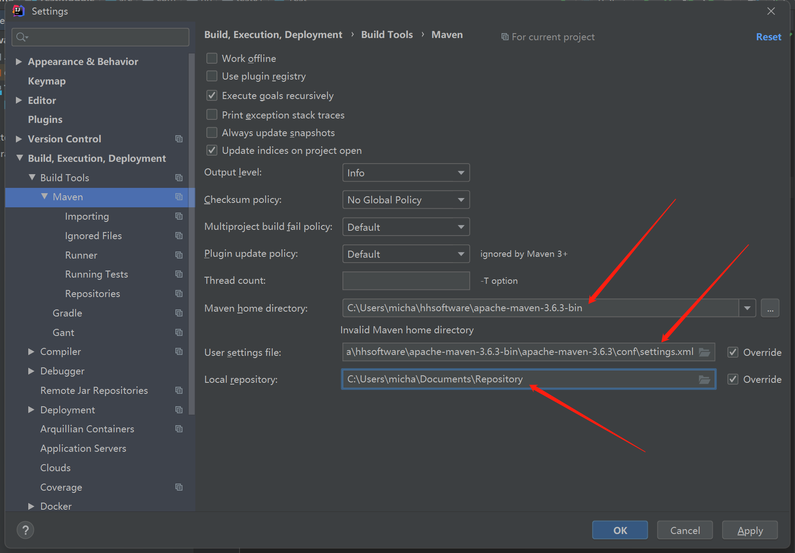
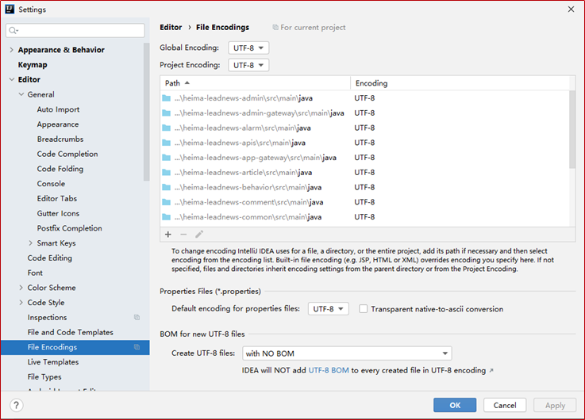
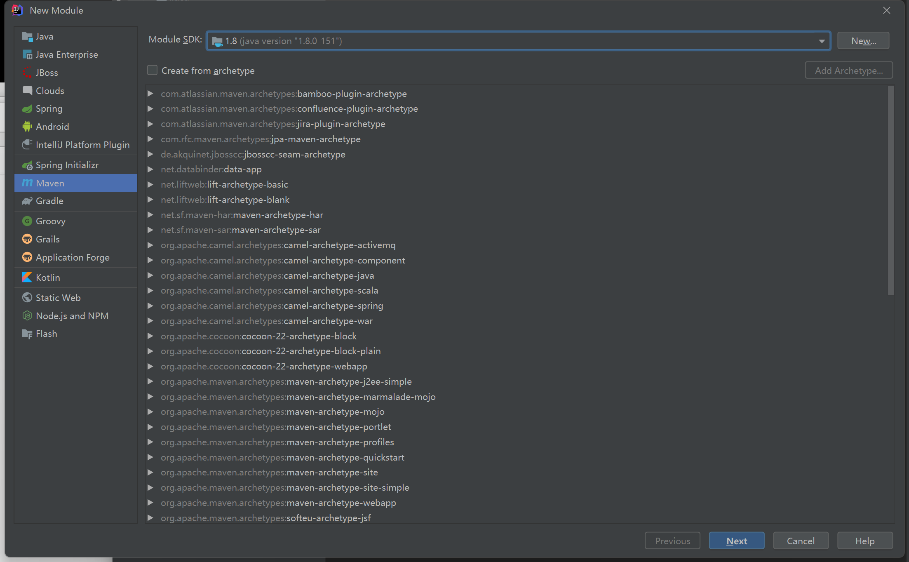
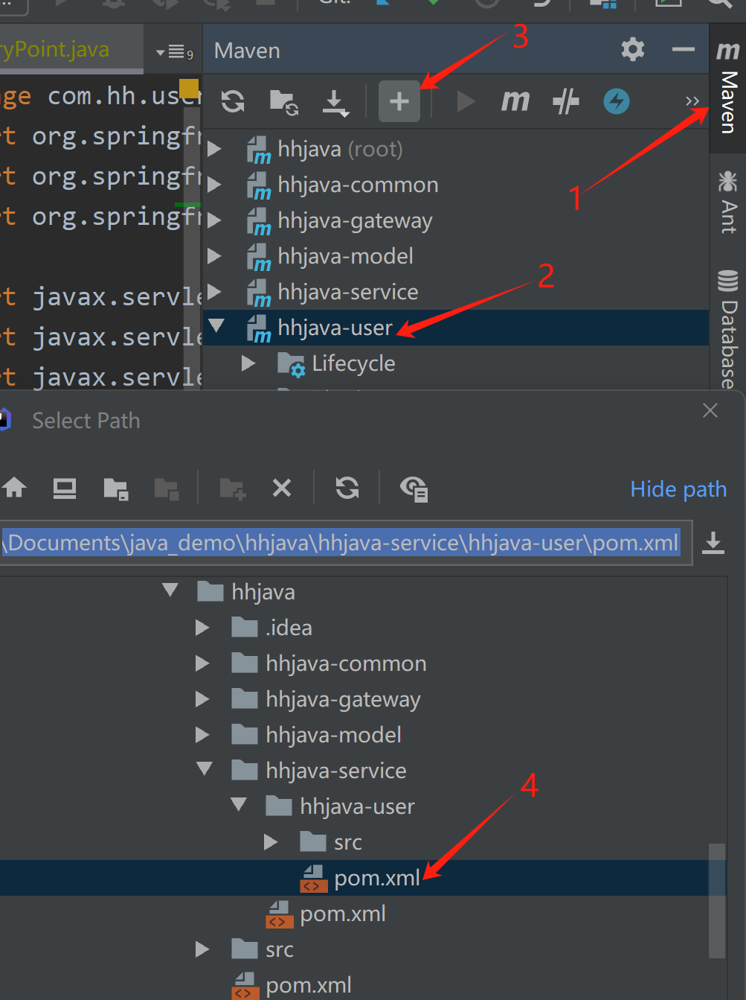

# Maven

Maven是使用Java语言编写的基于项目对象模型（POM）**项目管理工具软件**。

开发者可以通过一小段描述信息来管理项目构建、报告和文档。

使用Maven可以更好的帮助我们完成项目的管理。导包操作不用自己操作了。

## 非Maven项目的缺点

1. 项目中的jar包资源需要自己从网上下载后，手动导入到项目中使用。jar包多的话容易遗漏。
2. jar包版本控制麻烦。

## Maven的仓库

中央仓库(Central Repository)：Maven官方服务器，里面存放了绝大多数市面上流行的jar。允许用户注册后，上传自己的项目到官方服务器，网址在国外。https://mvnrepository.com/

本地仓库(Local Repository)：本机的文件夹作为本地仓库，本地仓库指本机的一份拷贝，用来缓存远程下载，包含你尚未发布的临时构件。

镜像仓库(Mirror Repository)：访问国外的Maven仓库特别慢。镜像仓库就是另一台备份/复制了中央仓库的服务器。平时使用阿里云镜像或华为云镜像，这样可以大大提升从中央仓库下载资源的速度。但它的角色仍然是一个远程库。

### 查找依赖流程

- 先在本地仓库找
  - 没找到
    - 配置文件`setting.xml`中是否指定镜像仓库
      - 指定了就在镜像仓库找
      - 没指定就在中央仓库找

    - 找到后放入本地仓库以备下次使用

  - 找到了
    - 直接使用


## Maven的资源坐标

将坐标复制到项目的配置文件中，通过坐标就可以找到jar包。

- GroupId：一般是逆向公司域名 com.xxx，同一个公司的GroupId都是相同的。
- ArtifactId：一般是项目(jar)名 mysql-connector-java。
- Version：版本号 8.0.28。

## Maven的下载和安装

从maven官网下载，地址：https://maven.apache.org/download.cgi

https://archive.apache.org/dist/maven/maven-3/3.6.1/binaries/

## Maven的配置

下面三个配置都是在配置文件`C:\Users\micha\hhsoftware\apache-maven-3.9.1\conf\settings.xml`中修改。

### 1、本地仓库

1. 随便选择一个目录作为本地仓库，可以使用我提供的本地仓库
2. 指定本地仓库位置

```xml
<localRepository>C:/Users/micha/Documents/Repository</localRepository>
```

### 2、镜像仓库

指定阿里云镜像仓库：

```xml
<mirrors> 
    <mirror>  
        <id>alimaven</id> 
        <name>aliyun maven</name>   
        <url>http://maven.aliyun.com/nexus/content/groups/public/</url>   
        <mirrorOf>central</mirrorOf> 
    </mirror>
</mirrors>
```

### 3、配置JDK

在使用Maven后，项目由Maven编译和打包运行，需要指定使用的JDK版本。

17换成1.8。

```xml
<profile>
  <id>jdk-17</id>
  <activation>
    <activeByDefault>true</activeByDefault>
    <jdk>17</jdk>
  </activation>
  <properties>
    <maven.compiler.source>17</maven.compiler.source>
    <maven.compiler.target>17</maven.compiler.target>
    <maven.compiler.compilerVersion>17</maven.compiler.compilerVersion>
  </properties>
</profile>
```

## 项目依赖环境

- maven：3.8.6换为低版本3.6.3
- jdk：17换为低版本1.8
- Intellij IEDA：2019版本

- Mysql5.7+

## 在IDEA中配置Maven

`File | Settings | Build, Execution, Deployment | Build Tools | Maven`

- Maven home directory
- User settings file
- Local repository本地仓库地址



设置项目编码格式



## 创建Maven项目

新建Module模块，ModuleSDK选择1.8版本的。



## pom.xml文件中添加依赖包

选择手动导入`Import Changes`

## Mac配置Maven

下载 Apache Maven 的二进制压缩包：[Maven 下载页面](https://maven.apache.org/download.cgi)

将解压后的目录移动到你想要存放的地方，例如 /usr/local/apache-maven-3.8.8。

配置环境变量:

编辑`~/.zshrc`文件，添加以下内容：
```sh
export M2_HOME=/usr/local/apache-maven-3.8.8/bin
export PATH=$PATH:$M2_HOME
```

保存文件并运行以下命令以使更改生效：
```sh
source ~/.zshrc
```

验证安装:

在终端中运行以下命令来验证 Maven 是否安装成功：
```sh
mvn -v
```

你应该看到 Maven 的版本信息和 Java 的版本信息。

## 新建Module

在Module中创建子Module，文件图标不正确，需要重新添加一下pom.xml。



