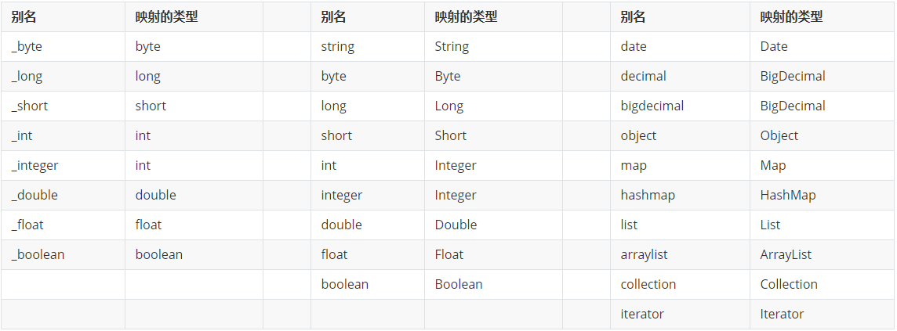

# MyBatis

等效于对之前学习JDBC的MyBatis框架。

## MyBatis是持久层框架

**持久层**是分层开发中专门负责访问数据源的一层。

把访问数据源的代码和业务逻辑代码分离开，有利于后期维护和团队分工开发。同时也增加了数据访问代码的复用性。

Java项目中每一层都有自己的作用。不同的层创建不同的类，不同的类功能不一样。

## MyBatis是ORM框架

**ORM**(Object Relation Mapping)，中文名称：**对象关系映射**。是一种解决数据库发展和面向对象编程语言发展不匹配问题而出现的技术。


## 搭建MyBatis框架

### 整体框架：

> Project
>
> - Module
>   - src
>     - main
>       - java
>         - com.hh
>           - mapper
>             - BookMapper.java（接口类）
>           - pojo
>             - Book.java（实体类）
>       - resources
>         - com.hh.mapper
>           - BookMapper.xml（映射文件）
>         - db.properties
>         - log4j.properties
>         - mybatis.xml
>     - test
>       - java
>         - com.hh.test
>           - test.java
>   - pom.xml

### 1、创建数据库表

直接在MySQL中，创建表和数据。

### 2、创建Maven项目

通过Maven导入对应框架。

### 3、pom.xml文件中添加依赖

```xml
<?xml version="1.0" encoding="UTF-8"?>
<project xmlns="http://maven.apache.org/POM/4.0.0"
         xmlns:xsi="http://www.w3.org/2001/XMLSchema-instance"
         xsi:schemaLocation="http://maven.apache.org/POM/4.0.0 http://maven.apache.org/xsd/maven-4.0.0.xsd">
    <modelVersion>4.0.0</modelVersion>

    <groupId>com.hh</groupId>
    <artifactId>TestMyBatis</artifactId>
    <version>1.0-SNAPSHOT</version>

    <dependencies>
        <!--MySQL依赖，mybatis链接数据库需要mysql驱动-->
        <dependency>
            <groupId>mysql</groupId>
            <artifactId>mysql-connector-java</artifactId>
            <version>8.0.28</version>
        </dependency>
        <!--Mybatis依赖-->
        <dependency>
            <groupId>org.mybatis</groupId>
            <artifactId>mybatis</artifactId>
            <version>3.5.6</version>
        </dependency>
        <!--log4j的依赖-->
        <dependency>
            <groupId>log4j</groupId>
            <artifactId>log4j</artifactId>
            <version>1.2.17</version>
        </dependency>
    </dependencies>
  
</project>
```

### 4、实体类

`java_demo/TestMyBatis02/src/main/java/com/hh/pojo/Book.java`创建Book实体类。

Mybatis查询到的数据要封装成对象，对象要依托于类。

### 5、映射文件

对数据库做操作的sq信息。增删改查在这个配置文件里。

在`项目|module|src|main|resources`下创建com文件夹->hh文件夹->mapper文件夹，然后在mapper文件夹中创建`BookMapper.xml`。

sql和业务代码解耦。直接在xml中操作。

创建映射文件：要求：namespace取值必须是接口的全限定路径、标签中的id属性值必须和接口中的方法名对应。

```xml
<?xml version="1.0" encoding="UTF-8" ?>
<!--约束 根标签是mapper-->
<!DOCTYPE mapper
        PUBLIC "-//mybatis.org//DTD Mapper 3.0//EN"
        "https://mybatis.org/dtd/mybatis-3-mapper.dtd">
<!--namespace：防止其它文件也有同样的名字的sql，所以定义一个命名空间。下面的id方法就是接口对应的实现类-->
<mapper namespace="com.hh.mapper.BookMapper">
    <!--    查询操作-->
    <!--    id类似方法名，resultType是返回值-->
    <!--    id方法名要与接口对应的名字一样-->
    <select id="selectAllBooks" resultType="b">
        select * from t_book
    </select>
    <select id="selectOneBook" resultType="Book">
        select * from t_book where name =#{param1} and author = #{param2}
    </select>
    <select id="selectOneBook2" resultType="Book">
        select * from t_book where name =#{name} and author = #{author}
    </select>
    <select id="selectOneBook3" resultType="Book">
        select * from t_book where name =#{param1} and author = #{param2.author}
    </select>
    <!--    插入操作-->
    <insert id="insertBook">
        insert into t_book (id,name,author,price) values (#{id},#{name},#{author},#{price})
    </insert>
</mapper>
```

**映射文件默认不会被程序加载，如果想要被项目加载，需要配置到核心配置文件mybatis.xml中`<mappers>`。** 

### 6、接口类

项目不写接口类也可以正常使用，但是会存在下面的问题：

- **方法不能直接调用**
- 多个参数问题处理麻烦
- 项目没有规范可言，不利于面向接口编程思想。

BookMapper.xml里面的sql不能作为方法调用。

`java_demo/TestMyBatis02/src/main/java/com/hh/mapper/BookMapper.java`

在`项目|module|src|main|java|package（com.hh.mapper）`创建BookMapper接口文件。

```java
package com.msb.mapper;

import com.msb.pojo.Book;

import java.util.List;

public interface BookMapper {
    //    定义规则，抽放方法。主要定义方法名，参数，返回值
    /*public abstract */List selectAllBooks();

    public abstract Book selectOneBook(String name, String author);

    public abstract Book selectOneBook2(Book book);

    public abstract Book selectOneBook3(String name, Book book);

    public abstract int insertBook(Book book);
}
```

### 7、创建MyBatis全局配置文件

（mybaits中文网址：https://mybatis.org/mybatis-3/zh/getting-started.html）

7.1、配置数据库属性文件

在`项目|模块|src|main|resources`中创建`db.properties`文件，后缀名必须是`.properties`。

里面放数据库的配置信息。

数据库的参数和核心配置文件解耦。改数据库的参数在`db.properties`里面改。

```properties
url=jdbc:mysql://localhost:3306/msb?useUnicode=true&characterEncoding=utf-8&useSSL=false&serverTimezone=GMT%2B8&allowPublicKeyRetrieval=true
driver=com.mysql.cj.jdbc.Driver
username=数据库名字
password=数据库密码
```

7.2、在`项目|模块|src|main|resources`中创建`mybatis.xml`文件

```xml
<?xml version="1.0" encoding="UTF-8" ?>
<!--标签约束，xml的标签不能随便写，一旦随便写，代码会出错-->
<!DOCTYPE configuration
        PUBLIC "-//mybatis.org//DTD Config 3.0//EN"
        "https://mybatis.org/dtd/mybatis-3-config.dtd">
<configuration>
    <!--    加载数据库配置文件-->
    <properties resource="db.properties"></properties>
    <!--    别名设置-->
    <typeAliases>
        <typeAlias type="com.hh.pojo.Book" alias="b"></typeAlias>
        <package name="com.hh.pojo"/>
    </typeAliases>

    <!--数据库配置信息-->
    <environments default="mysql">
        <!--链接MySQL数据库的数据源配置-->
        <environment id="mysql">
            <!--配置mybatis中的事务管理-->
            <transactionManager type="JDBC"></transactionManager>
            <dataSource type="POOLED">
                <property name="driver" value="${driver}"/>
                <property name="url" value="${url}"/>
                <property name="username" value="${username}"/>
                <property name="password" value="${password}"/>
            </dataSource>
        </environment>
    </environments>
    <!--资源扫描、接口对应的实现类-->
    <mappers>
        <mapper resource="com/hh/mapper/BookMapper.xml"></mapper>
    </mappers>

</configuration>
```

#### 别名设置

MyBatis提供了别名机制可以对某个类起别名或给某个包下所有类起别名，简化resultType取值的写法。

在核心配置文件mybatis.xml中，通过`<typeAlias>`标签明确设置类型的别名。

- type:类型全限定路径
- alias:别名名称

#### 1、具体的类起别名

```xml
<typeAliases>  
    <typeAlias type="com.msb.pojo.People" alias="p"></typeAlias>
</typeAliases>
```

#### 2、指定的包起别名

当类个数较多时，明确指定别名工作量较大，可以通过`<package>`标签指定包下全部类的别名。指定后所有类的别名就是类名。（也不区分大小写）

```xml
<typeAliases> 
    <package name="com.msb.pojo"/>
</typeAliases>
```

PS:明确指定别名和指定包的方式可以同时存在。

**内置别名**

MyBatis框架中内置了一些常见类型的别名。这些别名不需要配置



### 8、测试类，启动项目

```java
package com.hh.test;

import com.hh.mapper.BookMapper;
import com.hh.pojo.Book;
import org.apache.ibatis.io.Resources;
import org.apache.ibatis.session.SqlSession;
import org.apache.ibatis.session.SqlSessionFactory;
import org.apache.ibatis.session.SqlSessionFactoryBuilder;

import java.io.IOException;
import java.io.InputStream;
import java.util.List;

public class test {
    public static void main(String[] args) throws IOException {
        //指定核心配置文件的路径：从resources下开始加载，mybatis.xml在resources根目录下，所以直接写mybatis.xml。
        String resource = "mybatis.xml";
        //获取加载配置文件的输入流：
        InputStream inputStream = Resources.getResourceAsStream(resource);
        //加载配置文件，创建工厂类
        SqlSessionFactory sqlSessionFactory = new SqlSessionFactoryBuilder().build(inputStream);
        //通过工厂类获取一个会话：
        SqlSession sqlSession = sqlSessionFactory.openSession();
      
      
	      /// 1、不使用接口类的情况：
        //执行查询：
        List list0 = sqlSession.selectList("com.hh.mapper.BookMapper.selectAllBooks");
			  //遍历：
        for (int i = 0; i <= list0.size() - 1 ; i++) {
            Book b = (Book)list0.get(i);
            System.out.println(b.getName() + "---" + b.getAuthor());
        }
      
        /// 2、使用接口类的情况：
        //动态代理模式：通过接口找到接口对应的实现类 BookMapper mapper = BookMapper实现类BookMapper.xml
        BookMapper mapper = sqlSession.getMapper(BookMapper.class);
        List list = mapper.selectAllBooks();
        //遍历：
        for (int i = 0; i <= list.size() - 1; i++) {
            Book b = (Book) list.get(i);
            System.out.println(b.getName() + "---" + b.getAuthor());
        }

        Book book = mapper.selectOneBook("java", "jj");
        System.out.println(book.getName());

        //参数传一个对象
        Book b = new Book();
        b.setName("java");
        b.setAuthor("jj");
        Book book1 = mapper.selectOneBook2(b);
        System.out.println(book1.getAuthor());

        Book book2 = mapper.selectOneBook3("java", b);
        System.out.println(book2.getAuthor());

        //插入数据
        Book book3 = new Book();
        book3.setId(3);
        book3.setName("flutter");
        book3.setAuthor("msb");
        book3.setPrice(89);
        int n = mapper.insertBook(book3);
        if (n > 0) {
            System.out.println("插入成功");
        }
        //事务相关操作
        sqlSession.commit();
        //关闭资源：
        sqlSession.close();
    }
}
```

### 日志功能

MyBatis框架内置日志工厂。日志工厂负责自动加载项目中配置的日志。MyBatis支持以下日志：

- SLF4J
- Apache Commons Logging
- Log4j 2
- **Log4j** (deprecated since 3.5.9)
- JDK logging

`pom.xml`增加log4j的依赖：

```xml
<!--log4j的依赖-->
<dependency>
    <groupId>log4j</groupId>
    <artifactId>log4j</artifactId>
    <version>1.2.17</version>
</dependency>
```

在resources中新建`log4j.properties`配置文件。名称必须叫这个名字，扩展名必须是.properties。

如果只是想看sql执行过程，那么可以整体调高，局部降低：

将整个日志级别调为ERROR，然后mapper.xml涉及的内容级别降低为TRACE。这样整体的多余信息不会输出，然后mapper.xml中的涉及内容会详细打印。

log4j.properties加入：

```properties
# log4j中定义的级别：fatal(致命错误) > error(错误) >warn(警告) >info(普通信息) >debug(调试信息)>trace(跟踪信息)
log4j.rootLogger = error , console

# log4f.logger是固定的，com.hh.mapper.BookMapper是命名空间的名字。
log4j.logger.com.hh.mapper.BookMapper=TRACE

### console ###
log4j.appender.console = org.apache.log4j.ConsoleAppender
log4j.appender.console.Target = System.out
log4j.appender.console.layout = org.apache.log4j.PatternLayout
log4j.appender.console.layout.ConversionPattern = [%p] [%-d{yyyy-MM-dd HH\:mm\:ss}] %C.%M(%L) | %m%n
```

### 参数传递

**使用接口绑定方案之前：**

（1）如果是一个参数，直接传递

（2）如果是多个参数，封装为对象/集合

**使用接口绑定方法之后：**

可以直接调用方法传递参数即可。传递后在映射文件中如何获取数据呢？

在BookMapper接口文件中定义接口，在BookMapper.xml映射文件中写参数的名字和接口中的要对应。

**获取数据方式-使用内置名称进行调用**

使用符号： **#{}**进行获取

{}中名字使用**规则**：

- arg0、arg1、argM(M为从0开始的数字，和方法参数顺序对应)
- param1、param2、paramN（N为从1开始的数字，和方法参数顺序对应）。

**一个参数且参数为对象，获取参数如何处理呢？**

使用符号： **#{}**进行获取

直接利用属性名即可

**多个参数且参数有对象，获取参数如何处理呢？**

使用符号： **#{}**进行获取

- argM.属性名
- paramN.属性名

PS：argM. 或者 paramN. 不可以省略不写

先接口、再映射文件。
