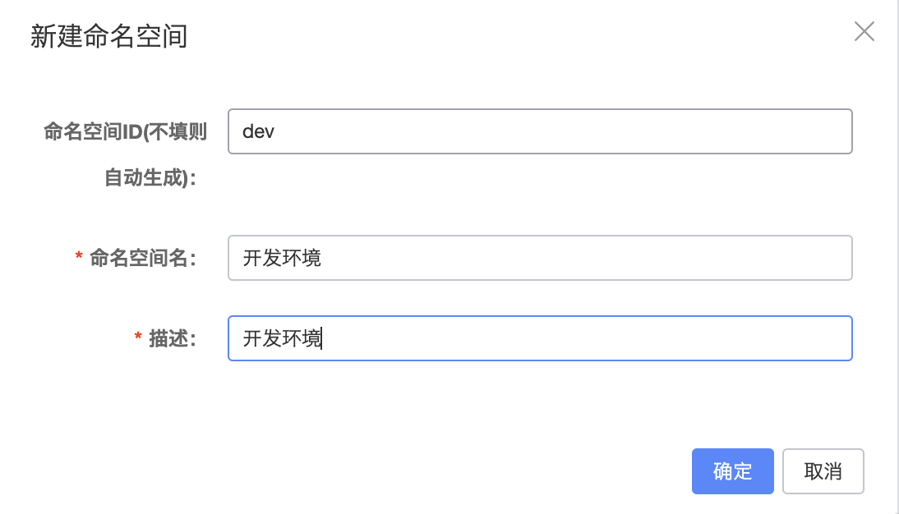
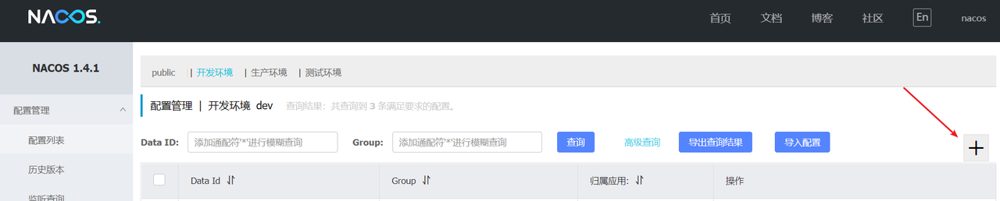
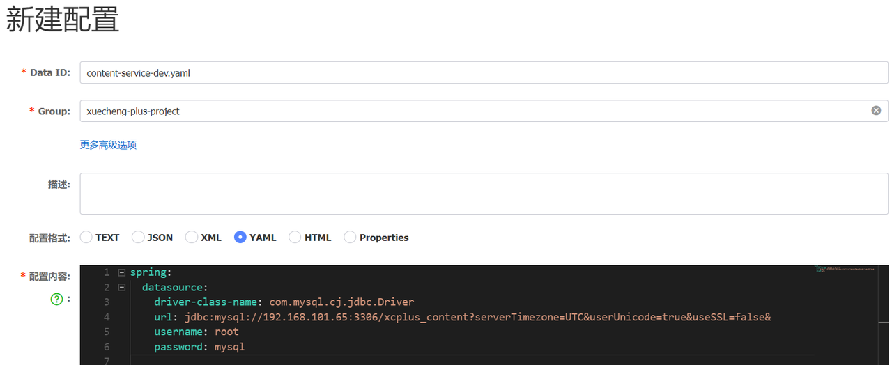
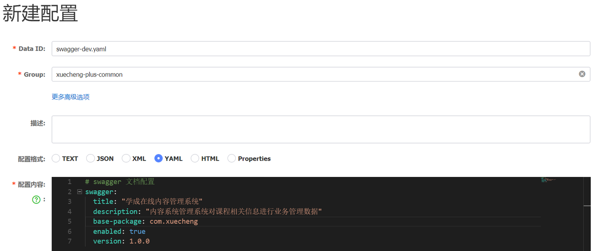
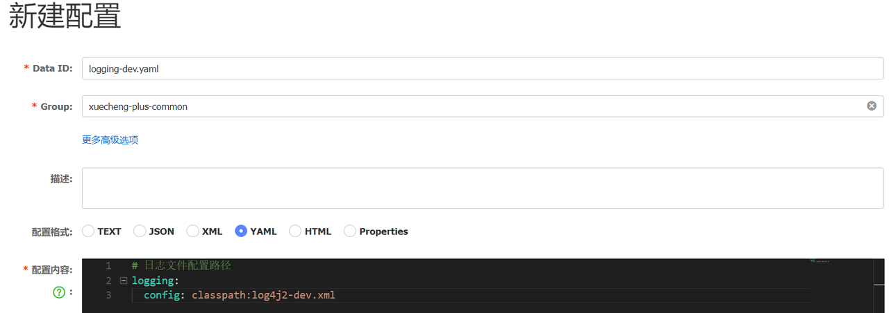
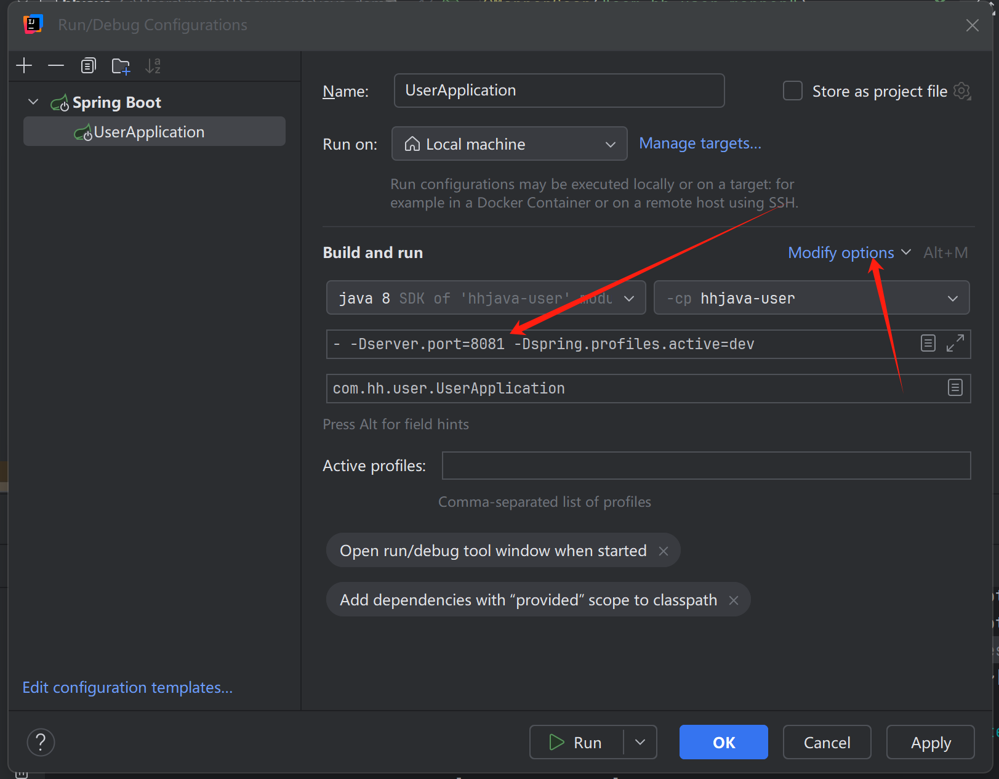

# Nacos

Nacos 是一个开源的动态服务发现、配置管理和服务管理平台，由阿里巴巴开源。Nacos 是 "Dynamic Naming and Configuration Service" 的缩写，它为微服务架构提供了关键的基础设施支持。

Nacos 的主要功能：

- **服务发现中心（注册中心）**
  - Nacos 可以帮助服务在注册中心进行注册和发现。服务实例可以通过 Nacos 注册自己，并且其他服务（网关）可以通过 Nacos 查找这些服务实例。

- **动态配置管理**

  - Nacos 提供集中化的配置管理功能，允许开发者在一个地方（Nacos）管理所有的配置项。配置的变更可以实时推送到应用程序中。

  - 支持配置的版本管理和灰度发布，方便进行配置的管理和控制。

- **动态 DNS 服务**
  - Nacos 提供 DNS 服务，可以将服务发现和 DNS 解析结合起来，方便服务的调用。

- **服务健康监测**
  - Nacos 提供了服务健康检查机制，确保服务实例的可用性。
- **服务管理**
  - 提供服务的元数据管理、流量管理、熔断降级等功能，帮助提升系统的稳定性和可靠性。

Nacos 支持多种服务发现协议（如 HTTP、gRPC、Dubbo 等）和多种配置格式（如 YAML、Properties、JSON 等），并且可以与 Spring Cloud、Kubernetes 等生态系统集成。

**Nacos 的典型应用场景包括微服务架构中的服务注册与发现、配置管理，以及分布式系统中的服务治理。**

Nacos通常安装在Linux服务器上。

## Nacos安装

1、docker拉取镜像 

```shell
docker pull nacos/nacos-server:latest
```

2、创建容器

针对nacos镜像创建容器

```shell
docker run --env MODE=standalone -d --name nacos-server --restart=always -p 8848:8848 -p 9848:9848 -p 9849:9849 nacos/nacos-server:latest
```

- docker run 启动容器
- MODE=standalone 单机版
- --restart=always 开机启动

**在阿里云安全组中一定要开放8848和9848两个端口。**

3、访问nacos地址：http://服务器ip:8848/nacos 

## 搭建Nacos

### 1、服务发现中心

Spring Cloud ：一套规范

Spring Cloud alibaba: nacos服务注册中心，配置中心

在搭建Nacos**服务发现中心**之前需要搞清楚两个概念：namespace和group

- namespace：用于区分环境、比如：开发环境、测试环境、生产环境。
- group：用于区分项目，比如：项目A、项目B。

首先在nacos配置namespace:

登录Centos，启动Naocs，使用sh /data/soft/restart.sh将自动启动Nacos。

登录成功，点击左侧菜单“**命名空间**”进入命名空间管理界面，

点击“新建命名空间”，填写命名空间的相关信息。如下图：



使用相同的方法再创建“测试环境”（test）、"生产环境"（prod）的命名空间。

首先完成各服务注册到Naocs。

1、在xuecheng-plus-parent中添加依赖管理 

```XML
<dependency>
    <groupId>com.alibaba.cloud</groupId>
    <artifactId>spring-cloud-alibaba-dependencies</artifactId>
    <version>${spring-cloud-alibaba.version}</version>
    <type>pom</type>
    <scope>import</scope>
</dependency>
```

2、在具体微服务模块的接口工程中添加如下依赖

discovery依赖用来向nacos注册微服务

```XML
<dependency>
    <groupId>com.alibaba.cloud</groupId>
    <artifactId>spring-cloud-starter-alibaba-nacos-discovery</artifactId>
</dependency>
```

3、配置nacos的地址

在具体微服务模块的接口工程的配置文件`application.yml`中配置如下信息：

服务名、nacos地址、namespace、group。

```YAML
#微服务配置
spring:
  application:
    name: 微服务名称 #向nacos上报哪个服务
  cloud:
    nacos:
      server-addr: 192.168.101.65:8848
      discovery:
        namespace: dev
        group: 项目名称
```

4、重启该微服务模块。

待微服务启动成功，进入Nacos`服务管理`查看`服务列表`。

在对应`命名空间`下有该服务这说明该微服务在Nacos注册成功。

点击微服务的“详情”，可以查看微服务实例的地址。

如果项目停止运行，则nacos对应的服务也会消失。

### 2、配置中心

#### 2.1 配置三要素

搭建Nacos为配置中心，通过Nacos去管理项目的所有配置。

正式的环境下，每个服务有多个实例保证容错性，每个实例用一个docker容器管理的话，配置文件会**散落**在所有的容器中，项目升级修改数据库地址时，需要把所有实例的配置文件修改一遍，不如在nacos统一管理。

先将项目中的配置文件进行分类：

**1、每个项目特有的配置**

该配置只在有些项目中需要配置，或者该配置在每个项目中配置的值不同。

比如：spring.application.name每个项目都需要配置但值不一样，以及有些项目需要连接数据库而有些项目不需要，有些项目需要配置消息队列而有些项目不需要。

**2、项目所公用的配置**

是指在若干项目中配置内容相同的配置。比如：redis的配置，很多项目用的同一套redis服务所以配置也一样。

另外还需要知道nacos如何去定位一个具体的配置文件，即：namespace、group、dataid. 

1、通过namespace、group找到具体的环境和具体的项目。

2、通过dataid找到具体的配置文件，dataid有三部分组成：

比如：content-service-dev.yaml配置文件  由下面三部分组成

1. content-service：服务名，${spring.application.name}。
2. dev：环境名，${spring.profiles.active}。
3. yaml：扩展名，配置文件的后缀，${spring.cloud.nacos.config.file-extension}，nacos支持properties、yaml等格式类型。

所以，如果我们要配置content-service工程的配置文件:

- 在开发环境中配置：content-service-dev.yaml
- 在测试环境中配置：content-service-test.yaml
- 在生产环境中配置：content-service-prod.yaml

我们启动项目中传入spring.profiles.active的参数决定引用哪个环境的配置文件，例如：传入spring.profiles.active=dev表示使用dev环境的配置文件即content-service-dev.yaml。

#### 2.2 配置content-service

以开发环境为例对content-service工程的配置文件进行配置，进入nacos，进入开发环境。



点击加号，添加一个配置



输入Data ID、Group以及配置文件内容。

为什么没在nacos中配置下边的内容 ？

```YAML
spring:
  application:
    name: content-service
```

因为刚才说了dataid第一部分就是spring.application.name，nacos 客户端要根据此值确定配置文件名称，所以要在工程的本地进行配置。

在content-service工程的resources中添加bootstrap.yaml，内容如下：

```YAML
spring:
  application:
    name: content-service
  cloud:
    nacos:
      server-addr: 192.168.101.65:8848
      discovery:
        namespace: dev
        group: xuecheng-plus-project
      config:
        namespace: dev
        group: xuecheng-plus-project
        file-extension: yaml
        refresh-enabled: true

	#profiles默认为dev
  profiles:
    active: dev
```

在内容管理模块的接口工程和service工程配置依赖：

```XML
<dependency>
    <groupId>com.alibaba.cloud</groupId>
    <artifactId>spring-cloud-starter-alibaba-nacos-config</artifactId>
</dependency>
```

配置完成，运行content-service工程的单元测试文件，能否正常测试，跟踪单元测试方法可以正常读取数据库的数据，说明从nacos读取配置信息正常。

通过运行观察控制台打印出下边的信息，NacosRestTemplate.java通过Post方式与nacos服务端交互读取配置信息。

```Plain
[NacosRestTemplate.java:476] - HTTP method: POST, url: http://192.168.101.65:8848/nacos/v1/cs/configs/listener, body: {Listening-Configs=content-service.yamlxuecheng-plus-projectdevcontent-service-dev.yamlxuecheng-plus-project88459b1483b8381eccc2ef462bd59182devcontent-servicexuecheng-plus-projectdev, tenant=dev}
```

#### 2.3配置content-api

在nacos中的开发环境中配置content-api-dev.yaml，内容如下：

```YAML
server:
  servlet:
    context-path: /content
  port: 63040

#微服务配置
spring:
  datasource:
    driver-class-name: com.mysql.cj.jdbc.Driver
    url: jdbc:mysql://192.168.101.65:3306/accounting_app?useSSL=false&useUnicode=true&characterEncoding=UTF-8
    username: root
    password: mysql

# 日志文件配置路径
logging:
  config: classpath:log4j2-dev.xml

# swagger 文档配置
swagger:
  title: "学成在线内容管理系统"
  description: "内容系统管理系统对课程相关信息进行业务管理数据"
  base-package: com.xuecheng.content
  enabled: true
  version: 1.0.0
```

在content-api工程的本地配置bootstrap.yaml，内容如下：

```YAML
#微服务配置
spring:
  application:
    name: content-api
  cloud:
    nacos:
      server-addr: 192.168.101.65:8848
      discovery:
        namespace: dev
        group: xuecheng-plus-project
      config:
        namespace: dev
        group: xuecheng-plus-project
        file-extension: yaml
        refresh-enabled: true
        extension-configs:
          - data-id: content-service-${spring.profiles.active}.yaml
            group: xuecheng-plus-project
            refresh: true
  profiles:
    active: dev
```

注意：因为api接口工程依赖了service工程 的jar，所以这里使用extension-configs扩展配置文件的方式引用service工程所用到的配置文件。

如果添加多个扩展文件，继续在下添加即可，如下：

```YAML
        extension-configs:
          - data-id: content-service-${spring.profiles.active}.yaml
            group: xuecheng-plus-project
            refresh: true
          - data-id: 填写文件 dataid
            group: xuecheng-plus-project
            refresh: true           
```

启动content-api工程，查询控制台是否打印出了请求nacos的日志，如下:

```Bash
[NacosRestTemplate.java:476] - HTTP method: POST, url: http://192.168.101.65:8848/nacos/v1/cs/configs/listener
```

并使用Httpclient测试课程查询接口是否可以正常查询。

### 3、公用配置

nacos提供了shared-configs可以引入公用配置。

所有的接口工程都需要配置swagger，将swagger的配置定义为一个公用配置，哪个项目用引入即可。

单独在xuecheng-plus-common分组下创建xuecheng-plus的公用配置，进入nacos的开发环境，添加swagger-dev.yaml公用配置



删除接口工程中对swagger的配置。

再以相同的方法配置日志的公用配置。



项目使用`shared-configs`可以引入公用配置。

在接口工程的本地配置文件中引入swagger-dev.yaml和loggin-dev.yaml公用配置文件，如下：

```yaml
#微服务配置
spring:
  application:
    name: content-api #服务名content-api-dev.yaml
  cloud:
    nacos:
      server-addr: 192.168.101.65:8848
      discovery: #服务注册相关配置
        namespace: ${spring.profiles.active}
        group: xuecheng-plus-project
      config: #配置文件相关配置
        namespace: ${spring.profiles.active}
        group: xuecheng-plus-project
        file-extension: yaml
        refresh-enabled: true
        extension-configs:
          - data-id: content-service-${spring.profiles.active}.yaml
            group: xuecheng-plus-project
            refresh: true
        shared-configs:
          - data-id: swagger-${spring.profiles.active}.yaml
            group: xuecheng-plus-common
            refresh: true
          - data-id: logging-${spring.profiles.active}.yaml
            group: xuecheng-plus-common
            refresh: true
          - data-id: freemarker-config-dev.yaml
            group: xuecheng-plus-common
            refresh: true
          - data-id: feign-${spring.profiles.active}.yaml
            group: xuecheng-plus-common
            refresh: true  #profiles默认为dev
  profiles:
    active: dev   #环境名
```

配置完成，重启content-api接口工程，访问http://localhost:63040/content/swagger-ui.html 查看swagger接口文档是否可以正常访问，查看控制台log4j2日志输出是否正常。

### 4、配置优先级

到目前为止已将所有微服务的配置统一在nacos进行配置，用到的配置文件有本地的配置文件 bootstrap.yaml和nacos上的配置文件，SpringBoot读取配置文件的顺序如下：

1. 项目启动
2. 加载bootstrap.yml，获取nacos地址、配置文件id
3. 根据id读取nacos配置文件
4. 读取本地配置文件application.yml，与nacos拉取到的配置合并
5. 创建spring容器
6. 加载bean

引入配置文件的形式有：

1、以项目应用名方式引入

2、以扩展配置文件方式引入

3、以共享配置文件方式引入

4、本地配置文件

前三个是nacos，第四个是本地。

各配置文件的优先级：项目应用名配置文件 > 扩展配置文件  > 共享配置文件 > 本地配置文件。

有时候我们在测试程序时直接在本地加一个配置进行测试，比如下边的例子：

我们想启动两个内容管理微服务，此时需要在本地指定不同的端口，通过VM Options参数，在IDEA配置启动参数

通过-D指定参数名和参数值，参数名即在bootstrap.yml中配置的server.port。



启动ContentApplication2，发现端口仍然是63040，这说明本地的配置没有生效。

这时我们想让本地最优先，可以在nacos配置文件 中配置如下即可实现：

```YAML
#配置本地优先
spring:
 cloud:
  config:
    override-none: true
```

再次启动ContentApplication2，端口为63041。

## spring-cloud2021.0.3之后版本的配置

2021.0.5版本的 Spring Cloud 默认不再启用 bootstrap 包，因此应该将配置文件写在 application.yml 中。

```yaml
#微服务配置
spring:
  config:
    import: nacos:hhjava-user-dev.yaml?config.namespace=dev&config.group=hhjava&config.file-extension=yaml
```
