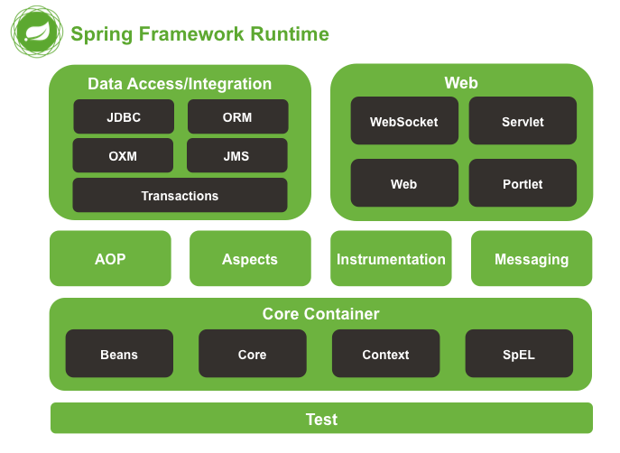
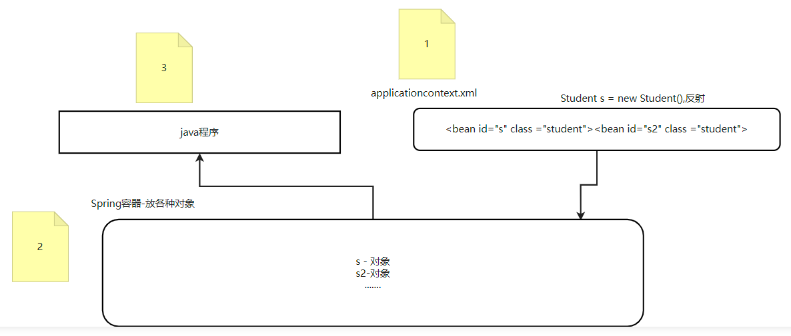

# Spring框架

## Spring各个模块



## Spring优势：

### 1、方便解耦

#### 控制反转

Student类，创建对象

```java
Student s = new Student();
```

如果想要把Student改为Person

```java
Person s = new Person();
```

如果有几十处的话，都需要修改。耦合性太大。

Java代码不再new创建对象，程序中用一个xml文件，里面配置对象名和类。**使用反射**。耦合性低。

spring容器里面放各种对象。

### 2、简化开发

对比MyBatis框架，定义接口、写映射文件，主要问题是解析mybatis.xml文件的代码，Spring就可以更简洁的处理。

### 3、不改变原有代码在它的基础上扩展（AOP切面编程）

### 4、声明式事务

### 5、整合各种优秀的框架

Spring是框架的框架。

**不重复造轮子**

A公司用a框架，B公司用b框架、C公司用c框架。3个框架的作用是完全一样的，用法也差不多。原有的技术加Spring的整合就可以很简单。不过后来Spring违背了这一原则，自己又出了新轮子。

使用Spring所需jar包比较多，通过maven导包就方便。

Spring官网：https://spring.io/ 

## Spring IoC/DI 介绍

IoC(Inversion of Control)中文名称：控制反转，也被称为DI(dependency injection )：依赖注入。

创建对象的权利（控制的位置）,**由JAVA代码转移到spring容器,由spring的容器控制对象的创建,就是控制反转**。

由于控制反转概念比较含糊，所以又给出了一个新的名字:“依赖注入”，相对loC而言，“依赖注入”明确描述了“被注入对象依赖loC容器来配置依赖对象”，Dl(英文全称为Dependency Injection，中文译名依赖注入）是loC的别名。



### Java程序分层处理

从前端获取的数据到从数据库处理之前，所有的逻辑都在java里面，各种功能在一起，程序臃肿，需要划分。

### 1、控制层

- 获取前端数据
- 控制页面跳转（例：登录成功返回成功，失败返回失败，前面跳转对应页面）
- 调用业务层

### 2、业务层

- 处理业务（业务需要增加和删除数据库数据操作同时进行，或者修改和查询同时进行。具体的业务逻辑）
  - A逻辑 需要增加和删除操作
  - B逻辑 需要增加和修改操作
  - C逻辑 需要增加和查询操作
  - 所以数据库连接层是简单的操作
- 调用数据库连接层

### 3、数据库连接层

- 跟数据库进行交互（简单的增加、删除、修改）

### 接口+实现类

每一层都分为接口+实现类两部分。接口不会变，只需要替换实现类，就可以实现修改。

通过接口=实现类的方式调用，更规范和扩展性更强。

### IoC/DI原理

如果每次创建对象的位置特别多，创建对象的代码和Java代码耦合性高，层和层之间的耦合性也高。所以把创建对象的代码交由Spring管理，不再在Java代码里创建对象。这就是Ioc/DI。

创建对象在Spring容器，Spring容器看不到，在底层完成的。

在程序中会多一个配置文件`applicationContext.xml`，名字可以自己定义。在xml中可以配置bean标签，例：`<bean id="s" class="Student">`，这行代码底层做的就是`Student s = new Student();`，构建是Spring底层通过反射技能做的。构建的对象放在一个地方：Spring容器，底层是map集合。Spring容器中放各种对象。

applicationContext.xml通过反射创建对象，所有对象放在容器中，java程序从容器中取对象。

## 第一个Spring项目-完成IoC/DI代码的实现

### 1、创建Maven项目，添加依赖

在项目的pom.xml中添加Spring项目的最基本依赖。

Spring项目想要运行起来必须包含:

- spring-context.jar - 依赖`spring-core`、`spring-aop`、`spring-expression`、`spring-beans`四个jar。

- spring-core.jar - 依赖`spring-jcl.jar`

- spring-aop.jar

- spring-expression.jar

- spring-beans.jar

- spring-jcl.jar

  所以在Maven中想要使用Spring框架只需要在项目中导入spring-context就可以了，其他的jar包根据Maven依赖传递性都可以导入进来。

```xml
<dependencies>
    <dependency>
        <groupId>org.springframework</groupId>
        <artifactId>spring-context</artifactId>
        <version>5.3.23</version>
    </dependency>
</dependencies>
```

### 2、创建一个Book类

Project\Maven\src\main\java\com.hh.pojo包\Book.java

### 3、创建Spring配置文件

在src/main/resources下新建`applicationContext.xml`文件。在这个文件中创建对象。

```xml
<?xml version="1.0" encoding="UTF-8"?>
<beans xmlns="http://www.springframework.org/schema/beans"
       xmlns:xsi="http://www.w3.org/2001/XMLSchema-instance"
       xmlns:context="http://www.springframework.org/schema/context"
       xsi:schemaLocation="http://www.springframework.org/schema/beans
        https://www.springframework.org/schema/beans/spring-beans.xsd
        http://www.springframework.org/schema/context
        https://www.springframework.org/schema/context/spring-context.xsd">

    <!-- com.hh.pojo包下component的注解都会扫描到-->
    <!--    <context:component-scan base-package="com.hh.pojo"></context:component-scan>-->

    <!--    setter方法 给属性赋值。下面的id和name都是setter方法中的名字（并非属性名）-->
    <bean id="b" class="com.hh.pojo.Book">
        <property name="id" value="1"></property>
        <property name="name" value="项目驱动零起点学Java"></property>
    </bean>

    <!--    类构造器 给属性赋值。下面的id和name都是构造器方法中的参数名字（并非属性名）-->
    <bean id="b2" class="com.hh.pojo.Book">
        <constructor-arg name="id" value="2"></constructor-arg>
        <constructor-arg name="name" value="红高粱"></constructor-arg>
    </bean>

    <!--    创建对象-->
    <bean id="boy" class="com.hh.pojo.Boy">
        <property name="age" value="22"></property>
        <property name="name" value="小明"></property>
    </bean>
    <bean id="girl" class="com.hh.pojo.Girl">
        <property name="age" value="19"></property>
        <property name="name" value="露露"></property>
        <property name="boyfriend" ref="boy"></property>
    </bean>

</beans>
```

识别com.hh.pojo.Book这个类，通过反射创建对象。

### 4、创建容器

在测试类中创建容器

```java
package com.msb.test;

import com.msb.pojo.Book;
import org.springframework.context.ApplicationContext;
import org.springframework.context.support.ClassPathXmlApplicationContext;

public class Test {
    public static void main(String[] args) {
        //创建Spring容器：
        ApplicationContext context = new ClassPathXmlApplicationContext("applicationContext.xml");
        //获取对象：
        //Book book = (Book)context.getBean("b");
        Book book = (Book)context.getBean("b2");
        //打印对象的信息：
        System.out.println(book.getName() + "---" + book.getId());

    }
}
```

### 属性注入

以前：setter方式

```java
Book b = new Book(); 
b.setId(1); 
b.setName("项目驱动零起点学Java")
```

现在：属性注入-设置注入

```xml
<bean id="b" class="com.msb.pojo.Book">
    <property name="id1" value="1" ></property>	<!--name不是属性的名字，是set方法的名字-->
    <property name="name1" value="项目驱动零起点学Java"></property>
</bean>
```

以前：构造器方式

```java
Book b = new Book(1，"项目驱动零起点学Java"); 
```

现在：属性注入-构造注入

```xml
<bean id="b2" class="com.msb.pojo.Book">
    <constructor-arg name="id2" value="2"></constructor-arg>
    <constructor-arg name="name2" value="红高粱"></constructor-arg>
</bean>
```

#### 属性为引用数据类型

**类的属性：**可以是基本数据类型，也可以是引用数据类型。

设置属性的值：

方式1：value：简单数据类型（基本数据类型+String）直接设置:

方式2：ref：需要引用另一个bean的id。也就是说这个参数是一个类类型，且这个类的对象也被Spring容器管理。

## IoC/DI相关的注解

上面`<bean>`标签就是创建对象，可以通过注解简化。

| 注解名称       | 解释                                                 |
| -------------- | ---------------------------------------------------- |
| @Component     | 实例化Bean， 默认名称为类名首字母变小写              |
| @Repository    | 作用和@Component一样。用在持久层                     |
| @Service       | 作用和@Component一样。用在业务层                     |
| @Controller    | 作用和@Component一样。用在控制器层                   |
| @Configuration | 作用和@Component一样。用在配置类上                   |
| @Autowired     | 自动注入。默认byType，如果多个同类型bean，使用byName |
| @ Value        | 给普通数据类型属性赋值                               |

### @Component的使用

在要创建对象的类中加入@Component注解，会自动构建这个类的对象，对象名字默认为：类名首字母变小写。创建的对象放到了Spring容器中。

注解在哪个package包下？要想找到这些注解，需要将注解所在的包进行扫描：设置需要扫描的包。并且需要在applicationContext.xml中添加context命名空间

```xml
<?xml version="1.0" encoding="UTF-8"?> 
<beans xmlns="http://www.springframework.org/schema/beans"     xmlns:xsi="http://www.w3.org/2001/XMLSchema-instance"     xmlns:context="http://www.springframework.org/schema/context"     xsi:schemaLocation="http://www.springframework.org/schema/beans     https://www.springframework.org/schema/beans/spring-beans.xsd     http://www.springframework.org/schema/context     https://www.springframework.org/schema/context/spring-context.xsd"> 
    
    <context:component-scan base-package="com.msb.service"></context:component-scan> 

</beans>
```

前五个注解作用一样，只所以搞出这么多，就是在语义上给你区别，放入不同层用不同的注解，但是作用都是创建对象。

### 属性注入的注解

#### @Value的使用

给普通数据类型赋值的注解，普通数据类型包括：八种基本数据类型+String，并且不需要依赖set方法。

#### @Autowired的使用

添加@Autowired注解后会把容器中的对象**自动注入**进来，并且不需要依赖set方法。