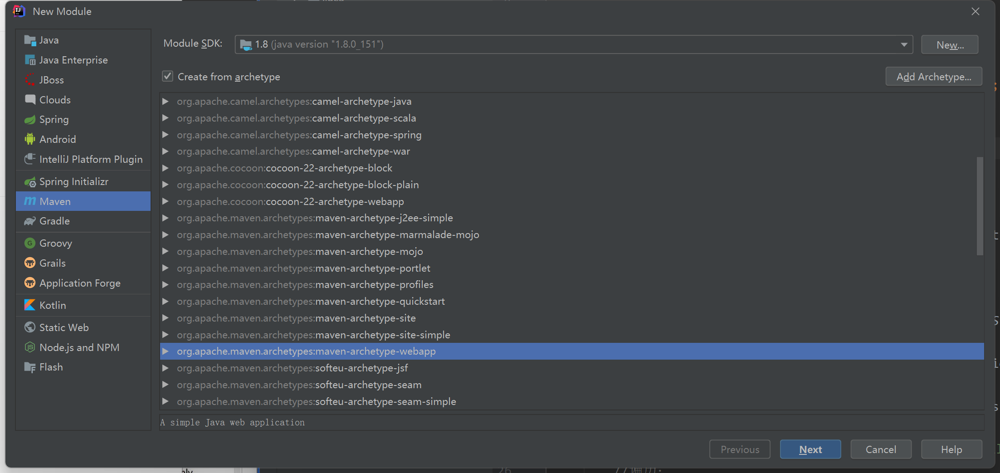
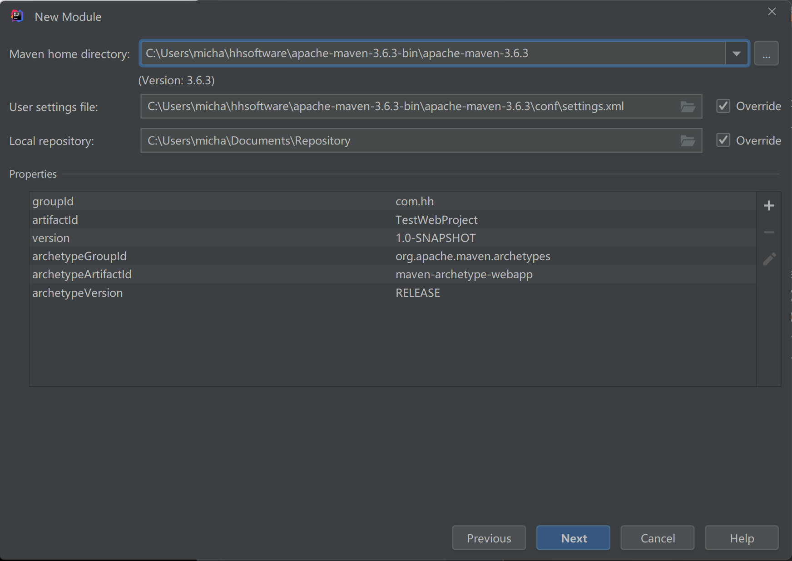
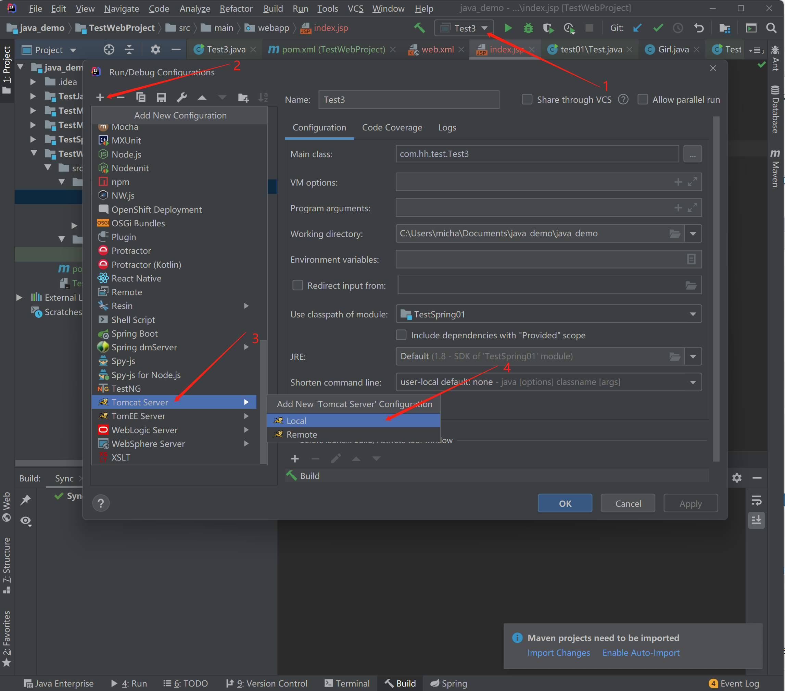
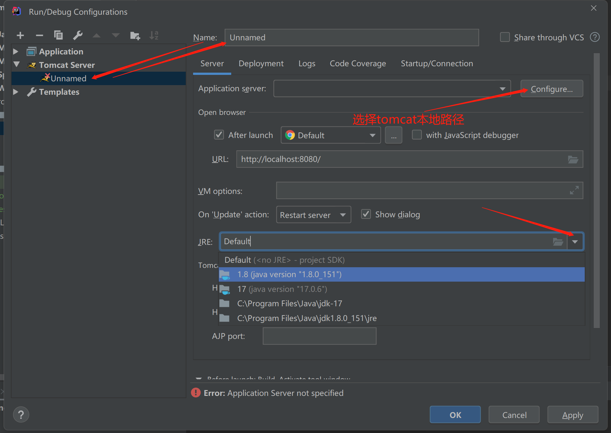
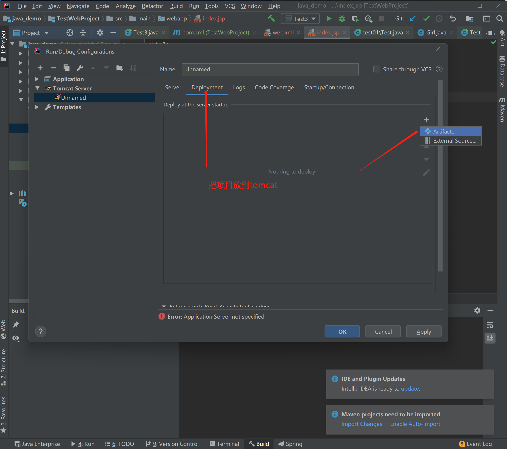

# SpringMVC&SSM

Spring、SpringMVC、Mybatis就是SSM。

## Java项目和web项目的区别

Java项目（jar项目）是由main()方法来开始的，直接依赖JVM虚拟机就能被编译执行。Java项目不需要服务器。

Web项目（war项目）中的Java文件是tomcat服务器来触发的，脱离了web服务器就无法启动。Web项目需要服务器。Web项目部署到服务器上，任何用户都可以通过浏览器来访问。将本地资源共享给外部访问。入口是`web.xml`。

## Tomcat服务器

Tomcat服务器对Servlet，Jsp，JNDI，JavaMail有很好的的支持，并且这个Web容器是开源免费的。（Tomcat服务器是Apache下的）

Tomcat就相当于一个电脑上的软件。

## 使用SpringMVC的原因

Spring是框架，SpringMVC也是框架。

前端|后端|数据库

后端获取前端传过来的数据，响应内容到前端。

前端和后端的交互。

**SpringMVC是对servlet的封装，servlet底层需要依赖tomcat运行。**

## SpringMVC环境搭建（通过Maven构建项目）

### 1、创建maven-web项目

Maven构建项目类型：

- Java项目：jar项目
- Web项目：war项目

创建Maven-war项目步骤：

创建Maven项目，添加webapp模板

先勾选`create from archetype`前面的复选框。

然后选择`org.apache.maven.archetypes:maven-archetype-webapp`



下一步确定maven版本，maven版本设置可以看前面的Maven学习



新建项目的剩余步骤都点击Next按钮即可，和不使用原型时创建Maven项目类似。

### 2、补全目录

观察目录结构与jar项目不同之处，设置java目录为资源目录。

> Project
>
> - Module
>   - src
>     - main
>       - java
>         - com.hh
>           - controller
>           - pojo
>       - resources
>         - springmvc.xml
>       - webapp
>     - test
>       - java
>   - pom.xml

创建完文件夹directory之后，需要右键`Mark Directory as`选择`Sources Root`、`Resources Root`、`Test Sources Root`。文件夹图标会变颜色，然后就可以在文件夹下创建各种文件。

### 3、pom.xml添加依赖和tomcat插件

#### 3.1、添加依赖

- mybatis的依赖
- 连接mysql的依赖
- log4j的依赖
- spring的核心依赖
- springjdbc依赖
- spring整合mybatis的依赖
- springwebmvc的依赖

#### 3.2、tomcat插件

使用本地tomcat（很少使用）





把项目放到tomcat里面，tomcat和项目联系。



#### maven中使用tomcat插件

tomcat和maven都是apache下的，同一个公司的。maven自带tomcat。

在项目的`pom.xml`中配置Tomcat插件，在`<build>`中添加Tomcat7插件。

```xml
<?xml version="1.0" encoding="UTF-8"?>

<project xmlns="http://maven.apache.org/POM/4.0.0" xmlns:xsi="http://www.w3.org/2001/XMLSchema-instance"
         xsi:schemaLocation="http://maven.apache.org/POM/4.0.0 http://maven.apache.org/xsd/maven-4.0.0.xsd">
    <modelVersion>4.0.0</modelVersion>

    <groupId>com.hh</groupId>
    <artifactId>TestSSM</artifactId>
    <version>1.0-SNAPSHOT</version>
    <packaging>war</packaging>

    <dependencies>
        <!-- 【1】mybatis的依赖 -->
        <dependency>
            <groupId>org.mybatis</groupId>
            <artifactId>mybatis</artifactId>
            <version>3.5.9</version>
        </dependency>
        <!-- 【2】连接mysql的依赖 -->
        <dependency>
            <groupId>mysql</groupId>
            <artifactId>mysql-connector-java</artifactId>
            <version>8.0.28</version>
        </dependency>
        <!-- 【3】log4j的依赖 -->
        <dependency>
            <groupId>log4j</groupId>
            <artifactId>log4j</artifactId>
            <version>1.2.17</version>
        </dependency>
        <!-- 【4】spring的核心依赖 -->
        <dependency>
            <groupId>org.springframework</groupId>
            <artifactId>spring-context</artifactId>
            <version>5.3.16</version>
        </dependency>
        <!-- 【5】springjdbc依赖-->
        <dependency>
            <groupId>org.springframework</groupId>
            <artifactId>spring-jdbc</artifactId>
            <version>5.3.16</version>
        </dependency>
        <!-- 【6】spring整合mybatis的依赖 -->
        <dependency>
            <groupId>org.mybatis</groupId>
            <artifactId>mybatis-spring</artifactId>
            <version>2.0.7</version>
        </dependency>
        <!-- 【7】springwebmvc的依赖 -->
        <dependency>
            <groupId>org.springframework</groupId>
            <artifactId>spring-webmvc</artifactId>
            <version>5.3.16</version>
        </dependency>
    </dependencies>
    
    <!-- 加入tomcat插件 -->
    <pluginRepositories>
        <pluginRepository>
            <id>mvnrepository</id>
            <url>https://artifacts.alfresco.com/nexus/content/repositories/public/</url>
        </pluginRepository>
    </pluginRepositories>
    <build>
        <plugins>
            <plugin>
                <groupId>org.apache.tomcat.maven</groupId>
                <artifactId>tomcat8-maven-plugin</artifactId>
                <version>3.0-r1756463</version>
                <configuration>
                    <port>8888</port>
                    <path>/ssm</path>
                </configuration>
            </plugin>
        </plugins>
    </build>

</project>
```

### 4、spring整合mybatis

#### applicationContext.xml

以前用mybatis先搞配置文件mybatis.xml，SSM整合后mybatis.xml都交由spring来管理，创建`applicationContext.xml`。

```xml
<?xml version="1.0" encoding="UTF-8"?>
<beans xmlns="http://www.springframework.org/schema/beans"
       xmlns:xsi="http://www.w3.org/2001/XMLSchema-instance"
       xmlns:context="http://www.springframework.org/schema/context"
       xsi:schemaLocation="http://www.springframework.org/schema/beans
        https://www.springframework.org/schema/beans/spring-beans.xsd
        http://www.springframework.org/schema/context
        https://www.springframework.org/schema/context/spring-context.xsd">

    <!-- 【1】连接数据库，获取数据源，配置数据源，设置数据库连接的四个参数  -->
    <bean id="dataSource" class="org.springframework.jdbc.datasource.DriverManagerDataSource">
        <!-- 利用setter方法完成属性注入，四个参数名固定的，注意源码中虽然没有driverClassName属性，但是有driverClassName的setter方法 -->
        <property name="driverClassName" value="com.mysql.cj.jdbc.Driver"/>
        <property name="url"
                  value="jdbc:mysql://localhost:3306/msb?useUnicode=true&amp;characterEncoding=utf-8&amp;useSSL=false&amp;serverTimezone=GMT%2B8&amp;allowPublicKeyRetrieval=true"/>
        <property name="username" value="root"/>
        <property name="password" value="asdf123456"/>
    </bean>

    <!-- 【2】获取SqlSessionFactory对象  -->
    <!-- 以前SqlSessionFactory都是在测试代码中我们自己创建的，但是现在不用了，整合包中提供的对于SqlSessionFactory的封装。里面提供了MyBatis全局配置文件所有配置的属性 -->
    <bean id="factory" class="org.mybatis.spring.SqlSessionFactoryBean">
        <!-- 注入数据源       -->
        <property name="dataSource" ref="dataSource"/>
        <!-- 给包下类起别名       -->
        <property name="typeAliasesPackage" value="com.hh.pojo"></property>
        <!--        解析mybatis.xml-->
        <property name="configLocation" value="classpath:mybatis.xml"></property>
    </bean>

    <!-- 【3】扫描mapper文件   -->
    <!-- 设置扫描哪个包，进行接口绑定-->
    <!-- 所有Mapper接口代理对象都能创建出来，可以直接从容器中获取出来。 -->
    <bean class="org.mybatis.spring.mapper.MapperScannerConfigurer">
        <!-- 和SqlSessionFactory产生联系，以前接口绑定sqlSession.getMapper(BookMapper.class);
        都是通过以前接口绑定sqlSession来调用mapper，所以这里一定要注入工厂啊
         注意这里sqlSessionFactoryBeanName类型为String，所以用value把工厂名字写过来就行-->
        <property name="sqlSessionFactoryBeanName" value="factory"></property>
        <!-- 扫描的包 接口对应的实现类 -->
        <property name="basePackage" value="com.hh.mapper"></property>
    </bean>

    <!-- 【4】扫描com.msb.service包下注解 -->
    <context:component-scan base-package="com.hh.service"></context:component-scan>

</beans>
```

扫描包 接口对应的实现类

#### mybatis.xml

日志是mybatis特有的配置方式，spring没有提供那样的配置，所以日志部分没法替代。所以可以把`mybatis.xml`保留，里面留下这个log4j的配置。

```xml
<?xml version="1.0" encoding="UTF-8" ?>
<!DOCTYPE configuration
        PUBLIC "-//mybatis.org//DTD Config 3.0//EN"
        "https://mybatis.org/dtd/mybatis-3-config.dtd">
<configuration>
    <settings>
        <!-- 配置生效的日志 -->
        <setting name="logImpl" value="LOG4J"/>
    </settings>
</configuration>
```

#### log4j.properties

log4j程序会自动去找log4j.properties，log4j.properties还是需要的。

```properties
# log4j中定义的级别：fatal(致命错误) > error(错误) >warn(警告) >info(普通信息) >debug(调试信息)>trace(跟踪信息)
log4j.rootLogger=ERROR , console , D 
# log4j.logger是固定的，a.b.c是命名空间的名字可以只写一部分。
log4j.logger.a.b=TRACE
### console ###
log4j.appender.console=org.apache.log4j.ConsoleAppender
log4j.appender.console.Target=System.out
log4j.appender.console.layout=org.apache.log4j.PatternLayout
log4j.appender.console.layout.ConversionPattern=[%p] [%-d{yyyy-MM-dd HH\:mm\:ss}] %C.%M(%L) | %m%n
### log file ###
log4j.appender.D=org.apache.log4j.DailyRollingFileAppender
log4j.appender.D.File=D:/log4j.log
log4j.appender.D.Append=true
# 只能生级别，不能降
log4j.appender.D.Threshold=INFO
log4j.appender.D.layout=org.apache.log4j.PatternLayout
log4j.appender.D.layout.ConversionPattern=[%p] [%-d{yyyy-MM-dd HH\:mm\:ss}] %
```

在applicationContext.xml中加入mybatis.xml解析

```xml
<bean id="factory" class="org.mybatis.spring.SqlSessionFactoryBean">
    <property name="dataSource" ref="dataSource"/>
    <property name="typeAliasesPackage" value="com.zss.pojo"></property>
    <!-- 解析mybatis.xml -->
    <property name="configLocation" value="classpath:mybatis.xml"></property>
</bean>
```

### 5、整合springmvc

#### 5.1、springmvc.xml

下面第6步中写的注解需要解析，解析需要xml配置。在`resources`中新建Spring MVC框架配置文件`springmvc.xml`（注解需要在这个xml文件中进行解析）

加入springmvc.xml的配置文件：

```xml
<?xml version="1.0" encoding="UTF-8"?>
<beans xmlns="http://www.springframework.org/schema/beans"
       xmlns:mvc="http://www.springframework.org/schema/mvc"
       xmlns:xsi="http://www.w3.org/2001/XMLSchema-instance"
       xmlns:context="http://www.springframework.org/schema/context"
       xsi:schemaLocation="
        http://www.springframework.org/schema/beans
        https://www.springframework.org/schema/beans/spring-beans.xsd
        http://www.springframework.org/schema/context
        https://www.springframework.org/schema/context/spring-context.xsd
        http://www.springframework.org/schema/mvc
        https://www.springframework.org/schema/mvc/spring-mvc.xsd">
    <!-- 扫描控制器类，千万不要把service等扫描进来，也千万不要在Spring配置文件扫描控制器类所在包 -->
    <context:component-scan base-package="com.hh.controller"></context:component-scan>
    <!-- 让Spring MVC的注解生效 ：@RequestMapping等注解-->
    <mvc:annotation-driven></mvc:annotation-driven>
</beans>
```

#### 5.2、web.xml

web项目的入口`web.xml`。tomcat启动的时候走到这里。

在`项目\TestSpringMVC\src\main\webapp\WEB-INF\web.xml`中加入了`springmvc.xml`配置文件的解析和`applicationContext.xml`的解析：

```xml
<?xml version="1.0" encoding="UTF-8"?>
<web-app xmlns="http://xmlns.jcp.org/xml/ns/javaee"
         xmlns:xsi="http://www.w3.org/2001/XMLSchema-instance"
         xsi:schemaLocation="http://xmlns.jcp.org/xml/ns/javaee http://xmlns.jcp.org/xml/ns/javaee/web-app_4_0.xsd"
         version="4.0">

    <!--  servlet配置-->
    <!--对SpringMVC解析-->
    <servlet>
        <servlet-name>springmvc</servlet-name>
        <servlet-class>org.springframework.web.servlet.DispatcherServlet</servlet-class>
        <init-param>
            <!-- 参数名称必须叫做：contextConfigLocation。单词和大小写错误都导致配置文件无法正确加载 -->
            <param-name>contextConfigLocation</param-name>
            <!-- springmvc.xml 名称自定义，只要和我们创建的配置文件的名称对应就可以了。 -->
            <param-value>classpath:springmvc.xml</param-value>
        </init-param>
        <!-- Tomcat启动立即加载Servlet，而不是等到访问Servlet才去实例化DispatcherServlet -->
        <!-- 配置上的效果：Tomcat启动立即加载Spring MVC框架的配置文件-->
        <load-on-startup>1</load-on-startup>
    </servlet>
    <servlet-mapping>
        <servlet-name>springmvc</servlet-name>
        <!-- /表示除了.jsp结尾的uri，其他的uri都会触发DispatcherServlet。此处前往不要写成 /* -->
        <url-pattern>/</url-pattern>
    </servlet-mapping>

    <!--新加入-->
    <!--解析applicationContext.xml：利用监听器监听-->
    <listener>
        <listener-class>org.springframework.web.context.ContextLoaderListener</listener-class>
    </listener>
    <!--给全局参数contextConfigLocation设置值，contextConfigLocation是ContextLoaderListener父类ContextLoader中的属性-->
    <context-param>
        <param-name>contextConfigLocation</param-name>
        <param-value>classpath:applicationContext.xml</param-value>
    </context-param>

</web-app>
```

### 6、项目分层

**创建项目目录结构**

上面将整合的配置内容已经配置好了，接下来开始创建项目的目录结构，项目要分层，有controller控制层、service业务层、dao层（有数据库连接层（Mybits接口绑定），mapper层）、实体类层。

#### 6.1、构建实体类：

属性的名称和数据库字段名对应

```java
package com.hh.pojo;

public class Book {
    private int id;
    private String name;
    private String author;
    private double price;

    public int getId() {
        return id;
    }

    public void setId(int id) {
        this.id = id;
    }

    public String getName() {
        return name;
    }

    public void setName(String name) {
        this.name = name;
    }

    public String getAuthor() {
        return author;
    }

    public void setAuthor(String author) {
        this.author = author;
    }

    public double getPrice() {
        return price;
    }

    public void setPrice(double price) {
        this.price = price;
    }

    public Book() {
    }

    public Book(int id, String name, String author, double price) {
        this.id = id;
        this.name = name;
        this.author = author;
        this.price = price;
    }
}
```

#### 6.2、创建mapper数据库连接层

##### 创建接口interface文件BookMapper

创建接口绑定的接口BookMapper的interface文件

构建mapper接口和mapper.xml映射文件:

com.zss.mapper.BookMapper接口：抽象方法

```java
package com.hh.mapper;

import java.util.List;

public interface BookMapper {
    //定义抽象方法
    //查询所有书籍
    public abstract List selectAll();
}
```

##### 创建接口的映射文件BookMapper.xml

接口构建好之后，构建具体的映射文件：接口的实现类

在`项目\TestSSM\src\main\resources`文件夹下，创建com文件夹、com下创建hh文件夹、hh下创建mapper文件夹。然后再创建和接口同名的`BookMapper.xml`文件。

```xml
<?xml version="1.0" encoding="UTF-8" ?>
<!DOCTYPE mapper
        PUBLIC "-//mybatis.org//DTD Mapper 3.0//EN"
        "https://mybatis.org/dtd/mybatis-3-mapper.dtd">

<mapper namespace="com.hh.mapper.BookMapper"><!--上面接口的命名空间-->
    <select id="selectAll" resultType="book">
        select * from t_book
    </select>
</mapper>
```

#### 6.3、创建service业务层内

业务层链接数据库层

##### 创建接口：

```java
package com.hh.service;

import java.util.List;

public interface BookService {
    public abstract List findAll();
}
```

##### 实现类：

在com.hh.service包下再new一个包com.hh.service.impl

在包下创建实现类BookServiceImpl。

```java
package com.hh.service.impl;

import com.hh.mapper.BookMapper;
import com.hh.service.BookService;
import org.springframework.beans.factory.annotation.Autowired;
import org.springframework.stereotype.Service;

import java.util.List;

@Service//注解 自动创建对象
public class BookServiceImpl implements BookService {
    @Autowired    //注解  注入对象
    private BookMapper bookMapper;
    public List findAll() {
        return bookMapper.selectAll();
    }
}
```

#### 6.4、创建controller控制层

前端请求到这个类里的具体方法

##### 6.4.1、响应数据

从前端、服务端、数据库一层一层的查找数据，然后再从数据库、服务端一层一层返还到前端。

响应页面

```java
package com.hh.controller;

import org.springframework.stereotype.Controller;
import org.springframework.web.bind.annotation.RequestMapping;

//注解 自动构建对象
@Controller
public class TestController {//控制器类
    //注解，请求路径。浏览器访问/test1就会进到方法
    @RequestMapping("/test1")
    public String test1() {
        //响应给浏览器index.jsp页面
        return "index.jsp";
    }
}
```

响应页面或者响应数据，响应数据需要加注解`@ResponseBody`，数据就可以return出去。

```java
package com.hh.controller;

import com.hh.pojo.Book;
import com.hh.service.BookService;
import org.springframework.beans.factory.annotation.Autowired;
import org.springframework.stereotype.Controller;
import org.springframework.web.bind.annotation.RequestMapping;
import org.springframework.web.bind.annotation.ResponseBody;

import java.util.List;

@Controller
public class BookController {
    @Autowired
    private BookService bookService;//业务层的对象

    @RequestMapping(value = "/findAllBooks", produces = "text/html;charset=utf-8")//前端请求路径
    @ResponseBody//注解，把对应响应的数据响应到浏览器
    public String findAll() {
        System.out.println("--");
        List list = bookService.findAll();
        System.out.println("一共有书籍数量：" + list.size());
        String s = "";
        for (int i = 0; i < list.size(); i++) {
            Book book = (Book) list.get(i);
            s += book.getName() + "," + book.getAuthor() + "\n";
        }
        return s;
        //响应一个页面
        //return "/index.jsp";
    }
}
```

@ResponseBody注解作用：直接在方法上添加上@ResponseBody，Spring MVC会把返回值设置到响应流中。

### 7、启动项目tomcat

点击IDEA右侧Maven面板。

tomcat7：选择要`运行的项目（配置插件的项目） -> Plugins -> tomcat7 -> tomcat7:run`双击启动。

tomcat8：选择要`运行的项目（配置插件的项目） -> Plugins -> tomcat8 -> tomcat8:run-war`双击启动。

tomcat7对@ResponseBody数据响应的注解支持的不是特别好，升级为tomcat8。双击tomcat8:run-war启动。

#### 乱码问题解决：

想要改变@ResonseBody注解的响应内容类型(Content-Type)只能通过@RequestMapping的produces属性进行设置。

### 8、通过浏览器测试访问结果

通过浏览器地址http://localhost:8888/testssm/findAllBooks访问到后端，后端返回。

## SpringMVC接收请求参数

浏览器和后端进行交互，前端页面上面有一些数据，交由后端进行处理。

### 1、获取普通参数

获取普通参数，只需要在**控制单元中提供与请求参数同名的方法参数**即可，Spring MVC会自动进行类型转换。

请求路径`http://localhost:8888/testspringmvc/testParam?name=zhan8gsan&age=99`

```java
@RequestMapping("/testParam")  
public String testParam(String name,int age){    
    System.out.println(name+","+age); 
    return "/index.jsp"; 
}
```

### 2、使用类对象作为控制单元参数

如果前台参数比较多，就可以使用一个类对象进行接收。之后再传到其它层比较方便。

#### JavaBean

一个包含私有属性，getter/setter方法和无参构造方法的Java类。

写法上和实体类相同。唯一区别是实体类是数据库层面的概念，类型中属性要和数据库字段对应。而JavaBean的属性是灵活的，不是必须和哪里对应的。

JavaBean是一个专业概念，可以简单点理解：使用类对象做为控制单元参数，接收请求参数。如果不是特别较真，狭义上可以认为JavaBean就是项目中的实体类。

在控制单元中放置一个类型对象，对象名称没有要求，**只需要保证请求参数名和类的属性名相同就可以了**。

一个类既可以是实体类又可以是JavaBean。
