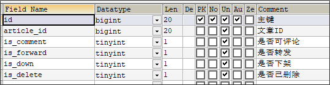
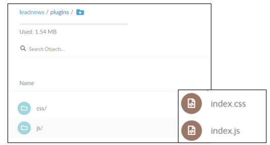

# app端文章查看，分布式文件系统minIO

文章列表从业务角度出发，如何进行分分表，分表的好处和原则。

文章详情会重点分析大文本展示方案。静态化模版技术freemarker，为了更好的访问静态化页面，访问速度最快的分布式文件系统minio。

## 文章列表

### 需求分析


### 表结构分析

ap_article  文章基本信息表


ap_article_config  文章配置表



ap_article_content 文章内容表


longtext：大文本类型

三张表关系分析


### 为什么要拆分成多个表

三张表都是一对一的关系，为什么不放在一张表里面，一张表不需要做关联查询。

**表的拆分-垂直分表**

垂直分表：将一个表的字段分散到多个表中，每个表存储其中一部分字段。

优势：

1. 减少IO争抢，减少锁表的几率，查看文章概述与文章详情互不影响。
2. 充分发挥高频数据的操作效率，对文章概述数据操作的高效率不会被操作文章详情数据的低效率所拖累。

**拆分规则**：

1. 把不常用的字段单独放在一张表。
2. 把text，blob等大字段拆分出来单独放在一张表。
3. 经常组合查询的字段单独放在一张表中。

### 导入文章数据库

#### 导入数据库

查看当天资料文件夹，在数据库连接工具中执行leadnews_article.sql

#### 导入对应的实体类

ap_article文章表对应实体

```java
package com.heima.model.article.pojos;

import com.baomidou.mybatisplus.annotation.IdType;
import com.baomidou.mybatisplus.annotation.TableField;
import com.baomidou.mybatisplus.annotation.TableId;
import com.baomidou.mybatisplus.annotation.TableName;
import lombok.Data;

import java.io.Serializable;
import java.util.Date;

/**
 * <p>
 * 文章信息表，存储已发布的文章
 * </p>
 *
 * @author itheima
 */

@Data
@TableName("ap_article")
public class ApArticle implements Serializable {

    @TableId(value = "id",type = IdType.ID_WORKER)
    private Long id;


    /**
     * 标题
     */
    private String title;

    /**
     * 作者id
     */
    @TableField("author_id")
    private Long authorId;

    /**
     * 作者名称
     */
    @TableField("author_name")
    private String authorName;

    /**
     * 频道id
     */
    @TableField("channel_id")
    private Integer channelId;

    /**
     * 频道名称
     */
    @TableField("channel_name")
    private String channelName;

    /**
     * 文章布局  0 无图文章   1 单图文章    2 多图文章
     */
    private Short layout;

    /**
     * 文章标记  0 普通文章   1 热点文章   2 置顶文章   3 精品文章   4 大V 文章
     */
    private Byte flag;

    /**
     * 文章封面图片 多张逗号分隔
     */
    private String images;

    /**
     * 标签
     */
    private String labels;

    /**
     * 点赞数量
     */
    private Integer likes;

    /**
     * 收藏数量
     */
    private Integer collection;

    /**
     * 评论数量
     */
    private Integer comment;

    /**
     * 阅读数量
     */
    private Integer views;

    /**
     * 省市
     */
    @TableField("province_id")
    private Integer provinceId;

    /**
     * 市区
     */
    @TableField("city_id")
    private Integer cityId;

    /**
     * 区县
     */
    @TableField("county_id")
    private Integer countyId;

    /**
     * 创建时间
     */
    @TableField("created_time")
    private Date createdTime;

    /**
     * 发布时间
     */
    @TableField("publish_time")
    private Date publishTime;

    /**
     * 同步状态
     */
    @TableField("sync_status")
    private Boolean syncStatus;

    /**
     * 来源
     */
    private Boolean origin;

    /**
     * 静态页面地址
     */
    @TableField("static_url")
    private String staticUrl;
}
```

ap_article_config文章配置对应实体类

```java
package com.heima.model.article.pojos;

import com.baomidou.mybatisplus.annotation.IdType;
import com.baomidou.mybatisplus.annotation.TableField;
import com.baomidou.mybatisplus.annotation.TableId;
import com.baomidou.mybatisplus.annotation.TableName;
import lombok.Data;

import java.io.Serializable;

/**
 * <p>
 * APP已发布文章配置表
 * </p>
 *
 * @author itheima
 */

@Data
@TableName("ap_article_config")
public class ApArticleConfig implements Serializable {

    @TableId(value = "id",type = IdType.ID_WORKER)
    private Long id;

    /**
     * 文章id
     */
    @TableField("article_id")
    private Long articleId;

    /**
     * 是否可评论
     * true: 可以评论   1
     * false: 不可评论  0
     */
    @TableField("is_comment")
    private Boolean isComment;

    /**
     * 是否转发
     * true: 可以转发   1
     * false: 不可转发  0
     */
    @TableField("is_forward")
    private Boolean isForward;

    /**
     * 是否下架
     * true: 下架   1
     * false: 没有下架  0
     */
    @TableField("is_down")
    private Boolean isDown;

    /**
     * 是否已删除
     * true: 删除   1
     * false: 没有删除  0
     */
    @TableField("is_delete")
    private Boolean isDelete;
}
```

ap_article_content 文章内容对应的实体类

```java
package com.heima.model.article.pojos;

import com.baomidou.mybatisplus.annotation.IdType;
import com.baomidou.mybatisplus.annotation.TableField;
import com.baomidou.mybatisplus.annotation.TableId;
import com.baomidou.mybatisplus.annotation.TableName;
import lombok.Data;

import java.io.Serializable;

@Data
@TableName("ap_article_content")
public class ApArticleContent implements Serializable {

    @TableId(value = "id",type = IdType.ID_WORKER)
    private Long id;

    /**
     * 文章id
     */
    @TableField("article_id")
    private Long articleId;

    /**
     * 文章内容
     */
    private String content;
}
```

### 实现思路


1. 在默认频道展示10条文章信息

2. 可以切换频道查看不同种类文章

3. 当用户下拉可以加载最新的文章（分页）本页文章列表中发布时间为最大的时间为依据

4. 当用户上拉可以加载更多的文章信息（按照发布时间）本页文章列表中发布时间最小的时间为依据

5. 如果是当前频道的首页，前端传递默认参数：

   - maxBehotTime：0（毫秒）


   - minBehotTime：20000000000000（毫秒）--->2063年


### 接口定义

|          | **加载首页**         | **加载更多**             | **加载最新**            |
| -------- | -------------------- | ------------------------ | ----------------------- |
| 接口路径 | /api/v1/article/load | /api/v1/article/loadmore | /api/v1/article/loadnew |
| 请求方式 | POST                 | POST                     | POST                    |
| 参数     | ArticleHomeDto       | ArticleHomeDto           | ArticleHomeDto          |
| 响应结果 | ResponseResult       | ResponseResult           | ResponseResult          |

ArticleHomeDto请求参数

```java
package com.heima.model.article.dtos;

import lombok.Data;

import java.util.Date;

@Data
public class ArticleHomeDto {

    // 最大时间
    Date maxBehotTime;
    // 最小时间
    Date minBehotTime;
    // 分页size
    Integer size;
    // 频道ID
    String tag;
}
```

### 功能实现

#### 1、添加文章微服务

#### 导入heima-leadnews-article微服务，资料在当天的文件夹中


<font color='red'>注意：需要在heima-leadnews-service的pom文件夹中添加子模块信息，如下：</font>

```xml
<modules>
    <module>heima-leadnews-user</module>
    <module>heima-leadnews-article</module>
</modules>
```

在idea中的maven中更新一下，如果工程还是灰色的，需要在重新添加文章微服务的pom文件，操作步骤如下：


需要在nacos中添加对应的配置

```yaml
spring:
  datasource:
    driver-class-name: com.mysql.jdbc.Driver
    url: jdbc:mysql://localhost:3306/leadnews_article?useUnicode=true&characterEncoding=UTF-8&serverTimezone=UTC
    username: root
    password: root
# 设置Mapper接口所对应的XML文件位置，如果你在Mapper接口中有自定义方法，需要进行该配置
mybatis-plus:
  mapper-locations: classpath*:mapper/*.xml
  # 设置别名包扫描路径，通过该属性可以给包中的类注册别名
  type-aliases-package: com.heima.model.article.pojos
```

#### 2、定义接口

三个接口需要三个方法。

```java
package com.heima.article.controller.v1;

import com.heima.model.article.dtos.ArticleHomeDto;
import com.heima.model.common.dtos.ResponseResult;
import org.springframework.web.bind.annotation.PostMapping;
import org.springframework.web.bind.annotation.RequestBody;
import org.springframework.web.bind.annotation.RequestMapping;
import org.springframework.web.bind.annotation.RestController;

@RestController
@RequestMapping("/api/v1/article")
public class ArticleHomeController {

    @PostMapping("/load")
    public ResponseResult load(@RequestBody ArticleHomeDto dto) {
        return null;
    }

    @PostMapping("/loadmore")
    public ResponseResult loadMore(@RequestBody ArticleHomeDto dto) {
        return null;
    }

    @PostMapping("/loadnew")
    public ResponseResult loadNew(@RequestBody ArticleHomeDto dto) {
        return null;
    }
}
```

#### 3、编写mapper文件

定义mapper的interface接口文件，继承BaseMapper因为集成了mybatisplus。

```java
package com.heima.article.mapper;

import com.baomidou.mybatisplus.core.mapper.BaseMapper;
import com.heima.model.article.dtos.ArticleHomeDto;
import com.heima.model.article.pojos.ApArticle;
import org.apache.ibatis.annotations.Mapper;
import org.apache.ibatis.annotations.Param;

import java.util.List;

@Mapper
public interface ApArticleMapper extends BaseMapper<ApArticle> {

    public List<ApArticle> loadArticleList(@Param("dto") ArticleHomeDto dto, @Param("type") Short type);

}
```

#### 3.1、对应的映射文件

在resources中新建mapper/ApArticleMapper.xml     如下配置：

```xml
<?xml version="1.0" encoding="UTF-8"?>
<!DOCTYPE mapper PUBLIC "-//mybatis.org//DTD Mapper 3.0//EN" "http://mybatis.org/dtd/mybatis-3-mapper.dtd">
<mapper namespace="com.heima.article.mapper.ApArticleMapper">

    <resultMap id="resultMap" type="com.heima.model.article.pojos.ApArticle">
        <id column="id" property="id"/>
        <result column="title" property="title"/>
        <result column="author_id" property="authorId"/>
        <result column="author_name" property="authorName"/>
        <result column="channel_id" property="channelId"/>
        <result column="channel_name" property="channelName"/>
        <result column="layout" property="layout"/>
        <result column="flag" property="flag"/>
        <result column="images" property="images"/>
        <result column="labels" property="labels"/>
        <result column="likes" property="likes"/>
        <result column="collection" property="collection"/>
        <result column="comment" property="comment"/>
        <result column="views" property="views"/>
        <result column="province_id" property="provinceId"/>
        <result column="city_id" property="cityId"/>
        <result column="county_id" property="countyId"/>
        <result column="created_time" property="createdTime"/>
        <result column="publish_time" property="publishTime"/>
        <result column="sync_status" property="syncStatus"/>
        <result column="static_url" property="staticUrl"/>
    </resultMap>
    <select id="loadArticleList" resultMap="resultMap">
        SELECT
        aa.*
        FROM
        `ap_article` aa
        LEFT JOIN ap_article_config aac ON aa.id = aac.article_id
        <where>
            and aac.is_delete != 1
            and aac.is_down != 1
            <!-- loadmore -->
            <if test="type != null and type == 1">
                and aa.publish_time <![CDATA[<]]> #{dto.minBehotTime}
            </if>
            <if test="type != null and type == 2">
                and aa.publish_time <![CDATA[>]]> #{dto.maxBehotTime}
            </if>
            <if test="dto.tag != '__all__'">
                and aa.channel_id = #{dto.tag}
            </if>
        </where>
        order by aa.publish_time desc
        limit #{dto.size}
    </select>

</mapper>
```

`<![CDATA[<]]>`表示小于，`<![CDATA[>]]>`表示大于。

#### 4、编写Service业务层代码

##### 接口

继承IService集成mybatisplus

```java
package com.heima.article.service;

import com.baomidou.mybatisplus.extension.service.IService;
import com.heima.model.article.dtos.ArticleHomeDto;
import com.heima.model.article.pojos.ApArticle;
import com.heima.model.common.dtos.ResponseResult;

import java.io.IOException;

public interface ApArticleService extends IService<ApArticle> {

    /**
     * 根据参数加载文章列表
     * @param loadtype 1为加载更多  2为加载最新
     * @param dto
     * @return
     */
    ResponseResult load(Short loadtype, ArticleHomeDto dto);

}
```

##### 实现类

```java
package com.heima.article.service.impl;

import com.baomidou.mybatisplus.extension.service.impl.ServiceImpl;
import com.heima.article.mapper.ApArticleMapper;
import com.heima.article.service.ApArticleService;
import com.heima.common.constants.ArticleConstants;
import com.heima.model.article.dtos.ArticleHomeDto;

import com.heima.model.article.pojos.ApArticle;
import com.heima.model.common.dtos.ResponseResult;
import lombok.extern.slf4j.Slf4j;
import org.apache.commons.lang3.StringUtils;
import org.springframework.beans.factory.annotation.Autowired;
import org.springframework.stereotype.Service;
import org.springframework.transaction.annotation.Transactional;

import java.util.Date;
import java.util.List;


@Service
@Transactional
@Slf4j
public class ApArticleServiceImpl  extends ServiceImpl<ApArticleMapper, ApArticle> implements ApArticleService {

    // 单页最大加载的数字
    private final static short MAX_PAGE_SIZE = 50;

	  //注入mapper
    @Autowired
    private ApArticleMapper apArticleMapper;

    /**
     * 根据参数加载文章列表
     * @param loadtype 1为加载更多  2为加载最新
     * @param dto
     * @return
     */
    @Override
    public ResponseResult load(Short loadtype, ArticleHomeDto dto) {
        //1.校验参数
        Integer size = dto.getSize();
        if(size == null || size == 0){
            size = 10;
        }
        size = Math.min(size,MAX_PAGE_SIZE);//分页的值最多不超过MAX_PAGE_SIZE条。
        dto.setSize(size);
        //类型参数检验 
        if(!loadtype.equals(ArticleConstants.LOADTYPE_LOAD_MORE)&&
           !loadtype.equals(ArticleConstants.LOADTYPE_LOAD_NEW)){
            loadtype = ArticleConstants.LOADTYPE_LOAD_MORE;
        }
        //文章频道校验
        if(StringUtils.isEmpty(dto.getTag())){
            dto.setTag(ArticleConstants.DEFAULT_TAG);
        }
        //时间校验
        if(dto.getMaxBehotTime() == null) dto.setMaxBehotTime(new Date());
        if(dto.getMinBehotTime() == null) dto.setMinBehotTime(new Date());
        //2.查询数据
        List<ApArticle> apArticles = apArticleMapper.loadArticleList(dto, loadtype);
        //3.结果封装
        ResponseResult responseResult = ResponseResult.okResult(apArticles);
        return responseResult;
    }
    
}
```

heima-leadnews-common中定义常量类

heima-leadnews/heima-leadnews-common/src/main/java/com/heima/common/constants

```java
package com.heima.common.constants;

public class ArticleConstants {
    public static final Short LOADTYPE_LOAD_MORE = 1;
    public static final Short LOADTYPE_LOAD_NEW = 2;
    public static final String DEFAULT_TAG = "__all__";
}
```

#### 5、编写控制器代码

```java
package com.heima.article.controller.v1;

import com.heima.article.service.ApArticleService;
import com.heima.common.constants.ArticleConstants;
import com.heima.model.article.dtos.ArticleHomeDto;
import com.heima.model.common.dtos.ResponseResult;
import org.springframework.beans.factory.annotation.Autowired;
import org.springframework.web.bind.annotation.PostMapping;
import org.springframework.web.bind.annotation.RequestBody;
import org.springframework.web.bind.annotation.RequestMapping;
import org.springframework.web.bind.annotation.RestController;

@RestController
@RequestMapping("/api/v1/article")
public class ArticleHomeController {


    @Autowired
    private ApArticleService apArticleService;

    @PostMapping("/load")
    public ResponseResult load(@RequestBody ArticleHomeDto dto) {
        return apArticleService.load(ArticleConstants.LOADTYPE_LOAD_MORE,dto);
    }

    @PostMapping("/loadmore")
    public ResponseResult loadMore(@RequestBody ArticleHomeDto dto) {
        return apArticleService.load(ArticleConstants.LOADTYPE_LOAD_MORE,dto);
    }

    @PostMapping("/loadnew")
    public ResponseResult loadNew(@RequestBody ArticleHomeDto dto) {
        return apArticleService.load(ArticleConstants.LOADTYPE_LOAD_NEW,dto);
    }
}
```

#### 6、swagger测试或前后端联调测试

1、微服务通过网关访问，所以需要在app**网关的微服务**的nacos的配置中心添加文章微服务的路由

完整配置如下：

```yaml
spring:
  cloud:
    gateway:
      globalcors:
        cors-configurations:
          '[/**]': # 匹配所有请求
            allowedOrigins: "*" #跨域处理 允许所有的域
            allowedMethods: # 支持的方法
              - GET
              - POST
              - PUT
              - DELETE
      routes:
        # 用户微服务
        - id: user
          uri: lb://leadnews-user
          predicates:
            - Path=/user/**
          filters:
            - StripPrefix= 1
        # 文章微服务
        - id: article
          uri: lb://leadnews-article
          predicates:
            - Path=/article/**
          filters:
            - StripPrefix= 1
```

2、启动app网关微服务、用户微服务、文章微服务。

3、启动nginx，直接使用前端项目测试。


## 3) 对象存储服务MinIO 

### 3.1 MinIO简介   

MinIO基于Apache License v2.0开源协议的对象存储服务，可以做为云存储的解决方案用来保存海量的图片，视频，文档。由于采用Golang实现，服务端可以工作在Windows,Linux, OS X和FreeBSD上。配置简单，基本是复制可执行程序，单行命令可以运行起来。

MinIO兼容亚马逊S3云存储服务接口，非常适合于存储大容量非结构化的数据，例如图片、视频、日志文件、备份数据和容器/虚拟机镜像等，而一个对象文件可以是任意大小，从几kb到最大5T不等。

**S3 （ Simple Storage Service简单存储服务）**

基本概念

- bucket – 类比于文件系统的目录
- Object – 类比文件系统的文件
- Keys – 类比文件名

官网文档：http://docs.minio.org.cn/docs/

### 3.2 MinIO特点 

- 数据保护

  Minio使用Minio Erasure Code（纠删码）来防止硬件故障。即便损坏一半以上的driver，但是仍然可以从中恢复。

- 高性能

  作为高性能对象存储，在标准硬件条件下它能达到55GB/s的读、35GB/s的写速率

- 可扩容

  不同MinIO集群可以组成联邦，并形成一个全局的命名空间，并跨越多个数据中心

- SDK支持

  基于Minio轻量的特点，它得到类似Java、Python或Go等语言的sdk支持

- 有操作页面

  面向用户友好的简单操作界面，非常方便的管理Bucket及里面的文件资源

- 功能简单

  这一设计原则让MinIO不容易出错、更快启动

- 丰富的API

  支持文件资源的分享连接及分享链接的过期策略、存储桶操作、文件列表访问及文件上传下载的基本功能等。

- 文件变化主动通知

  存储桶（Bucket）如果发生改变,比如上传对象和删除对象，可以使用存储桶事件通知机制进行监控，并通过以下方式发布出去:AMQP、MQTT、Elasticsearch、Redis、NATS、MySQL、Kafka、Webhooks等。


### 3.3 开箱使用 

#### 3.3.1 安装启动   

我们提供的镜像中已经有minio的环境

我们可以使用docker进行环境部署和启动

```yaml
docker run -p 9000:9000 --name minio -d --restart=always -e "MINIO_ACCESS_KEY=minio" -e "MINIO_SECRET_KEY=minio123" -v /home/data:/data -v /home/config:/root/.minio minio/minio server /data
```

#### 3.3.2 管理控制台   

假设我们的服务器地址为http://192.168.200.130:9000，我们在地址栏输入：http://http://192.168.200.130:9000/ 即可进入登录界面。


Access Key为minio   Secret_key 为minio123    进入系统后可以看到主界面


点击右下角的“+”号 ，点击下面的图标，创建一个桶


### 3.4 快速入门

#### 3.4.1 创建工程，导入pom依赖

创建minio-demo,对应pom如下

```xml
<?xml version="1.0" encoding="UTF-8"?>
<project xmlns="http://maven.apache.org/POM/4.0.0"
         xmlns:xsi="http://www.w3.org/2001/XMLSchema-instance"
         xsi:schemaLocation="http://maven.apache.org/POM/4.0.0 http://maven.apache.org/xsd/maven-4.0.0.xsd">
    <parent>
        <artifactId>heima-leadnews-test</artifactId>
        <groupId>com.heima</groupId>
        <version>1.0-SNAPSHOT</version>
    </parent>
    <modelVersion>4.0.0</modelVersion>

    <artifactId>minio-demo</artifactId>

    <properties>
        <maven.compiler.source>8</maven.compiler.source>
        <maven.compiler.target>8</maven.compiler.target>
    </properties>

    <dependencies>

        <dependency>
            <groupId>io.minio</groupId>
            <artifactId>minio</artifactId>
            <version>7.1.0</version>
        </dependency>
        <dependency>
            <groupId>org.springframework.boot</groupId>
            <artifactId>spring-boot-starter-web</artifactId>
        </dependency>

        <dependency>
            <groupId>org.springframework.boot</groupId>
            <artifactId>spring-boot-starter-test</artifactId>
        </dependency>
    </dependencies>

</project>
```

引导类：

```java
package com.heima.minio;

import org.springframework.boot.SpringApplication;
import org.springframework.boot.autoconfigure.SpringBootApplication;


@SpringBootApplication
public class MinIOApplication {

    public static void main(String[] args) {
        SpringApplication.run(MinIOApplication.class,args);
    }
}
```

创建测试类，上传html文件

```java
package com.heima.minio.test;

import io.minio.MinioClient;
import io.minio.PutObjectArgs;

import java.io.FileInputStream;

public class MinIOTest {


    public static void main(String[] args) {

        FileInputStream fileInputStream = null;
        try {

            fileInputStream =  new FileInputStream("D:\\list.html");;

            //1.创建minio链接客户端
            MinioClient minioClient = MinioClient.builder().credentials("minio", "minio123").endpoint("http://192.168.200.130:9000").build();
            //2.上传
            PutObjectArgs putObjectArgs = PutObjectArgs.builder()
                    .object("list.html")//文件名
                    .contentType("text/html")//文件类型
                    .bucket("leadnews")//桶名词  与minio创建的名词一致
                    .stream(fileInputStream, fileInputStream.available(), -1) //文件流
                    .build();
            minioClient.putObject(putObjectArgs);

            System.out.println("http://192.168.200.130:9000/leadnews/ak47.jpg");

        } catch (Exception ex) {
            ex.printStackTrace();
        }
    }

}
```


### 3.5 封装MinIO为starter

#### 3.5.1 创建模块heima-file-starter

导入依赖

```xml
<dependencies>
    <dependency>
        <groupId>org.springframework.boot</groupId>
        <artifactId>spring-boot-autoconfigure</artifactId>
    </dependency>
    <dependency>
        <groupId>io.minio</groupId>
        <artifactId>minio</artifactId>
        <version>7.1.0</version>
    </dependency>
    <dependency>
        <groupId>org.springframework.boot</groupId>
        <artifactId>spring-boot-starter</artifactId>
    </dependency>
    <dependency>
        <groupId>org.springframework.boot</groupId>
        <artifactId>spring-boot-configuration-processor</artifactId>
        <optional>true</optional>
    </dependency>
    <dependency>
        <groupId>org.springframework.boot</groupId>
        <artifactId>spring-boot-starter-actuator</artifactId>
    </dependency>
</dependencies>
```

#### 3.5.2 配置类

MinIOConfigProperties

```java
package com.heima.file.config;


import lombok.Data;
import org.springframework.boot.context.properties.ConfigurationProperties;

import java.io.Serializable;

@Data
@ConfigurationProperties(prefix = "minio")  // 文件上传 配置前缀file.oss
public class MinIOConfigProperties implements Serializable {

    private String accessKey;
    private String secretKey;
    private String bucket;
    private String endpoint;
    private String readPath;
}
```

MinIOConfig

```java
package com.heima.file.config;

import com.heima.file.service.FileStorageService;
import io.minio.MinioClient;
import lombok.Data;
import org.springframework.beans.factory.annotation.Autowired;
import org.springframework.boot.autoconfigure.condition.ConditionalOnClass;
import org.springframework.boot.context.properties.EnableConfigurationProperties;
import org.springframework.context.annotation.Bean;
import org.springframework.context.annotation.Configuration;


@Data
@Configuration
@EnableConfigurationProperties({MinIOConfigProperties.class})
//当引入FileStorageService接口时
@ConditionalOnClass(FileStorageService.class)
public class MinIOConfig {

   @Autowired
   private MinIOConfigProperties minIOConfigProperties;

    @Bean
    public MinioClient buildMinioClient(){
        return MinioClient
                .builder()
                .credentials(minIOConfigProperties.getAccessKey(), minIOConfigProperties.getSecretKey())
                .endpoint(minIOConfigProperties.getEndpoint())
                .build();
    }
}
```

#### 3.5.3 封装操作minIO类

FileStorageService

```java
package com.heima.file.service;

import java.io.InputStream;

/**
 * @author itheima
 */
public interface FileStorageService {


    /**
     *  上传图片文件
     * @param prefix  文件前缀
     * @param filename  文件名
     * @param inputStream 文件流
     * @return  文件全路径
     */
    public String uploadImgFile(String prefix, String filename,InputStream inputStream);

    /**
     *  上传html文件
     * @param prefix  文件前缀
     * @param filename   文件名
     * @param inputStream  文件流
     * @return  文件全路径
     */
    public String uploadHtmlFile(String prefix, String filename,InputStream inputStream);

    /**
     * 删除文件
     * @param pathUrl  文件全路径
     */
    public void delete(String pathUrl);

    /**
     * 下载文件
     * @param pathUrl  文件全路径
     * @return
     *
     */
    public byte[]  downLoadFile(String pathUrl);

}
```

MinIOFileStorageService

```java
package com.heima.file.service.impl;


import com.heima.file.config.MinIOConfig;
import com.heima.file.config.MinIOConfigProperties;
import com.heima.file.service.FileStorageService;
import io.minio.GetObjectArgs;
import io.minio.MinioClient;
import io.minio.PutObjectArgs;
import io.minio.RemoveObjectArgs;
import lombok.extern.slf4j.Slf4j;
import org.springframework.beans.factory.annotation.Autowired;
import org.springframework.boot.context.properties.EnableConfigurationProperties;
import org.springframework.context.annotation.Import;
import org.springframework.util.StringUtils;

import java.io.ByteArrayOutputStream;
import java.io.IOException;
import java.io.InputStream;
import java.text.SimpleDateFormat;
import java.util.Date;

@Slf4j
@EnableConfigurationProperties(MinIOConfigProperties.class)
@Import(MinIOConfig.class)
public class MinIOFileStorageService implements FileStorageService {

    @Autowired
    private MinioClient minioClient;

    @Autowired
    private MinIOConfigProperties minIOConfigProperties;

    private final static String separator = "/";

    /**
     * @param dirPath
     * @param filename  yyyy/mm/dd/file.jpg
     * @return
     */
    public String builderFilePath(String dirPath,String filename) {
        StringBuilder stringBuilder = new StringBuilder(50);
        if(!StringUtils.isEmpty(dirPath)){
            stringBuilder.append(dirPath).append(separator);
        }
        SimpleDateFormat sdf = new SimpleDateFormat("yyyy/MM/dd");
        String todayStr = sdf.format(new Date());
        stringBuilder.append(todayStr).append(separator);
        stringBuilder.append(filename);
        return stringBuilder.toString();
    }

    /**
     *  上传图片文件
     * @param prefix  文件前缀
     * @param filename  文件名
     * @param inputStream 文件流
     * @return  文件全路径
     */
    @Override
    public String uploadImgFile(String prefix, String filename,InputStream inputStream) {
        String filePath = builderFilePath(prefix, filename);
        try {
            PutObjectArgs putObjectArgs = PutObjectArgs.builder()
                    .object(filePath)
                    .contentType("image/jpg")
                    .bucket(minIOConfigProperties.getBucket()).stream(inputStream,inputStream.available(),-1)
                    .build();
            minioClient.putObject(putObjectArgs);
            StringBuilder urlPath = new StringBuilder(minIOConfigProperties.getReadPath());
            urlPath.append(separator+minIOConfigProperties.getBucket());
            urlPath.append(separator);
            urlPath.append(filePath);
            return urlPath.toString();
        }catch (Exception ex){
            log.error("minio put file error.",ex);
            throw new RuntimeException("上传文件失败");
        }
    }

    /**
     *  上传html文件
     * @param prefix  文件前缀
     * @param filename   文件名
     * @param inputStream  文件流
     * @return  文件全路径
     */
    @Override
    public String uploadHtmlFile(String prefix, String filename,InputStream inputStream) {
        String filePath = builderFilePath(prefix, filename);
        try {
            PutObjectArgs putObjectArgs = PutObjectArgs.builder()
                    .object(filePath)
                    .contentType("text/html")
                    .bucket(minIOConfigProperties.getBucket()).stream(inputStream,inputStream.available(),-1)
                    .build();
            minioClient.putObject(putObjectArgs);
            StringBuilder urlPath = new StringBuilder(minIOConfigProperties.getReadPath());
            urlPath.append(separator+minIOConfigProperties.getBucket());
            urlPath.append(separator);
            urlPath.append(filePath);
            return urlPath.toString();
        }catch (Exception ex){
            log.error("minio put file error.",ex);
            ex.printStackTrace();
            throw new RuntimeException("上传文件失败");
        }
    }

    /**
     * 删除文件
     * @param pathUrl  文件全路径
     */
    @Override
    public void delete(String pathUrl) {
        String key = pathUrl.replace(minIOConfigProperties.getEndpoint()+"/","");
        int index = key.indexOf(separator);
        String bucket = key.substring(0,index);
        String filePath = key.substring(index+1);
        // 删除Objects
        RemoveObjectArgs removeObjectArgs = RemoveObjectArgs.builder().bucket(bucket).object(filePath).build();
        try {
            minioClient.removeObject(removeObjectArgs);
        } catch (Exception e) {
            log.error("minio remove file error.  pathUrl:{}",pathUrl);
            e.printStackTrace();
        }
    }


    /**
     * 下载文件
     * @param pathUrl  文件全路径
     * @return  文件流
     *
     */
    @Override
    public byte[] downLoadFile(String pathUrl)  {
        String key = pathUrl.replace(minIOConfigProperties.getEndpoint()+"/","");
        int index = key.indexOf(separator);
        String bucket = key.substring(0,index);
        String filePath = key.substring(index+1);
        InputStream inputStream = null;
        try {
            inputStream = minioClient.getObject(GetObjectArgs.builder().bucket(minIOConfigProperties.getBucket()).object(filePath).build());
        } catch (Exception e) {
            log.error("minio down file error.  pathUrl:{}",pathUrl);
            e.printStackTrace();
        }

        ByteArrayOutputStream byteArrayOutputStream = new ByteArrayOutputStream();
        byte[] buff = new byte[100];
        int rc = 0;
        while (true) {
            try {
                if (!((rc = inputStream.read(buff, 0, 100)) > 0)) break;
            } catch (IOException e) {
                e.printStackTrace();
            }
            byteArrayOutputStream.write(buff, 0, rc);
        }
        return byteArrayOutputStream.toByteArray();
    }
}
```

#### 3.5.4 对外加入自动配置

在resources中新建`META-INF/spring.factories`

```java
org.springframework.boot.autoconfigure.EnableAutoConfiguration=\
  com.heima.file.service.impl.MinIOFileStorageService
```


#### 3.5.5 其他微服务使用

第一，导入heima-file-starter的依赖

第二，在微服务中添加minio所需要的配置

```yaml
minio:
  accessKey: minio
  secretKey: minio123
  bucket: leadnews
  endpoint: http://192.168.200.130:9000
  readPath: http://192.168.200.130:9000
```

第三，在对应使用的业务类中注入FileStorageService，样例如下：

```java
package com.heima.minio.test;


import com.heima.file.service.FileStorageService;
import com.heima.minio.MinioApplication;
import org.junit.Test;
import org.junit.runner.RunWith;
import org.springframework.beans.factory.annotation.Autowired;
import org.springframework.boot.test.context.SpringBootTest;
import org.springframework.test.context.junit4.SpringRunner;

import java.io.FileInputStream;
import java.io.FileNotFoundException;

@SpringBootTest(classes = MinioApplication.class)
@RunWith(SpringRunner.class)
public class MinioTest {

    @Autowired
    private FileStorageService fileStorageService;

    @Test
    public void testUpdateImgFile() {
        try {
            FileInputStream fileInputStream = new FileInputStream("E:\\tmp\\ak47.jpg");
            String filePath = fileStorageService.uploadImgFile("", "ak47.jpg", fileInputStream);
            System.out.println(filePath);
        } catch (FileNotFoundException e) {
            e.printStackTrace();
        }
    }
}
```

## 文章详情

### 需求分析


### 实现方案

方案一

用户某一条文章，根据文章的id去查询文章内容表，返回渲染页面


方案二


生成的html文件上传到minIO。把存入到minIO中的文件地址再存入到ap_article表中。

### 实现步骤

1.在artile微服务中添加MinIO和freemarker的支持，参考测试项目

2.资料中找到模板文件（article.ftl）拷贝到article微服务下


3.资料中找到index.js和index.css两个文件手动上传到MinIO中



4.在文章微服务中导入依赖

```xml
<dependencies>
    <dependency>
        <groupId>org.springframework.boot</groupId>
        <artifactId>spring-boot-starter-freemarker</artifactId>
    </dependency>
    <dependency>
        <groupId>com.heima</groupId>
        <artifactId>heima-file-starter</artifactId>
        <version>1.0-SNAPSHOT</version>
    </dependency>
</dependencies>
```

5.新建ApArticleContentMapper

```java
package com.heima.article.mapper;

import com.baomidou.mybatisplus.core.mapper.BaseMapper;
import com.heima.model.article.pojos.ApArticleContent;
import org.apache.ibatis.annotations.Mapper;

@Mapper
public interface ApArticleContentMapper extends BaseMapper<ApArticleContent> {
}
```

6.在artile微服务中新增测试类（后期新增文章的时候创建详情静态页，目前暂时手动生成）

```java
package com.heima.article.test;


import com.alibaba.fastjson.JSONArray;
import com.baomidou.mybatisplus.core.toolkit.Wrappers;
import com.heima.article.ArticleApplication;
import com.heima.article.mapper.ApArticleContentMapper;
import com.heima.article.mapper.ApArticleMapper;
import com.heima.file.service.FileStorageService;
import com.heima.model.article.pojos.ApArticle;
import com.heima.model.article.pojos.ApArticleContent;
import freemarker.template.Configuration;
import freemarker.template.Template;
import org.apache.commons.lang3.StringUtils;
import org.junit.Test;
import org.junit.runner.RunWith;
import org.springframework.beans.factory.annotation.Autowired;
import org.springframework.boot.test.context.SpringBootTest;
import org.springframework.test.context.junit4.SpringRunner;

import java.io.ByteArrayInputStream;
import java.io.InputStream;
import java.io.StringWriter;
import java.util.HashMap;
import java.util.Map;

@SpringBootTest(classes = ArticleApplication.class)
@RunWith(SpringRunner.class)
public class ArticleFreemarkerTest {

    @Autowired
    private Configuration configuration;

    @Autowired
    private FileStorageService fileStorageService;


    @Autowired
    private ApArticleMapper apArticleMapper;

    @Autowired
    private ApArticleContentMapper apArticleContentMapper;

    @Test
    public void createStaticUrlTest() throws Exception {
        //1.获取文章内容
        ApArticleContent apArticleContent = apArticleContentMapper.selectOne(Wrappers.<ApArticleContent>lambdaQuery().eq(ApArticleContent::getArticleId, 1390536764510310401L));
        if(apArticleContent != null && StringUtils.isNotBlank(apArticleContent.getContent())){
            //2.文章内容通过freemarker生成html文件
            StringWriter out = new StringWriter();
            Template template = configuration.getTemplate("article.ftl");

            Map<String, Object> params = new HashMap<>();
            params.put("content", JSONArray.parseArray(apArticleContent.getContent()));

            template.process(params, out);
            InputStream is = new ByteArrayInputStream(out.toString().getBytes());

            //3.把html文件上传到minio中
            String path = fileStorageService.uploadHtmlFile("", apArticleContent.getArticleId() + ".html", is);

            //4.修改ap_article表，保存static_url字段
            ApArticle article = new ApArticle();
            article.setId(apArticleContent.getArticleId());
            article.setStaticUrl(path);
            apArticleMapper.updateById(article);

        }
    }
}
```


