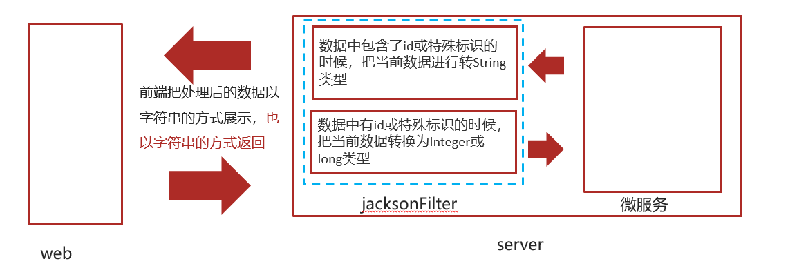

# jackson进行序列化和反序列化解决

文章id是一长串数字，long类型。网络传输过程可能丢失。



- 当后端响应给前端的数据中包含了id或者特殊标识（可自定义）的时候，把当前数据进行转换为String类型
- 当前端传递后后端的dto中有id或者特殊标识（可自定义）的时候，把当前数据转为Integer或Long类型。

特殊标识类说明：

**IdEncrypt自定义注解**  

作用在需要转换类型的字段属性上，用于非id的属性上   在model包下

```java
package com.heima.model.common.annotation;

import com.fasterxml.jackson.annotation.JacksonAnnotation;

import java.lang.annotation.ElementType;
import java.lang.annotation.Retention;
import java.lang.annotation.RetentionPolicy;
import java.lang.annotation.Target;

@JacksonAnnotation
@Retention(RetentionPolicy.RUNTIME)
@Target({ElementType.FIELD, ElementType.METHOD, ElementType.PARAMETER})
public @interface IdEncrypt {
}
```

序列化和反序列化类说明：以下类理解为主，可直接在资料文件夹下拷贝到leadnews-common模块中使用。

**ConfusionSerializer**    

用于序列化自增数字的混淆

```java
public class ConfusionSerializer extends JsonSerializer<Object> {

    @Override
    public  void serialize(Object value, JsonGenerator jsonGenerator, SerializerProvider serializers) throws IOException {
        try {
            if (value != null) {
                jsonGenerator.writeString(value.toString());
                return;
            }
        }catch (Exception e){
            e.printStackTrace();
        }
        serializers.defaultSerializeValue(value, jsonGenerator);
    }
}
```

**ConfusionDeserializer**  

 用于反序列化自增数字的混淆解密

```java
public class ConfusionDeserializer extends JsonDeserializer<Object> {

    JsonDeserializer<Object>  deserializer = null;
    JavaType type =null;

    public  ConfusionDeserializer(JsonDeserializer<Object> deserializer, JavaType type){
        this.deserializer = deserializer;
        this.type = type;
    }

    @Override
    public  Object deserialize(JsonParser p, DeserializationContext ctxt)
            throws IOException{
        try {
            if(type!=null){
                if(type.getTypeName().contains("Long")){
                    return Long.valueOf(p.getValueAsString());
                }
                if(type.getTypeName().contains("Integer")){
                    return Integer.valueOf(p.getValueAsString());
                }
            }
            return IdsUtils.decryptLong(p.getValueAsString());
        }catch (Exception e){
            if(deserializer!=null){
                return deserializer.deserialize(p,ctxt);
            }else {
                return p.getCurrentValue();
            }
        }
    }
}
```

**ConfusionSerializerModifier**

用于过滤序列化时处理的字段

```java
public class ConfusionSerializerModifier extends BeanSerializerModifier {

    @Override
    public List<BeanPropertyWriter> changeProperties(SerializationConfig config,
                                                     BeanDescription beanDesc, List<BeanPropertyWriter> beanProperties) {
        List<BeanPropertyWriter> newWriter = new ArrayList<>();
        for(BeanPropertyWriter writer : beanProperties){
            String name = writer.getType().getTypeName();
            if(null == writer.getAnnotation(IdEncrypt.class) && !writer.getName().equalsIgnoreCase("id")){
                newWriter.add(writer);
            } else {
                writer.assignSerializer(new ConfusionSerializer());
                newWriter.add(writer);
            }
        }
        return newWriter;
    }
}
```

**ConfusionDeserializerModifier**    

用于过滤反序列化时处理的字段

```java
public class ConfusionDeserializerModifier extends BeanDeserializerModifier {

    @Override
    public BeanDeserializerBuilder updateBuilder(final DeserializationConfig config, final BeanDescription beanDescription, final BeanDeserializerBuilder builder) {
        Iterator it = builder.getProperties();

        while (it.hasNext()) {
            SettableBeanProperty p = (SettableBeanProperty) it.next();
            if ((null != p.getAnnotation(IdEncrypt.class)||p.getName().equalsIgnoreCase("id"))) {
                JsonDeserializer<Object> current = p.getValueDeserializer();
                builder.addOrReplaceProperty(p.withValueDeserializer(new ConfusionDeserializer(p.getValueDeserializer(),p.getType())), true);
            }
        }
        return builder;
    }
}
```

**ConfusionModule**  

用于注册模块和修改器

```java
public class ConfusionModule extends Module {

    public final static String MODULE_NAME = "jackson-confusion-encryption";
    public final static Version VERSION = new Version(1,0,0,null,"heima",MODULE_NAME);

    @Override
    public String getModuleName() {
        return MODULE_NAME;
    }

    @Override
    public Version version() {
        return VERSION;
    }

    @Override
    public void setupModule(SetupContext context) {
        context.addBeanSerializerModifier(new ConfusionSerializerModifier());
        context.addBeanDeserializerModifier(new ConfusionDeserializerModifier());
    }

    /**
     * 注册当前模块
     * @return
     */
    public static ObjectMapper registerModule(ObjectMapper objectMapper){
        //CamelCase策略，Java对象属性：personId，序列化后属性：persionId
        //PascalCase策略，Java对象属性：personId，序列化后属性：PersonId
        //SnakeCase策略，Java对象属性：personId，序列化后属性：person_id
        //KebabCase策略，Java对象属性：personId，序列化后属性：person-id
        // 忽略多余字段，抛错
        objectMapper.configure(DeserializationFeature.FAIL_ON_UNKNOWN_PROPERTIES, false);
//        objectMapper.setPropertyNamingStrategy(PropertyNamingStrategy.SNAKE_CASE);
        return objectMapper.registerModule(new ConfusionModule());
    }
}
```

**InitJacksonConfig**   

提供自动化配置默认ObjectMapper，让整个框架自动处理id混淆

```java
@Configuration
public class InitJacksonConfig {
    @Bean
    public ObjectMapper objectMapper() {
        ObjectMapper objectMapper = new ObjectMapper();
        objectMapper = ConfusionModule.registerModule(objectMapper);
        return objectMapper;
    }
}
```

在common模块中的自动配置的spring.factories中添加如下内容

```java
org.springframework.boot.autoconfigure.EnableAutoConfiguration=\
  com.heima.common.swagger.SwaggerConfiguration,\
  com.heima.common.swagger.Swagger2Configuration,\
  com.heima.common.exception.ExceptionCatch,\
  com.heima.common.aliyun.GreenTextScan,\
  com.heima.common.aliyun.GreenImageScan,\
  com.heima.common.jackson.InitJacksonConfig
```

在dto中传递参数的时候如果想要把数值类型转为json，可以使用`@IdEncrypt`标识字段进行转换，如下：

```java
@Data
public class ArticleInfoDto {
    
    // 文章ID
    @IdEncrypt
    Long articleId;
}
```

