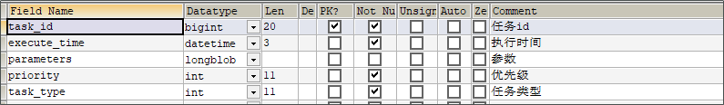
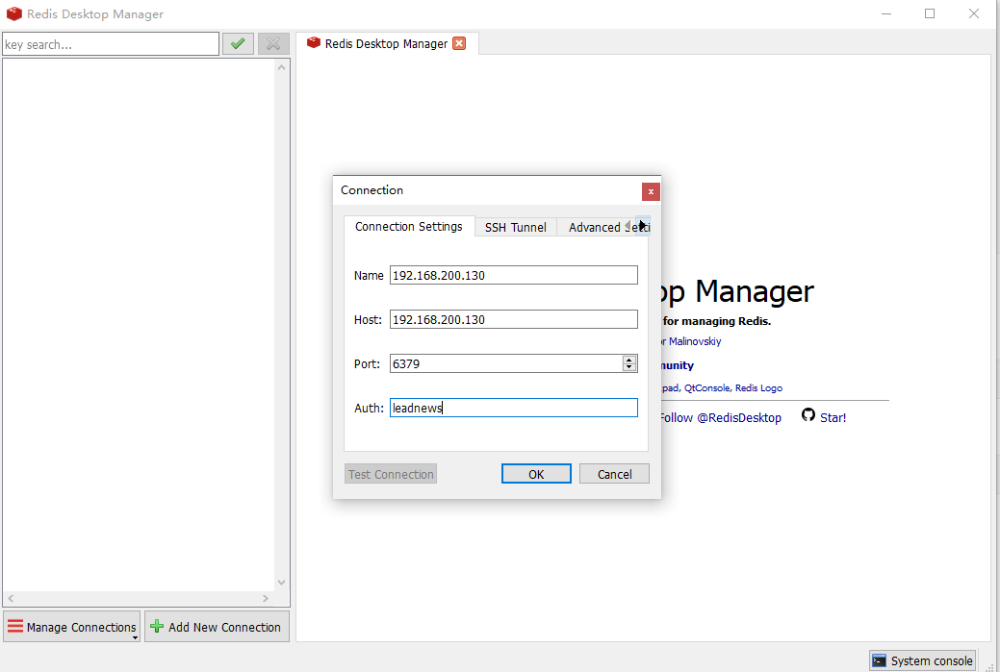
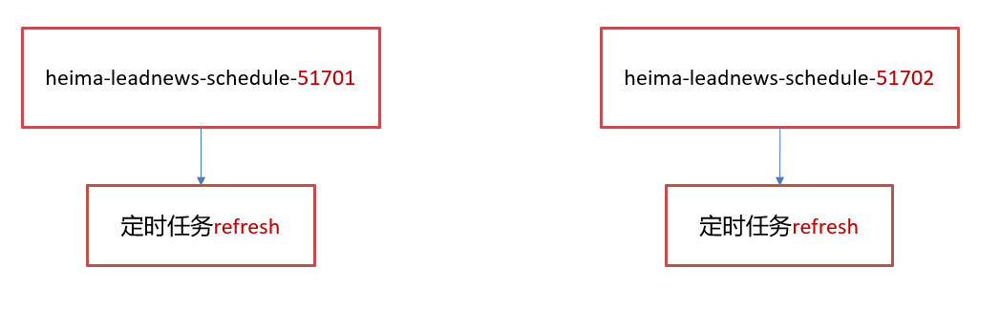

# 延迟任务精准发布文章

## 延迟任务概述

- 定时任务：有固定周期的，有明确的触发时间。
- 延迟队列：没有固定的开始时间，它常常是由一个事件触发的，而在这个事件触发之后的一段时间内触发另一个事件，任务可以立即执行，也可以延迟。

应用场景：

1. 订单下单之后30分钟后，如果用户没有付钱，则系统自动取消订单；如果期间下单成功，任务取消。
2. 接口对接出现网络问题，1分钟后重试，如果失败，2分钟重试，直到出现阈值终止。

## 技术对比

### 1、DelayQueue

JDK自带DelayQueue 是一个支持延时获取元素的**阻塞队列**， 内部采用优先队列 PriorityQueue 存储元素，同时元素必须实现 Delayed 接口；在创建元素时可以指定多久才可以从队列中获取当前元素，只有在延迟期满时才能从队列中提取元素。


DelayQueue属于排序队列，队列的元素必须实现Delayed接口，该接口需要实现compareTo和getDelay方法。

- getDelay方法：获取元素在队列中的剩余时间，只有当剩余时间为0时元素才可以出队列。
- compareTo方法：用于排序，确定元素出队列的顺序。

生产者向DelayQueue中添加元素Delay（任务），可以给每一个任务设置一个过期时间，消费者中当前的DelayQueue中获取过期超时的元素（任务）。

**实现：**

1. 在测试包jdk下创建延迟任务元素对象DelayedTask，实现compareTo和getDelay方法。
2. 在main方法中创建DelayQueue并向延迟队列中添加三个延迟任务。
3. 循环的从延迟队列中拉取任务。

```java
public class DelayedTask  implements Delayed{
    
    // 任务的执行时间
    private int executeTime = 0;
    
    public DelayedTask(int delay){
        Calendar calendar = Calendar.getInstance();
        calendar.add(Calendar.SECOND,delay);
        this.executeTime = (int)(calendar.getTimeInMillis() /1000 );
    }

    /**
     * 元素在队列中的剩余时间
     * @param unit
     * @return
     */
    @Override
    public long getDelay(TimeUnit unit) {
        Calendar calendar = Calendar.getInstance();
        return executeTime - (calendar.getTimeInMillis()/1000);
    }

    /**
     * 元素排序
     * @param o
     * @return
     */
    @Override
    public int compareTo(Delayed o) {
        long val = this.getDelay(TimeUnit.NANOSECONDS) - o.getDelay(TimeUnit.NANOSECONDS);
        return val == 0 ? 0 : ( val < 0 ? -1: 1 );
    }

    public static void main(String[] args) {
        DelayQueue<DelayedTask> queue = new DelayQueue<DelayedTask>();
        
        queue.add(new DelayedTask(5));
        queue.add(new DelayedTask(10));
        queue.add(new DelayedTask(15));

        System.out.println(System.currentTimeMillis()/1000+" start consume ");
        while(queue.size() != 0){
            DelayedTask delayedTask = queue.poll();
            if(delayedTask !=null ){
                System.out.println(System.currentTimeMillis()/1000+" cosume task");
            }
            //每隔一秒消费一次
            try {
                Thread.sleep(1000);
            } catch (InterruptedException e) {
                e.printStackTrace();
            }
        }     
    }
}
```

使用线程池或者原生DelayQueue程序挂掉之后，任务都是放在内存，需要考虑未处理消息的丢失带来的影响，如何保证数据不丢失，需要持久化（磁盘）。

### 2、RabbitMQ实现延迟任务

- TTL：Time To Live (消息存活时间)

- 死信队列：Dead Letter Exchange(死信交换机)，当消息成为Dead message后，可以重新发送另一个交换机（死信交换机）


### 3、redis实现

zset数据类型的去重有序（分数排序）特点进行延迟。例如：时间戳作为score进行排序


例如：生产者添加到4个任务到延迟队列中，时间毫秒值分别为97、98、99、100。当前时间的毫秒值为90消费者端进行监听，如果当前时间的毫秒值匹配到了延迟队列中的毫秒值就立即消费。

## redis实现延迟任务

数据库是磁盘，redis就是缓存。

实现思路


**1、为什么任务需要存储在数据库中**

延迟任务是一个通用的服务，任何需要延迟得任务都可以调用该服务。需要考虑数据持久化的问题，存储数据库中是一种数据安全的考虑。

**2、为什么redis中使用两种数据类型，list和zset**

- list存现在要执行的任务，zset存储未来要执行的任务。

- 效率问题，算法的时间复杂度

  - 操作redis中的list命令LPUSH：时间复杂度： O(1)
  
  
    - 操作redis中的zset命令zadd：时间复杂度：O(M*log(n))
  


|             | 说明                                       |
| ----------- | ------------------------------------------ |
| O(1)        | 常量级复杂度，执行次数与数据规模没有关系   |
| O(M*log(n)) | 对数级复杂度，执行次数与数据规模是对数关系 |

list是双向链表，可以方便的添加和查找，性能比较高。数据量大时性能比zset高的多。

zset可以按照分值进行排序。

**3、在添加zset数据的时候，为什么不需要预加载**

任务模块是一个通用的模块，项目中任何需要延迟队列的地方，都可以调用这个接口，要考虑到数据量的问题，如果数据量特别大，为了防止阻塞，只需要把未来几分钟要执行的数据存入缓存即可。

## 延迟任务微服务

### 1、搭建heima-leadnews-schedule模块

leadnews-schedule是一个通用的服务，单独创建模块来管理任何类型的延迟任务，供多个微服务使用（通过feign的远程接口调用）。

①：导入资料文件夹下的heima-leadnews-schedule模块到heima-leadnews-service下。

②：添加bootstrap.yml

```yaml
server:
  port: 51701
spring:
  application:
    name: leadnews-schedule
  cloud:
    nacos:
      discovery:
        server-addr: 192.168.200.130:8848
      config:
        server-addr: 192.168.200.130:8848
        file-extension: yml
```

③：在nacos中添加对应配置，并添加数据库及mybatis-plus的配置

```yaml
spring:
  datasource:
    driver-class-name: com.mysql.jdbc.Driver
    url: jdbc:mysql://localhost:3306/leadnews_schedule?useUnicode=true&characterEncoding=UTF-8&serverTimezone=UTC
    username: root
    password: root
# 设置Mapper接口所对应的XML文件位置，如果你在Mapper接口中有自定义方法，需要进行该配置
mybatis-plus:
  mapper-locations: classpath*:mapper/*.xml
  # 设置别名包扫描路径，通过该属性可以给包中的类注册别名
  type-aliases-package: com.heima.model.schedule.pojos
```

### 2、数据库准备

导入资料中leadnews_schedule数据库

taskinfo 任务表



实体类

```java
package com.heima.model.schedule.pojos;

import com.baomidou.mybatisplus.annotation.IdType;
import com.baomidou.mybatisplus.annotation.TableField;
import com.baomidou.mybatisplus.annotation.TableId;
import com.baomidou.mybatisplus.annotation.TableName;
import lombok.Data;

import java.io.Serializable;
import java.util.Date;

/**
 * <p>
 * 
 * </p>
 *
 * @author itheima
 */
@Data
@TableName("taskinfo")
public class Taskinfo implements Serializable {

    private static final long serialVersionUID = 1L;

    /**
     * 任务id
     */
    @TableId(type = IdType.ID_WORKER)
    private Long taskId;

    /**
     * 执行时间
     */
    @TableField("execute_time")
    private Date executeTime;

    /**
     * 参数
     */
    @TableField("parameters")
    private byte[] parameters;

    /**
     * 优先级
     */
    @TableField("priority")
    private Integer priority;

    /**
     * 任务类型
     */
    @TableField("task_type")
    private Integer taskType;

}
```

taskinfo_logs 任务日志表


实体类

```java
package com.heima.model.schedule.pojos;

import com.baomidou.mybatisplus.annotation.*;
import lombok.Data;

import java.io.Serializable;
import java.util.Date;

/**
 * <p>
 * 
 * </p>
 *
 * @author itheima
 */
@Data
@TableName("taskinfo_logs")
public class TaskinfoLogs implements Serializable {

    private static final long serialVersionUID = 1L;

    /**
     * 任务id
     */
    @TableId(type = IdType.ID_WORKER)
    private Long taskId;

    /**
     * 执行时间
     */
    @TableField("execute_time")
    private Date executeTime;

    /**
     * 参数
     */
    @TableField("parameters")
    private byte[] parameters;

    /**
     * 优先级
     */
    @TableField("priority")
    private Integer priority;

    /**
     * 任务类型
     */
    @TableField("task_type")
    private Integer taskType;

    /**
     * 版本号,用乐观锁
     */
    @Version
    private Integer version;

    /**
     * 状态 0=init 1=EXECUTED 2=CANCELLED
     */
    @TableField("status")
    private Integer status;
    
}
```

mybatis-plus集成乐观锁的使用

①：在实体类中使用@Version标明是一个版本的字段

```java
/**
* 版本号,用乐观锁
*/
@Version
private Integer version;
```

②：mybatis-plus对乐观锁的支持，在启动类中向容器中放入**乐观锁的拦截器**

```java
@SpringBootApplication
@MapperScan("com.heima.schedule.mapper")
@EnableScheduling
public class ScheduleApplication {

    public static void main(String[] args) {
        System.out.println("创建分支测试");
        System.out.println("合并分支测试");
        SpringApplication.run(ScheduleApplication.class,args);
    }

    /**
     * mybatis-plus乐观锁支持
     * @return
     */
    @Bean
    public MybatisPlusInterceptor optimisticLockerInterceptor(){
        MybatisPlusInterceptor interceptor = new MybatisPlusInterceptor();
        interceptor.addInnerInterceptor(new OptimisticLockerInnerInterceptor());
        return interceptor;
    }
}
```

### 3、安装redis

①拉取镜像

```shell
docker pull redis
```

② 创建容器

```shell
docker run -d --name redis --restart=always -p 6379:6379 redis --requirepass "leadnews"
```

- --requirepass "leadnews"：密码leadnews

③链接测试

 打开资料中的Redis Desktop Manager客户端工具，输入host、port、password链接测试



能链接成功，即可

### 4、项目集成redis

① 在项目导入redis相关依赖

```xml
<dependency>
    <groupId>org.springframework.boot</groupId>
    <artifactId>spring-boot-starter-data-redis</artifactId>
</dependency>
<!-- redis依赖commons-pool 这个依赖一定要添加 -->
<dependency>
    <groupId>org.apache.commons</groupId>
    <artifactId>commons-pool2</artifactId>
</dependency>
```

② 在heima-leadnews-schedule中集成redis,添加以下nacos配置，链接上redis

```yaml
spring:
  redis:
    #地址
    host: 192.168.200.130
    #密码
    password: leadnews
    #端口
    port: 6379
```

③ 拷贝资料文件夹下的类：CacheService到heima-leadnews-common模块下，并在`heima-leadnews\heima-leadnews\heima-leadnews-common\src\main\resources\META-INF\spring.factories`中添加自动配置。

```properties
org.springframework.boot.autoconfigure.EnableAutoConfiguration=\
  com.heima.common.exception.ExceptionCatch,\
  com.heima.common.aliyun.GreenImageScan,\
  com.heima.common.aliyun.GreenTextScan,\
  com.heima.common.tess4j.Tess4jClient,\
  com.heima.common.redis.CacheService,\
```

④：测试

```java
package com.heima.schedule.test;

import com.heima.common.redis.CacheService;
import com.heima.schedule.ScheduleApplication;
import org.junit.Test;
import org.junit.runner.RunWith;
import org.springframework.beans.factory.annotation.Autowired;
import org.springframework.boot.test.context.SpringBootTest;
import org.springframework.test.context.junit4.SpringRunner;

import java.util.Set;

@SpringBootTest(classes = ScheduleApplication.class)
@RunWith(SpringRunner.class)
public class RedisTest {

    @Autowired
    private CacheService cacheService;

    @Test
    public void testList(){

        //在list的左边添加元素
//        cacheService.lLeftPush("list_001","hello,redis");

        //在list的右边获取元素，并删除
        String list_001 = cacheService.lRightPop("list_001");
        System.out.println(list_001);
    }

    @Test
    public void testZset(){
        //添加数据到zset中  分值
        /*cacheService.zAdd("zset_key_001","hello zset 001",1000);
        cacheService.zAdd("zset_key_001","hello zset 002",8888);
        cacheService.zAdd("zset_key_001","hello zset 003",7777);
        cacheService.zAdd("zset_key_001","hello zset 004",999999);*/

        //按照分值获取数据，最小0 最大8888
        Set<String> zset_key_001 = cacheService.zRangeByScore("zset_key_001", 0, 8888);
        System.out.println(zset_key_001);//结果会获取分值1000、7777、8888三条数据

    }
}
```

### 5、添加任务

1、拷贝mybatis-plus生成的文件，mapper。拷贝资料中TaskinfoMapper 和TaskinfoLogsMapper到项目中。

2、创建task类，用于接收添加任务的参数

```java
package com.heima.model.schedule.dtos;

import lombok.Data;

import java.io.Serializable;

@Data
public class Task implements Serializable {

    /**
     * 任务id
     */
    private Long taskId;
    /**
     * 类型
     */
    private Integer taskType;

    /**
     * 优先级
     */
    private Integer priority;

    /**
     * 执行id
     */
    private long executeTime;

    /**
     * task参数
     */
    private byte[] parameters;
    
}
```

3、创建TaskService

​       3.1、添加任务到数据库中       

​	3.2、添加任务到redis中	 

​		3.2.1、如果任务的执行时间小于等于当前时间存入list	 

​		3.2.2、如果任务的执行时间大于当前时间，小于等于预设时间（未来5分钟）存入zset中

```java
package com.heima.schedule.service;

import com.heima.model.schedule.dtos.Task;

/**
 * 对外访问接口
 */
public interface TaskService {

    /**
     * 添加任务
     * @param task   任务对象
     * @return       任务id
     */
    public long addTask(Task task) ;

}
```

实现：

```java
package com.heima.schedule.service.impl;

import com.alibaba.fastjson.JSON;
import com.heima.common.constants.ScheduleConstants;
import com.heima.common.redis.CacheService;
import com.heima.model.schedule.dtos.Task;
import com.heima.model.schedule.pojos.Taskinfo;
import com.heima.model.schedule.pojos.TaskinfoLogs;
import com.heima.schedule.mapper.TaskinfoLogsMapper;
import com.heima.schedule.mapper.TaskinfoMapper;
import com.heima.schedule.service.TaskService;
import lombok.extern.slf4j.Slf4j;
import org.springframework.beans.BeanUtils;
import org.springframework.beans.factory.annotation.Autowired;
import org.springframework.stereotype.Service;
import org.springframework.transaction.annotation.Transactional;

import java.util.Calendar;
import java.util.Date;

@Service
@Transactional
@Slf4j
public class TaskServiceImpl implements TaskService {
    /**
     * 添加延迟任务
     *
     * @param task
     * @return
     */
    @Override
    public long addTask(Task task) {
        
        //1.添加任务到数据库中
        boolean success = addTaskToDb(task);
        
        if (success) {
            //2.添加任务到redis
            addTaskToCache(task);
        }
        
        return task.getTaskId();
    }

    @Autowired
    private CacheService cacheService;

    /**
     * 把任务添加到redis中
     *
     * @param task
     */
    private void addTaskToCache(Task task) {

        String key = task.getTaskType() + "_" + task.getPriority();

        //获取5分钟之后的时间  毫秒值
        Calendar calendar = Calendar.getInstance();
        calendar.add(Calendar.MINUTE, 5);
        long nextScheduleTime = calendar.getTimeInMillis();

        //2.1 如果任务的执行时间小于等于当前时间，存入list
        if (task.getExecuteTime() <= System.currentTimeMillis()) {
            cacheService.lLeftPush(ScheduleConstants.TOPIC + key, JSON.toJSONString(task));
        } else if (task.getExecuteTime() <= nextScheduleTime) {
            //2.2 如果任务的执行时间大于当前时间 && 小于等于预设时间（未来5分钟） 存入zset中
            cacheService.zAdd(ScheduleConstants.FUTURE + key, JSON.toJSONString(task), task.getExecuteTime());
        }

    }

    @Autowired
    private TaskinfoMapper taskinfoMapper;

    @Autowired
    private TaskinfoLogsMapper taskinfoLogsMapper;

    /**
     * 添加任务到数据库中
     *
     * @param task
     * @return
     */
    private boolean addTaskToDb(Task task) {

        boolean flag = false;

        try {
            //保存任务表
            Taskinfo taskinfo = new Taskinfo();
            BeanUtils.copyProperties(task, taskinfo);
            taskinfo.setExecuteTime(new Date(task.getExecuteTime()));
            taskinfoMapper.insert(taskinfo);

            //设置taskID
            task.setTaskId(taskinfo.getTaskId());

            //保存任务日志数据
            TaskinfoLogs taskinfoLogs = new TaskinfoLogs();
            BeanUtils.copyProperties(taskinfo, taskinfoLogs);
            taskinfoLogs.setVersion(1);
            taskinfoLogs.setStatus(ScheduleConstants.SCHEDULED);
            taskinfoLogsMapper.insert(taskinfoLogs);

            flag = true;
        } catch (Exception e) {
            e.printStackTrace();
        }

        return flag;
    }
}
```

ScheduleConstants常量类

```java
package com.heima.common.constants;

public class ScheduleConstants {

    //task状态
    public static final int SCHEDULED=0;   //初始化状态

    public static final int EXECUTED=1;       //已执行状态

    public static final int CANCELLED=2;   //已取消状态

    public static String FUTURE="future_";   //未来数据key前缀

    public static String TOPIC="topic_";     //当前数据key前缀
}
```

4、测试

### 6、取消任务

场景：第三接口网络不通，使用延迟任务进行重试，当达到阀值以后，取消任务。

1. 根据taskid（参数）删除任务，修改任务日志状态为 2(取消)。
2. 删除redis中对应的任务数据，包括list和zset。

在TaskService中添加方法

```java
/**
 * 取消任务
 * @param taskId        任务id
 * @return              取消结果
 */
public boolean cancelTask(long taskId);
```

实现

```java
/**
 * 取消任务
 * @param taskId
 * @return
 */
@Override
public boolean cancelTask(long taskId) {

    boolean flag = false;

    //删除任务，更新日志
    Task task = updateDb(taskId,ScheduleConstants.EXECUTED);

    //删除redis的数据
    if(task != null){
        removeTaskFromCache(task);
        flag = true;
    }

    return flag;
}

/**
 * 删除redis中的任务数据
 * @param task
 */
private void removeTaskFromCache(Task task) {

    String key = task.getTaskType()+"_"+task.getPriority();

    if(task.getExecuteTime()<=System.currentTimeMillis()){
        cacheService.lRemove(ScheduleConstants.TOPIC+key,0,JSON.toJSONString(task));
    }else {
        cacheService.zRemove(ScheduleConstants.FUTURE+key, JSON.toJSONString(task));
    }
}

/**
 * 删除任务，更新任务日志状态
 * @param taskId
 * @param status 可以是删除任务、可以是消费任务
 * @return
 */
private Task updateDb(long taskId, int status) {
    Task task = null;
    try {
        //删除任务
        taskinfoMapper.deleteById(taskId);
	
        //更新任务日志
        //1.查出来任务日志
        TaskinfoLogs taskinfoLogs = taskinfoLogsMapper.selectById(taskId);
        //2.设置任务日志状态
        taskinfoLogs.setStatus(status);
        //3.更新任务日志
        taskinfoLogsMapper.updateById(taskinfoLogs);

        task = new Task();
        BeanUtils.copyProperties(taskinfoLogs,task);
        task.setExecuteTime(taskinfoLogs.getExecuteTime().getTime());
    }catch (Exception e){
        log.error("task cancel exception taskid={}",taskId);
    }

    return task;

}
```

测试

### 7、消费任务

1. 消费任务。参数：任务的类型和优先级。
2. 从redis的list中pop数据。pop:取出数据并删除。
3. 修改数据库的任务。删除任务&修改日志状态

在TaskService中添加方法

```java
/**
 * 按照类型和优先级来拉取任务
 * @param type 类型
 * @param priority 优先级
 * @return
 */
public Task poll(int type,int priority);
```

实现

```java
/**
 * 按照类型和优先级拉取任务
 * @return
 */
@Override
public Task poll(int type,int priority) {
    Task task = null;
    try {
        String key = type+"_"+priority;
        //从redis中拉取数据 pop
        String task_json = cacheService.lRightPop(ScheduleConstants.TOPIC + key);
        if(StringUtils.isNotBlank(task_json)){//task_json不为空
            task = JSON.parseObject(task_json, Task.class);
            //更新数据库信息
            updateDb(task.getTaskId(),ScheduleConstants.EXECUTED);
        }
    }catch (Exception e){
        e.printStackTrace();
        log.error("poll task exception");
    }
    return task;
}
```

### 8、未来数据定时刷新

流程：

1. 做一个定时的任务，每分钟执行一次。

2. 查看未来数据（zset）的keys。

3. 按照分值查询zset

4. 跟当前时间对比，判断数据是否到期
   1. 到期的话Redis同步到list

      第一：从zset中查出数据，并删除。

      第二：把数据存入到list中。

#### 1、reids key值匹配

方案1：keys 模糊匹配

使用keys的模糊匹配发现redis的CPU使用率极高，所以公司的redis生产环境将keys命令禁用了！redis是单线程，会被堵塞。


方案2：scan 

SCAN 命令是一个基于游标的迭代器，SCAN命令每次被调用之后， 都会向用户返回一个新的游标， 用户在下次迭代时需要使用这个新游标作为SCAN命令的游标参数， 以此来延续之前的迭代过程。


代码案例：

```java
@Test
public void testKeys(){
    Set<String> keys = cacheService.keys("future_*");
    System.out.println(keys);

    Set<String> scan = cacheService.scan("future_*");
    System.out.println(scan);
}
```

#### 2、reids管道

普通redis客户端和服务器交互模式


Pipeline请求模型


以上两种方式测试结果数据对比

普通方式：随着数据越多时间越长。

pipeline：时间比较少。

测试案例对比：

```java
@Test
public  void testPiple1(){
    long start =System.currentTimeMillis();
    for (int i = 0; i <10000 ; i++) {
        Task task = new Task();
        task.setTaskType(1001);
        task.setPriority(1);
        task.setExecuteTime(new Date().getTime());
        cacheService.lLeftPush("1001_1", JSON.toJSONString(task));
    }
    System.out.println("耗时"+(System.currentTimeMillis()- start));//耗时6151
}


@Test
public void testPiple2(){
    long start  = System.currentTimeMillis();
    //使用管道技术
    List<Object> objectList = cacheService.getstringRedisTemplate().executePipelined(new RedisCallback<Object>() {
        @Nullable
        @Override
        public Object doInRedis(RedisConnection redisConnection) throws DataAccessException {
            for (int i = 0; i <10000 ; i++) {
                Task task = new Task();
                task.setTaskType(1001);
                task.setPriority(1);
                task.setExecuteTime(new Date().getTime());
                redisConnection.lPush("1001_1".getBytes(), JSON.toJSONString(task).getBytes());
            }
            return null;
        }
    });
    System.out.println("使用管道技术执行10000次自增操作共耗时:"+(System.currentTimeMillis()-start)+"毫秒");
}
```

#### 3、未来数据定时刷新

在TaskServiceImpl中添加方法

```java
@Scheduled(cron = "0 */1 * * * ?")//每分钟定时执行一次
public void refresh() {
    System.out.println(System.currentTimeMillis() / 1000 + "执行了定时任务");

    // 获取所有未来数据集合的key值
    Set<String> futureKeys = cacheService.scan(ScheduleConstants.FUTURE + "*");// future_*
    
    for (String futureKey : futureKeys) { // future_250_250
        //获取当前数据的key topic
        String topicKey = ScheduleConstants.TOPIC + futureKey.split(ScheduleConstants.FUTURE)[1];
        //按照key和分值查询该组key下当前需要消费的任务数据
        Set<String> tasks = cacheService.zRangeByScore(futureKey, 0, System.currentTimeMillis());
        if (!tasks.isEmpty()) {
            //同步数据
            //将这些任务数据添加到消费者队列中
            cacheService.refreshWithPipeline(futureKey, topicKey, tasks);
            System.out.println("成功的将" + futureKey + "下的当前需要执行的任务数据刷新到" + topicKey + "下");
        }
    }
}
```

在引导类中添加开启任务调度注解：`@EnableScheduling`

### 9、分布式锁解决集群下的方法抢占执行

#### 问题描述

启动两台heima-leadnews-schedule服务，每台服务都会去执行refresh定时任务方法



#### 分布式锁

分布式锁：控制分布式系统有序的去对共享资源进行操作，通过互斥来保证数据的一致性。

解决方案：

|   方案    |               说明                |
| :-------: | :-------------------------------: |
|  数据库   |         基于表的唯一索引          |
| zookeeper | 根据zookeeper中的临时有序节点排序 |
|   redis   |         使用SETNX命令完成         |

#### redis分布式锁

sexnx （SET if Not eXists） 命令在指定的 key 不存在时，为 key 设置指定的值。


这种加锁的思路是，如果 key 不存在则为 key 设置 value，如果 key 已存在则 SETNX 命令不做任何操作

- 客户端A请求服务器设置key的值，如果设置成功就表示加锁成功
- 客户端B也去请求服务器设置key的值，如果返回失败，那么就代表加锁失败
- 客户端A执行代码完成，删除锁
- 客户端B在等待一段时间后再去请求设置key的值，设置成功
- 客户端B执行代码完成，删除锁

#### 在工具类CacheService中添加方法

```java
/**
 * 加锁
 *
 * @param name 名字
 * @param expire 过期时间
 * @return
 */
public String tryLock(String name, long expire) {
    name = name + "_lock";
    String token = UUID.randomUUID().toString();
    RedisConnectionFactory factory = stringRedisTemplate.getConnectionFactory();
    RedisConnection conn = factory.getConnection();
    try {
        //参考redis命令：
        //set key value [EX seconds] [PX milliseconds] [NX|XX]
        Boolean result = conn.set(
                name.getBytes(),
                token.getBytes(),
                Expiration.from(expire, TimeUnit.MILLISECONDS),
                RedisStringCommands.SetOption.SET_IF_ABSENT //NX
        );
        if (result != null && result)
            return token;
    } finally {
        RedisConnectionUtils.releaseConnection(conn, factory,false);
    }
    return null;
}
```

修改未来数据定时刷新的方法，如下：

```java
/**
 * 未来数据定时刷新
 */
@Scheduled(cron = "0 */1 * * * ?")
public void refresh(){

    // 加锁
    String token = cacheService.tryLock("FUTURE_TASK_SYNC", 1000 * 30);
    
    if(StringUtils.isNotBlank(token)){
        log.info("未来数据定时刷新---定时任务");

        //获取所有未来数据的集合key
        Set<String> futureKeys = cacheService.scan(ScheduleConstants.FUTURE + "*");
        for (String futureKey : futureKeys) {//future_100_50

            //获取当前数据的key  topic
            String topicKey = ScheduleConstants.TOPIC+futureKey.split(ScheduleConstants.FUTURE)[1];

            //按照key和分值查询符合条件的数据
            Set<String> tasks = cacheService.zRangeByScore(futureKey, 0, System.currentTimeMillis());

            //同步数据
            if(!tasks.isEmpty()){
                cacheService.refreshWithPipeline(futureKey,topicKey,tasks);
                log.info("成功的将"+futureKey+"刷新到了"+topicKey);
            }
        }
    }
}
```

总结

1. 在分布式系统环境下，一个方法在同一时间只能被一个机器的一个线程执行.

2. 主要是通过redis的sexnx特性完成分布式锁的功能 

   A获取到锁以后其他客户端不能操作，只能等待A释放锁以后，其他客户端才能操作

### 10、数据库同步到redis

数据库中的任务定时的同步到redis中。

1、清理缓存中的数据

如果缓存中有未消费的任务，可能会有重复，所以需要清理。

```java
Set<String> topicKeys = cacheService.scan(ScheduleConstants.TOPIC + "*");
Set<String> futureKeys = cacheService.scan(ScheduleConstants.FUTURE + "*");
cacheService.delete(topicKeys);
cacheService.delete(futureKeys);
```

2、查询小于未来5分钟的所有任务

```java
List<Taskinfo> taskinfoList = taskinfoMapper.selectList(Wrappers.<Taskinfo>lambdaQuery().lt(Taskinfo::getExecuteTime, calendar.getTime()));
```

3、新增任务到redis

```java
for (Taskinfo taskinfo : taskinfoList) {
    Task task = new Task();
    BeanUtils.copyProperties(taskinfo,task);
    //根据时间判断，存到list还是zset。
    task.setExecuteTime(taskinfo.getExecuteTime().getTime());
    addTaskToCache(task);
}
```


```java
@Scheduled(cron = "0 */5 * * * ?")//每5分钟执行一次
@PostConstruct	//启动微服务的时候就直接执行
public void reloadData() {
    //清理缓存中的数据
    clearCache();
    
    log.info("数据库数据同步到缓存");
    Calendar calendar = Calendar.getInstance();
    calendar.add(Calendar.MINUTE, 5);
    /查询小于未来5分钟的所有任务
    List<Taskinfo> allTasks = taskinfoMapper.selectList(Wrappers.<Taskinfo>lambdaQuery().lt(Taskinfo::getExecuteTime,calendar.getTime()));
    //把任务添加到redis
    if(allTasks != null && allTasks.size() > 0){
        for (Taskinfo taskinfo : allTasks) {
            Task task = new Task();
            BeanUtils.copyProperties(taskinfo,task);
            task.setExecuteTime(taskinfo.getExecuteTime().getTime());
            addTaskToCache(task);
        }
    }
}

private void clearCache(){
    // 删除缓存中未来数据集合和当前消费者队列的所有key
    Set<String> futurekeys = cacheService.scan(ScheduleConstants.FUTURE + "*");// future_ 开头所有的数据
    Set<String> topickeys = cacheService.scan(ScheduleConstants.TOPIC + "*");// topic_
    cacheService.delete(futurekeys);
    cacheService.delete(topickeys);
}
```

## 延迟队列解决精准时间发布文章

上面的延迟任务服务已经开发完了，如果其它微服务想要调取schedule服务的话，schedule微服务必须提供对外的feign的远程接口。

### 1、延迟队列服务提供对外接口

提供远程的feign接口，在`heima-leadnews-feign-api`编写类如下：

```java
package com.heima.apis.schedule;

import com.heima.model.common.dtos.ResponseResult;
import com.heima.model.schedule.dtos.Task;
import org.springframework.cloud.openfeign.FeignClient;
import org.springframework.web.bind.annotation.GetMapping;
import org.springframework.web.bind.annotation.PathVariable;
import org.springframework.web.bind.annotation.PostMapping;
import org.springframework.web.bind.annotation.RequestBody;

@FeignClient("leadnews-schedule")
public interface IScheduleClient {

    /**
     * 添加任务
     * @param task   任务对象
     * @return       任务id
     */
    @PostMapping("/api/v1/task/add")
    public ResponseResult addTask(@RequestBody Task task);

    /**
     * 取消任务
     * @param taskId        任务id
     * @return              取消结果
     */
    @GetMapping("/api/v1/task/cancel/{taskId}")
    public ResponseResult cancelTask(@PathVariable("taskId") long taskId);

    /**
     * 按照类型和优先级来拉取任务
     * @param type
     * @param priority 优先级
     * @return
     */
    @GetMapping("/api/v1/task/poll/{type}/{priority}")
    public ResponseResult poll(@PathVariable("type") int type,@PathVariable("priority")  int priority);
}
```

在`heima-leadnews-schedule`微服务下提供对应的实现

```java
package com.heima.schedule.feign;

import com.heima.apis.schedule.IScheduleClient;
import com.heima.model.common.dtos.ResponseResult;
import com.heima.model.schedule.dtos.Task;
import com.heima.schedule.service.TaskService;
import org.springframework.beans.factory.annotation.Autowired;
import org.springframework.web.bind.annotation.*;

@RestController
public class ScheduleClient implements IScheduleClient {

    @Autowired
    private TaskService taskService;

    /**
     * 添加任务
     * @param task 任务对象
     * @return 任务id
     */
    @PostMapping("/api/v1/task/add")
    @Override
    public ResponseResult addTask(@RequestBody Task task) {
        return ResponseResult.okResult(taskService.addTask(task));
    }

    /**
     * 取消任务
     * @param taskId 任务id
     * @return 取消结果
     */
    @GetMapping("/api/v1/task/cancel/{taskId}")
    @Override
    public ResponseResult cancelTask(@PathVariable("taskId") long taskId) {
        return ResponseResult.okResult(taskService.cancelTask(taskId));
    }

    /**
     * 按照类型和优先级来拉取任务
     * @param type
     * @param priority
     * @return
     */
    @GetMapping("/api/v1/task/poll/{type}/{priority}")
    @Override
    public ResponseResult poll(@PathVariable("type") int type, @PathVariable("priority") int priority) {
        return ResponseResult.okResult(taskService.poll(type,priority));
    }
}
```

### 2、发布文章集成添加延迟队列接口

1. 发布文章之后，不管发布时间是当前时间还是未来时间，都把文章的数据添加到延迟任务中。
2. 文章审核，去延迟任务中拉取当前时间需要发布的任务。

在创建WmNewsTaskService

```java
package com.heima.wemedia.service;

import com.heima.model.wemedia.pojos.WmNews;

public interface WmNewsTaskService {

    /**
     * 添加任务到延迟队列中
     * @param id  文章的id
     * @param publishTime  文章的发布时间  可以做为任务的执行时间
     */
    public void addNewsToTask(Integer id, Date publishTime);
  
}
```

实现：

```java
package com.heima.wemedia.service.impl;

import com.heima.apis.schedule.IScheduleClient;
import com.heima.model.common.enums.TaskTypeEnum;
import com.heima.model.schedule.dtos.Task;
import com.heima.model.wemedia.pojos.WmNews;
import com.heima.utils.common.ProtostuffUtil;
import com.heima.wemedia.service.WmNewsTaskService;
import lombok.SneakyThrows;
import lombok.extern.slf4j.Slf4j;
import org.springframework.beans.factory.annotation.Autowired;
import org.springframework.scheduling.annotation.Async;
import org.springframework.stereotype.Service;

@Service
@Slf4j
public class WmNewsTaskServiceImpl  implements WmNewsTaskService {

    @Autowired
    private IScheduleClient scheduleClient;

    /**
     * 添加任务到延迟队列中
     * @param id          文章的id
     * @param publishTime 发布的时间  可以做为任务的执行时间
     */
    @Override
    @Async
    public void addNewsToTask(Integer id, Date publishTime) {

        log.info("添加任务到延迟服务中----begin");

        Task task = new Task();
        task.setExecuteTime(publishTime.getTime());
        task.setTaskType(TaskTypeEnum.NEWS_SCAN_TIME.getTaskType());
        task.setPriority(TaskTypeEnum.NEWS_SCAN_TIME.getPriority());
        WmNews wmNews = new WmNews();
        wmNews.setId(id);
        task.setParameters(ProtostuffUtil.serialize(wmNews));

        scheduleClient.addTask(task);

        log.info("添加任务到延迟服务中----end");

    }
    
}
```

枚举类：

```java
package com.heima.model.common.enums;

import lombok.AllArgsConstructor;
import lombok.Getter;

@Getter
@AllArgsConstructor
public enum TaskTypeEnum {

    NEWS_SCAN_TIME(1001, 1,"文章定时审核"),
    REMOTEERROR(1002, 2,"第三方接口调用失败，重试");
    private final int taskType; //对应具体业务
    private final int priority; //业务不同级别
    private final String desc; //描述信息
}
```

### 序列化工具对比

 [序列化工具](../序列化.md) 

修改发布文章代码：

把之前的异步调用修改为调用延迟任务

```java
@Autowired
private WmNewsTaskService wmNewsTaskService;
 
/**
 * 发布修改文章或保存为草稿
 * @param dto
 * @return
 */
@Override
public ResponseResult submitNews(WmNewsDto dto) {

    //0.条件判断
    if(dto == null || dto.getContent() == null){
        return ResponseResult.errorResult(AppHttpCodeEnum.PARAM_INVALID);
    }

    //1.保存或修改文章

    WmNews wmNews = new WmNews();
    //属性拷贝 属性名词和类型相同才能拷贝
    BeanUtils.copyProperties(dto,wmNews);
    //封面图片  list---> string
    if(dto.getImages() != null && dto.getImages().size() > 0){
        //[1dddfsd.jpg,sdlfjldk.jpg]-->   1dddfsd.jpg,sdlfjldk.jpg
        String imageStr = StringUtils.join(dto.getImages(), ",");
        wmNews.setImages(imageStr);
    }
    //如果当前封面类型为自动 -1
    if(dto.getType().equals(WemediaConstants.WM_NEWS_TYPE_AUTO)){
        wmNews.setType(null);
    }

    saveOrUpdateWmNews(wmNews);

    //2.判断是否为草稿  如果为草稿结束当前方法
    if(dto.getStatus().equals(WmNews.Status.NORMAL.getCode())){
        return ResponseResult.okResult(AppHttpCodeEnum.SUCCESS);
    }

    //3.不是草稿，保存文章内容图片与素材的关系
    //获取到文章内容中的图片信息
    List<String> materials =  ectractUrlInfo(dto.getContent());
    saveRelativeInfoForContent(materials,wmNews.getId());

    //4.不是草稿，保存文章封面图片与素材的关系，如果当前布局是自动，需要匹配封面图片
    saveRelativeInfoForCover(dto,wmNews,materials);

    //审核文章
    //        wmNewsAutoScanService.autoScanWmNews(wmNews.getId());
    wmNewsTaskService.addNewsToTask(wmNews.getId(),wmNews.getPublishTime());

    return ResponseResult.okResult(AppHttpCodeEnum.SUCCESS);

}
```

### 3、消费任务进行审核文章

WmNewsTaskService中添加方法

```
/**
 * 消费延迟队列数据，审核文章
 */
public void scanNewsByTask();
```

实现

```java
@Autowired
private WmNewsAutoScanServiceImpl wmNewsAutoScanService;

/**
 * 消费延迟队列数据
 */
@Scheduled(fixedRate = 1000)//每秒钟去拉取任务
@Override
@SneakyThrows
public void scanNewsByTask() {

    log.info("文章审核---消费任务执行---begin---");

    ResponseResult responseResult = scheduleClient.poll(TaskTypeEnum.NEWS_SCAN_TIME.getTaskType(), TaskTypeEnum.NEWS_SCAN_TIME.getPriority());
    //成功并且task不为null
    if(responseResult.getCode().equals(200) && responseResult.getData() != null){
        String json_str = JSON.toJSONString(responseResult.getData());
        Task task = JSON.parseObject(json_str, Task.class);
        byte[] parameters = task.getParameters();
        WmNews wmNews = ProtostuffUtil.deserialize(parameters, WmNews.class);
        System.out.println(wmNews.getId()+"-----------");
        //审核文章
        wmNewsAutoScanService.autoScanWmNews(wmNews.getId());
    }
    log.info("文章审核---消费任务执行---end---");
}
```

在WemediaApplication自媒体的引导类中添加开启任务调度注解`@EnableScheduling`
