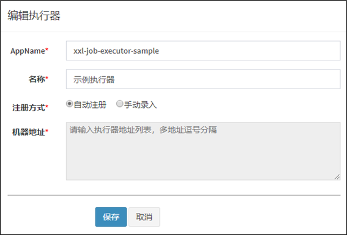
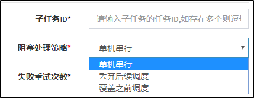
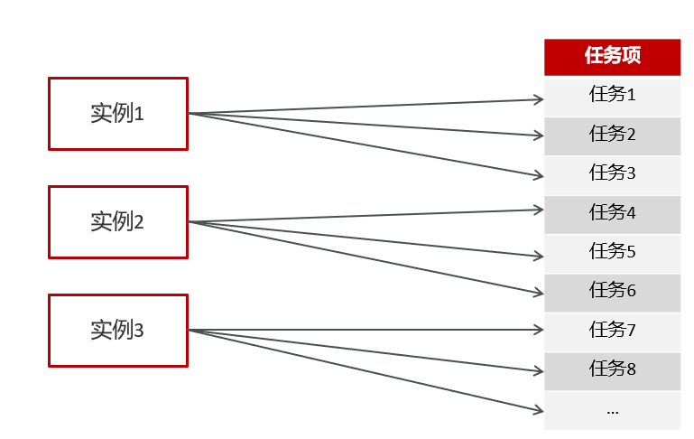
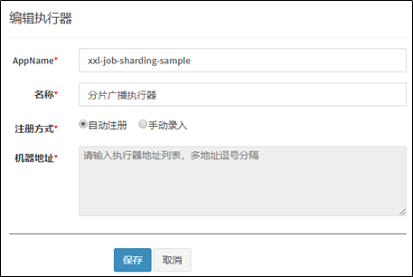
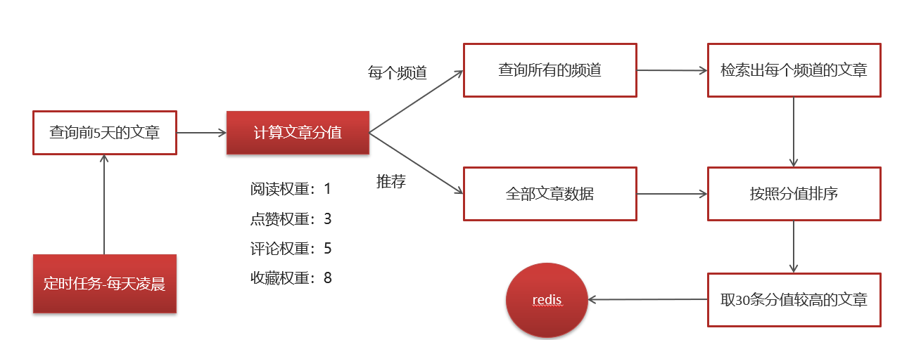
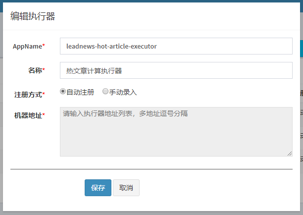
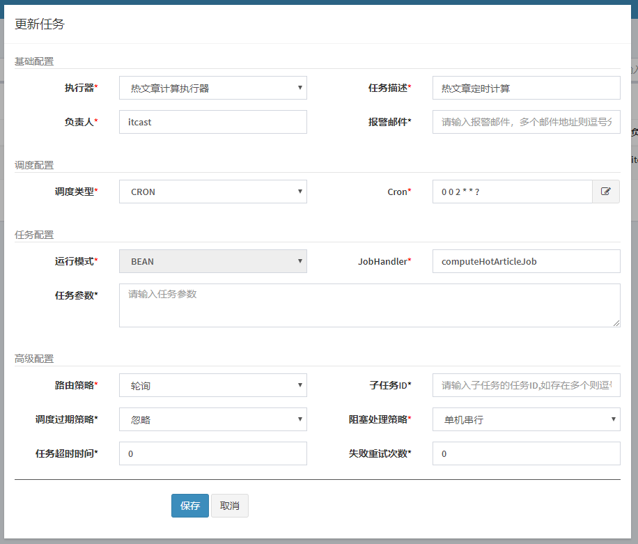

# xxl-Job分布式任务调度

## 需求分析

目前实现的思路：从数据库直接按照发布时间倒序查询

- 问题1：

  如何访问量较大，直接查询数据库，压力较大

- 问题2：

  新发布的文章会展示在前面，并不是热点文章

## 实现思路

把热点数据存入redis进行展示

判断文章是否是热点，有几项标准： 点赞数量，评论数量，阅读数量，收藏数量

计算文章热度，有两种方案：

- 定时计算文章热度

- 实时计算文章热度

## 定时计算

1. 查询近几天发布的所有文章。
2. 根据文章的行为（点赞、评论、阅读、收藏）计算文章的分值，利用定时任务每天完成一次计算。
3. 把分值较大的文章数据存入到redis中。
4. App端用户查询文章列表的时候，优先从redis中查询热度较高的文章数据。

## 定时任务框架-xxljob

spring传统的定时任务@Scheduled存在这一些问题 ：

- 做集群任务的重复执行问题。

- cron表达式定义在代码之中，修改不方便。

- 定时任务失败了，无法重试也没有统计。

- 如果任务量过大，不能有效的分片执行。

解决这些问题的方案为：**xxl-job 分布式任务调度框架**。

## 分布式任务调度

当前软件的架构已经开始向分布式架构转变，将单体结构拆分为若干服务，服务之间通过网络交互来完成业务处理。在分布式架构下，一个服务往往会部署多个实例来运行我们的业务，如果在这种分布式系统环境下运行任务调度，我们称之为**分布式任务调度**。


将任务调度程序分布式构建，这样就可以具有分布式系统的特点，并且提高任务的调度处理能力：

1、并行任务调度

并行任务调度实现靠多线程，如果有大量任务需要调度，此时光靠多线程就会有瓶颈了，因为一台计算机CPU的处理能力是有限的。

如果将任务调度程序分布式部署，每个结点还可以部署为集群，这样就可以让多台计算机共同去完成任务调度，我们可以将任务分割为若干个分片，由不同的实例并行执行，来提高任务调度的处理效率。

2、高可用

若某一个实例宕机，不影响其他实例来执行任务。

3、弹性扩容

当集群中增加实例就可以提高并执行任务的处理效率。

4、任务管理与监测

对系统中存在的所有定时任务进行统一的管理及监测。让开发人员及运维人员能够时刻了解任务执行情况，从而做出快速的应急处理响应。

**分布式任务调度面临的问题：**

当任务调度以集群方式部署，同一个任务调度可能会执行多次。例如：电商系统定期发放优惠券，就可能重复发放优惠券，对公司造成损失，信用卡还款提醒就会重复执行多次，给用户造成烦恼，所以需要控制相同的任务在多个运行实例上只执行一次。常见解决方案：

- 分布式锁，多个实例在任务执行前首先需要获取锁，如果获取失败那么就证明有其他服务已经在运行，如果获取成功那么证明没有服务在运行定时任务，那么就可以执行。
- ZooKeeper选举，利用ZooKeeper对Leader实例执行定时任务，执行定时任务的时候判断自己是否是Leader，如果不是则不执行，如果是则执行业务逻辑，这样也能达到目的。

## xxl-Job简介

针对分布式任务调度的需求，市场上出现了很多的产品：

1） TBSchedule：淘宝推出的一款非常优秀的高性能分布式调度框架，目前被应用于阿里、京东、支付宝、国美等很多互联网企业的流程调度系统中。但是已经多年未更新，文档缺失严重，缺少维护。

2） XXL-Job：大众点评的分布式任务调度平台，是一个轻量级分布式任务调度平台, 其核心设计目标是开发迅速、学习简单、轻量级、易扩展。现已开放源代码并接入多家公司线上产品线，开箱即用。

3）Elastic-job：当当网借鉴TBSchedule并基于quartz 二次开发的弹性分布式任务调度系统，功能丰富强大，采用zookeeper实现分布式协调，具有任务高可用以及分片功能。

4）Saturn： 唯品会开源的一个分布式任务调度平台，基于Elastic-job，可以全域统一配置，统一监控，具有任务高可用以及分片功能。 

XXL-JOB是一个分布式任务调度平台，其核心设计目标是开发迅速、学习简单、轻量级、易扩展。现已开放源代码并接入多家公司线上产品线，开箱即用。

源码地址：https://gitee.com/xuxueli0323/xxl-job

文档地址：https://www.xuxueli.com/xxl-job/

**特性**

- **简单灵活**
  提供Web页面对任务进行管理，管理系统支持用户管理、权限控制；
  支持容器部署；
  支持通过通用HTTP提供跨平台任务调度；
- **丰富的任务管理功能**
  支持页面对任务CRUD操作；
  支持在页面编写脚本任务、命令行任务、Java代码任务并执行；
  支持任务级联编排，父任务执行结束后触发子任务执行；
  支持设置指定任务执行节点路由策略，包括轮询、随机、广播、故障转移、忙碌转移等；
  支持Cron方式、任务依赖、调度中心API接口方式触发任务执行
- **高性能**
  任务调度流程全异步化设计实现，如异步调度、异步运行、异步回调等，有效对密集调度进行流量削峰；
- **高可用**
  任务调度中心、任务执行节点均 集群部署，支持动态扩展、故障转移
  支持任务配置路由故障转移策略，执行器节点不可用是自动转移到其他节点执行
  支持任务超时控制、失败重试配置
  支持任务处理阻塞策略：调度当任务执行节点忙碌时来不及执行任务的处理策略，包括：串行、抛弃、覆盖策略
- **易于监控运维**
  支持设置任务失败邮件告警，预留接口支持短信、钉钉告警；
  支持实时查看任务执行运行数据统计图表、任务进度监控数据、任务完整执行日志；

## XXL-Job-环境搭建

### 调度中心环境要求

- Maven3+
- Jdk1.8+
- Mysql5.7+

### 源码仓库地址

| 源码仓库地址                         | Release Download                                          |
| :----------------------------------- | :-------------------------------------------------------- |
| https://github.com/xuxueli/xxl-job   | [Download](https://github.com/xuxueli/xxl-job/releases)   |
| http://gitee.com/xuxueli0323/xxl-job | [Download](http://gitee.com/xuxueli0323/xxl-job/releases) |

### 初始化“调度数据库”

请下载项目源码并解压，获取 “调度数据库初始化SQL脚本” 并执行即可。

位置：`/xxl-job/doc/db/tables_xxl_job.sql`  共8张表：

```java
- xxl_job_lock：任务调度锁表；
- xxl_job_group：执行器信息表，维护任务执行器信息；
- xxl_job_info：调度扩展信息表： 用于保存XXL-JOB调度任务的扩展信息，如任务分组、任务名、机器地址、执行器、执行入参和报警邮件等等；
- xxl_job_log：调度日志表： 用于保存XXL-JOB任务调度的历史信息，如调度结果、执行结果、调度入参、调度机器和执行器等等；
- xxl_job_log_report: 
- xxl_job_logglue：任务GLUE日志：用于保存GLUE更新历史，用于支持GLUE的版本回溯功能；
- xxl_job_registry：执行器注册表，维护在线的执行器和调度中心机器地址信息；
- xxl_job_user：系统用户表；
```

调度中心支持集群部署，集群情况下各节点务必连接同一个mysql实例;

如果mysql做主从，调度中心集群节点务必强制走主库;

### 编译源码

解压源码,按照maven格式将源码导入IDE, 使用maven进行编译即可，源码结构如下：


### 配置部署“调度中心”

调度中心项目：xxl-job-admin

作用：统一管理任务调度平台上调度任务，负责触发调度执行，并且提供任务管理平台。

步骤一：调度中心配置

调度中心配置文件地址：`/xxl-job/xxl-job-admin/src/main/resources/application.properties`

数据库的连接信息修改为自己的数据库

```properties
### web
server.port=8888
server.servlet.context-path=/xxl-job-admin

### actuator
management.server.servlet.context-path=/actuator
management.health.mail.enabled=false

### resources
spring.mvc.servlet.load-on-startup=0
spring.mvc.static-path-pattern=/static/**
spring.resources.static-locations=classpath:/static/

### freemarker
spring.freemarker.templateLoaderPath=classpath:/templates/
spring.freemarker.suffix=.ftl
spring.freemarker.charset=UTF-8
spring.freemarker.request-context-attribute=request
spring.freemarker.settings.number_format=0.##########

### mybatis
mybatis.mapper-locations=classpath:/mybatis-mapper/*Mapper.xml
#mybatis.type-aliases-package=com.xxl.job.admin.core.model

### xxl-job, datasource
spring.datasource.url=jdbc:mysql://127.0.0.1:3306/xxl_job?Unicode=true&serverTimezone=Asia/Shanghai&characterEncoding=UTF-8
spring.datasource.username=root
spring.datasource.password=root
spring.datasource.driver-class-name=com.mysql.cj.jdbc.Driver

### datasource-pool
spring.datasource.type=com.zaxxer.hikari.HikariDataSource
spring.datasource.hikari.minimum-idle=10
spring.datasource.hikari.maximum-pool-size=30
spring.datasource.hikari.auto-commit=true
spring.datasource.hikari.idle-timeout=30000
spring.datasource.hikari.pool-name=HikariCP
spring.datasource.hikari.max-lifetime=900000
spring.datasource.hikari.connection-timeout=10000
spring.datasource.hikari.connection-test-query=SELECT 1

### xxl-job, email
spring.mail.host=smtp.qq.com
spring.mail.port=25
spring.mail.username=xxx@qq.com
spring.mail.password=xxx
spring.mail.properties.mail.smtp.auth=true
spring.mail.properties.mail.smtp.starttls.enable=true
spring.mail.properties.mail.smtp.starttls.required=true
spring.mail.properties.mail.smtp.socketFactory.class=javax.net.ssl.SSLSocketFactory

### xxl-job, access token
xxl.job.accessToken=

### xxl-job, i18n (default is zh_CN, and you can choose "zh_CN", "zh_TC" and "en")
xxl.job.i18n=zh_CN

## xxl-job, triggerpool max size
xxl.job.triggerpool.fast.max=200
xxl.job.triggerpool.slow.max=100

### xxl-job, log retention days
xxl.job.logretentiondays=30
```

启动调度中心，`localhost:8080/xxl-job-admin`默认登录账号 “admin/123456”, 登录后运行界面。

## 配置部署调度中心-docker安装

1.创建mysql容器，初始化xxl-job的SQL脚本

```shell
docker run -p 3306:3306 --name mysql57 \
-v /opt/mysql/conf:/etc/mysql \
-v /opt/mysql/logs:/var/log/mysql \
-v /opt/mysql/data:/var/lib/mysql \
-e MYSQL_ROOT_PASSWORD=root \
-d mysql:5.7
```

2.拉取镜像

```shell
docker pull xuxueli/xxl-job-admin:2.3.0
```

3.创建（启动）容器

```shell
docker run -e PARAMS="--spring.datasource.url=jdbc:mysql://192.168.200.130:3306/xxl_job?Unicode=true&characterEncoding=UTF-8 \
--spring.datasource.username=root \
--spring.datasource.password=root" \
-p 8888:8080 -v /tmp:/data/applogs \
--name xxl-job-admin --restart=always  -d xuxueli/xxl-job-admin:2.3.0
```

## xxl-job入门案例编写

### 1、登录调度中心，点击下图所示“新建任务”按钮，新建示例任务


### 2、创建xxljob-demo项目，导入依赖

```xml
<dependencies>
    <dependency>
        <groupId>org.springframework.boot</groupId>
        <artifactId>spring-boot-starter-web</artifactId>
    </dependency>

    <!--xxl-job-->
    <dependency>
        <groupId>com.xuxueli</groupId>
        <artifactId>xxl-job-core</artifactId>
        <version>2.3.0</version>
    </dependency>
</dependencies>
```

### 3、application.yml配置

```yaml
server:
  port: 8881
  
xxl:
  job:
    admin:
      addresses: http://192.168.200.130:8888/xxl-job-admin
    executor:
      appname: xxl-job-executor-sample
      port: 9999
```

### 4、新建配置类

```java
package com.heima.xxljob.config;

import com.xxl.job.core.executor.impl.XxlJobSpringExecutor;
import org.slf4j.Logger;
import org.slf4j.LoggerFactory;
import org.springframework.beans.factory.annotation.Value;
import org.springframework.context.annotation.Bean;
import org.springframework.context.annotation.Configuration;

/**
 * xxl-job config
 *
 * @author xuxueli 2017-04-28
 */
@Configuration
public class XxlJobConfig {
    private Logger logger = LoggerFactory.getLogger(XxlJobConfig.class);

    @Value("${xxl.job.admin.addresses}")
    private String adminAddresses;

    @Value("${xxl.job.executor.appname}")
    private String appname;

    @Value("${xxl.job.executor.port}")
    private int port;

    @Bean
    public XxlJobSpringExecutor xxlJobExecutor() {
        logger.info(">>>>>>>>>>> xxl-job config init.");
        XxlJobSpringExecutor xxlJobSpringExecutor = new XxlJobSpringExecutor();
        xxlJobSpringExecutor.setAdminAddresses(adminAddresses);
        xxlJobSpringExecutor.setAppname(appname);
        xxlJobSpringExecutor.setPort(port);
        return xxlJobSpringExecutor;
    }

}
```

### 5、任务代码，重要注解:@XxlJob(“**JobHandler**”)

```java
package com.heima.xxljob.job;

import com.xxl.job.core.handler.annotation.XxlJob;
import org.springframework.stereotype.Component;

@Component
public class HelloJob {

    @XxlJob("demoJobHandler")
    public void helloJob(){
        System.out.println("简单任务执行了。。。。");
    }
}
```

### 6、测试-单节点

- 启动微服务

- 在xxl-job的调度中心中启动任务

## 任务详解-执行器

- 执行器：任务的绑定的执行器，任务触发调度时将会自动发现注册成功的执行器, 实现任务自动发现功能; 

- 另一方面也可以方便的进行任务分组。每个任务必须绑定一个执行器




 以下是执行器的属性说明：

| 属性名称 | 说明                                                         |
| -------- | ------------------------------------------------------------ |
| AppName  | 是每个执行器集群的唯一标示AppName, 执行器会周期性以AppName为对象进行自动注册。可通过该配置自动发现注册成功的执行器, 供任务调度时使用; |
| 名称     | 执行器的名称, 因为AppName限制字母数字等组成,可读性不强, 名称为了提高执行器的可读性; |
| 排序     | 执行器的排序, 系统中需要执行器的地方,如任务新增, 将会按照该排序读取可用的执行器列表; |
| 注册方式 | 调度中心获取执行器地址的方式；                               |
| 机器地址 | 注册方式为"手动录入"时有效，支持人工维护执行器的地址信息；   |

自动注册和手动注册的区别和配置


## 任务详解-基础配置


**基础配置**

- 执行器：每个任务必须绑定一个执行器, 方便给任务进行分组

- 任务描述：任务的描述信息，便于任务管理；

- 负责人：任务的负责人；

- 报警邮件：任务调度失败时邮件通知的邮箱地址，支持配置多邮箱地址，配置多个邮箱地址时用逗号分隔


**调度配置**

- 调度类型：
  - 无：该类型不会主动触发调度；
  - CRON：该类型将会通过CRON，触发任务调度；
  - 固定速度：该类型将会以固定速度，触发任务调度；按照固定的间隔时间，周期性触发；


**任务配置**

- 运行模式：

​    BEAN模式：任务以JobHandler方式维护在执行器端；需要结合 "JobHandler" 属性匹配执行器中任务；

- JobHandler：运行模式为 "BEAN模式" 时生效，对应执行器中新开发的JobHandler类“@JobHandler”注解自定义的value值；

- 执行参数：任务执行所需的参数；


**阻塞处理策略**

阻塞处理策略：调度过于密集执行器来不及处理时的处理策略；

- 单机串行（默认）：调度请求进入单机执行器后，调度请求进入FIFO(First Input First Output)队列并以串行方式运行；

- 丢弃后续调度：调度请求进入单机执行器后，发现执行器存在运行的调度任务，本次请求将会被丢弃并标记为失败；

- 覆盖之前调度：调度请求进入单机执行器后，发现执行器存在运行的调度任务，将会终止运行中的调度任务并清空队列，然后运行本地调度任务；



**路由策略**

当执行器集群部署时，提供丰富的路由策略，包括；

- FIRST（第一个）：固定选择第一个机器；

- LAST（最后一个）：固定选择最后一个机器；

- **ROUND（轮询）**

- RANDOM（随机）：随机选择在线的机器；

- CONSISTENT_HASH（一致性HASH）：每个任务按照Hash算法固定选择某一台机器，且所有任务均匀散列在不同机器上。

- LEAST_FREQUENTLY_USED（最不经常使用）：使用频率最低的机器优先被选举；

- LEAST_RECENTLY_USED（最近最久未使用）：最久未使用的机器优先被选举；

- FAILOVER（故障转移）：按照顺序依次进行心跳检测，第一个心跳检测成功的机器选定为目标执行器并发起调度；

- BUSYOVER（忙碌转移）：按照顺序依次进行空闲检测，第一个空闲检测成功的机器选定为目标执行器并发起调度；

- **SHARDING_BROADCAST(分片广播)：广播触发对应集群中所有机器执行一次任务，同时系统自动传递分片参数；可根据分片参数开发分片任务；**


## 路由策略(轮询)-案例

1.修改任务为轮询


2.启动多个微服务


修改yml配置文件

```yaml
server:
  port: ${port:8881}

xxl:
  job:
    admin:
      addresses: http://192.168.200.130:8888/xxl-job-admin
    executor:
      appname: xxl-job-executor-sample
      port: ${executor.port:9999}
```

3.启动多个微服务

每个微服务轮询的去执行任务

## 路由策略(分片广播)

### 1、分片逻辑

执行器集群部署时，任务路由策略选择”分片广播”情况下，一次任务调度将会广播触发对应集群中所有执行器执行一次任务



执行器集群部署时，任务路由策略选择”分片广播”情况下，一次任务调度将会广播触发对应集群中所有执行器执行一次任务


### 2、路由策略(分片广播)-案例

需求：让两个节点同时执行10000个任务，每个节点分别执行5000个任务

①：创建分片执行器



②：创建任务，路由策略为分片广播


③：分片广播代码

   分片参数

​     index：当前分片序号(从0开始)，执行器集群列表中当前执行器的序号；

​     total：总分片数，执行器集群的总机器数量；

修改yml配置

```yaml
server:
  port: ${port:8881}


xxl:
  job:
    admin:
      addresses: http://192.168.200.130:8888/xxl-job-admin
    executor:
      appname: xxl-job-sharding-executor
      port: ${executor.port:9999}
```

代码

```java
package com.heima.xxljob.job;

import com.xxl.job.core.context.XxlJobHelper;
import com.xxl.job.core.handler.annotation.XxlJob;
import org.springframework.beans.factory.annotation.Value;
import org.springframework.stereotype.Component;

import java.util.ArrayList;
import java.util.List;

@Component
public class HelloJob {

    @Value("${server.port}")
    private String port;


    @XxlJob("demoJobHandler")
    public void helloJob(){
        System.out.println("简单任务执行了。。。。"+port);

    }

    @XxlJob("shardingJobHandler")
    public void shardingJobHandler(){
        //分片的参数
        int shardIndex = XxlJobHelper.getShardIndex();
        int shardTotal = XxlJobHelper.getShardTotal();

        //业务逻辑
        List<Integer> list = getList();
        for (Integer integer : list) {
            if(integer % shardTotal == shardIndex){
                System.out.println("当前第"+shardIndex+"分片执行了，任务项为："+integer);
            }
        }
    }

    public List<Integer> getList(){
        List<Integer> list = new ArrayList<>();
        for (int i = 0; i < 10000; i++) {
            list.add(i);
        }
        return list;
    }
}
```

④：测试

启动多个微服务测试，一次执行可以执行多个任务

## 热点文章-定时计算

### 需求分析

需求：为每个频道缓存热度较高的30条文章优先展示


判断文章热度较高的标准是什么？

文章：阅读，点赞，评论，收藏

### 实现思路



### 实现步骤

分值计算不涉及到前端工程，也无需提供api接口，是一个纯后台的功能的开发。

#### 1、频道列表远程接口准备

计算完成新热数据后，需要给每个频道缓存一份数据，所以需要查询所有频道信息

① 在heima-leadnews-feign-api定义远程接口

```java
package com.heima.apis.wemedia;

import com.heima.model.common.dtos.ResponseResult;
import org.springframework.cloud.openfeign.FeignClient;
import org.springframework.web.bind.annotation.GetMapping;

@FeignClient("leadnews-wemedia")
public interface IWemediaClient {

    @GetMapping("/api/v1/channel/list")
    public ResponseResult getChannels();
}
```

② heima-leadnews-wemedia端提供接口

```java
package com.heima.wemedia.feign;

import com.heima.apis.wemedia.IWemediaClient;
import com.heima.model.common.dtos.ResponseResult;
import com.heima.wemedia.service.WmChannelService;
import org.springframework.beans.factory.annotation.Autowired;
import org.springframework.web.bind.annotation.GetMapping;
import org.springframework.web.bind.annotation.RestController;

@RestController
public class WemediaClient implements IWemediaClient {

    @Autowired
    private WmChannelService wmChannelService;

    @GetMapping("/api/v1/channel/list")
    @Override
    public ResponseResult getChannels() {
        return wmChannelService.findAll();
    }
}
```

在ApArticleMapper.xml新增方法

```xml
<select id="findArticleListByLast5days" resultMap="resultMap">
    SELECT
    aa.*
    FROM
    `ap_article` aa
    LEFT JOIN ap_article_config aac ON aa.id = aac.article_id
    <where>
        and aac.is_delete != 1
        and aac.is_down != 1
        <if test="dayParam != null">
            and aa.publish_time <![CDATA[>=]]> #{dayParam}
        </if>
    </where>
</select>
```

修改ApArticleMapper类

```java
package com.heima.article.mapper;

import com.baomidou.mybatisplus.core.mapper.BaseMapper;
import com.heima.model.article.dtos.ArticleHomeDto;
import com.heima.model.article.pojos.ApArticle;
import org.apache.ibatis.annotations.Mapper;
import org.apache.ibatis.annotations.Param;

import java.util.Date;
import java.util.List;

@Mapper
public interface ApArticleMapper extends BaseMapper<ApArticle> {

    /**
     * 加载文章列表
     * @param dto
     * @param type  1  加载更多   2记载最新
     * @return
     */
    public List<ApArticle> loadArticleList(ArticleHomeDto dto,Short type);

    public List<ApArticle> findArticleListByLast5days(@Param("dayParam") Date dayParam);
}
```

#### 2、热文章业务层

定义业务层接口

```java
package com.heima.article.service;

public interface HotArticleService {

    /**
     * 计算热点文章
     */
    public void computeHotArticle();
}
```

修改ArticleConstans

```java
package com.heima.common.constants;

public class ArticleConstants {
    public static final Short LOADTYPE_LOAD_MORE = 1;
    public static final Short LOADTYPE_LOAD_NEW = 2;
    public static final String DEFAULT_TAG = "__all__";

    public static final String ARTICLE_ES_SYNC_TOPIC = "article.es.sync.topic";

    public static final Integer HOT_ARTICLE_LIKE_WEIGHT = 3;
    public static final Integer HOT_ARTICLE_COMMENT_WEIGHT = 5;
    public static final Integer HOT_ARTICLE_COLLECTION_WEIGHT = 8;

    public static final String HOT_ARTICLE_FIRST_PAGE = "hot_article_first_page_";
}
```

创建一个vo接收计算分值后的对象

```java
package com.heima.model.article.vos;

import com.heima.model.article.pojos.ApArticle;
import lombok.Data;

@Data
public class HotArticleVo extends ApArticle {
    /**
     * 文章分值
     */
    private Integer score;
}
```

业务层实现类

```java
package com.heima.article.service.impl;

import com.alibaba.fastjson.JSON;
import com.heima.apis.wemedia.IWemediaClient;
import com.heima.article.mapper.ApArticleMapper;
import com.heima.article.service.HotArticleService;
import com.heima.common.constants.ArticleConstants;
import com.heima.common.redis.CacheService;
import com.heima.model.article.pojos.ApArticle;
import com.heima.model.article.vos.HotArticleVo;
import com.heima.model.common.dtos.ResponseResult;
import com.heima.model.wemedia.pojos.WmChannel;
import lombok.extern.slf4j.Slf4j;
import org.joda.time.DateTime;
import org.springframework.beans.BeanUtils;
import org.springframework.beans.factory.annotation.Autowired;
import org.springframework.stereotype.Service;
import org.springframework.transaction.annotation.Transactional;

import java.util.ArrayList;
import java.util.Comparator;
import java.util.Date;
import java.util.List;
import java.util.stream.Collectors;

@Service
@Slf4j
@Transactional
public class HotArticleServiceImpl implements HotArticleService {

    @Autowired
    private ApArticleMapper apArticleMapper;

    /**
     * 计算热点文章
     */
    @Override
    public void computeHotArticle() {
        //1.查询前5天的文章数据
        Date dateParam = DateTime.now().minusDays(50).toDate();
        List<ApArticle> apArticleList = apArticleMapper.findArticleListByLast5days(dateParam);

        //2.计算文章的分值
        List<HotArticleVo> hotArticleVoList = computeHotArticle(apArticleList);

        //3.为每个频道缓存30条分值较高的文章
        cacheTagToRedis(hotArticleVoList);

    }

    @Autowired
    private IWemediaClient wemediaClient;

    @Autowired
    private CacheService cacheService;

    /**
     * 为每个频道缓存30条分值较高的文章
     * @param hotArticleVoList
     */
    private void cacheTagToRedis(List<HotArticleVo> hotArticleVoList) {
        //每个频道缓存30条分值较高的文章
        ResponseResult responseResult = wemediaClient.getChannels();
        if(responseResult.getCode().equals(200)){
            String channelJson = JSON.toJSONString(responseResult.getData());
            List<WmChannel> wmChannels = JSON.parseArray(channelJson, WmChannel.class);
            //检索出每个频道的文章
            if(wmChannels != null && wmChannels.size() > 0){
                for (WmChannel wmChannel : wmChannels) {
                    List<HotArticleVo> hotArticleVos = hotArticleVoList.stream().filter(x -> x.getChannelId().equals(wmChannel.getId())).collect(Collectors.toList());
                    //给文章进行排序，取30条分值较高的文章存入redis  key：频道id   value：30条分值较高的文章
                    sortAndCache(hotArticleVos, ArticleConstants.HOT_ARTICLE_FIRST_PAGE + wmChannel.getId());
                }
            }
        }


        //设置推荐数据
        //给文章进行排序，取30条分值较高的文章存入redis  key：频道id   value：30条分值较高的文章
        sortAndCache(hotArticleVoList, ArticleConstants.HOT_ARTICLE_FIRST_PAGE+ArticleConstants.DEFAULT_TAG);

    }

    /**
     * 排序并且缓存数据
     * @param hotArticleVos
     * @param key
     */
    private void sortAndCache(List<HotArticleVo> hotArticleVos, String key) {
        hotArticleVos = hotArticleVos.stream().sorted(Comparator.comparing(HotArticleVo::getScore).reversed()).collect(Collectors.toList());
        if (hotArticleVos.size() > 30) {
            hotArticleVos = hotArticleVos.subList(0, 30);
        }
        cacheService.set(key, JSON.toJSONString(hotArticleVos));
    }

    /**
     * 计算文章分值
     * @param apArticleList
     * @return
     */
    private List<HotArticleVo> computeHotArticle(List<ApArticle> apArticleList) {

        List<HotArticleVo> hotArticleVoList = new ArrayList<>();

        if(apArticleList != null && apArticleList.size() > 0){
            for (ApArticle apArticle : apArticleList) {
                HotArticleVo hot = new HotArticleVo();
                BeanUtils.copyProperties(apArticle,hot);
                Integer score = computeScore(apArticle);
                hot.setScore(score);
                hotArticleVoList.add(hot);
            }
        }
        return hotArticleVoList;
    }

    /**
     * 计算文章的具体分值
     * @param apArticle
     * @return
     */
    private Integer computeScore(ApArticle apArticle) {
        Integer scere = 0;
        if(apArticle.getLikes() != null){
            scere += apArticle.getLikes() * ArticleConstants.HOT_ARTICLE_LIKE_WEIGHT;
        }
        if(apArticle.getViews() != null){
            scere += apArticle.getViews();
        }
        if(apArticle.getComment() != null){
            scere += apArticle.getComment() * ArticleConstants.HOT_ARTICLE_COMMENT_WEIGHT;
        }
        if(apArticle.getCollection() != null){
            scere += apArticle.getCollection() * ArticleConstants.HOT_ARTICLE_COLLECTION_WEIGHT;
        }

        return scere;
    }
}
```

在ArticleApplication的引导类中添加以下注解

```java
@EnableFeignClients(basePackages = "com.heima.apis")
```

现在数据库中准备点数据

```java
package com.heima.article.service.impl;

import com.heima.article.ArticleApplication;
import com.heima.article.service.HotArticleService;
import org.junit.Test;
import org.junit.runner.RunWith;
import org.springframework.beans.factory.annotation.Autowired;
import org.springframework.boot.test.context.SpringBootTest;
import org.springframework.test.context.junit4.SpringRunner;

@SpringBootTest(classes = ArticleApplication.class)
@RunWith(SpringRunner.class)
public class HotArticleServiceImplTest {

    @Autowired
    private HotArticleService hotArticleService;

    @Test
    public void computeHotArticle() {
        hotArticleService.computeHotArticle();
    }
}
```

#### 3、xxl-job定时计算-步骤

①：在heima-leadnews-article中的pom文件中新增依赖

```xml
<!--xxl-job-->
<dependency>
    <groupId>com.xuxueli</groupId>
    <artifactId>xxl-job-core</artifactId>
    <version>2.3.0</version>
</dependency>
```

② 在xxl-job-admin中新建执行器和任务

新建执行器：leadnews-hot-article-executor



新建任务：路由策略为轮询，Cron表达式：0 0 2 * * ? 



③ leadnews-article中集成xxl-job

XxlJobConfig

```java
package com.heima.article.config;

import com.xxl.job.core.executor.impl.XxlJobSpringExecutor;
import org.slf4j.Logger;
import org.slf4j.LoggerFactory;
import org.springframework.beans.factory.annotation.Value;
import org.springframework.context.annotation.Bean;
import org.springframework.context.annotation.Configuration;

/**
 * xxl-job config
 *
 * @author xuxueli 2017-04-28
 */
@Configuration
public class XxlJobConfig {
    private Logger logger = LoggerFactory.getLogger(XxlJobConfig.class);

    @Value("${xxl.job.admin.addresses}")
    private String adminAddresses;

    @Value("${xxl.job.executor.appname}")
    private String appname;

    @Value("${xxl.job.executor.port}")
    private int port;


    @Bean
    public XxlJobSpringExecutor xxlJobExecutor() {
        logger.info(">>>>>>>>>>> xxl-job config init.");
        XxlJobSpringExecutor xxlJobSpringExecutor = new XxlJobSpringExecutor();
        xxlJobSpringExecutor.setAdminAddresses(adminAddresses);
        xxlJobSpringExecutor.setAppname(appname);
        xxlJobSpringExecutor.setPort(port);
        return xxlJobSpringExecutor;
    }


}
```

在nacos配置新增配置

```yaml
xxl:
  job:
    admin:
      addresses: http://192.168.200.130:8888/xxl-job-admin
    executor:
      appname: leadnews-hot-article-executor
      port: 9999
```

④：在article微服务中新建任务类

```java
package com.heima.article.job;

import com.heima.article.service.HotArticleService;
import com.xxl.job.core.handler.annotation.XxlJob;
import lombok.extern.slf4j.Slf4j;
import org.springframework.beans.factory.annotation.Autowired;
import org.springframework.stereotype.Component;

@Component
@Slf4j
public class ComputeHotArticleJob {

    @Autowired
    private HotArticleService hotArticleService;

    @XxlJob("computeHotArticleJob")
    public void handle(){
        log.info("热文章分值计算调度任务开始执行...");
        hotArticleService.computeHotArticle();
        log.info("热文章分值计算调度任务结束...");

    }
}
```

## 查询文章接口改造

### 思路分析


### 功能实现

#### 1、在ApArticleService中新增方法

```java
/**
 * 加载文章列表
 * @param dto
 * @param type  1 加载更多   2 加载最新
 * @param firstPage  true  是首页  flase 非首页
 * @return
 */
public ResponseResult load2(ArticleHomeDto dto,Short type,boolean firstPage);
```

实现方法

```java
/**
 * 加载文章列表
 * @param dto
 * @param type      1 加载更多   2 加载最新
 * @param firstPage true  是首页  flase 非首页
 * @return
 */
@Override
public ResponseResult load2(ArticleHomeDto dto, Short type, boolean firstPage) {
    if(firstPage){
        String jsonStr = cacheService.get(ArticleConstants.HOT_ARTICLE_FIRST_PAGE + dto.getTag());
        if(StringUtils.isNotBlank(jsonStr)){
            List<HotArticleVo> hotArticleVoList = JSON.parseArray(jsonStr, HotArticleVo.class);
            ResponseResult responseResult = ResponseResult.okResult(hotArticleVoList);
            return responseResult;
        }
    }
    return load(type,dto);
}
```

#### 2、修改控制器

```java
/**
 * 加载首页
 * @param dto
 * @return
 */
@PostMapping("/load")
public ResponseResult load(@RequestBody ArticleHomeDto dto){
    //        return apArticleService.load(dto, ArticleConstants.LOADTYPE_LOAD_MORE);
    return apArticleService.load2(dto, ArticleConstants.LOADTYPE_LOAD_MORE,true);
}
```
