# 环境搭建、SpringCloud微服务(注册发现、服务调用、网关)

## 项目概述

黑马头条项目采用当下火热的微服务+大数据技术架构实现。本项目主要着手于获取最新最热新闻资讯，通过大数据分析用户喜好精确推送咨询新闻。

## 技术栈


- Spring-Cloud-Gateway : 微服务之前架设的网关服务，实现服务注册中的API请求路由，以及控制流速控制和熔断处理都是常用的架构手段，而这些功能Gateway天然支持。
- 运用Spring Boot快速开发框架，构建项目工程；并结合Spring Cloud全家桶技术，实现后端个人中心、自媒体、管理中心等微服务。
- 运用Spring Cloud Alibaba Nacos作为项目中的注册中心和配置中心。
- 运用mybatis-plus作为持久层提升开发效率。
- 运用Kafka完成内部系统消息通知；与客户端系统消息通知；以及实时数据计算。
- 运用Redis缓存技术，实现热数据的计算，提升系统性能指标。
- 使用Mysql存储用户数据，以保证上层数据查询的高性能。
- 使用Mongo存储用户热数据，以保证用户热数据高扩展和高性能指标。
- 使用FastDFS作为静态资源存储器，在其上实现热静态资源缓存、淘汰等功能。
- 运用Hbase技术，存储系统中的冷数据，保证系统数据的可靠性。
- 运用ES搜索技术，对冷数据、文章数据建立索引，以保证冷数据、文章查询性能。
- 运用AI技术，来完成系统自动化功能，以提升效率及节省成本。比如实名认证自动化。
- PMD&P3C : 静态代码扫描工具，在项目中扫描项目代码，检查异常点、优化点、代码规范等，为开发团队提供规范统一，提升项目代码质量。

## 虚拟机镜像准备

1. 安装VMware
2. VMware打开虚拟机，选择ContOS7-hmtt.vmx文件，先挂载上。

3. VMware-编辑-虚拟网络编辑器，修改虚拟网络地址（NAT），把网段改为200（当前挂载的虚拟机已固定ip地址）

   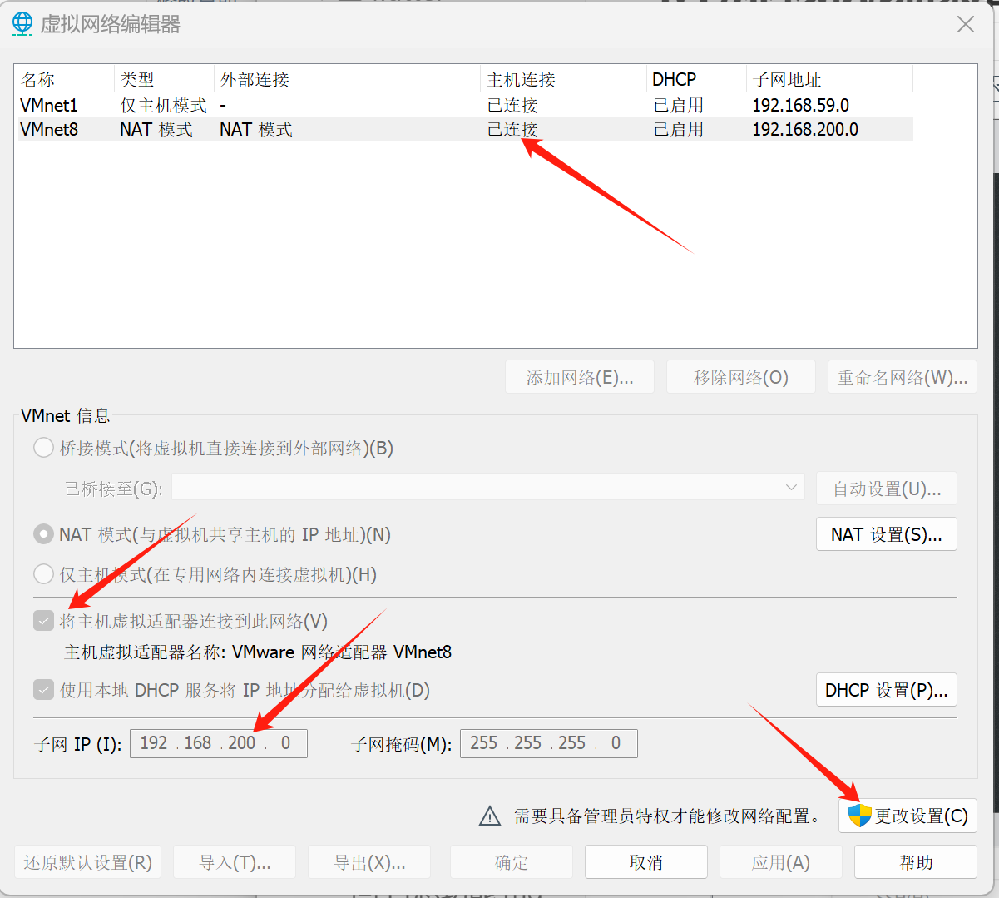

4. 指定系统的网络为刚才设置的网络（NAT）。

5. 修改虚拟机的网络模式为NAT

​	

6. 启动虚拟机，**用户名：root  密码：itcast**，当前虚拟机的ip已手动固定（静态IP), 地址为：**192.168.200.130**
7. 使用FinalShell客户端链接

​	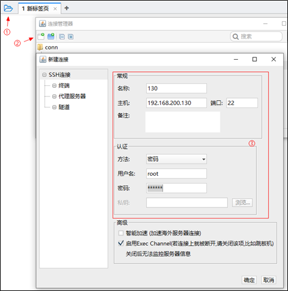

## Nacos环境搭建

Nacos 是一个开源的动态服务发现、配置管理和服务管理平台，由阿里巴巴开源。Nacos 是 "Dynamic Naming and Configuration Service" 的缩写，它为微服务架构提供了关键的基础设施支持。

Nacos 的主要功能包括：

1. **服务发现和服务健康监测**：
   - Nacos 可以帮助服务在注册中心进行注册和发现。服务实例可以通过 Nacos 注册自己，并且其他服务可以通过 Nacos 查找这些服务实例。
   - Nacos 提供了服务健康检查机制，确保服务实例的可用性。

2. **动态配置管理**：
   - Nacos 提供集中化的配置管理功能，允许开发者在一个地方管理所有的配置项。配置的变更可以实时推送到应用程序中。
   - 支持配置的版本管理和灰度发布，方便进行配置的管理和控制。

3. **动态 DNS 服务**：
   - Nacos 提供 DNS 服务，可以将服务发现和 DNS 解析结合起来，方便服务的调用。

4. **服务管理**：
   - 提供服务的元数据管理、流量管理、熔断降级等功能，帮助提升系统的稳定性和可靠性。

Nacos 支持多种服务发现协议（如 HTTP、gRPC、Dubbo 等）和多种配置格式（如 YAML、Properties、JSON 等），并且可以与 Spring Cloud、Kubernetes 等生态系统集成。

**Nacos 的典型应用场景包括微服务架构中的服务注册与发现、配置管理，以及分布式系统中的服务治理。**

Nacos通常安装在Linux服务器上。Linux可以安装在本地电脑的虚拟机上。

Nacos作用

- 作为注册中心
- 作为配置中心

### Nacos安装

1、docker拉取镜像 

```shell
docker pull nacos/nacos-server:1.2.0
```

查看所有镜像

```shell
docker images
```

2、创建容器

针对nacos镜像创建容器

```shell
docker run --env MODE=standalone --name nacos --restart=always  -d -p 8848:8848 nacos/nacos-server:1.2.0
```

- docker run 启动容器
- MODE=standalone 单机版
- --restart=always 开机启动
- -p 8848:8848  映射端口
- -d 创建一个守护式容器在后台运行

```sh
docker ps
```

3、访问nacos地址：http://192.168.200.130:8848/nacos 

## 初始工程搭建

### 环境准备

项目依赖环境

- JDK1.8
- Intellij Idea
- maven-3.6.1

IDEA开发工具配置

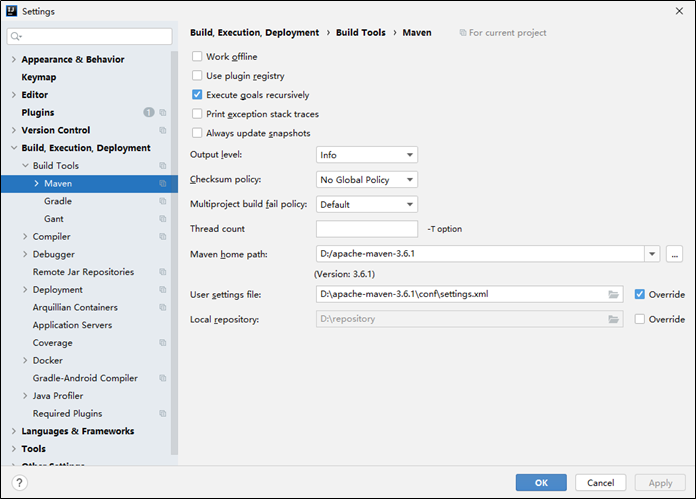

设置本地仓库，建议使用资料中提供好的仓库

设置项目编码格式

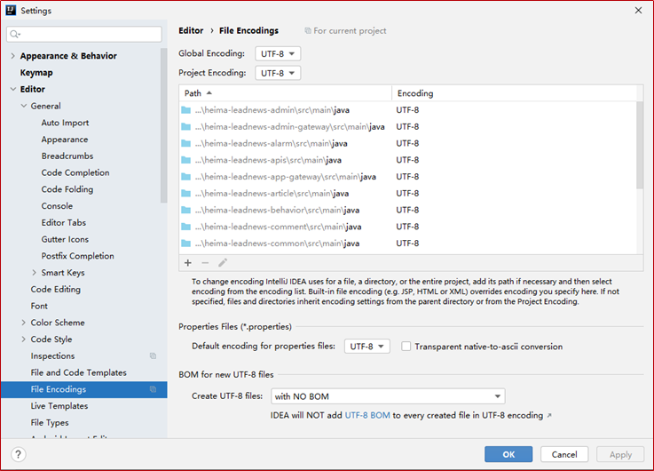

## 工程主体结构

- heima-leadnews：父工程，统一管理项目依赖，继承springboot
  - heima-leadnews-common：一些通用的配置（例如：全局异常）
  - heima-leadnews-feign-api：feign对外的接口
  - heima-leadnews-model：pojo、dto实体类
  - heima-leadnews-utils：通用的工具类
  - heima-leadnews-gateway：管理网关微服务工程
    - heima-leadnews-admin-gateway
    - heima-leadnews-wemedia-gateway
    - heima-leadnews-app-gateway
  - heima-leadnews-service：管理所有微服务工程
    - 项目会创建很多的微服务，统一管理微服务
  - heima-leadnews-test：一些测试案例

### 全局异常

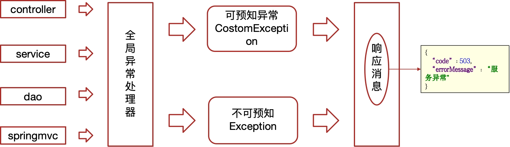

可预知异常：程序员抛出的异常

不可预知异常：系统异常，500、404、空指针等。

## heima-leadnews-gateway

右键AppGatewayApplication.java启动某一个网关。

## heima-leadnews-service

每一个微服务都有一个UserApplication引导类，左键引导类debug启动工程。

## heima-leadnews-model

### AppHttpCodeEnum

AppHttpCodeEnum.java里面给code和errorMessage赋值。一般结合ResponseResult使用。

### ResponseResult

ResponseResult是接口开发统一的返回，开发规范，可以表示所有接口返回的规范。

```java
package com.heima.model.common.dtos;

import com.alibaba.fastjson.JSON;
import com.heima.model.common.enums.AppHttpCodeEnum;

import java.io.Serializable;
import java.util.ArrayList;
import java.util.List;

/**
 * 通用的结果返回类
 *
 * @param <T>
 */
public class ResponseResult<T> implements Serializable {

    private String host;

    private Integer code;

    private String errorMessage;
	//一个是对象，多个是列表
    private T data;

    public ResponseResult() {
        this.code = 200;
    }

    public ResponseResult(Integer code, T data) {
        this.code = code;
        this.data = data;
    }

    public ResponseResult(Integer code, String msg, T data) {
        this.code = code;
        this.errorMessage = msg;
        this.data = data;
    }

    public ResponseResult(Integer code, String msg) {
        this.code = code;
        this.errorMessage = msg;
    }

    public static ResponseResult errorResult(int code, String msg) {
        ResponseResult result = new ResponseResult();
        return result.error(code, msg);
    }

    public static ResponseResult okResult(int code, String msg) {
        ResponseResult result = new ResponseResult();
        return result.ok(code, null, msg);
    }

    public static ResponseResult okResult(Object data) {
        ResponseResult result = setAppHttpCodeEnum(AppHttpCodeEnum.SUCCESS, AppHttpCodeEnum.SUCCESS.getErrorMessage());
        if (data != null) {
            result.setData(data);
        }
        return result;
    }

    public static ResponseResult errorResult(AppHttpCodeEnum enums) {
        return setAppHttpCodeEnum(enums, enums.getErrorMessage());
    }

    public static ResponseResult errorResult(AppHttpCodeEnum enums, String errorMessage) {
        return setAppHttpCodeEnum(enums, errorMessage);
    }

    public static ResponseResult setAppHttpCodeEnum(AppHttpCodeEnum enums) {
        return okResult(enums.getCode(), enums.getErrorMessage());
    }

    private static ResponseResult setAppHttpCodeEnum(AppHttpCodeEnum enums, String errorMessage) {
        return okResult(enums.getCode(), errorMessage);
    }

    public ResponseResult<?> error(Integer code, String msg) {
        this.code = code;
        this.errorMessage = msg;
        return this;
    }

    public ResponseResult<?> ok(Integer code, T data) {
        this.code = code;
        this.data = data;
        return this;
    }

    public ResponseResult<?> ok(Integer code, T data, String msg) {
        this.code = code;
        this.data = data;
        this.errorMessage = msg;
        return this;
    }

    public ResponseResult<?> ok(T data) {
        this.data = data;
        return this;
    }

    public Integer getCode() {
        return code;
    }

    public void setCode(Integer code) {
        this.code = code;
    }

    public String getErrorMessage() {
        return errorMessage;
    }

    public void setErrorMessage(String errorMessage) {
        this.errorMessage = errorMessage;
    }

    public T getData() {
        return data;
    }

    public void setData(T data) {
        this.data = data;
    }

    public String getHost() {
        return host;
    }

    public void setHost(String host) {
        this.host = host;
    }

    public static void main(String[] args) {
        //前置
        /*AppHttpCodeEnum success = AppHttpCodeEnum.SUCCESS;
        System.out.println(success.getCode());
        System.out.println(success.getErrorMessage());*/

        //查询一个对象
        /*Map map = new HashMap();
        map.put("name","zhangsan");
        map.put("age",18);
        ResponseResult result = ResponseResult.okResult(map);
        System.out.println(JSON.toJSONString(result));*/

        //新增，修改，删除  在项目中统一返回成功即可
        /*ResponseResult result = ResponseResult.okResult(AppHttpCodeEnum.SUCCESS);
        System.out.println(JSON.toJSONString(result));*/

        //根据不用的业务返回不同的提示信息  比如：当前操作需要登录、参数错误
        /*ResponseResult result = ResponseResult.errorResult(AppHttpCodeEnum.NEED_LOGIN,"自定义提示信息");
        System.out.println(JSON.toJSONString(result));*/

        //查询分页信息
        PageResponseResult responseResult = new PageResponseResult(1, 5, 50);
        List list = new ArrayList();
        list.add("itcast");
        list.add("itheima");
        responseResult.setData(list);
        System.out.println(JSON.toJSONString(responseResult));

    }

}
```

失败1

```java
{
    "host": null,
    "code": 2,
    "errorMessage": "密码错误",
    "data": null
}
```

失败2

```java
{
    "host": null,
    "code": 1002,
    "errorMessage": "用户不存在",
    "data": null
}
```

成功

```java
{
    "host": null,
    "code": 200,
    "errorMessage": "操作成功",
    "data": {
        "user": {
            "id": 4,
            "name": "admin",
            "phone": "13511223456"
        },
        "token": "eyJhbGciOiJIUzUxMiIsInppcCI6IkdaSVAifQ.H4sIAAAAAAAAAC2L0QrDIAwA_yXPFaqxavs3SQ3MQkGIhY2xf28Ke7vjuC8co8EGKLjvdanOoxQXQ57dmhkdcw6ccSGqESZoNGDzyZc5leRxAr3Ybv3okPPpqqYvaSeZ0VXNqHdjeff_mUN4zmYt_m786DRJgAAAAA.RcSqR7Ii6sNkB-OUSTu6-BgMO5qw5Xu2pVq9s1L2CVe727goJZjp0PdaFUEbWavGu3JhZg-plTuIOGRzZcEVnw"
    }
}
```

#### PageResponseResult

PageResponseResult继承了ResponseResult。

```java
package com.heima.model.common.dtos;

import java.io.Serializable;

public class PageResponseResult extends ResponseResult implements Serializable {
    private Integer currentPage;
    private Integer size;
    private Integer total;

    public PageResponseResult(Integer currentPage, Integer size, Integer total) {
        this.currentPage = currentPage;
        this.size = size;
        this.total = total;
    }

    public PageResponseResult() {

    }


    public int getCurrentPage() {
        return currentPage;
    }

    public void setCurrentPage(int currentPage) {
        this.currentPage = currentPage;
    }

    public int getSize() {
        return size;
    }

    public void setSize(int size) {
        this.size = size;
    }

    public int getTotal() {
        return total;
    }

    public void setTotal(int total) {
        this.total = total;
    }
}
```

## 登录

### 需求分析

- 用户登录后，用户权限较大，可以查看，也可以操作（点赞，关注，评论）

- 用户不登录，游客只有查看的权限

### 表结构分析

关于app端用户相关的内容较多，可以单独设置一个库`leadnews_user`。

|    **表名称**    |     **说明**      |
| :--------------: | :---------------: |
|     ap_user      |   APP用户信息表   |
|   ap_user_fan    | APP用户粉丝信息表 |
|  ap_user_follow  | APP用户关注信息表 |
| ap_user_realname | APP实名认证信息表 |

从当前资料中找到对应数据库并导入到mysql中

登录需要用到的是ap_user表，表结构如下：

```sql
DROP TABLE IF EXISTS `ap_user`;
CREATE TABLE `ap_user` (
  `id` int(11) unsigned NOT NULL AUTO_INCREMENT COMMENT '主键',
  `salt` varchar(32) COLLATE utf8mb4_unicode_ci DEFAULT NULL COMMENT '密码、通信等加密盐',
  `name` varchar(20) COLLATE utf8mb4_unicode_ci DEFAULT NULL COMMENT '用户名',
  `password` varchar(32) COLLATE utf8mb4_unicode_ci DEFAULT NULL COMMENT '密码,md5加密',
  `phone` varchar(11) COLLATE utf8mb4_unicode_ci DEFAULT NULL COMMENT '手机号',
  `image` varchar(255) COLLATE utf8mb4_unicode_ci DEFAULT NULL COMMENT '头像',
  `sex` tinyint(1) unsigned DEFAULT NULL COMMENT '0 男\r\n 1 女\r\n 2 未知',
  `is_certification` tinyint(1) unsigned DEFAULT NULL COMMENT '0 未\r\n 1 是',
  `is_identity_authentication` tinyint(1) DEFAULT NULL COMMENT '是否身份认证',
  `status` tinyint(1) unsigned DEFAULT NULL COMMENT '0正常\r\n 1锁定',
  `flag` tinyint(1) unsigned DEFAULT NULL COMMENT '0 普通用户\r\n 1 自媒体人\r\n 2 大V',
  `created_time` datetime DEFAULT NULL COMMENT '注册时间',
  PRIMARY KEY (`id`) USING BTREE
) ENGINE=InnoDB AUTO_INCREMENT=7 DEFAULT CHARSET=utf8mb4 COLLATE=utf8mb4_unicode_ci ROW_FORMAT=DYNAMIC COMMENT='APP用户信息表';
```

**注意事项：**

> tinyint类型：占1个字节，不指定unsigned(非负数)，值范围(-128,127)，指定了unsigned，值范围(0,255)
>
> tinyint通常表示小范围的数值，或者表示true或false，通常值为0表示false,值为1表示true

项目中的持久层使用的mybatis-plus，一般都使用mybais-plus逆向生成对应的实体类

app_user表对应的实体类如下：

```java
package com.heima.model.user.pojos;

import com.baomidou.mybatisplus.annotation.IdType;
import com.baomidou.mybatisplus.annotation.TableField;
import com.baomidou.mybatisplus.annotation.TableId;
import com.baomidou.mybatisplus.annotation.TableName;
import lombok.Data;

import java.io.Serializable;
import java.util.Date;

/**
 * <p>
 * APP用户信息表
 * </p>
 *
 * @author itheima
 */
@Data
@TableName("ap_user")
public class ApUser implements Serializable {

    private static final long serialVersionUID = 1L;

    /**
     * 主键
     */
    @TableId(value = "id", type = IdType.AUTO)
    private Integer id;

    /**
     * 密码、通信等加密盐
     */
    @TableField("salt")
    private String salt;

    /**
     * 用户名
     */
    @TableField("name")
    private String name;

    /**
     * 密码,md5加密
     */
    @TableField("password")
    private String password;

    /**
     * 手机号
     */
    @TableField("phone")
    private String phone;

    /**
     * 头像
     */
    @TableField("image")
    private String image;

    /**
     * 0 男
       1 女
       2 未知
     */
    @TableField("sex")
    private Boolean sex;

    /**
     * 0 未
       1 是
     */
    @TableField("is_certification")
    private Boolean certification;

    /**
     * 是否身份认证
     */
    @TableField("is_identity_authentication")
    private Boolean identityAuthentication;

    /**
     * 0正常
       1锁定
     */
    @TableField("status")
    private Boolean status;

    /**
     * 0 普通用户
       1 自媒体人
       2 大V
     */
    @TableField("flag")
    private Short flag;

    /**
     * 注册时间
     */
    @TableField("created_time")
    private Date createdTime;

}
```

### 手动加密（md5+随机字符串）

md5是不可逆加密，md5相同的密码每次加密都一样，不太安全。在md5的基础上手动加盐（salt）处理

#### 注册->生成盐

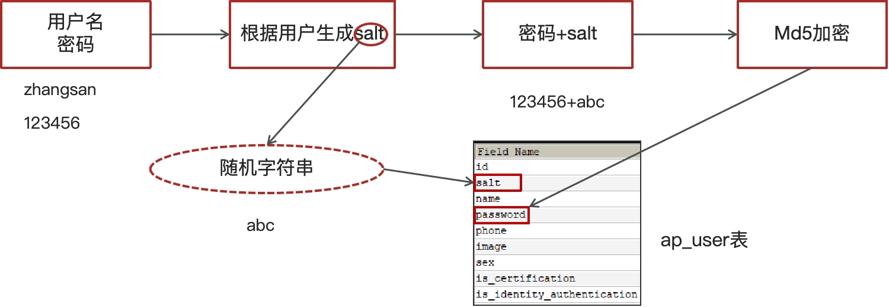

#### 登录->使用盐来配合验证

手动加密（md5+随机字符串）

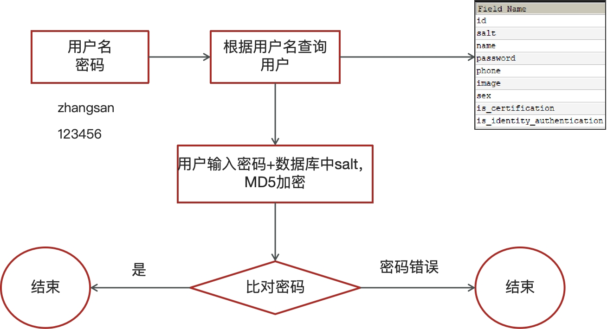

### **用户端微服务搭建**

#### heima-leadnews-service依赖说明

```xml
<?xml version="1.0" encoding="UTF-8"?>
<project xmlns="http://maven.apache.org/POM/4.0.0"
         xmlns:xsi="http://www.w3.org/2001/XMLSchema-instance"
         xsi:schemaLocation="http://maven.apache.org/POM/4.0.0 http://maven.apache.org/xsd/maven-4.0.0.xsd">
    <parent>
        <artifactId>heima-leadnews</artifactId>
        <groupId>com.heima</groupId>
        <version>1.0-SNAPSHOT</version>
    </parent>
    <modelVersion>4.0.0</modelVersion>

    <artifactId>heima-leadnews-service</artifactId>
    <packaging>pom</packaging>
    <modules>
        <module>heima-leadnews-user</module>
    </modules>

    <properties>
        <maven.compiler.source>8</maven.compiler.source>
        <maven.compiler.target>8</maven.compiler.target>
    </properties>

    <dependencies>
        <!-- 引入依赖模块 -->
        <!-- 存放实体类和dto-->
        <dependency>
            <groupId>com.heima</groupId>
            <artifactId>heima-leadnews-model</artifactId>
        </dependency>
        <!-- 通用的配置-->
        <dependency>
            <groupId>com.heima</groupId>
            <artifactId>heima-leadnews-common</artifactId>
        </dependency>
        <!-- feign对外统一接口-->
        <dependency>
            <groupId>com.heima</groupId>
            <artifactId>heima-leadnews-feign-api</artifactId>
        </dependency>
        <!-- Spring boot starter -->
        <!-- web-starter-->
        <dependency>
            <groupId>org.springframework.boot</groupId>
            <artifactId>spring-boot-starter-web</artifactId>
        </dependency>
        <dependency>
            <groupId>org.springframework.boot</groupId>
            <artifactId>spring-boot-starter-test</artifactId>
            <scope>test</scope>
        </dependency>

        <!-- nacos注册中心和配置中心-->
        <dependency>
            <groupId>com.alibaba.cloud</groupId>
            <artifactId>spring-cloud-starter-alibaba-nacos-discovery</artifactId>
        </dependency>
        <dependency>
            <groupId>com.alibaba.cloud</groupId>
            <artifactId>spring-cloud-starter-alibaba-nacos-config</artifactId>
        </dependency>
    </dependencies>

</project>
```

在heima-leadnews-service下创建Module工程heima-leadnews-user用户微服务。

所有的微服务都是下面这个结构：

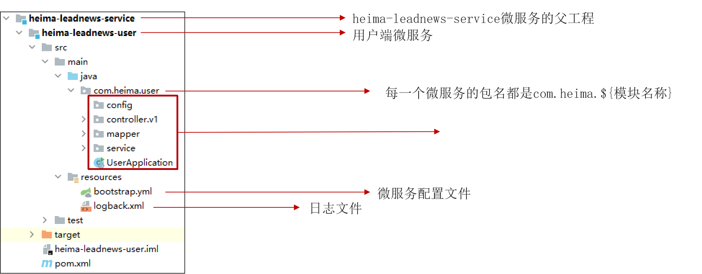

引导类

```java
package com.heima.user;

import org.mybatis.spring.annotation.MapperScan;
import org.springframework.boot.SpringApplication;
import org.springframework.boot.autoconfigure.SpringBootApplication;
import org.springframework.cloud.client.discovery.EnableDiscoveryClient;

@SpringBootApplication
@EnableDiscoveryClient
@MapperScan("com.heima.user.mapper")
public class UserApplication {

    public static void main(String[] args) {
        SpringApplication.run(UserApplication.class,args);
    }
}
```

bootstrap.yml

```yaml
server:
  port: 51801
spring:
  application:
    name: leadnews-user
  cloud:
    nacos:
      discovery:
        server-addr: 192.168.200.130:8848
      config:
        server-addr: 192.168.200.130:8848
        file-extension: yml
```

在nacos中创建配置文件

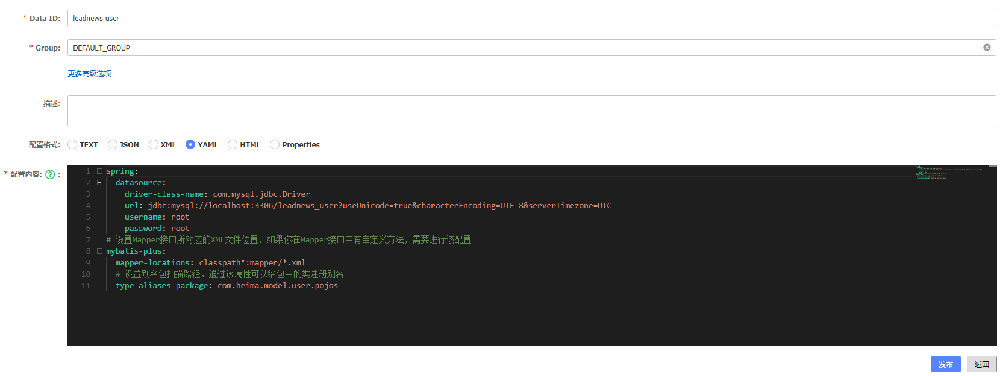

```yaml
spring:
	#mysql驱动
  datasource:
    driver-class-name: com.mysql.jdbc.Driver
    url: jdbc:mysql://localhost:3306/leadnews_user?useUnicode=true&characterEncoding=UTF-8&serverTimezone=UTC
    username: root
    password: root
# 设置Mapper接口所对应的XML文件位置，如果你在Mapper接口中有自定义方法，需要进行该配置
mybatis-plus:
  mapper-locations: classpath*:mapper/*.xml
  # 设置别名包扫描路径，通过该属性可以给包中的类注册别名
  type-aliases-package: com.heima.model.user.pojos
```

logback.xml

```xml
<?xml version="1.0" encoding="UTF-8"?>

<configuration>
    <!--定义日志文件的存储地址,使用绝对路径-->
    <property name="LOG_HOME" value="e:/logs"/>

    <!-- Console 输出设置 -->
    <appender name="CONSOLE" class="ch.qos.logback.core.ConsoleAppender">
        <encoder>
            <!--格式化输出：%d表示日期，%thread表示线程名，%-5level：级别从左显示5个字符宽度%msg：日志消息，%n是换行符-->
            <pattern>%d{yyyy-MM-dd HH:mm:ss.SSS} [%thread] %-5level %logger{36} - %msg%n</pattern>
            <charset>utf8</charset>
        </encoder>
    </appender>

    <!-- 按照每天生成日志文件 -->
    <appender name="FILE" class="ch.qos.logback.core.rolling.RollingFileAppender">
        <rollingPolicy class="ch.qos.logback.core.rolling.TimeBasedRollingPolicy">
            <!--日志文件输出的文件名-->
            <fileNamePattern>${LOG_HOME}/leadnews.%d{yyyy-MM-dd}.log</fileNamePattern>
        </rollingPolicy>
        <encoder>
            <pattern>%d{yyyy-MM-dd HH:mm:ss.SSS} [%thread] %-5level %logger{36} - %msg%n</pattern>
        </encoder>
    </appender>

    <!-- 异步输出 -->
    <appender name="ASYNC" class="ch.qos.logback.classic.AsyncAppender">
        <!-- 不丢失日志.默认的,如果队列的80%已满,则会丢弃TRACT、DEBUG、INFO级别的日志 -->
        <discardingThreshold>0</discardingThreshold>
        <!-- 更改默认的队列的深度,该值会影响性能.默认值为256 -->
        <queueSize>512</queueSize>
        <!-- 添加附加的appender,最多只能添加一个 -->
        <appender-ref ref="FILE"/>
    </appender>


    <logger name="org.apache.ibatis.cache.decorators.LoggingCache" level="DEBUG" additivity="false">
        <appender-ref ref="CONSOLE"/>
    </logger>
    <logger name="org.springframework.boot" level="debug"/>
    <root level="info">
        <!--<appender-ref ref="ASYNC"/>-->
        <appender-ref ref="FILE"/>
        <appender-ref ref="CONSOLE"/>
    </root>
</configuration>
```

### 登录功能实现

#### 1、接口定义

接口路径：/api/v1/login/login_auth

```java
@RestController
@RequestMapping("/api/v1/login")//接口路径
public class ApUserLoginController {

    @PostMapping("/login_auth")//接口路径，请求方式POST
    public ResponseResult login(@RequestBody LoginDto dto) {//参数：LoginDto，响应结果：ResponseResult
        return null;
    }
}
```

LoginDto里面包含phone手机号和password密码

```java
@Data
public class LoginDto  {
    /**
    * 手机号
    */
    private String phone;
    /**
    * 密码
    */
    private String password;
}
```

#### 2、持久层mapper

```java
package com.heima.user.mapper;

import com.baomidou.mybatisplus.core.mapper.BaseMapper;
import com.heima.model.user.pojos.ApUser;
import org.apache.ibatis.annotations.Mapper;

@Mapper
public interface ApUserMapper extends BaseMapper<ApUser> {
}
```

#### 3、业务层service

```java
package com.heima.user.service;

import com.baomidou.mybatisplus.extension.service.IService;
import com.heima.model.common.dtos.ResponseResult;
import com.heima.model.user.dtos.LoginDto;
import com.heima.model.user.pojos.ApUser;

public interface ApUserService extends IService<ApUser>{

    /**
     * app端登录
     * @param dto
     * @return
     */
    public ResponseResult login(LoginDto dto);
    
}
```

#### 3.1、实现类

#### 思路分析


- 用户输入了用户名和密码进行登录，校验成功后返回jwt（**基于当前用户的id生成**）
- 用户游客登录，生成jwt返回（**基于默认值0生成**）

```java
package com.heima.user.service.impl;

import com.baomidou.mybatisplus.core.toolkit.Wrappers;
import com.baomidou.mybatisplus.extension.service.impl.ServiceImpl;
import com.heima.model.common.dtos.ResponseResult;
import com.heima.model.common.enums.AppHttpCodeEnum;
import com.heima.model.user.dtos.LoginDto;
import com.heima.model.user.pojos.ApUser;
import com.heima.user.mapper.ApUserMapper;
import com.heima.user.service.ApUserService;
import com.heima.utils.common.AppJwtUtil;
import lombok.extern.slf4j.Slf4j;
import org.apache.commons.lang3.StringUtils;
import org.springframework.stereotype.Service;
import org.springframework.transaction.annotation.Transactional;
import org.springframework.util.DigestUtils;

import java.util.HashMap;
import java.util.Map;


@Service//注解
@Transactional//事务
@Slf4j//打印日志
public class ApUserServiceImpl extends ServiceImpl<ApUserMapper, ApUser> implements ApUserService {
    /**
     * app端登录功能
     *
     * @param dto
     * @return
     */
    @Override
    public ResponseResult login(LoginDto dto) {
        //1.正常登录 用户名和密码都不为空
        if (StringUtils.isNotBlank(dto.getPhone()) && StringUtils.isNotBlank(dto.getPassword())) {
            //1.1 根据手机号查询用户信息
            ApUser dbUser = getOne(Wrappers.<ApUser>lambdaQuery().eq(ApUser::getPhone, dto.getPhone()));
            if (dbUser == null) {
                return ResponseResult.errorResult(AppHttpCodeEnum.DATA_NOT_EXIST, "用户信息不存在");
            }
            //1.2 比对密码
            String salt = dbUser.getSalt();//从数据库中获取盐
            String password = dto.getPassword();//前端传过来的密码
            String pswd = DigestUtils.md5DigestAsHex((password + salt).getBytes());
            if (!pswd.equals(dbUser.getPassword())) {//是否和数据库中的密码一样
                return ResponseResult.errorResult(AppHttpCodeEnum.LOGIN_PASSWORD_ERROR);
            }
            //1.3 返回数据  jwt（token）  user
            //AppJwtUtil是项目中写的工具类，getToken是AppJwtUtil的静态方法
            String token = AppJwtUtil.getToken(dbUser.getId().longValue());
            Map<String, Object> map = new HashMap<>();
            map.put("token", token);
            dbUser.setSalt("");//盐不需要返回给前端
            dbUser.setPassword("");//密码不返回给前端
            map.put("user", dbUser);
            return ResponseResult.okResult(map);
        } else {
            //2.游客登录
            Map<String, Object> map = new HashMap<>();
            map.put("token", AppJwtUtil.getToken(0L));
            return ResponseResult.okResult(map);
        }
    }
}
```

#### 4、控制层controller

```java
package com.heima.user.controller.v1;

import com.heima.model.common.dtos.ResponseResult;
import com.heima.model.user.dtos.LoginDto;
import com.heima.user.service.ApUserService;
import org.springframework.beans.factory.annotation.Autowired;
import org.springframework.web.bind.annotation.PostMapping;
import org.springframework.web.bind.annotation.RequestBody;
import org.springframework.web.bind.annotation.RequestMapping;
import org.springframework.web.bind.annotation.RestController;

@RestController
@RequestMapping("/api/v1/login")
public class ApUserLoginController {

    //注入service
    @Autowired
    private ApUserService apUserService;

    @PostMapping("/login_auth")
    public ResponseResult login(@RequestBody LoginDto dto) {
        return apUserService.login(dto);
    }
}
```

## 接口测试工具

### postman

Postman是一款功能强大的网页调试与发送网页HTTP请求的Chrome插件。

官方网址：https://www.postman.com/

### swagger

Swagger 是一个规范和完整的框架，用于生成、描述、调用和可视化 RESTful 风格的 Web 服务(<https://swagger.io/>)。 它的主要作用是：

1. 使得前后端分离开发更加方便，有利于团队协作

2. 接口的文档**在线**自动生成，降低后端开发人员编写接口文档的负担

3. 功能测试 

   Spring已经将Swagger纳入自身的标准，建立了Spring-swagger项目，现在叫Springfox。通过在项目中引入Springfox ，即可非常简单快捷的使用Swagger。

#### SpringBoot集成Swagger

- 引入依赖,在heima-leadnews-model和heima-leadnews-common模块中引入该依赖

  heima-leadnews-common：所有的微服务会引用common
  
  heima-leadnews-model：参数的描述
  
  ```xml
  <dependency>
      <groupId>io.springfox</groupId>
      <artifactId>springfox-swagger2</artifactId>
  </dependency>
  <dependency>
      <groupId>io.springfox</groupId>
      <artifactId>springfox-swagger-ui</artifactId>
  </dependency>
  ```

只需要在heima-leadnews-common中进行配置即可，因为其他微服务工程都直接或间接依赖即可。

- 在heima-leadnews-common工程中添加一个配置类

新增：com.heima.common.swagger.SwaggerConfiguration

```java
package com.heima.common.swagger;

import org.springframework.context.annotation.Bean;
import org.springframework.context.annotation.Configuration;
import springfox.documentation.builders.ApiInfoBuilder;
import springfox.documentation.builders.PathSelectors;
import springfox.documentation.builders.RequestHandlerSelectors;
import springfox.documentation.service.ApiInfo;
import springfox.documentation.service.Contact;
import springfox.documentation.spi.DocumentationType;
import springfox.documentation.spring.web.plugins.Docket;
import springfox.documentation.swagger2.annotations.EnableSwagger2;

@Configuration
@EnableSwagger2
public class SwaggerConfiguration {

   @Bean
   public Docket buildDocket() {
      return new Docket(DocumentationType.SWAGGER_2)
              .apiInfo(buildApiInfo())
              .select()
              // 要扫描的API(Controller)基础包
              .apis(RequestHandlerSelectors.basePackage("com.heima"))
              .paths(PathSelectors.any())
              .build();
   }

   private ApiInfo buildApiInfo() {
      Contact contact = new Contact("黑马程序员","","");
      return new ApiInfoBuilder()
              .title("黑马头条-平台管理API文档")
              .description("黑马头条后台api")
              .contact(contact)
              .version("1.0.0").build();
   }
}
```

在heima-leadnews-common模块中的resources目录中新增以下目录和文件

文件：resources/META-INF/Spring.factories

```java
org.springframework.boot.autoconfigure.EnableAutoConfiguration=\
  com.heima.common.swagger.SwaggerConfiguration
```

#### Swagger常用注解

在Java类中添加Swagger的注解即可生成Swagger接口文档，常用Swagger注解如下：

@Api：修饰整个类，描述Controller的作用  

@ApiOperation：描述一个类的一个方法，或者说一个接口  

@ApiParam：单个参数的描述信息  

@ApiModel：用对象来接收参数  

@ApiModelProperty：用对象接收参数时，描述对象的一个字段  

@ApiResponse：HTTP响应其中1个描述  

@ApiResponses：HTTP响应整体描述  

@ApiIgnore：使用该注解忽略这个API  

@ApiError ：发生错误返回的信息  

@ApiImplicitParam：一个请求参数  

@ApiImplicitParams：多个请求参数的描述信息

---

 @ApiImplicitParam属性：

| 属性         | 取值   | 作用                                          |
| ------------ | ------ | --------------------------------------------- |
| paramType    |        | 查询参数类型                                  |
|              | path   | 以地址的形式提交数据                          |
|              | query  | 直接跟参数完成自动映射赋值                    |
|              | body   | 以流的形式提交 仅支持POST                     |
|              | header | 参数在request headers 里边提交                |
|              | form   | 以form表单的形式提交 仅支持POST               |
| dataType     |        | 参数的数据类型 只作为标志说明，并没有实际验证 |
|              | Long   |                                               |
|              | String |                                               |
| name         |        | 接收参数名                                    |
| value        |        | 接收参数的意义描述                            |
| required     |        | 参数是否必填                                  |
|              | true   | 必填                                          |
|              | false  | 非必填                                        |
| defaultValue |        | 默认值                                        |

我们在ApUserLoginController中添加Swagger注解，代码如下所示：

> @Api(value = "app端用户登录", tags = "ap_user", description = "app端用户登录API")//在类上面描述
> @ApiOperation("用户登录")//在某一个方法上面描述

```java
@RestController
@RequestMapping("/api/v1/login")
@Api(value = "app端用户登录", tags = "ap_user", description = "app端用户登录API")
public class ApUserLoginController {

    @Autowired
    private ApUserService apUserService;

    @PostMapping("/login_auth")
    @ApiOperation("用户登录")
    public ResponseResult login(@RequestBody LoginDto dto){
        return apUserService.login(dto);
    }
}
```

LoginDto

参数的注解` @ApiModelProperty`

```java
@Data
public class LoginDto {

    /**
     * 手机号
     */
    @ApiModelProperty(value="手机号",required = true)
    private String phone;

    /**
     * 密码
     */
    @ApiModelProperty(value="密码",required = true)
    private String password;
}
```

启动user微服务，访问地址：http://localhost:51801/swagger-ui.html

### knife4j

knife4j是为Java MVC框架集成Swagger生成Api文档的增强解决方案，前身是swagger-bootstrap-ui，取名kni4j是希望它能像一把匕首一样小巧，轻量，并且功能强悍！

gitee地址：https://gitee.com/xiaoym/knife4j

官方文档：https://doc.xiaominfo.com/

效果演示：http://knife4j.xiaominfo.com/doc.html

#### 核心功能

该UI增强包主要包括两大核心功能：文档说明 和 在线调试

- 文档说明：根据Swagger的规范说明，详细列出接口文档的说明，包括接口地址、类型、请求示例、请求参数、响应示例、响应参数、响应码等信息，使用swagger-bootstrap-ui能根据该文档说明，对该接口的使用情况一目了然。
- 在线调试：提供在线接口联调的强大功能，自动解析当前接口参数,同时包含表单验证，调用参数可返回接口响应内容、headers、Curl请求命令实例、响应时间、响应状态码等信息，帮助开发者在线调试，而不必通过其他测试工具测试接口是否正确,简介、强大。
- 个性化配置：通过个性化ui配置项，可自定义UI的相关显示信息
- 离线文档：根据标准规范，生成的在线markdown离线文档，开发者可以进行拷贝生成markdown接口文档，通过其他第三方markdown转换工具转换成html或pdf，这样也可以放弃swagger2markdown组件
- 接口排序：自1.8.5后，ui支持了接口排序功能，例如一个注册功能主要包含了多个步骤,可以根据swagger-bootstrap-ui提供的接口排序规则实现接口的排序，step化接口操作，方便其他开发者进行接口对接

#### 快速集成

- 在heima-leadnews-common模块中的`pom.xml`文件中引入`knife4j`的依赖,如下：

```xml
<dependency>
     <groupId>com.github.xiaoymin</groupId>
     <artifactId>knife4j-spring-boot-starter</artifactId>
</dependency>
```

- 创建Swagger配置文件

在heima-leadnews-common模块中新建配置类

新建Swagger的配置文件`SwaggerConfiguration.java`文件,创建springfox提供的Docket分组对象,代码如下：

```java
package com.heima.common.knife4j;

import com.github.xiaoymin.knife4j.spring.annotations.EnableKnife4j;
import org.springframework.context.annotation.Bean;
import org.springframework.context.annotation.Configuration;
import org.springframework.context.annotation.Import;
import springfox.bean.validators.configuration.BeanValidatorPluginsConfiguration;
import springfox.documentation.builders.ApiInfoBuilder;
import springfox.documentation.builders.PathSelectors;
import springfox.documentation.builders.RequestHandlerSelectors;
import springfox.documentation.service.ApiInfo;
import springfox.documentation.spi.DocumentationType;
import springfox.documentation.spring.web.plugins.Docket;
import springfox.documentation.swagger2.annotations.EnableSwagger2;

@Configuration
@EnableSwagger2
@EnableKnife4j
@Import(BeanValidatorPluginsConfiguration.class)
public class Swagger2Configuration {

    @Bean(value = "defaultApi2")
    public Docket defaultApi2() {
        Docket docket=new Docket(DocumentationType.SWAGGER_2)
                .apiInfo(apiInfo())
                //分组名称
                .groupName("1.0")
                .select()
                //这里指定Controller扫描包路径
                .apis(RequestHandlerSelectors.basePackage("com.heima"))
                .paths(PathSelectors.any())
                .build();
        return docket;
    }
    private ApiInfo apiInfo() {
        return new ApiInfoBuilder()
                .title("黑马头条API文档")
                .description("黑马头条API文档")
                .version("1.0")
                .build();
    }
}
```

以上有两个注解需要特别说明，如下表：

| 注解              | 说明                                                         |
| ----------------- | ------------------------------------------------------------ |
| `@EnableSwagger2` | 该注解是Springfox-swagger框架提供的使用Swagger注解，该注解必须加 |
| `@EnableKnife4j`  | 该注解是`knife4j`提供的增强注解，Ui提供了例如动态参数、参数过滤、接口排序等增强功能，如果你想使用这些增强功能就必须加该注解，否则可以不用加 |

- 添加配置

在Spring.factories中新增配置

```java
org.springframework.boot.autoconfigure.EnableAutoConfiguration=\
  com.heima.common.swagger.Swagger2Configuration, \
  com.heima.common.swagger.SwaggerConfiguration
```

- 访问

在浏览器输入地址：`http://host:port/doc.html`

## 网关

**网关概述**

一个前端请求首先会经过网关，之后再路由到一个个的微服务。

网关里面还可以做授权、限流、登录、日志的收集等。

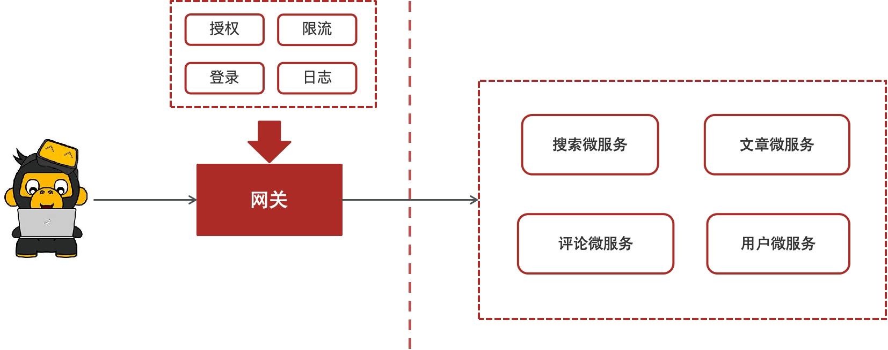

在heima-leadnews-gateway导入以下依赖

pom文件

```xml
<dependencies>
    <dependency>
        <groupId>org.springframework.cloud</groupId>
        <artifactId>spring-cloud-starter-gateway</artifactId>
    </dependency>
    <!--        nacos的注册依赖-->
    <dependency>
        <groupId>com.alibaba.cloud</groupId>
        <artifactId>spring-cloud-starter-alibaba-nacos-discovery</artifactId>
    </dependency>
    <!--        nacos配置-->
 	<dependency>
            <groupId>com.alibaba.cloud</groupId>
            <artifactId>spring-cloud-starter-alibaba-nacos-config</artifactId>
    </dependency>
    <!--        jwt解析的jar包-->
    <dependency>
        <groupId>io.jsonwebtoken</groupId>
        <artifactId>jjwt</artifactId>
    </dependency>
</dependencies>
```

在heima-leadnews-gateway下创建heima-leadnews-app-gateway微服务Module

在heima-leadnews-app-gateway|src|main|java|heima-leadnews-app-gateway包下创建引导类：

```java
package com.heima.app.gateway;

import org.springframework.boot.SpringApplication;
import org.springframework.boot.autoconfigure.SpringBootApplication;
import org.springframework.cloud.client.discovery.EnableDiscoveryClient;

@SpringBootApplication
@EnableDiscoveryClient  //开启注册中心
public class AppGatewayApplication {
    public static void main(String[] args) {
        SpringApplication.run(AppGatewayApplication.class,args);
    }
}
```

在heima-leadnews-app-gateway|src|main|java|resource中创建bootstrap.yml配置文件

```yaml
server:
  port: 51601
spring:
  application:
    name: leadnews-app-gateway
  cloud:
    nacos:
      discovery:
      	#注册中心的地址
        server-addr: 192.168.200.130:8848
      config:
        #配置中心的地址
        server-addr: 192.168.200.130:8848
        file-extension: yml
```

在nacos的配置中心创建dataid为leadnews-app-gateway的yml配置

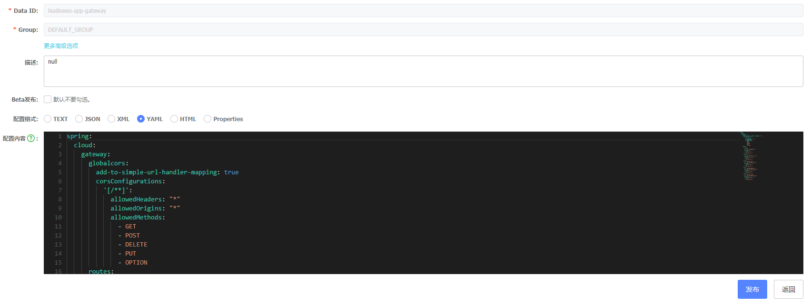

```yaml
spring:
  cloud:
    gateway:
      globalcors:
        add-to-simple-url-handler-mapping: true
        corsConfigurations:
          '[/**]': #匹配所有的请求
            allowedHeaders: "*" 
            allowedOrigins: "*" #跨域处理 允许所有的域
            allowedMethods:		#支持的方法
              - GET
              - POST
              - DELETE
              - PUT
              - OPTION
      routes:
        # 平台管理
        - id: user
          uri: lb://leadnews-user
          predicates:
            - Path=/user/**
          filters:
            - StripPrefix= 1
```

环境搭建完成以后，启动项目网关和用户两个服务，使用postman进行测试

请求地址：http://localhost:51601/user/api/v1/login/login_auth   

### 认证过滤器

**全局过滤器实现jwt校验**

校验token。


思路分析：

1. 用户进入网关开始登陆，网关过滤器进行判断，如果是登录，则路由到后台管理微服务进行登录
2. 用户登录成功，后台管理微服务签发JWT TOKEN信息返回给用户
3. 用户再次进入网关开始访问，网关过滤器接收用户携带的TOKEN 
4. 网关过滤器解析TOKEN ，判断是否有权限，如果有，则放行，如果没有则返回未认证错误

具体实现：

第一：

​	在认证过滤器中需要用到jwt的解析，所以需要把工具类拷贝一份到网关微服务

第二：

在网关微服务中新建全局过滤器：

```java
package com.heima.app.gateway.filter;


import com.heima.app.gateway.util.AppJwtUtil;
import io.jsonwebtoken.Claims;
import lombok.extern.slf4j.Slf4j;
import org.apache.commons.lang.StringUtils;
import org.springframework.cloud.gateway.filter.GatewayFilterChain;
import org.springframework.cloud.gateway.filter.GlobalFilter;
import org.springframework.core.Ordered;
import org.springframework.http.HttpStatus;
import org.springframework.http.server.reactive.ServerHttpRequest;
import org.springframework.http.server.reactive.ServerHttpResponse;
import org.springframework.stereotype.Component;
import org.springframework.web.server.ServerWebExchange;
import reactor.core.publisher.Mono;

@Component//被spring管理的注解
@Slf4j//打印日志的注解
public class AuthorizeFilter implements Ordered, GlobalFilter {//需要实现Ordered, GlobalFilter
    @Override
    public Mono<Void> filter(ServerWebExchange exchange, GatewayFilterChain chain) {
        //1.获取request和response对象
        ServerHttpRequest request = exchange.getRequest();
        ServerHttpResponse response = exchange.getResponse();

        //2.判断是否是登录
        if(request.getURI().getPath().contains("/login")){
            //放行
            return chain.filter(exchange);
        }


        //3.获取token
        String token = request.getHeaders().getFirst("token");

        //4.判断token是否存在
        if(StringUtils.isBlank(token)){//token为空
            response.setStatusCode(HttpStatus.UNAUTHORIZED);
            return response.setComplete();//结束请求
        }

        //5.判断token是否有效
        try {
            Claims claimsBody = AppJwtUtil.getClaimsBody(token);
            //是否是过期
            int result = AppJwtUtil.verifyToken(claimsBody);
            if(result == 1 || result  == 2){
                response.setStatusCode(HttpStatus.UNAUTHORIZED);
                return response.setComplete();
            }
        } catch (Exception e) {
            e.printStackTrace();//打印失败日志
            response.setStatusCode(HttpStatus.UNAUTHORIZED);
            return response.setComplete();
        }

        //6.放行
        return chain.filter(exchange);
    }

    /**
     * 优先级设置  值越小  优先级越高
     * @return
     */
    @Override
    public int getOrder() {
        return 0;
    }
}
```

测试：

启动user服务，继续访问其他微服务，会提示需要认证才能访问，这个时候需要在heads中设置设置token才能正常访问。

## 前端集成

### 前后端分离

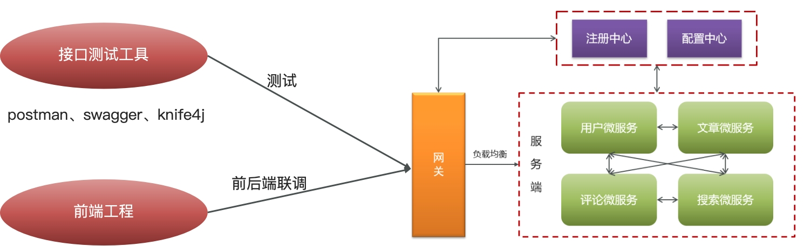

### 前端项目部署思路

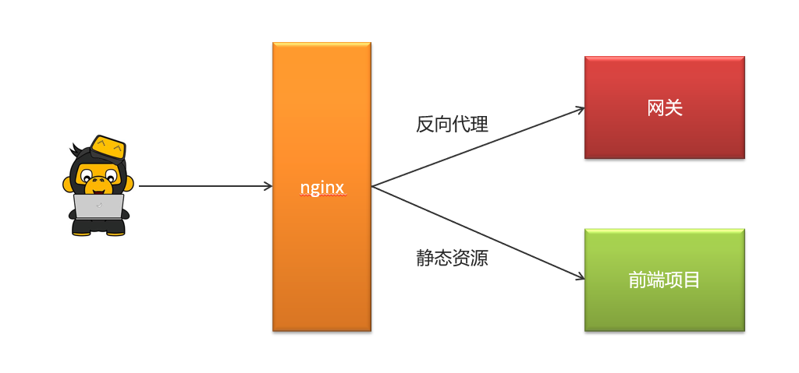

通过nginx来进行配置，功能如下

- 通过nginx的反向代理功能访问后台的网关资源，并且可以设置负载均衡。
- 通过nginx的静态服务器功能访问前端静态页面。

### 配置nginx

①：解压资料文件夹中的压缩包nginx-1.18.0.zip

在下面的地址中输入cmd回车，输入nginx，没报错就说明成功。


②：解压资料文件夹中的前端项目app-web.zip

③：配置nginx.conf文件

在nginx安装的conf目录下新建一个文件夹`leadnews.conf`,在当前文件夹中新建`heima-leadnews-app.conf`文件

heima-leadnews-app.conf配置如下：

```javascript
# 配置反向代理
upstream  heima-app-gateway{
    server localhost:51601; # 网关
}

server {
	listen 8801;
	location / {
		root C:/Users/micha/Documents/java_demo/heima-leadnews/app-web/;
		index index.html;
	}
	
	location ~/app/(.*) {
		proxy_pass http://heima-app-gateway/$1;
		proxy_set_header HOST $host;  # 不改变源请求头的值
		proxy_pass_request_body on;  #开启获取请求体
		proxy_pass_request_headers on;  #开启获取请求头
		proxy_set_header X-Real-IP $remote_addr;   # 记录真实发出请求的客户端IP
		proxy_set_header X-Forwarded-For $proxy_add_x_forwarded_for;  #记录代理信息
	}
}
```

nginx.conf   把里面注释的内容和静态资源配置相关删除，引入heima-leadnews-app.conf文件加载

```javascript

#user  nobody;
worker_processes  1;

events {
    worker_connections  1024;
}
http {
    include       mime.types;
    default_type  application/octet-stream;
    sendfile        on;
    keepalive_timeout  65;
	# 引入自定义配置文件
	include leadnews.conf/*.conf;
}
```

④ ：启动nginx

​    在nginx安装包中使用命令提示符打开，输入命令nginx启动项目

​    可查看进程，检查nginx是否启动

​	重新加载配置文件：`nginx -s reload`

⑤：打开前端项目进行测试  -- >  http://localhost:8801

​     用谷歌浏览器打开，调试移动端模式进行访问


