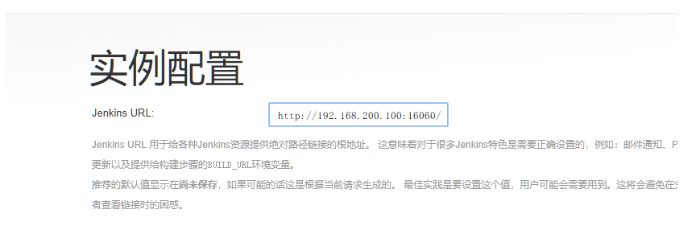
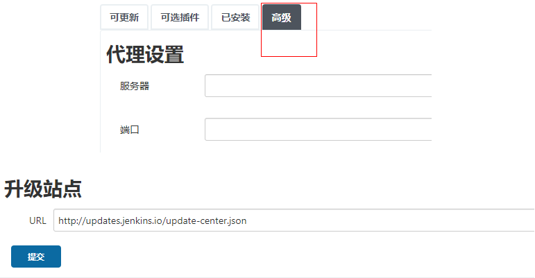
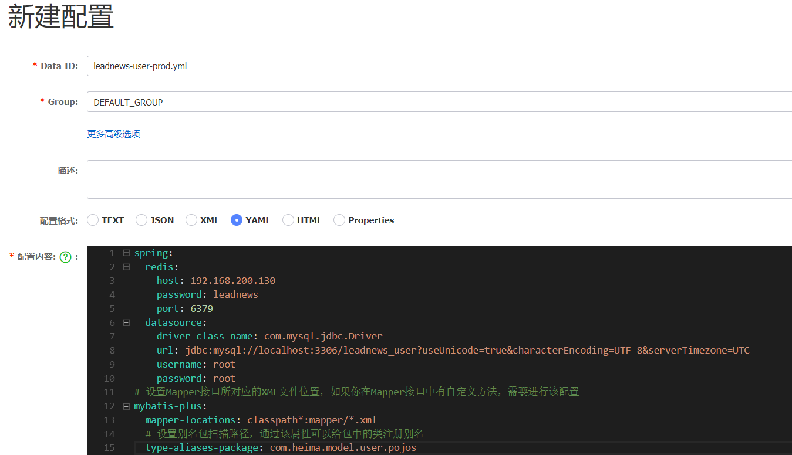

# 项目部署_持续集成

## 持续集成

持续集成（ Continuous integration ， 简称 CI ）指的是，频繁地（一天多次）将代码集成到主干


**持续集成的组成要素**

一个自动构建过程， 从检出代码、 编译构建、 运行测试、 结果记录、 测试统计等都是自动完成的， 无需人工干预。

一个代码存储库，即需要版本控制软件来保障代码的可维护性，同时作为构建过程的素材库，一般使用SVN或Git。

一个持续集成（CI）服务器， Jenkins 就是一个配置简单和使用方便的持续集成服务器。

## 持续集成的好处

1、降低风险，由于持续集成不断去构建，编译和测试，可以很早期发现问题，所以修复的代价就少；
2、对系统健康持续检查，减少发布风险带来的问题；
3、减少重复性工作；
4、持续部署，提供可部署单元包；
5、持续交付可供使用的版本；
6、增强团队信心；

## 软件开发模式

### 软件开发生命周期

软件开发生命周期又叫做SDLC（Software Development Life Cycle），它是集合了计划、开发、测试和部署过程的集合。如下 ：

- 需求分析Requirement Analysis

  这是生命周期的第一阶段，根据项目需求，团队执行一个可行性计划的分析。项目需求可能是公司内部或者客户提出的。这阶段主要是对信息的收集，也有可能是对现有项目的改善和重新做一个新的项目。还要分析项目的预算多长，可以从哪方面受益及布局，这也是项目创建的目标。

- 设计Design

  第二阶段就是设计阶段，系统架构和满意状态（就是要做成什么样子，有什么功能），和创建一个项目计划。计划可以使用图表，布局设计或者文字的方式呈现。

- 实现Implementation

  第三阶段就是实现阶段，项目经理创建和分配工作给开者，开发者根据任务和在设计阶段定义的目标进行开发代码。依据项目的大小和复杂程度，可以需要数月或更长时间才能完成。

- 测试Testing

  测试人员进行代码测试 ，包括功能测试、代码测试、压力测试等。

- 进化Evolution

  最后进阶段就是对产品不断的进化改进和维护阶段，根据用户的使用情况，可能需要对某功能进行修改，bug修复，功能增加等。

### 敏捷开发

- 什么是敏捷开发？

  敏捷开发（Agile Development） 的核心是迭代开发（Iterative Development） 与 增量开发（Incremental Development）。

- 迭代开发

  对于大型软件项目，传统的开发方式是采用一个大周期（比如一年）进行开发，整个过程就是一次"大开发"；迭代开发的方式则不一样，它将开发过程拆分成多个小周期，即一次"大开发"变成多次"小开发"，每次小开发都是同样的流程，所以看上去就好像重复在做同样的步骤。

  举例来说，SpaceX 公司想造一个大推力火箭，将人类送到火星。但是，它不是一开始就造大火箭，而是先造一个最简陋的小火箭 Falcon 1。结果，第一次发射就爆炸了，直到第四次发射，才成功进入轨道。然后，开发了中型火箭 Falcon 9，九年中发射了70次。最后，才开发 Falcon 重型火箭。如果SpaceX 不采用迭代开发，它可能直到现在还无法上天。

- 增量开发

  软件的每个版本，都会新增一个用户可以感知的完整功能。也就是说，按照新增功能来划分迭代。

  举例来说，房产公司开发一个10栋楼的小区。如果采用增量开发的模式，该公司第一个迭代就是交付一号楼，第二个迭代交付二号楼......每个迭代都是完成一栋完整的楼。而不是第一个迭代挖好10栋楼的地基，第二个迭代建好每栋楼的骨架，第三个迭代架设屋顶......

- 敏捷开发如何迭代

  虽然敏捷开发将软件开发分成多个迭代，但是也要求，每次迭代都是一个完整的软件开发周期，必须按照软件工程的方法论，进行正规的流程管理。


- 敏捷开发的好处

  - 早期交付

    敏捷开发的第一个好处，就是早期交付，从而大大降低成本。 还是以上一节的房产公司为例，如果按照传统的"瀑布开发模式"，先挖10栋楼的地基、再盖骨架、然后架设屋顶，每个阶段都等到前一个阶段完成后开始，可能需要两年才能一次性交付10栋楼。也就是说，如果不考虑预售，该项目必须等到两年后才能回款。 敏捷开发是六个月后交付一号楼，后面每两个月交付一栋楼。因此，半年就能回款10%，后面每个月都会有现金流，资金压力就大大减轻了。

  - 降低风险

    敏捷开发的第二个好处是，及时了解市场需求，降低产品不适用的风险。 请想一想，哪一种情况损失比较小：10栋楼都造好以后，才发现卖不出去，还是造好第一栋楼，就发现卖不出去，从而改进或停建后面9栋楼？

## Jenkins

Jenkins  是一款流行的开源持续集成（Continuous Integration）工具，广泛用于项目开发，具有自动化构建、测试和部署等功能。官网：  http://jenkins-ci.org/。

Jenkins的特征：

- 开源的 Java语言开发持续集成工具，支持持续集成，持续部署。
- 易于安装部署配置：可通过 yum安装，或下载war包以及通过docker容器等快速实现安装部署，可方便web界面配置管理。
- 消息通知及测试报告：集成 RSS/E-mail通过RSS发布构建结果或当构建完成时通过e-mail通知，生成JUnit/TestNG测试报告。
- 分布式构建：支持 Jenkins能够让多台计算机一起构建/测试。
- 文件识别： Jenkins能够跟踪哪次构建生成哪些jar，哪次构建使用哪个版本的jar等。
- 丰富的插件支持：支持扩展插件，你可以开发适合自己团队使用的工具，如 git，svn，maven，docker等。

Jenkins安装和持续集成环境配置


1. 首先，开发人员每天进行代码提交，提交到Git仓库。
2. 然后，Jenkins作为持续集成工具，使用Git工具到Git仓库拉取代码到集成服务器，再配合JDK，Maven等软件完成代码编译、测试、审查、打包等工作，在这个过程中每一步出错，都重新再执行一次整个流程。
3. 最后，Jenkins把生成的jar或war包分发到测试服务器或者生产服务器，测试人员或用户就可以访问应用。

### 1、Jenkins安装配置

1. 采用YUM方式安装

   加入jenkins安装源：

   ```sh
   sudo wget -O /etc/yum.repos.d/jenkins.repo https://pkg.jenkins.io/redhat-stable/jenkins.repo --no-check-certificate
   
   sudo rpm --import https://pkg.jenkins.io/redhat-stable/jenkins.io.key
   ```

   执行yum命令安装：

   ```sh
   yum -y install jenkins
   ```

2. 采用RPM安装包方式

   [Jenkins安装包下载地址](https://pkg.jenkins.io/redhat-stable/)

   ```sh
   wget https://pkg.jenkins.io/redhat-stable/jenkins-2.190.1-1.1.noarch.rpm
   ```

   执行安装：

   ```sh
   rpm -ivh jenkins-2.190.1-1.1.noarch.rpm
   ```

3. 配置：

   修改配置文件：

   ```sh
   vi /etc/sysconfig/jenkins
   ```

   修改内容：

   ```sh
   # 修改为对应的目标用户， 这里使用的是root
   $JENKINS_USER="root"
   # 服务监听端口
   JENKINS_PORT="16060"
   ```

   目录权限：

   ```sh
   chown -R root:root /var/lib/jenkins
   chown -R root:root /var/cache/jenkins
   chown -R root:root /var/log/jenkins
   ```

   重启：

   ```sh
   systemctl restart jenkins
   ```

   如果启动失败， 出现错误信息：

   ```sh
   Starting Jenkins bash: /usr/bin/java: No such file or directory
   ```

   创建JAVA环境的软链接：

   ```sh
   ln -s /usr/local/jdk/bin/java /usr/bin/java
   ```

4. 管理后台初始化设置

   http://192.168.200.100:16060/

   需要输入管理密码， 在以下位置查看：

   ```sh
   cat /var/lib/jenkins/secrets/initialAdminPassword
   ```

   

   按默认设置，把建议的插件都安装上

   

   这一步等待时间较长， 安装完成之后， 创建管理员用户：

   

配置访问地址：



配置完成之后， 会进行重启， 之后可以看到管理后台。

### 2、Jenkins插件安装

在实现持续集成之前， 需要确保以下插件安装成功。

- Maven Integration plugin： Maven 集成管理插件。
- Docker plugin： Docker集成插件。
- GitLab Plugin： GitLab集成插件。
- Publish Over SSH：远程文件发布插件。
- SSH: 远程脚本执行插件。

安装方法：

1. 进入【系统管理】-【插件管理】

2. 点击标签页的【可选插件】

   在过滤框中搜索插件名称

   

3. 勾选插件， 点击直接安装即可。

>注意，如果没有安装按钮，需要更改配置
>
>在安装插件的高级配置中，修改升级站点的连接为：http://updates.jenkins.io/update-center.json 保存
>
>
>
>

### 3、Git安装配置

1、yum 安装方式

```sh
yum -y install git
```

2、采用源码包方式安装

- 安装依赖包

  ```sh
  yum -y install curl-devel expat-devel gettext-devel openssl-devel zlib-devel
  yum -y install gcc perl-ExtUtils-MakeMaker
  ```

- 如果之前有安装旧版本， 先做卸载， 没有安装则忽略

  ```sh
  yum remove git
  ```

- 下载源码包

  ```sh
  cd /usr/local
  wget https://mirrors.edge.kernel.org/pub/software/scm/git/git-1.8.3.1.tar.gz
  tar -xvf git-1.8.3.1.tar.gz
  ```

  也可以安装其他版本， 地址：https://mirrors.edge.kernel.org/pub/software/scm/git/

- 编译安装

  ```sh
  cd git-1.8.3.1
  make prefix=/usr/local/git all
  make prefix=/usr/local/git install
  echo "export PATH=$PATH:/usr/local/git/bin" >> /etc/bashrc
  source /etc/bashrc
  ```

3、检查git版本

```sh
[root@localhost jenkins]# git version
git version 1.8.3.1
```


### 4、Maven安装配置

1. 下载安装包

   下载地址： https://maven.apache.org/download.cgi

2. 解压安装包

   ```sh
   cd /usr/local
   unzip -o apache-maven-3.6.1.zip 
   ```

   上传本地仓库repository_new并解压。

3. 配置

   环境变量配置

   ```sh
   vi /etc/profile
   ```

   增加：

   ```sh
   export MAVEN_HOME=/usr/local/maven/apache-maven-3.6.1
   export PATH=$PATH:$MAVEN_HOME/bin
   ```

   如果权限不够，则需要增加当前目录的权限

   ```shell
   chmod 777 /usr/local/maven/apache-maven-3.6.1/bin/mvn
   ```

   修改镜像仓库配置：

   ```sh
   vi /usr/local/maven/apache-maven-3.6.1/conf/settings.xml
   ```
   
   需要把本机的仓库打包上传到服务器上（不上传会自动下载）

   然后指定上传后的仓库配置：

   ```xml
   <localRepository>/usr/local/maven/apache-maven-3.6.1/repository_new</localRepository>
   ```

### 5、Docker安装配置

1. 更新软件包版本

   ```sh
   yum -y update
   ```

2. 卸载旧版本

   ```sh
   yum -y remove docker  docker-common docker-selinux docker-engine
   ```

3. 安装软件依赖包

   ```sh
   yum install -y yum-utils device-mapper-persistent-data lvm2
   ```

4. 设置yum源为阿里云

   ```sh
   sudo yum-config-manager --add-repo http://mirrors.aliyun.com/docker-ce/linux/centos/docker-ce.repo
   ```

5. 安装后查看docker版本

   ```sh
   docker -v
   ```
   
6. 启动

   设置开机启动：

   ```sh
   systemctl enable docker
   ```

   启动docker

   ```sh
   systemctl start docker
   ```


### 6、Docker Registry私有仓库安装配置

###  Jenkins工具配置

1. 进入`Manage Jenkins`系统管理--> `Global Tool Configuration`全局工具配置

2. MAVEN配置全局设置

3. 指定`JDK`配置

   先把Install automatically取消选中，自定义安装。

   然后查找服务器JDK位置`whereis jkd`

   别名：随便填；JAVA_HOME：填上面JDK的位置。

4. 指定`git`配置

   和上面的相同。

5. 指定`MAVEN`目录

   和上面的相同。

6. 指定`DOCKER`目录

   和上面的相同。

   如果不清楚docker的安装的目录，可以使用`whereis docker` 命令查看docker的安装的目录。

## 后端项目部署

### 多环境切换

在项目开发部署的过程中，一般都会有三套项目环境

- Development ：开发环境

- Production ：生产环境

- Test ：测试环境

例如：开发环境的mysql连接的是本地，生产环境需要连接线上的mysql环境

### 多环境切换-微服务中多环境配置

1.在微服务中的bootstrap.yml中新增配置

```yaml
server:
  port: 51801
spring:
  application:
    name: leadnews-user
  cloud:
    nacos:
      discovery:
        server-addr: 192.168.200.130:8848
      config:
        server-addr: 192.168.200.130:8848
        file-extension: yml
  profiles:
    active: dev
```

2.在nacos的配置中心中新增各个环境的配置文件，例如user微服务中新增

修改bootstrap.yml 添加内容

```properties
spring:
  profiles:
    active: dev
```

创建对应的nacos的多环境配置：

- leadnews-user-dev.yml
- leadnews-user-prod.yml



注意事项：

其中DataID属性命名有规范：

- prefix：默认使用${spring.application.name}，也可以通过spring.cloud.nacos.config.prefix来配置。
- spring.profile.active：即为当前环境对应的 profile，详情可以参考 Spring Boot文档。 注意：当 spring.profile.active 为空时，对应的连接符 - 也将不存在，dataId 的拼接格式变成 ${prefix}.${file-extension}
- file-exetension：为配置内容的数据格式，可以通过配置项 spring.cloud.nacos.config.file-extension 来配置。目前只支持 properties 和 yaml 类型。

### 整体思路

目标：把黑马头条的app端相关的微服务部署到192.168.200.100这台服务器上


**注意事项**

192.168.200.100与192.168.200.130必须使用**NAT**这个网卡，必须在同一个网段，才可以互相通信，可以使用ping命令来检查。

### 服务集成Docker配置

目标：部署的每一个微服务都是先创建**docker镜像**后创建对应容器启动。

方式一：本地微服务打包以后上传到服务器，编写Dockerfile文件完成。

方式二：使用dockerfile-maven-plugin插件，可以直接把微服务创建为镜像使用（更省事）

**服务集成Docker配置**

**每个微服务都引入该依赖**，以heima-leadnews-user微服务为例

```xml
<?xml version="1.0" encoding="UTF-8"?>
<project xmlns="http://maven.apache.org/POM/4.0.0"
         xmlns:xsi="http://www.w3.org/2001/XMLSchema-instance"
         xsi:schemaLocation="http://maven.apache.org/POM/4.0.0 http://maven.apache.org/xsd/maven-4.0.0.xsd">
    <parent>
        <artifactId>heima-leadnews-service</artifactId>
        <groupId>com.heima</groupId>
        <version>1.0-SNAPSHOT</version>
    </parent>
    <modelVersion>4.0.0</modelVersion>

    <artifactId>heima-leadnews-user</artifactId>

    <properties>
        <maven.compiler.source>8</maven.compiler.source>
        <maven.compiler.target>8</maven.compiler.target>
        <!-- 指定docker仓库-->
        <docker.image>docker_storage</docker.image>
    </properties>

    <build>
        <finalName>heima-leadnews-user</finalName>
        <plugins>
            <!-- spring-boot-maven-plugin：Spring Boot应用打包为可执行的jar或war文件-->
            <plugin>
                <groupId>org.springframework.boot</groupId>
                <artifactId>spring-boot-maven-plugin</artifactId>
                <executions>
                    <execution>
                        <goals>
                            <goal>repackage</goal>
                        </goals>
                    </execution>
                </executions>
            </plugin>
            
            <!-- maven-compiler-plugin：编译的插件-->
            <plugin>
                <groupId>org.apache.maven.plugins</groupId>
                <artifactId>maven-compiler-plugin</artifactId>
                <version>3.7.0</version>
                <configuration>
                    <source>${java.version}</source>
                    <target>${java.version}</target>
                </configuration>
            </plugin>
            
            <plugin>
                <groupId>com.spotify</groupId>
                <artifactId>dockerfile-maven-plugin</artifactId>
                <version>1.3.6</version>
                <configuration>
                    <!-- repository指定docker镜像的仓库名字-->
                    <repository>${docker.image}/${project.artifactId}</repository>
                    <!-- buildArgs可以指定一个或多个变量，传递给Dockerfile，在Dockerfile中通过ARG指令进行引用。-->
                    <buildArgs>
                        <JAR_FILE>target/${project.build.finalName}.jar</JAR_FILE>
                    </buildArgs>
                </configuration>
            </plugin>
        </plugins>
    </build>

</project>
```

**服务集成Dockerfile文件**

每一个微服务都相同，存放位置为：**每个微服务的根目录**。

```dockerfile
# 设置JAVA版本
FROM java:8
# 指定存储卷, 任何向/tmp写入的信息都不会记录到容器存储层
VOLUME /tmp
# 拷贝运行JAR包
ARG JAR_FILE
COPY ${JAR_FILE} app.jar
# 设置JVM运行参数， 这里限定下内存大小，减少开销
ENV JAVA_OPTS="\
-server \
-Xms256m \
-Xmx512m \
-XX:MetaspaceSize=256m \
-XX:MaxMetaspaceSize=512m"
#空参数，方便创建容器时传参
ENV PARAMS=""
# 入口点， 执行JAVA运行命令
ENTRYPOINT ["sh","-c","java -jar $JAVA_OPTS /app.jar $PARAMS"]
```

通过的maven的命令`dockerfile:build`可以把微服务打成镜像。

### jenkins基础依赖打包配置

在微服务运行之前需要在本地仓库中先去install所依赖的jar包，所以第一步应该是从git中拉取代码，并且把基础的依赖部分安装到仓库中

1、父工程heima-leadnews

打开Jenkins-->左侧导航栏-->`新建item`。

输入任务名称`heima-leadnews`，选择`Freestyle project`构建一个自由风格的软件项目。

2、源码管理

找到自己指定的git仓库，设置用户名和密码。

3、构建

选择`Invoke top-level Maven targets`调用顶层Maven目标。

- Maven版本：maven
- 目标：`clean install -Dmaven.test.skip=true`

把基础依赖信息安装到服务器上的本地仓库。

4、执行

执行日志包括以下：

- 从git中拉取代码
- 编译打包
- 执行成功

### jenkins微服务打包配置

所有微服务打包的方式类似，以heima-leadnews-user微服务为例

1、新建任务

打开Jenkins，点击左侧导航栏`新建item`。

输入任务名称`heima-leadnews-user`，选择`Freestyle project`构建一个自由风格的软件项目。

2、源码管理

找到自己指定的git仓库，设置用户名和密码。

3、构建

执行maven命令

选择`Invoke top-level Maven targets`。

- Maven版本：选择maven。
- 目标：`clean install -Dmaven.test.skip=true dockerfile:build -f heima-leadnews/heima-leadnews-service/heima-leadnews-user/pom.xml`

<font color='red'>注意：根据自己的实际代码路径配置</font>

`-Dmaven.test.skip=true`：跳过测试。

`dockerfile:build`：启动dockerfile插件构建容器。

`-f heima-leadnews-user/pom.xml`：指定需要构建的文件（必须是pom）。

4、执行shell脚本

选择`增加构建步骤`-->`Excute shell`

输入下面的指令：

```shell
if [ -n  "$(docker ps -a -f  name=$JOB_NAME  --format '{{.ID}}' )" ]
 then
 #删除之前的容器
 docker rm -f $(docker ps -a -f  name=$JOB_NAME  --format '{{.ID}}' )
fi
 # 清理镜像
docker image prune -f 
 # 启动docker服务
docker run -d --net=host -e PARAMS="--spring.profiles.active=prod"  --name $JOB_NAME docker_storage/$JOB_NAME
```

`$JOB_NAME`是配置的Jenkins项目的名称。

5、执行日志

- 拉取代码
- 编译打包
- 构建镜像
- 清理容器，创建新的容器

### 部署服务到远程服务器上

目标：使用jenkins（192.168.200.100）把微服务打包部署到192.168.200.130服务器上


#### 1、安装配置私有仓库

对于持续集成环境的配置，Jenkins会发布大量的微服务， 要与多台机器进行交互， 可以采用docker镜像的保存与导出功能结合SSH实现， 但这样交互繁琐，稳定性差， 而且不便管理， 这里我们通过搭建Docker的私有仓库来实现， 这个有点类似GIT仓库， 集中统一管理资源， 由客户端拉取或更新。

1. 下载最新Registry镜像

   ```sh
   docker pull registry:latest
   ```

2. 启动Registry镜像服务

   ```sh
   docker run -d -p 5000:5000 --name registry -v /usr/local/docker/registry:/var/lib/registry registry:latest
   ```

   映射5000端口； -v是将Registry内的镜像数据卷与本地文件关联， 便于管理和维护Registry内的数据。

3. 查看仓库资源

   访问地址：http://192.168.200.100:5000/v2/_catalog

   启动正常， 可以看到返回：

   ```json
   {"repositories":[]}
   ```

   如果上传成功， 可以看到数据，目前并没有上传镜像， 显示空数据。

4. 配置Docker客户端

   正常生产环境中使用， 要配置HTTPS服务， 确保安全，内部开发或测试集成的局域网环境，可以采用简便的方式， 不做安全控制。

   先确保持续集成环境的机器已安装好Docker客户端， 然后做以下修改：

   ```sh
   vi /lib/systemd/system/docker.service
   ```

   修改内容：

   ```sh
   ExecStart=/usr/bin/dockerd --insecure-registry 192.168.200.100:5000
   ```

   指向安装Registry的服务IP与端口。

   重启生效：

   ```sh
   systemctl daemon-reolad
   systemctl restart docker.service
   ```

#### 2、jenkins中安装插件

100服务器需要连200服务器，需要下面两个插件。

- Publish Over SSH（文件发布插件）
- SSH plugin（远程脚本执行）

Jenkins-->Manage Jenkins-->Manage Plugins插件管理。

#### 3、jenkins系统配置远程服务器链接

位置：Manage Jenkins-->Configure System-->SSH remote hosts-->新增


需要先添加凭证

位置：Manage Jenkins-->Manage CreDentials

添加链接到130服务器的用户名和密码


#### 4、jenkins项目创建与其他微服务相同

创建项目参考之前创建过的用户微服务

#### 5、设置参数


#### 6、构建执行Execute shell

执行maven命令

选择`Invoke top-level Maven targets`。

- Maven版本：选择maven。
- 目标：输入maven命令`clean install -Dmaven.test.skip=true dockerfile:build -f heima-leadnews/heima-leadnews-service/heima-leadnews-article/pom.xml`

选择`增加构建步骤`-->`Execute shell`输入下面的shell脚本命令：

```shell
image_tag=$docker_registry/docker_storage/$JOB_NAME
echo '================docker镜像清理================'
if [ -n  "$(docker ps -a -f  name=$JOB_NAME  --format '{{.ID}}' )" ]
 then
 #删除之前的容器
 docker rm -f $(docker ps -a -f  name=$JOB_NAME  --format '{{.ID}}' )
fi
 # 清理镜像
docker image prune -f 

# 创建TAG
docker tag docker_storage/$JOB_NAME $image_tag
echo '================docker镜像推送================'
# 推送镜像
docker push $image_tag
# 删除TAG
docker rmi $image_tag
echo '================docker tag 清理 ================'
```

#### 7、在远程服务器上执行脚本

再次选择`增加构建步骤`-->`Execute shell script on remote host using ssh`输入下面的shell脚本命令：

远程服务器执行的shell脚本

```shell
echo '================拉取最新镜像================'
docker pull $docker_registry/docker_storage/$JOB_NAME

echo '================删除清理容器镜像================'
if [ -n  "$(docker ps -a -f  name=$JOB_NAME  --format '{{.ID}}' )" ]
 then
 #删除之前的容器
 docker rm -f $(docker ps -a -f  name=$JOB_NAME  --format '{{.ID}}' )
fi
 # 清理镜像
docker image prune -f 

echo '===============启动容器================'
docker run -d   --net=host -e PARAMS="--spring.profiles.active=prod" --name $JOB_NAME $docker_registry/docker_storage/$JOB_NAME
```

#### 8、构建完成以后，可以登录130服务器，查看是否有相关的镜像和容器

查看镜像：`docker images`。

查看容器：`docker ps`。

### 联调测试

1.参考jenkins中heima-leadnews-user微服务把app端网关部署起来

2.修改本地nginx中的配置反向代理地址为100这台服务器：heima-leadnews-app.conf

```html
upstream  heima-app-gateway{
	server 192.168.200.100:51601;
}
```

3.启动nginx，打开页面进行测试

## jenkins触发器配置

### 1、URL触发远程构建

修改jenkins中某一个服务的**配置**-->构建触发器-->选择**触发远程构建**-->输入身份验证令牌（例如88888888）

触发构建url： http://192.168.200.100:16060/job/leadnews-admin/build?token=88888888

### 2、其他工程构建后触发

配置需要触发的工程

修改jenkins中某一个服务的**配置**-->构建触发器-->选择**Build after other projects are built**-->输入关注的项目（已经存在的jenkins的item）。

适用于：项目之间有依赖顺序。

### 3、定时构建

定时构建（ Build periodically）

修改jenkins中某一个服务的**配置**-->构建触发器-->选择**Build periodically**-->日程表中输入**定时表达式**。

**定时构建-定时表达式**

定时字符串从左往右分别为： 分 时 日 月 周

| 组成部分 | 含义        | 取值范围                   |
| -------- | ----------- | -------------------------- |
| 第一部分 | minute (分) | 0~59                       |
| 第二部分 | hour(小时)  | 0~23                       |
| 第三部分 | day(天)     | 1~31                       |
| 第四部分 | month(月)   | 1~12                       |
| 第五部分 | week(周)    | 0~7，0 和 7 都是表示星期天 |

- 符号H 表示一个随机数

- 符号*  取值范围的任意值

案例：

- 每30分钟构建一次：H/30 * * * * 10:02 10:32
- 每2个小时构建一次: H H/2 * * *
- 每天的8点，12点，22点，一天构建3次： (多个时间点中间用逗号隔开) 0 8,12,22 * * *
- 每天下午18点定时构建一次 H 18 * * *

### 4、轮询构建

轮询 SCM（Poll SCM）

修改jenkins中某一个服务的**配置**-->构建触发器-->选择**Poll SCM**-->日程表中输入表达式（表达式类似定时构建）。

轮询SCM，是指定时扫描本地代码仓库的代码是否有变更，如果代码有变更就触发项目构建。

Jenkins会定时扫描本地整个项目的代码，增大系统的开销，不建议使用。
