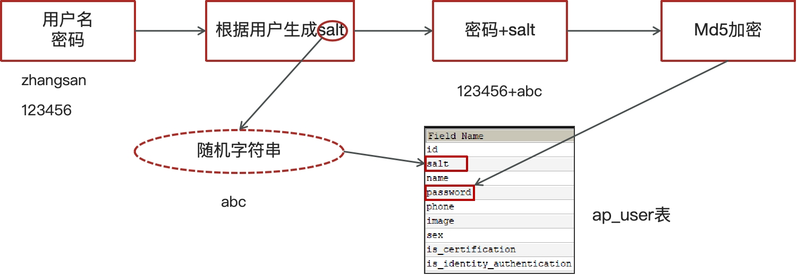

# app登录

表结构分析

关于app端用户相关的内容较多，可以单独设置一个库leadnews_user

|    **表名称**    |     **说明**      |
| :--------------: | :---------------: |
|     ap_user      |   APP用户信息表   |
|   ap_user_fan    | APP用户粉丝信息表 |
|  ap_user_follow  | APP用户关注信息表 |
| ap_user_realname | APP实名认证信息表 |

## 手动加密（md5+随机字符串）

md5是不可逆加密，md5相同的密码每次加密都一样，不太安全。在md5的基础上手动加盐（salt）处理。

### 注册

### 登录

手动加密（md5+随机字符串）

