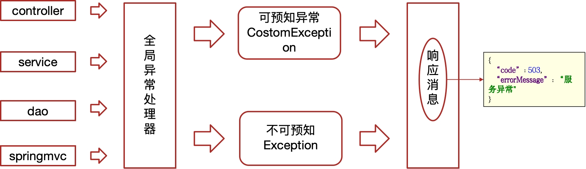

## Nacos

Nacos 是一个开源的动态服务发现、配置管理和服务管理平台，由阿里巴巴开源。Nacos 是 "Dynamic Naming and Configuration Service" 的缩写，它为微服务架构提供了关键的基础设施支持。

Nacos 的主要功能包括：

1. **服务发现和服务健康监测**：
   - Nacos 可以帮助服务在注册中心进行注册和发现。服务实例可以通过 Nacos 注册自己，并且其他服务可以通过 Nacos 查找这些服务实例。
   - Nacos 提供了服务健康检查机制，确保服务实例的可用性。

2. **动态配置管理**：
   - Nacos 提供集中化的配置管理功能，允许开发者在一个地方管理所有的配置项。配置的变更可以实时推送到应用程序中。
   - 支持配置的版本管理和灰度发布，方便进行配置的管理和控制。

3. **动态 DNS 服务**：
   - Nacos 提供 DNS 服务，可以将服务发现和 DNS 解析结合起来，方便服务的调用。

4. **服务管理**：
   - 提供服务的元数据管理、流量管理、熔断降级等功能，帮助提升系统的稳定性和可靠性。

Nacos 支持多种服务发现协议（如 HTTP、gRPC、Dubbo 等）和多种配置格式（如 YAML、Properties、JSON 等），并且可以与 Spring Cloud、Kubernetes 等生态系统集成。

**Nacos 的典型应用场景包括微服务架构中的服务注册与发现、配置管理，以及分布式系统中的服务治理。**

### docker安装Nacos安装

docker拉取镜像

```sh
docker pull nacos/nacos-server:1.2.0
```

创建容器

```sh
docker run --env MODE=standalone --name nacos --restart=always  -d -p 8848:8848 nacos/nacos-server:1.2.0
```

- MODE=standalone  单机版
- --restart=always  开机启动
- -p 8848:8848   映射端口
- -d 创建一个守护式容器在后台运行

访问地址：http://192.168.200.130:8848/nacos

## 环境搭建

### 前后端分离


## 服务层


## app端网关

### 网关概述


### 认证过滤器

**全局过滤器实现jwt校验**


## 工程主体结构

- heima-leadnews：父工程统一管理项目依赖，继承springboot
  - heima-leadnews-common：一些通用的配置
  - heima-leadnews-feign-api：feign对外的接口
  - heima-leadnews-model：pojo、dto
  - heima-leadnews-utils：通用的工具
  - heima-leadnews-gateway：管理网关工程
    - heima-leadnews-admin-gateway
    - heima-leadnews-wemedia-gateway
    - heima-leadnews-app-gateway
  - heima-leadnews-service：管理微服务
  - heima-leadnews-test：一些测试案例

### 全局异常

