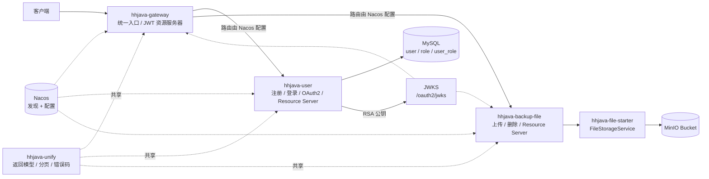
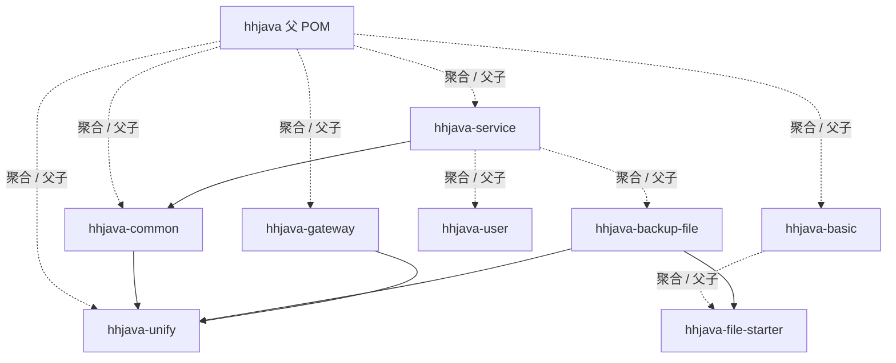
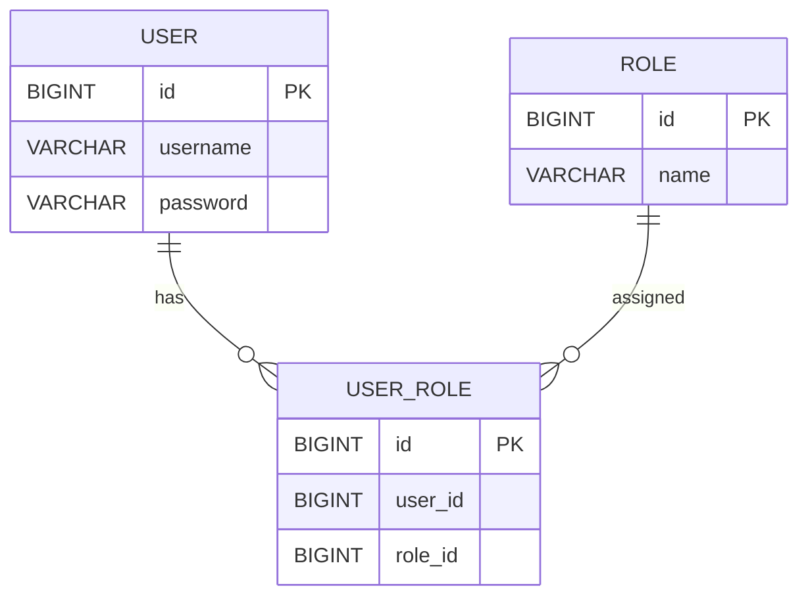
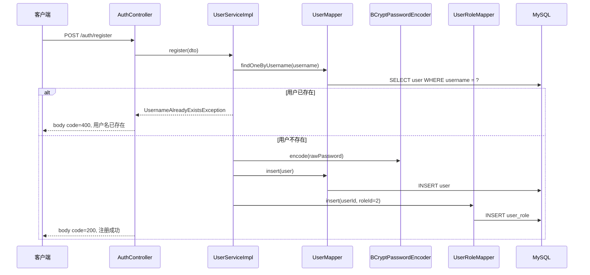
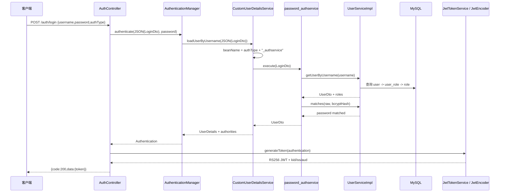
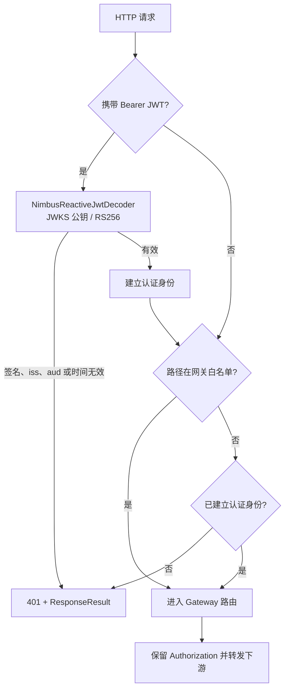
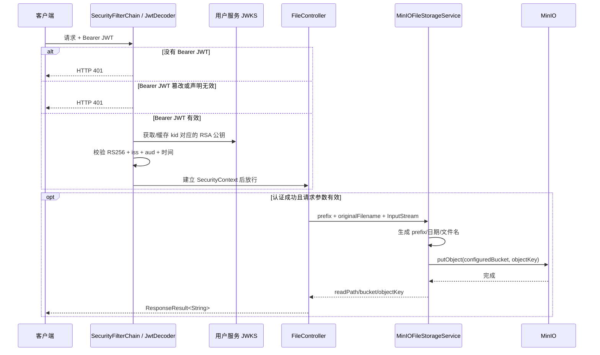

# hhjava 业务逻辑与代码逻辑梳理

> 分析基线：Git 提交 `2e36d26` 及 2026-08-28 当前工作区的 RSA/JWKS、资源服务器与配置外置改造。
>
> 分析范围：仓库内所有 Maven 模块、Java 源码、Mapper XML、本地配置和 Spring Boot 自动配置声明；`target/` 仅用于构建与测试结果核验，不作为业务源码。Nacos、MySQL 及本地进程的实际验证结果单列在第 12 节。
>
> 重要边界：网关路由、端口、MySQL 数据源和 MinIO 参数等核心运行配置从远端 Nacos 导入；Nacos 凭据、数据库密码、OAuth 客户端密钥和 RSA 密钥材料由部署环境注入，不保存真实值到仓库。本文会明确区分“源码可确认事实”“本轮开发环境验证结果”和“仍依赖外部配置的行为”。出于安全原因，本文不复述任何真实密码、Token 或公私钥内容。

## 1. 一页结论

`hhjava` 是一个基于 Java 17、Spring Boot 3.3.7、Spring Cloud Gateway、Nacos、MyBatis-Plus、Spring Security、JWT 和 MinIO 搭建的多模块微服务项目。仓库当前真正落地的业务能力集中在两块：

1. **用户与认证**：用户注册、用户名密码登录、角色加载，以及共用 RSA 签名器的自定义 JWT 和 OAuth2/OIDC 授权服务器。
2. **备份文件**：图片、HTML、SQLite 类数据库文件上传，以及文件删除；底层存储抽成了 MinIO Starter。

整体调用关系是：用户服务是唯一 JWT 签发方，持有 RSA 私钥并发布 JWKS 公钥端点；网关、用户服务自身和文件服务均作为 OAuth2 Resource Server 验证 JWT。客户端原则上先经过网关，但下游服务也有自身认证边界。用户数据存入 MySQL，文件存入 MinIO；服务发现和大部分运行配置来自 Nacos。

从完成度看，这更接近一个“认证 + 对象存储的微服务骨架”，还不是闭环的生产业务系统：数据库迁移、文件元数据/所有权、稳定的错误契约和完整业务集成测试仍未闭环。三个运行服务在源码上均已改造为 Resource Server；2026-08-28 的 Reactor 测试为 6/6 通过，但只覆盖用户模块的 RSA、JWT 和 OAuth 客户端基础逻辑。当前 Nacos 缺少文件服务的 data-id，且 MinIO 未部署；空 data-id 本身只产生警告，但缺少由其提供的 MinIO 参数最终会让服务因没有 `MinioClient` Bean 而启动失败。因此不能把此前使用临时占位配置完成的鉴权联调理解为文件业务当前可运行，详见第 10、12 节。

## 2. 系统架构

### 2.1 运行时拓扑



需要注意：具体 route predicate、URI 和 filter 存在远端 `hhjava-gateway-dev.yaml` 中，而不在仓库。本次已核验开发环境分别按 `/user/**`、`/backup/**` 路由到两个服务，且没有前缀重写；这属于环境事实，不是仓库可复现的配置基线。

### 2.2 Maven 模块与职责

| 模块 | 形态 | 主要职责 | 关键入口 |
| --- | --- | --- | --- |
| 根项目 `hhjava` | 聚合 POM | 统一 Java/Spring Boot/Spring Cloud/依赖版本，聚合 5 个一级模块 | `pom.xml:7-17,19-43` |
| `hhjava-unify` | 公共 Jar | `ResponseResult`、分页模型和业务码；已不再承担 JWT 签发/验签 | `hhjava-unify/pom.xml` |
| `hhjava-common` | 公共 Jar | 全局异常处理、OpenAPI、MyBatis-Plus 分页自动配置 | `AutoConfiguration.imports` |
| `hhjava-basic` | 聚合 POM | 基础能力父模块，目前只包含文件 Starter | `hhjava-basic/pom.xml` |
| `hhjava-file-starter` | Starter Jar | MinIO 配置绑定、`MinioClient`、统一文件存储接口及实现 | `MinIOConfig.java`、`FileStorageService.java` |
| `hhjava-service` | 服务聚合 POM | 为业务服务统一引入 common、Web、Lombok | `hhjava-service/pom.xml` |
| `hhjava-user` | 可启动服务 | 用户注册、登录、RBAC 角色加载、RSA JWT 签发、JWKS 发布、OAuth2/OIDC 授权服务器及本地 Resource Server | `UserApplication.java` |
| `hhjava-backup-file` | 可启动服务 | 文件上传和删除，通过 JWKS 验证 JWT，通过 Starter 访问 MinIO | `BackupFileApplication.java` |
| `hhjava-gateway` | 可启动服务 | 服务发现、动态路由、JWKS/RS256 JWT 验证、精确入口白名单、统一 401/403 | `GatewayApplication.java` |

### 2.3 构建期依赖关系



父 POM 默认给所有模块引入 Log4j2 和 Lombok，并在 dependency management 中管理 Spring Cloud 2023.0.5、Spring Cloud Alibaba 2023.0.1.0、MyBatis-Plus 3.5.7 等版本。网关已移除与当前 Boot/Cloud 基线不匹配的旧 `spring-cloud-starter-security` 依赖，网关和文件服务均使用 `spring-boot-starter-oauth2-resource-server`；用户服务同时使用 Authorization Server 和 Resource Server 能力。

## 3. 启动、配置与自动装配

### 3.1 三个运行服务

| 服务 | `spring.application.name` | 本地激活环境 | 远端配置 data-id | 代码扫描范围 |
| --- | --- | --- | --- | --- |
| 网关 | `hhjava-gateway` | `${SPRING_PROFILES_ACTIVE:dev}` | `${spring.application.name}-${spring.profiles.active}.yaml` | 主类默认 `com.hh` |
| 用户服务 | `hhjava-user` | `${SPRING_PROFILES_ACTIVE:dev}` | `${spring.application.name}-${spring.profiles.active}.yaml` | 显式 `com.hh`；Mapper 为 `com.hh.user.mapper` |
| 文件服务 | `hhjava-backup-file` | `${SPRING_PROFILES_ACTIVE:dev}` | `${spring.application.name}-${spring.profiles.active}.yaml` | 主类默认 `com.hhjava.www` |

三份本地 `application.yml` 都从环境变量读取 Nacos 地址、用户名和密码；profile、namespace 和 group 可按环境覆盖，并由 `spring.config.import` 动态组合 data-id。这带来几个直接结论：

- 仓库内看不到服务端口、网关 routes、MySQL 数据源、MyBatis 细节、MinIO endpoint/bucket/readPath、上传大小限制等最终值。
- data-id 跟随 `spring.application.name` 和激活 profile，切换 profile 会同步切换远端配置名。
- import 没有声明 `optional:`，说明没有显式设计本地降级路径；但当前版本遇到空/不存在的 data-id 时只记录警告并继续，不能把“缺 data-id”直接等同于配置导入失败。Nacos 连接/读取异常仍须与空配置场景分别验证。
- Gateway 和 user 会先可选加载 `HHJAVA_DEV_CONFIG_LOCATION` 指向的外部 properties；backup-file 没有这条本地导入链，只能依赖环境变量和 Nacos。
- 用户服务的数据源 URL、账号等结构配置仍由 Nacos 下发，数据库密码通过 `${HHJAVA_DATASOURCE_PASSWORD}` 由部署环境外置注入；仓库和远端配置均不保存其真实值。
- JWT 的 issuer/audience/JWKS URI、RSA 密钥资源位置与 OAuth 客户端凭据也全部通过部署环境提供。

2026-08-28 对开发环境进行了只读复核：`hhjava-gateway-dev.yaml`、`hhjava-user-dev.yaml` 存在，`hhjava-backup-file-dev.yaml` 缺失。网关把 `/user/**` 路由到 `hhjava-user`、把 `/backup/**` 路由到 `hhjava-backup-file`，没有执行 `StripPrefix`；用户服务配置 `/user` context path。因此当前用户入口是 `/user/auth/login`、`/user/auth/register` 等。文件服务实跑时会对空 data-id 记录警告后继续，随后因为没有 `minio.endpoint`，`MinIOConfig` 不生效，`MinIOFileStorageService` 又注入不到 `MinioClient`，最终启动失败。补齐 data-id 后仍要部署 MinIO，才能验收上传、删除和读地址链路。此外，文件 Controller 只声明 `/files/**`，启用时还必须在远端为服务补 `/backup` context path，或在 Gateway 增加 `StripPrefix=1`，否则 `/backup/files/**` 会因下游路径不匹配返回 404。

data-id 由应用名与 profile 生成，避免了本地激活环境与远端文件名脱节。需要注意，当前源码的 import URI 使用了 `config.namespace`、`config.group`、`config.file-extension` 查询名，而当前 resolver 实际不读取这些名称；现环境能工作是因为 namespace/group 同时存在于 `spring.cloud.nacos.config.*` 全局配置中，文件后缀也已经包含在 data-id 中。推荐把 URI 收敛为 `nacos:${spring.application.name}-${spring.profiles.active}.yaml?group=${NACOS_GROUP:hhjava}`。

开发环境的 Nacos 与 MySQL 凭据已完成轮换；最近一次有记录的服务端版本核验发生在 2026-08-27，当时为 Nacos 2.0.3。版本升级、对公网入口和安全组进行网络收口都属于 ECS 运维操作，本轮未执行；因此“凭据已轮换”不应被理解为 Nacos 基础设施已完成全部安全收紧。

### 3.2 自动配置

`hhjava-common` 通过 `AutoConfiguration.imports` 自动加载：

- `OpenApiConfig`：当 classpath 有 OpenAPI 时，提供可被业务覆盖的 `OpenAPI` Bean。
- `MyBatisPlusConfig`：当 classpath 有 MyBatis-Plus 时，注册 MySQL 分页拦截器。

`MybatisPlusInterceptor` 没有 `@ConditionalOnMissingBean`；消费方如果再定义同类型拦截器，可能形成 Bean 冲突或插件重复装配。

`hhjava-file-starter` 通过同一机制导入 `MinIOConfig`。只有 classpath 存在 `MinioClient` 且配置了 `minio.endpoint` 时，才绑定 `minio.*` 并创建客户端。

启用条件只检查 endpoint，`MinioClient` Bean 也没有 `@ConditionalOnMissingBean`。accessKey/secretKey 缺失会在构建 client Bean 时失败；bucket/readPath 缺失主要会在实际上传、拼接返回地址时暴露。若 endpoint 缺失，`MinIOConfig` 不生效，但当前文件服务仍会扫描 `MinIOFileStorageService`，最终因没有 `MinioClient` 可注入而启动失败。

这里有一个扫描边界：Starter 的 `MinIOFileStorageService` 只是普通 `@Service`，没有由自动配置显式声明。当前文件服务主包恰好是 `com.hhjava.www`，可以扫描到依赖 Jar 中同包名的实现；其他包名的消费项目只引入 Starter 时，未必能得到 `FileStorageService` Bean。

另一个边界是 `GlobalExceptionHandler`：它位于 `com.hh.common.exception`，但 common 的自动配置清单没有导入它。用户服务显式扫描 `com.hh`，能够发现它；文件服务默认只扫描 `com.hhjava.www`，按当前源码不会发现它。因此文件服务抛出的 `CustomException` 不一定会按统一 `ResponseResult` 处理，而可能落入 Spring Boot 默认错误响应。

用户模块还提供了 `spring-logback.xml`，但根项目实际引入 Log4j2，并未通过 `logging.config` 指向该非默认文件名；按当前配置它大概率不会进入实际日志链。

## 4. 核心数据模型

### 4.1 用户、角色与关联

代码采用最小 RBAC 模型：



实体和 Mapper 可确认：

- `user`：自增 `id`、`username`、`password` 字段；注册链会先对密码做 BCrypt 哈希再写入，但实体与 Mapper 不能保证库中所有历史值都采用该格式，也不声明唯一约束。
- `role`：自增 `id`、角色名 `name`；角色名直接转成 Spring Security authority。
- `user_role`：用户与角色的多对多关联。

IDE 数据源元数据也记录了上述三表及 `username` 唯一索引；该历史快照中的 `user_role` 只有主键，没有外键或 `(user_id, role_id)` 组合唯一约束。但仓库没有 Flyway/Liquibase/SQL 初始化脚本，因此不能把 IDE 缓存当作当前数据库保证或可复现的迁移。

本次已用该快照与实体、Mapper 交叉核对后，在开发 MySQL 中重建同结构的 `app` 库和三表；这修复了当前开发环境，但没有解决仓库缺少版本化数据库迁移的问题。

注册时默认写入 `role_id = 2`，这意味着运行库必须预置 ID 为 2 的目标角色；源码无法证明它具体代表“普通用户”还是其他角色。代码没有检查该角色是否存在，也没有在 `user` 与 `user_role` 两次插入外层声明事务。

### 4.2 文件领域模型

仓库没有文件实体、文件表或文件与用户的关联表。文件服务只把二进制对象写入 MinIO，并返回一个字符串 URL；用户名仅用于图片上传日志。因此当前系统无法通过自身数据回答：

- 某用户拥有过哪些文件；
- 某 URL 是否属于当前用户；
- 文件的大小、哈希、MIME、状态、版本和创建时间；
- 删除是否需要所有者或管理员权限。

## 5. 用户业务完整链路

用户服务只有注册和登录两个显式业务 API。仓库内没有用户资料查询/修改、角色管理、修改或找回密码、账号禁用、登出、自签 JWT 刷新/撤销等业务接口。

### 5.1 注册：`POST /auth/register`

请求体是 `RegisterDto { username, password }`，当前 DTO 没有 Bean Validation 约束，Controller 也没有 `@Valid`。



关键代码：`AuthController.java:41-53`、`UserServiceImpl.java:35-50`、`UserMapper.xml:16-22`。

实际语义：

- 用户名先查重；本机历史 IDE 缓存显示当时存在唯一索引，若当前运行库仍保留该索引，它才是并发重复注册的最终保护。唯一键冲突会被 Controller 当作通用注册异常，body code 为 500。
- 密码用 BCrypt 编码后入库，不保存明文。
- 新用户无条件绑定角色 2。
- Controller 自己捕获异常并返回 `ResponseResult`；由于没有返回 `ResponseEntity`，这些业务失败通常仍是 HTTP 200，只是 body 中 `code` 为 400 或 500。
- 两次写库没有 `@Transactional`。如果用户写入成功而角色关联失败，会留下没有角色的用户。

### 5.2 用户名密码登录：`POST /auth/login`

请求体是：

```text
LoginDto {
  username: @NotBlank 声明必填,
  password: @NotBlank 声明必填,
  authType: @NotBlank 声明必填，当前真正实现的值是 password
}
```

用户模块已引入 `spring-boot-starter-validation`，`AuthController.login` 也标注了 `@Valid`，因此上述约束会在运行时执行。注册 DTO 仍没有字段约束，注册方法也没有 `@Valid`。

登录代码用“认证策略 + Spring Security AuthenticationManager”完成认证，成功后由用户服务的 RSA 签名器生成 JWT：



关键细节：

1. Controller 没把普通用户名作为 principal，而是把完整 `LoginDto` 序列化成 JSON；这样 `CustomUserDetailsService` 才能拿到 `authType` 并选择策略 Bean。
2. 当前只有 `@Service("password_authservice")`。DTO 文档提到 `sms`，但没有 `sms_authservice`；传入其他类型会在容器取 Bean 时失败，通常被包装为 `InternalAuthenticationServiceException`，Controller 最终返回 body code 400 和“用户名或密码错误”。
3. 密码策略先查用户，再从 `user_role` 查角色 ID，最后从 `role` 查角色实体；角色名被映射为 `SimpleGrantedAuthority`。
4. `PasswordAuthServiceImpl` 已主动调用 BCrypt `matches`。`DaoAuthenticationProviderCustom` 又把框架的 `additionalAuthenticationChecks` 留空，意图避免二次校验并为以后无密码认证留入口。
5. 自定义 provider 是仓库中唯一的 `AuthenticationProvider` Bean，会接入 `AuthenticationManager`。本轮真实注册与登录已成功，说明开发环境中这条 provider 链路已正常工作。
6. 登录失败由 Controller 区分用户不存在、密码错误、其他认证异常，但多数情况下 HTTP 状态仍是 200，错误信息放在 body `code/message`。这种区分会暴露用户名是否存在；通用 `AuthenticationException` 的原始消息还会直接返回客户端。
7. 没有 `user_role` 的用户会得到 `roles = null`；`CustomUserDetailsService.getAuthorities()` 随后直接调用 `user.getRoles().stream()`，会产生空指针，而不是一个“无权限用户”。
8. `UserDto` 在内存中携带 BCrypt 密码哈希；当前没有直接返回它，但自动生成的 `toString` 或未来误用可能泄露哈希。`User.toString()` 也明确拼接了 password 字段。

### 5.3 JWT 内容与生命周期

`JwtTokenService` 使用授权服务器的同一个 `JwtEncoder` 签发自定义登录 JWT。Header 固定为 `RS256` 并携带配置化 `kid`；Claims 包含：

- `iss`：唯一签发者；
- `sub`：认证后的用户名；
- `aud`：目标 API；
- `iat` 和 `nbf`：签发与生效时间；
- `exp`：按 `access-token-ttl` 计算，默认 1 小时；
- `jti`：每枚 Token 的随机唯一标识。

本轮联调确认登录 Token 的 issuer 为 `http://127.0.0.1:63010/user`、audience 为 `hhjava-api`、有效期为 3600 秒。Token 仍不写入用户角色或业务权限；角色只存在于登录过程的 `Authentication` 中，网关和文件 API 当前也只判断是否已认证，没有落地跨服务 RBAC。

`RsaKeyConfiguration` 从外部资源加载 PKCS#8 私钥和 X.509 公钥，检查密钥对是否匹配且 RSA 长度不低于 2048 位，然后构造带 `kid`、`use=sig`、`alg=RS256` 的 JWK。私钥只由用户服务加载；网关和文件服务只访问 JWKS 公钥端点。原有 `JwtUtil`、`SecurityConstants`、JJWT 依赖和共享 HMAC 签发边界已删除。

### 5.4 用户服务自身的 Resource Server

用户服务已删除手写 `JWTAuthenticationFilter`，改用 Spring Security OAuth2 Resource Server。对 Bearer JWT 的访问由本地 `JwtDecoder` 使用 RSA 公钥验签，并校验 RS256、issuer、audience 及时间声明；验证成功后由框架建立 `JwtAuthenticationToken`，不再把 `sub` 回放给 `CustomUserDetailsService`。

`WebSecurityConfig` 只公开 `POST /auth/register`、`POST /auth/login`、默认登录/错误页和文档端点，其余请求全部要求认证。因此即使绕过网关直连用户服务，受保护路径也不会匿名放行。本轮单元测试已覆盖 RSA 签发与本地解码器；运行时的合法/缺失/篡改 Token 矩阵主要通过网关和文件服务进行了联调验证。

`CustomUserDetailsService` 仍将入参解析为 JSON `LoginDto`，但它现在只用于项目自有登录认证，不再参与 Bearer Token 解析。这消除了原来“JWT subject 是普通用户名，UDS 却只接受 JSON”的 Token 回放问题；但 OAuth2 授权码模式的默认表单登录仍会传入普通用户名，这一协议差异仍是第 7 节的未闭环点。

## 6. 网关认证与路由逻辑

### 6.1 请求过滤链



`SecurityConfig` 精确公开：

- `POST /user/auth/register` 和 `POST /user/auth/login`；
- `/user/oauth2/**`、`/user/.well-known/**`、`/user/login` 等 OAuth2/OIDC 协议入口；
- `/v3/api-docs/**`、`/swagger-ui/**`、webjars 等网关根路径。

最后一组只是源码白名单，不代表经 Gateway 访问下游文档时匿名可用：当前 Nacos 没有这些根路径路由，用户服务真实网关路径 `/user/v3/api-docs`、`/user/swagger-ui/**` 又不匹配根白名单，因此经 Gateway 访问仍需要 JWT；直连用户服务时才由下游自己的文档白名单放行。

其余路径要求 `authenticated()`。未认证由 `CustomAuthenticationHandler` 返回 HTTP 401，无权限返回 HTTP 403，响应体仍是 `ResponseResult` JSON。

虽然 403 handler 已配置，但当前授权规则只有 permit-all 与 authenticated，没有角色或 scope 条件；正常业务路由几乎没有触发 403 的授权分支。

用户业务白名单已从整个 `/user/**` 收紧到注册和登录两个 POST 端点。`/user/oauth2/**` 在网关放行表示把协议请求转交下游授权服务器，不等于绕过 OAuth 客户端或用户认证。另外，permit-all 请求如果主动携带无效 Bearer Token，资源服务器仍会先尝试解析并可能返回 401；客户端调用登录接口时不应附带过期 Token。

开发环境使用 `/user` context path 且网关不剥前缀，因此 `/user/auth/login` 会命中 Controller 的 `/auth/login`；其他环境仍需保证 route 与 context path 一致。原有仅重写相同 Header 的 `GatewayAuthFilter` 已删除；真正验签一直由 Spring Security OAuth2 Resource Server 负责，Gateway 默认继续向下游透传 `Authorization`。

`CustomAuthenticationHandler` 在网关安全链中作为 401 entry point 和 403 denied handler；它实现的成功处理方法仍没有接入当前链路。

当前仓库和本次发布的网关 Nacos 配置都没有有效 CORS 规则：安全链的 `cors().disable()` 是关闭 Spring Security CORS 集成，并不代表允许跨域。需要浏览器跨域调用时仍须显式补充并验证预检策略。

### 6.2 授权能力边界

网关当前只验证“是否持有可验证 JWT”，没有按角色、scope、HTTP 方法或业务资源授权。自定义登录 JWT 也没有 roles/scope claim。因此当前权限模型是：

- 用户库能加载角色；
- Spring `UserDetails` 能携带 authority；
- 但跨服务 JWT 和网关规则没有使用这些角色；
- 文件服务也不校验角色或文件所有权。

网关的解码器通过 JWKS 选择 `kid` 对应的公钥，限制算法为 RS256，并校验 issuer、audience 与时间声明。它不会为自包含 Token 实时查询撤销状态；虽然 Token 包含 `jti`，当前也没有黑名单或撤销查询链路。

## 7. OAuth2/OIDC 授权服务器

用户服务除了 `/auth/login` 兼容入口，还配置了一套 Spring Authorization Server。两者是并存的两条发 Token 路径：认证协议不同，但共用同一个 RSA `JwtEncoder`、issuer、audience、`kid` 和访问令牌 TTL。

### 7.1 当前配置

- 注册客户端保存在内存中，服务每次启动生成新的内部 registration id。
- client id、client secret 和 redirect URI 都由外部属性注入，不提供真实 secret 默认值；secret 会经 BCrypt 后存入内存仓库。
- 支持 authorization code、client credentials 和 refresh token；未实现的 password grant 已从客户端声明中移除。
- scope 包括 `openid` 和 `all`，并关闭用户授权确认页。
- access token 有效期由统一 JWT 属性控制，默认 1 小时；refresh token 有效期 3 天。
- issuer 也为必填外部属性，不再使用代码占位默认地址。
- 显式端点包括 `/oauth2/authorize`、`/oauth2/token`、`/oauth2/introspect`、`/oauth2/revoke`，同时启用 OIDC 默认端点。
- `JWKSource` 使授权服务器发布标准 JWKS；`JwtEncoder` 与 `JwtDecoder` 固定使用 RS256，访问令牌增加 API audience。
- 两条 `SecurityFilterChain` 显式使用 `@Order(1)` 和 `@Order(2)`，授权服务器端点优先匹配。
- `client_credentials` 已使用外置客户端凭据真实调用 `/oauth2/token` 成功，返回可验证的 JWT access token。

### 7.2 与 `/auth/login` 的区别

| 维度 | `/auth/login` | OAuth2/OIDC |
| --- | --- | --- |
| 入口 | 自定义 REST Controller | Spring Authorization Server 端点 |
| 客户端认证 | 无 OAuth client | 内存 RegisteredClient |
| 用户认证扩展 | `authType` 策略 | 依赖授权服务器过滤链和框架协议 |
| access token TTL | 统一配置，默认 1 小时 | 统一配置，默认 1 小时 |
| refresh token | 无 | 声明 3 天 |
| token 签名 | RSA/RS256，携带 `kid` | 同一 RSA/RS256 签名器和 `kid` |
| token 内容 | iss/sub/aud/iat/nbf/exp/jti，无角色/scope | 由 Authorization Server 生成协议声明和 scope |
| 持久化 | 无 token 状态 | 客户端、授权与 consent 使用内存实现，重启丢失 |

password grant 已明确不支持，密码兼容客户端继续使用 `/auth/login`；新的 OAuth 客户端应选择 authorization code 或 client credentials，而不应向 `/oauth2/token` 发送 `grant_type=password`。

RSA/JWKS、本地 `JwtDecoder`、OIDC 所需 `JWKSource` 和过滤链顺序已在源码层补齐，用户服务也已在完整联调环境中启动。仍需注意以下边界：

1. OAuth 客户端、授权与 consent 使用内存实现，服务重启会丢失协议状态。
2. 通用安全链已提供并公开默认 `/login`，但 `CustomUserDetailsService` 仍只接受 JSON `LoginDto`；默认表单登录传入普通 username 时仍会解析失败，authorization-code/OIDC 的终端用户登录尚未完成端到端验证。
3. 当前已验证 JWKS 发布、自定义登录 Token 和 OAuth2 `client_credentials` Token；refresh、introspection、revocation、authorization code 和 OIDC UserInfo 等其他协议端点还需独立集成测试。

## 8. 文件备份业务完整链路

### 8.1 HTTP 接口

| 方法与路径 | 请求 | 默认 prefix | 成功结果 | 服务内当前身份使用 |
| --- | --- | --- | --- | --- |
| `POST /files/image` | multipart `file`，可选 `prefix` | `images` | 地址字符串；可访问性依赖外部配置 | Resource Server 先强制认证；写入成功后读取 `sub` 并记日志 |
| `POST /files/html` | multipart `file`，可选 `prefix` | `htmls` | 地址字符串；可访问性依赖外部配置 | Resource Server 先强制认证；业务代码不使用当前身份 |
| `POST /files/database` | multipart `file`，可选 `prefix` | `databases` | 地址字符串；可访问性依赖外部配置 | Resource Server 先强制认证；业务代码不使用当前身份 |
| `DELETE /files?url=...` | 查询参数 `url` | 无 | 固定“文件删除成功” | Resource Server 先强制认证；仍不校验文件所有权 |

Controller 没有下载接口。`FileStorageService.downLoadFile` 只是 Starter 内部能力，当前没有 HTTP 暴露。

### 8.2 上传与对象 key

三种上传共用 `MinIOFileStorageService.uploadFile`，仅 Content-Type 不同：图片写 `image/*`，HTML 写 `text/html`，数据库写 `application/x-sqlite3`。

对象 key 规则是：

```text
[prefix/]yyyy/MM/dd/originalFilename
```

完整链路：



可以直接确认的边界：

- bucket 必须预先存在，代码不创建、不检查 bucket。
- 文件名和 prefix 直接使用客户端输入，没有清洗、唯一化或按用户隔离。
- 同一天、同 prefix、同文件名会命中同一个对象 key，是否覆盖或形成版本取决于 MinIO bucket 策略。
- 不检查空文件、大小、扩展名、真实 MIME 或内容；端点名称只改变写入的 Content-Type。
- 上传长度使用 `InputStream.available()`，它不是“流总长度”的可靠契约。MinIO 8.5.17 会把这个值作为明确 objectSize；一旦 `available()` 低估，就可能截断，返回 0 时会按 0 字节对象处理。
- 返回 URL 是 `minio.readPath/bucket/objectKey` 的字符串拼接，不是 presigned URL；能否访问依赖外部 bucket policy、代理或 CDN。
- MinIO 上传异常在 Service 中统一变成不保留 cause 的 `RuntimeException("上传文件失败")`；Controller 只捕获 `file.getInputStream()` 可能抛出的 `IOException`，所以对象存储失败不会进入 Controller 的 `CustomException(ERROR)` 分支。

仓库没有显式配置 `spring.servlet.multipart.max-file-size/max-request-size`。如果远端 Nacos 也没有覆盖，则使用 Spring Boot 默认限制；因此实际允许的备份文件大小仍是外部配置问题，不能从 Controller 推断。

图片上传的业务代码仍是先完成 MinIO 写入，再调用 `SecurityUtil.getCurrentUsername()`。但当前 Resource Server 会在进入 Controller 之前完成认证并建立 `SecurityContext`，因此匿名或篡改 Token 请求不会到达写存储的逻辑。HTML、数据库上传和删除虽然不读取当前用户，也同样必须先通过服务内认证；它们的剩余问题是未利用已认证身份实现文件所有权。

### 8.3 文件服务的 Resource Server

原有 `FileTokenInterceptor` 和对应 `WebMvcConfig` 已删除。文件服务现在使用无状态 Spring Security `SecurityFilterChain`：只公开 OpenAPI/Swagger 文档，其余请求均要求认证。解码器从用户服务 JWKS 端点取得 RSA 公钥，限制 RS256，并校验 issuer、audience 及时间声明。

验证成功后，框架把 `JwtAuthenticationToken` 写入 `SecurityContextHolder`，`SecurityUtil.getCurrentUsername()` 通过 `Authentication.getName()` 获取 JWT `sub`。文件服务不再依赖 request attribute 传递用户名。缺失或无效 Token 由 Spring Security 在 MVC 之前返回 HTTP 401；当前这一响应体仍未像网关那样统一为 `ResponseResult`。

2026-08-27 曾使用临时 MinIO 占位配置验证网关路由和文件服务直连鉴权：合法 Token 可通过安全链，缺失或篡改 Token 均返回 401。这证明安全链在当时的临时启动条件下有效，但不是当前启动验收；2026-08-28 复核时 `hhjava-backup-file-dev.yaml` 已缺失，实跑会在空配置警告后因缺少 `MinioClient` Bean 启动失败，且真实文件上传、删除始终未验证。

### 8.4 删除逻辑

删除输入是客户端提供的完整 URL。实现用字符串 `replace` 尝试去掉所有匹配的 `minio.endpoint + "/"` 片段，而不是做严格 URL 前缀解析；随后按第一个 `/` 把剩余字符串拆成 bucket 和 object key，最后调用 `removeObject`。

这与上传返回值不完全自洽：

- 上传 URL 基于 `readPath`；
- 删除和下载却按 `endpoint` 解析；
- 常见部署里二者分别是公网读域名和 MinIO API 内网地址，可能并不相同。

此外，删除没有限定为配置的 bucket、没有校验 URL host/路径、没有所有权检查，调用方实际可以影响要操作的 bucket。URL 拆分与 `RemoveObjectArgs` 构建还发生在 try/catch 之外，格式错误与 MinIO 调用错误的呈现不同。`removeObject` 发生异常时只记日志、不再抛出，Controller 随后仍固定返回“文件删除成功”；代码也不做删除前后的存在性检查，所以即使 SDK 不报错，也不能证明对象此前存在或现已删除。

### 8.5 下载内部能力

`downLoadFile` 使用与删除相同的 URL 拆分方式，从 MinIO 取得流，以 4 KiB 缓冲读入 `ByteArrayOutputStream`，最终返回整个 `byte[]`。它目前：

- 没有 Controller 入口；
- 没有 filename、Content-Type、Content-Length、ETag 等元数据；
- 不是流式 HTTP 响应，大文件和并发下载会占用大量堆内存；
- URL 解析仍受 `readPath`/`endpoint` 不一致影响。

## 9. 公共模型、异常与基础设施逻辑

### 9.1 统一响应

标准响应结构是：

```json
{
  "code": 200,
  "message": "操作成功",
  "data": {}
}
```

`ResponseResult.success(data)` 使用业务码 200；`error(code, message)` 只构造 body，不自动改变 HTTP 状态。当前不同入口的协议并不完全统一：

| 场景 | HTTP 状态 | body code |
| --- | --- | --- |
| 注册/登录成功 | 通常 200 | 200 |
| 注册/登录业务失败 | 通常 200 | 400 或 500 |
| 网关未认证 | 401 | 401 |
| 网关无权限 | 403 | 403 |
| 用户/文件资源服务器未认证 | 401 | 框架默认响应，未统一为 `ResponseResult` |
| common 捕获 `CustomException` | 200 | 枚举业务码 |
| common 捕获普通异常 | 500 | 500 |
| 文件服务异常 | 因 Handler 扫描边界，可能是默认 Spring 错误体 | 不稳定 |

`AppHttpCodeEnum` 预留了登录、token、签名、参数、数据和权限错误段，但当前业务只使用其中少数枚举；注册/登录 Controller 还直接写了 400/500，与枚举并未完全统一。

### 9.2 分页模型

`PageRequestDto.checkParam()` 把空值、负数或 size 大于 100 的输入修正为默认 `page=1,size=10`，但 `page=0`、`size=0` 会原样保留，而且业务方必须手工调用该方法；`PageResponseResult` 增加 currentPage/size/total。当前仓库没有分页业务接口，这套模型和 MyBatis-Plus 分页拦截器尚未进入实际业务调用链。

### 9.3 全局异常日志

`GlobalExceptionHandler` 会记录请求 URI、参数 map 和异常信息。它能统一普通异常与 `CustomException`，但没有记录完整堆栈的普通异常日志调用；请求参数日志也需要避免未来把密码、token 等敏感查询参数写入日志。

它没有为反序列化、参数校验等客户端错误提供专门 handler；这些异常也会落入 `Exception.class`，按“系统异常”返回 HTTP/body 500，而不是稳定的 400 参数错误。OAuth2 Resource Server 的 Token 异常发生在 MVC Controller 之前，`@ControllerAdvice` 本身无法统一处理；网关已配置自定义 401/403，但用户服务和文件服务仍使用框架默认响应。

## 10. 当前代码实际边界与未闭环点

这一节不是对业务需求的猜测，而是阅读代码时必须知道的“当前实现状态”。

| 领域 | 设计/意图 | 当前源码实际状态 | 直接影响 |
| --- | --- | --- | --- |
| 网关路由 | 网关作为统一入口 | `dev/hhjava` 的 Nacos 配置已核验：`/user/** -> lb://hhjava-user`、`/backup/** -> lb://hhjava-backup-file` | 路由依赖环境外配置，仓库本身仍不能独立还原 |
| 登录白名单 | 放行注册登录 | 网关仅精确放行两个 POST 入口；用户服务也仅放行 `/auth/register`、`/auth/login` 和必要协议/文档端点 | 当前开发环境入口为 `/user/auth/**`，新增用户业务默认要求认证 |
| 用户服务鉴权 | JWT 建立用户身份 | 已删除手写 Filter，改用本地 RSA `JwtDecoder` 和标准 Resource Server，校验算法/issuer/audience/时间 | Bearer Token 不再回放到 JSON-only UDS，直连受保护路径也有认证边界 |
| 角色授权 | RBAC 控制权限 | 角色只转成登录时 authority，JWT 不带角色，网关和文件 API 不按角色授权 | 跨服务 RBAC 尚未落地 |
| 多认证方式 | `authType` 策略扩展 | 只有 `password_authservice` | `sms` 等文档值不可用 |
| OAuth2 password grant | 密码客户端取得 Token | 明确不支持并已从 RegisteredClient 移除；密码兼容流量使用 `/auth/login` | 客户端不应向 `/oauth2/token` 发送 `grant_type=password` |
| OAuth2/OIDC | 标准授权服务器 | RSA `JWKSource`、`JwtEncoder`、`JwtDecoder`、JWKS、audience 和过滤链顺序已补齐 | JWKS 和 `client_credentials` 已真实验证；OAuth 表单 UDS 协议差异及其他标准协议端点仍待端到端测试 |
| 文件服务鉴权 | JWT 用户才能操作 | 源码为无状态 Resource Server；2026-08-28 时远端 data-id 与 MinIO 配置缺失 | 临时配置下的鉴权矩阵曾通过，但当前因缺少 `MinioClient` Bean 无法启动，且始终未实现所有权 |
| 文件所有权 | 用户管理自己的备份 | 没有文件表、owner、权限判断 | 任意 URL 删除与审计无法闭环 |
| 删除结果 | 返回真实删除状态 | MinIO 异常被吞，Controller 固定成功 | 客户端会收到假成功 |
| 文件 URL | 上传结果可继续删除/下载 | 返回用 readPath，解析用 endpoint | 常见代理/CDN 部署下不自洽 |
| 注册一致性 | 用户和默认角色原子创建 | 无显式事务，角色 ID 硬编码为 2 | 可能留下无角色用户，依赖预置数据 |
| 参数校验 | `@Valid` 校验登录 | 已引入 Validation Starter，登录 DTO 约束可执行；注册 DTO 仍无约束且方法未标 `@Valid` | 登录空值校验已生效，注册输入边界仍未闭环 |
| 异常统一 | 所有服务返回 ResponseResult | 文件服务扫描不到 common Handler | 文件错误契约可能退回默认格式 |
| Starter 复用 | 引入依赖即可得到存储服务 | 实现依赖消费方包扫描；配置类（含属性绑定与 client）受 endpoint 条件控制，普通 `@Service` 存储实现不受该条件控制 | 换包名消费或缺 endpoint 时可能无法注入 |
| 可复现部署 | 仓库即环境事实 | 已提供无真实凭据的 `.env.example` 和动态 Nacos 导入；仍无数据库 migration、MinIO 初始化和完整 Nacos 配置样例 | 新环境可知道必需变量，但仍无法仅靠仓库完整还原 |
| 自动化验证 | 回归保护 | `JwtTokenServiceTest` 2 例、`RsaKeyConfigurationTest` 3 例、`AuthorizationServerTest` 1 例均通过；业务用例和其他 OAuth2/MinIO 流程仍缺集成测试 | JWT 签发、Claims、RSA 密钥校验和 OAuth client secret 编码有基础回归保护，其他主要流程仍需补齐 |

### 10.1 安全配置现状

当前工作树已完成以下收紧：

- 三个服务的 Nacos 地址和凭据改由环境变量注入，开发环境 Nacos 凭据已轮换；
- MySQL 数据源结构配置由 Nacos 下发，密码由 `${HHJAVA_DATASOURCE_PASSWORD}` 外置注入，本轮也已完成轮换；
- OAuth client secret 为必填外部属性，源码不再存放真实值；
- 共享 HMAC 密钥、`JwtUtil`、`SecurityConstants` 和 JJWT 依赖已删除；
- 用户服务是唯一签发方，只它加载外部 RSA 私钥；网关和文件服务通过 JWKS 获取公钥；
- JWT 固定使用 RS256，并通过 `kid` 建立密钥版本识别能力。

当前源码泄漏不再直接赋予签发 JWT 的能力。但 RSA 私钥文件权限、定期轮换流程、JWKS 缓存切换和部署环境的密钥保管仍属于运维边界。旧凭据可能仍存在于 Git 历史中，因此“已轮换”比单纯从当前文件删除更为重要。2026-08-27 核验的 Nacos 版本仍为 2.0.3，升级与公网/安全组网络收口需在 ECS 上单独完成，不属于本次代码修改已解决的范围。

### 10.2 文件安全与稳定性现状

- prefix、originalFilename、删除 URL 均由客户端控制，缺少规范化和白名单。
- 上传没有大小、类型、内容、空文件检查。
- HTML 端点接受任意内容并固定标记为 `text/html`；若 bucket/readPath 位于可信域且公开访问，会形成存储型主动内容风险。
- 对象 key 不唯一，可能覆盖。
- 上传长度使用 `available()`，下载全量进内存。
- 上传流的关闭责任没有在接口中明确。
- 删除解析发生在部分 try/catch 之外，格式错误和 MinIO 错误呈现不一致。
- 图片业务日志仍在存储后读取用户名，但安全链已在进入 Controller 前完成认证，不再存在匿名写入后才拒绝的链路。

## 11. 从请求到代码的快速索引

| 想了解的内容 | 代码位置 |
| --- | --- |
| Maven 模块与统一版本 | `pom.xml:11-17,19-43,59-133` |
| 网关白名单与 Resource Server | `hhjava-gateway/src/main/java/com/hh/gateway/config/SecurityConfig.java:20-34,56-83`、`src/main/resources/application.yml:46-55` |
| 网关 401/403 响应 | `hhjava-gateway/src/main/java/com/hh/gateway/config/CustomAuthenticationHandler.java:24-57` |
| 注册/登录 API | `hhjava-service/hhjava-user/src/main/java/com/hh/user/controller/AuthController.java:29-102` |
| 注册写库逻辑 | `hhjava-service/hhjava-user/src/main/java/com/hh/user/service/impl/UserServiceImpl.java:35-50` |
| 用户与角色加载 | `UserServiceImpl.java:53-71` 及三个 Mapper XML |
| 认证策略分派 | `hhjava-service/hhjava-user/src/main/java/com/hh/security/CustomUserDetailsService.java:26-55` |
| 密码认证策略 | `hhjava-service/hhjava-user/src/main/java/com/hh/user/service/impl/PasswordAuthServiceImpl.java:17-28` |
| 用户服务安全链 | `hhjava-service/hhjava-user/src/main/java/com/hh/security/WebSecurityConfig.java:53-78` |
| OAuth2/OIDC 配置 | `hhjava-service/hhjava-user/src/main/java/com/hh/security/AuthorizationServer.java:36-110` |
| 自定义 JWT 签发 | `hhjava-service/hhjava-user/src/main/java/com/hh/security/jwt/JwtTokenService.java:39-56` |
| RSA/JWKS 与用户服务 Decoder | `hhjava-service/hhjava-user/src/main/java/com/hh/security/jwt/RsaKeyConfiguration.java:49-96` |
| JWT/OAuth 外部属性 | `hhjava-service/hhjava-user/src/main/java/com/hh/security/properties/JwtProperties.java`、`OAuthClientProperties.java` |
| 本地部署变量模板 | `.env.example`（只有占位符和非敏感示例） |
| 文件 HTTP API | `hhjava-service/hhjava-backup-file/src/main/java/com/hhjava/www/controller/FileController.java:15-112` |
| 文件服务鉴权与身份 | `hhjava-service/hhjava-backup-file/src/main/java/com/hhjava/www/config/SecurityConfig.java:18-32`、`controller/SecurityUtil.java:18-43` |
| MinIO 上传/删除/下载 | `hhjava-basic/hhjava-file-starter/src/main/java/com/hhjava/www/service/impl/MinIOFileStorageService.java:31-163` |
| 统一响应和业务码 | `hhjava-unify/src/main/java/com/hhjava/www/model/dtos/ResponseResult.java`、`AppHttpCodeEnum.java` |
| common 自动配置 | `hhjava-common/src/main/resources/META-INF/spring/org.springframework.boot.autoconfigure.AutoConfiguration.imports` |

## 12. 验证记录

### 12.1 本次源码与构建验证（2026-08-28）

- 已逐一核对非 `target` Java 源码、Mapper XML、POM、本地 YAML、脚本和自动配置声明，并枚举全部显式 MVC API。
- 已执行 `mvn -B -ntp test`：9 个 Reactor 项目全部 `BUILD SUCCESS`，Surefire 共执行 6 个测试，6/6 通过。
- 6 个测试全部位于 user 模块：`JwtTokenServiceTest` 2 个、`RsaKeyConfigurationTest` 3 个、`AuthorizationServerTest` 1 个。
- Gateway、backup-file、FileController、MinIO、Nacos 配置和注册/登录业务接口当前都没有自动化测试，不能由上述 6 个测试推导为已回归。

### 12.2 当前配置只读复核（2026-08-28）

- Nacos `dev` namespace、`hhjava` group 中，`hhjava-gateway-dev.yaml` 与 `hhjava-user-dev.yaml` 存在，`hhjava-backup-file-dev.yaml` 缺失。
- Gateway 远端配置仍包含 `/user/**` 与 `/backup/**` 两条路由，均没有 `StripPrefix`；没有 CORS、Retry、CircuitBreaker 或 fallback。
- user 的远端配置仍提供 `/user` context path；因此开发环境完整注册/登录入口为 `/user/auth/register`、`/user/auth/login`。
- backup-file 的 Nacos import 未声明 `optional:`，但当前版本对缺失 data-id 只记录空配置警告；实际启动失败点是缺少 `minio.endpoint` 后没有创建 `MinioClient` Bean。
- backup-file 本地没有 `/backup` context path；创建远端 data-id 时须配置该 context path，或改为由 Gateway 移除 `/backup` 前缀，才能让 `/backup/files/**` 命中 Controller。

### 12.3 历史联调记录与当前边界

2026-08-27 曾完成用户注册/登录、JWKS、OAuth2 `client_credentials`、Gateway 与临时启动的文件服务 Token 矩阵；真实密码、Token 和密钥内容均未记录。该记录只能证明当时的临时配置链路，不能替代当前重新启动验收。

MinIO 仍未安装，真实上传、删除、下载、Bucket 策略和返回地址均未验证。authorization code、refresh、introspection、revocation 和 OIDC UserInfo 也没有端到端验证。

## 13. 关联知识

- [工程结构](./工程结构.md)
- [Nacos](./Nacos.md)
- [MyBatis](./数据库连接/MyBatis.md)
- [分布式文件系统 MinIO](./分布式文件系统MinIO.md)
- [hhjava 认证授权与配置安全整改实战](./认证授权和网关/hhjava认证授权与配置安全整改实战.md)
- [接口测试工具](./接口测试工具.md)
