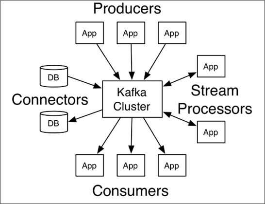
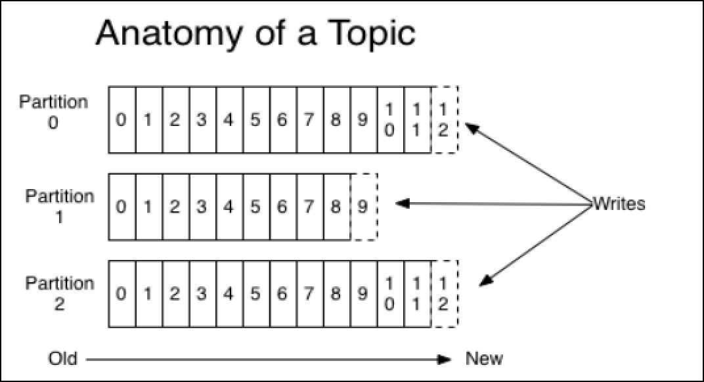
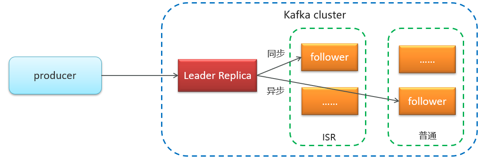

# kafka及异步通知文章上下架

## 自媒体文章上下架

自媒体端操作文章上下架。通知文章微服务去上下架文章。

- 通过feign的远程调用实现，但是会产生系统的耦合。
- 采用MQ的方式实现。自媒体端发生一旦上下架，就发一个消息给MQ，文章微服务接收这个消息进行上下架。达到**系统的解耦**。

点赞，喜欢等操作原理一样。

## 消息中间件对比

| 特性       | ActiveMQ                               | RabbitMQ                   | RocketMQ                 | Kafka                                    |
| ---------- | -------------------------------------- | -------------------------- | ------------------------ | ---------------------------------------- |
| 开发语言   | java                                   | erlang                     | java                     | scala                                    |
| 单机吞吐量 | 万级                                   | 万级                       | 10万级                   | 100万级                                  |
| 时效性     | ms（毫秒）                             | us（微秒）                 | ms                       | ms级以内                                 |
| 可用性     | 高（主从）                             | 高（主从）                 | 非常高（分布式）         | 非常高（分布式）                         |
| 功能特性   | 成熟的产品、较全的文档、各种协议支持好 | 并发能力强、性能好、延迟低 | MQ功能比较完善、扩展性佳 | 只支持主要的MQ功能、主要应用于大数据领域 |

选择建议

| **消息中间件** | **建议**                                                     |
| -------------- | ------------------------------------------------------------ |
| Kafka          | 追求高吞吐量，适合产生大量数据的互联网服务的数据收集业务     |
| RocketMQ       | 可靠性要求很高的金融互联网领域,稳定性高，经历了多次阿里双11考验 |
| RabbitMQ       | 性能较好，社区活跃度高，数据量没有那么大，优先选择功能比较完备的RabbitMQ |

## kafka概述

Kafka 是一个分布式流媒体平台，类似于消息队列或企业消息传递系统。

官网：http://kafka.apache.org/  



kafka介绍-名词解释


- producer：发布消息的对象称之为主题生产者（topic producer）

- topic：Kafka将消息分门别类，每一类的消息称之为一个主题（Topic）

- consumer：订阅消息并处理发布的消息的对象称之为主题消费者（topic consumers）

- broker：已发布的消息保存在一组服务器中，称之为Kafka集群。集群中的每一个服务器都是一个代理（Broker）。消费者可以订阅一个或多个主题（topic），并从Broker拉数据，从而消费这些已发布的消息。

- Kafka Cluster：Kafka集群。

## kafka安装配置

Kafka对zookeeper是强依赖，保存kafka相关的节点数据，所以安装Kafka之前必须先安装zookeeper

### Docker安装zookeeper

下载镜像：

```shell
docker pull zookeeper:3.4.14
```

创建容器

```shell
docker run -d --name zookeeper -p 2181:2181 zookeeper:3.4.14
```

### Docker安装kafka

下载镜像：

```shell
docker pull wurstmeister/kafka:2.12-2.3.1
```

创建容器

```shell
docker run -d --name kafka \
--env KAFKA_ADVERTISED_HOST_NAME=192.168.200.130 \
--env KAFKA_ZOOKEEPER_CONNECT=192.168.200.130:2181 \
--env KAFKA_ADVERTISED_LISTENERS=PLAINTEXT://192.168.200.130:9092 \
--env KAFKA_LISTENERS=PLAINTEXT://0.0.0.0:9092 \
--env KAFKA_HEAP_OPTS="-Xmx256M -Xms256M" \
--net=host wurstmeister/kafka:2.12-2.3.1
```

`--net=host`：直接使用容器宿主机的网络命名空间， 即没有独立的网络环境。它使用宿主机的ip和端口

## kafka入门


- 生产者发送消息，多个消费者订阅同一个主题，只能有一个消费者收到消息（一对一，**在同一个组**）
- 生产者发送消息，多个消费者订阅同一个主题，所有消费者都能收到消息（一对多，**多个组**）

1、创建kafka-demo项目，导入kafka客户端依赖

```xml
<dependency>
    <groupId>org.apache.kafka</groupId>
    <artifactId>kafka-clients</artifactId>
</dependency>
```

2、生产者发送消息

```java
package com.heima.kafka.sample;

import org.apache.kafka.clients.producer.KafkaProducer;
import org.apache.kafka.clients.producer.ProducerConfig;
import org.apache.kafka.clients.producer.ProducerRecord;

import java.util.Properties;

/**
 * 生产者
 */
public class ProducerQuickStart {

    public static void main(String[] args) {
        
        //1.kafka的配置信息
        Properties properties = new Properties();
        //kafka的连接地址
        properties.put(ProducerConfig.BOOTSTRAP_SERVERS_CONFIG,"192.168.200.130:9092");
        //发送失败，失败的重试次数
        properties.put(ProducerConfig.RETRIES_CONFIG,5);
        //消息key的序列化器
        properties.put(ProducerConfig.KEY_SERIALIZER_CLASS_CONFIG,"org.apache.kafka.common.serialization.StringSerializer");
        //消息value的序列化器
        properties.put(ProducerConfig.VALUE_SERIALIZER_CLASS_CONFIG,"org.apache.kafka.common.serialization.StringSerializer");

        //2.生产者对象
        KafkaProducer<String,String> producer = new KafkaProducer<String, String>(properties);

        //封装发送的消息
        /**
         * 第一个参数 ：topic
         * 第二个参数：消息的key
         * 第三个参数：消息的value
         */
        ProducerRecord<String,String> record = new ProducerRecord<String, String>("itheima-topic","100001","hello kafka");

        //3.发送消息
        producer.send(record);

        //4.关闭消息通道，必须要关闭，否则消息发送不成功
        producer.close();
    }

}
```

3、消费者接收消息

```java
package com.heima.kafka.sample;

import org.apache.kafka.clients.consumer.ConsumerConfig;
import org.apache.kafka.clients.consumer.ConsumerRecord;
import org.apache.kafka.clients.consumer.ConsumerRecords;
import org.apache.kafka.clients.consumer.KafkaConsumer;

import java.time.Duration;
import java.util.Collections;
import java.util.Properties;

/**
 * 消费者
 */
public class ConsumerQuickStart {

    public static void main(String[] args) {
        //1.添加kafka的配置信息
        Properties properties = new Properties();
        //kafka的连接地址
        properties.put(ConsumerConfig.BOOTSTRAP_SERVERS_CONFIG, "192.168.200.130:9092");
        //消费者组
        properties.put(ConsumerConfig.GROUP_ID_CONFIG, "group2");
        //消息的反序列化器
        properties.put(ConsumerConfig.KEY_DESERIALIZER_CLASS_CONFIG, "org.apache.kafka.common.serialization.StringDeserializer");
        properties.put(ConsumerConfig.VALUE_DESERIALIZER_CLASS_CONFIG, "org.apache.kafka.common.serialization.StringDeserializer");

        //2.消费者对象
        KafkaConsumer<String, String> consumer = new KafkaConsumer<String, String>(properties);

        //3.订阅主题，从哪个主题拉取消息
        consumer.subscribe(Collections.singletonList("itheima-topic"));

        //当前线程一直处于监听状态
        while (true) {
            //4.获取消息
            ConsumerRecords<String, String> consumerRecords = consumer.poll(Duration.ofMillis(1000));//每1秒拉取一次
            for (ConsumerRecord<String, String> consumerRecord : consumerRecords) {
                System.out.println(consumerRecord.key());
                System.out.println(consumerRecord.value());
            }
        }
    }
}
```

### Partition分区机制


Kafka 中的分区机制指的是将每个主题划分成多个分区（Partition）可以处理更多的消息，不受单台服务器的限制，可以不受限的处理更多的数据。

当producer发送消息的时候必须要指定主题topic，生产者发送了一条消息，topic是T1，当前T1由两台服务器存储（Broker1和Broker2），黄色区域就是分区，分区可以理解为存储topic的文件夹。当发送消息的时候可以给topic指定不同的分区，让topic存储在不同的分区（文件夹）下，可以是不同的机器上。

为什么存储在不同机器上：数据多的时候一台可能存不了。

#### topic剖析



上图发送消息的时候可以把topic存储在三个分区下面。每一个分区下面消息都是一个有顺序的、不可变的消息队列， 并且可以持续的添加。分区中的消息都被分了一个序列号，称之为偏移量(offset)，在每个分区中此**偏移量都是唯一的**。

#### 分区策略

| 分区策略     | 说明                                                         |
| ------------ | ------------------------------------------------------------ |
| 轮询策略     | 按顺序轮流将每条数据分配到每个分区中                         |
| 随机策略     | 每次都随机地将消息分配到每个分区                             |
| 按键保存策略 | 生产者发送数据的时候，可以指定一个key，计算这个key的hashCode值，按照hashCode的值对不同消息进行存储 |

## kafka高可用设计

### 集群


- Kafka 的服务器端由被称为 Broker 的服务进程构成，即一个 Kafka 集群由多个 Broker 组成
- 如果集群中某一台机器宕机，其他机器上的 Broker 也依然能够对外提供服务。这其实就是 Kafka 提供高可用的手段之一。

### 备份机制(Replication）


Kafka 中消息的备份又叫做副本（Replica）

Kafka 定义了两类副本：

- 领导者副本（Leader Replica）

- 追随者副本（Follower Replica）
  - ISR
  - 普通


**同步方式**



ISR（in-sync replica）需要同步复制保存的follower

如果leader失效后，需要选出新的leader，选举的原则如下：

第一：选举时优先从ISR中选定，因为这个列表中follower的数据是与leader同步的。

第二：如果ISR列表中的follower都不行了，就只能从其他follower中选取。

极端情况，就是所有副本都失效了，这时有两种方案：

第一：等待ISR中的一个活过来，选为Leader，数据可靠，但活过来的时间不确定。

第二：选择第一个活过来的Replication，不一定是ISR中的，选为leader，以最快速度恢复可用性，但数据不一定完整。

## kafka生产者详解 

### 发送类型

- 同步发送

   使用send()方法发送，它会返回一个Future对象，调用get()方法进行等待，就可以知道消息是否发送成功
   
   消息多时，可能会产生阻塞。

```java
RecordMetadata recordMetadata = producer.send(kvProducerRecord).get();
System.out.println(recordMetadata.offset());//获取偏移量
```

- 异步发送

   调用send()方法，并指定一个回调函数，服务器在返回响应时调用函数

```java
//异步消息发送
producer.send(kvProducerRecord, new Callback() {
    @Override
    public void onCompletion(RecordMetadata recordMetadata, Exception e) {
        if(e != null){
            System.out.println("记录异常信息到日志表中");
        }
        System.out.println(recordMetadata.offset());
    }
});
```

### 参数详解

#### ack消息确认机制


代码的配置方式：

```java
//ack配置  消息确认机制
prop.put(ProducerConfig.ACKS_CONFIG,"all");
```

参数的选择说明

| **确认机制**     | **说明**                                                     |
| ---------------- | ------------------------------------------------------------ |
| acks=0           | 生产者在成功写入消息之前不会等待任何来自服务器的响应，消息有丢失的风险，但是速度最快 |
| acks=1（默认值） | 只要集群首领节点（Leader节点）收到消息，生产者就会收到一个来自服务器的成功响应 |
| acks=all         | 只有当所有参与赋值的节点全部收到消息时，生产者才会收到一个来自服务器的成功响应 |

#### retries重试机制


生产者从服务器收到的错误有可能是临时性错误，在这种情况下，retries参数的值决定了生产者可以重发消息的次数，如果达到这个次数，生产者会放弃重试返回错误，默认情况下，生产者会在每次重试之间等待100ms

代码中配置方式：

```java
//重试次数
prop.put(ProducerConfig.RETRIES_CONFIG,10);
```

#### COMPRESSION消息压缩

默认情况下， 消息发送时不会被压缩。

代码中配置方式：

```java
//数据压缩
prop.put(ProducerConfig.COMPRESSION_TYPE_CONFIG,"lz4");
```

| **压缩算法** | **说明**                                                     |
| ------------ | ------------------------------------------------------------ |
| snappy       | 占用较少的  CPU，  却能提供较好的性能和相当可观的压缩比， 如果看重性能和网络带宽，建议采用 |
| lz4          | 占用较少的 CPU， 压缩和解压缩速度较快，压缩比也很客观        |
| gzip         | 占用较多的  CPU，但会提供更高的压缩比，网络带宽有限，可以使用这种算法 |

使用压缩可以降低网络传输开销和存储开销，而这往往是向 Kafka 发送消息的瓶颈所在。

## kafka消费者详解

### 消费者组


- 消费者组（Consumer Group） ：指的就是由一个或多个消费者组成的群体

- 一个发布在Topic上消息被分发给此消费者组中的一个消费者

  - 所有的消费者都在一个组中，那么这就变成了queue模型（消息队列），组内消费者的只能有一个接收到消息。

  - 所有的消费者都在不同的组中，那么就完全变成了发布-订阅模型。所有的消费者都能接收到消息。

### 消息有序性

应用场景：

- 即时消息中的单对单聊天和群聊，保证发送方消息发送顺序与接收方的顺序一致

- 充值转账两个渠道在同一个时间进行余额变更，短信通知必须要有顺序


topic分区中消息只能由消费者组中的唯一一个消费者处理，所以消息肯定是按照先后顺序进行处理的。但是它也仅仅是保证Topic的一个分区顺序处理，不能保证跨分区的消息先后处理顺序。 所以，如果想要顺序的处理Topic的所有消息，那就只提供一个分区。

### 提交和偏移量

kafka不会像其他消息队列（JMS）那样需要得到消费者的确认，消费者可以使用kafka来追踪消息在分区的位置（偏移量）。

消费者会往一个叫做_consumer_offset的特殊主题发送消息，消息里包含了每个分区的偏移量。如果消费者发生崩溃或有新的消费者加入群组，就会触发再均衡。


正常的情况


如果消费者2挂掉以后，会发生再均衡，消费者2负责的分区会被其他消费者进行消费

再均衡后不可避免会出现一些问题

问题一：


如果提交偏移量小于客户端处理的最后一个消息的偏移量，那么处于两个偏移量之间的消息就会被重复处理。

问题二：


如果提交的偏移量大于客户端的最后一个消息的偏移量，那么处于两个偏移量之间的消息将会丢失。

如果想要解决这些问题，还要知道目前kafka提交偏移量的方式：

提交偏移量的方式有两种，分别是自动提交偏移量和手动提交

#### 自动提交偏移量

当enable.auto.commit被设置为true，提交方式就是让消费者自动提交偏移量，每隔5秒消费者会自动把从poll()方法接收的最大偏移量提交上去

#### 手动提交 

手动提交，当enable.auto.commit被设置为false可以有以下三种提交方式

- 提交当前偏移量（同步提交）

- 异步提交

- 同步和异步组合提交

##### 1、提交当前偏移量（同步提交）

把`enable.auto.commit`设置为false,让应用程序决定何时提交偏移量。使用commitSync()提交偏移量，commitSync()将会提交poll返回的最新的偏移量，所以在处理完所有记录后要确保调用了commitSync()方法。否则还是会有消息丢失的风险。

只要没有发生不可恢复的错误，commitSync()方法会一直尝试直至提交成功，如果提交失败也可以记录到错误日志里。

```java
while (true){
    ConsumerRecords<String, String> records = consumer.poll(Duration.ofMillis(1000));
    for (ConsumerRecord<String, String> record : records) {
        System.out.println(record.value());
        System.out.println(record.key());
        try {
            consumer.commitSync();//同步提交当前最新的偏移量
        }catch (CommitFailedException e){
            System.out.println("记录提交失败的异常："+e);
        }

    }
}
```

##### 2、异步提交

手动提交有一个缺点，那就是当发起提交调用时应用会阻塞。当然我们可以减少手动提交的频率，但这个会增加消息重复的概率（和自动提交一样）。另外一个解决办法是，使用异步提交的API。

```java
while (true){
    //拉取消息
    ConsumerRecords<String, String> records = consumer.poll(Duration.ofMillis(1000));
    for (ConsumerRecord<String, String> record : records) {
        System.out.println(record.value());
        System.out.println(record.key());
    }
    //异步提交
    consumer.commitAsync(new OffsetCommitCallback() {
        @Override
        public void onComplete(Map<TopicPartition, OffsetAndMetadata> map, Exception e) {
            if(e!=null){
                System.out.println("记录错误的提交偏移量："+ map+",异常信息"+e);
            }
        }
    });
}
```

##### 3、同步和异步组合提交

异步提交也有个缺点，那就是如果服务器返回提交失败，异步提交不会进行重试。

相比较起来，同步提交会进行重试直到成功或者最后抛出异常给应用。

异步提交没有实现重试是因为，如果同时存在多个异步提交，进行重试可能会导致位移覆盖。

举个例子，假如我们发起了一个异步提交commitA，此时的提交位移为2000，随后又发起了一个异步提交commitB且位移为3000；commitA提交失败但commitB提交成功，此时commitA进行重试并成功的话，会将实际上将已经提交的位移从3000回滚到2000，导致消息重复消费。

异步提交失败之后会先记录日志，最后同步提交，同步提交直至成功或者抛出异常。

```java
try {
    while (true){
        ConsumerRecords<String, String> records = consumer.poll(Duration.ofMillis(1000));
        for (ConsumerRecord<String, String> record : records) {
            System.out.println(record.value());
            System.out.println(record.key());
        }
        consumer.commitAsync();
    }
}catch (Exception e){+
    e.printStackTrace();
    System.out.println("记录错误信息："+e);
}finally {
    try {
        consumer.commitSync();
    }finally {
        consumer.close();
    }
}
```

## springboot集成kafka

1、导入spring-kafka依赖信息

```xml
<dependencies>
    <dependency>
        <groupId>org.springframework.boot</groupId>
        <artifactId>spring-boot-starter-web</artifactId>
    </dependency>
    <!-- kafkfa -->
    <dependency>
        <groupId>org.springframework.kafka</groupId>
        <artifactId>spring-kafka</artifactId>
        <exclusions>
            <exclusion>
                <groupId>org.apache.kafka</groupId>
                <artifactId>kafka-clients</artifactId>
            </exclusion>
        </exclusions>
    </dependency>
    <dependency>
        <groupId>org.apache.kafka</groupId>
        <artifactId>kafka-clients</artifactId>
    </dependency>
    <dependency>
        <groupId>com.alibaba</groupId>
        <artifactId>fastjson</artifactId>
    </dependency>
</dependencies>
```

2、在resources下创建文件application.yml

```yaml
server:
  port: 9991
spring:
  application:
    name: kafka-demo
  kafka:
    bootstrap-servers: 192.168.200.130:9092 #链接地址
    producer: #生产者
      retries: 10 #重试次数
      key-serializer: org.apache.kafka.common.serialization.StringSerializer #key的序列化器
      value-serializer: org.apache.kafka.common.serialization.StringSerializer #value的序列化器
    consumer: #生产者
      group-id: ${spring.application.name}-test #group id
      key-deserializer: org.apache.kafka.common.serialization.StringDeserializer #key的反序列化
      value-deserializer: org.apache.kafka.common.serialization.StringDeserializer
```

### 传递消息为对象

目前springboot整合后的kafka，因为序列化器是StringSerializer，这个时候如果需要传递对象可以有两种方式

方式一：可以自定义序列化器，对象类型众多，这种方式通用性不强，本章节不介绍。

方式二：可以把要传递的对象进行转json字符串，接收消息后再转为对象即可，本项目采用这种方式。

3、消息生产者

```java
package com.heima.kafka.controller;

import com.alibaba.fastjson.JSON;
import com.heima.kafka.pojo.User;
import org.springframework.beans.factory.annotation.Autowired;
import org.springframework.kafka.core.KafkaTemplate;
import org.springframework.web.bind.annotation.GetMapping;
import org.springframework.web.bind.annotation.RestController;

@RestController
public class HelloController {

    // 注入KafkaTemplate
    @Autowired
    private KafkaTemplate<String,String> kafkaTemplate;
    
    @GetMapping("/hello")
    public String hello(){
        User user = new User();
        user.setUsername("xiaowang");
        user.setAge(18);
        // 发消息
        // topic：itcast-topic
        // data：JSON.toJSONString(user)
        kafkaTemplate.send("user-topic", JSON.toJSONString(user));

        return "ok";
    }
}
```

4、消息消费者

```java
package com.heima.kafka.listener;

import com.alibaba.fastjson.JSON;
import com.heima.kafka.pojo.User;
import org.springframework.kafka.annotation.KafkaListener;
import org.springframework.stereotype.Component;
import org.springframework.util.StringUtils;

@Component //被spring管理
public class HelloListener {
    // 注解：监听
    @KafkaListener(topics = "user-topic")
    public void onMessage(String message){
        if(!StringUtils.isEmpty(message)){
            User user = JSON.parseObject(message, User.class);
            System.out.println(user);
        }
    }
}
```

启动引导类，浏览器访问`localhost:9991/hello`。

## 自媒体文章上下架功能

### 需求分析

- 已发表且已上架的文章可以下架

- 已发表且已下架的文章可以上架

### 流程说明


**自媒体**端下架成功后发消息给Kafka，传两个参数（articleId和enable），**文章端**接收消息，修改文章端文章的配置信息。

### 接口定义

|          | **说明**                |
| -------- | ----------------------- |
| 接口路径 | /api/v1/news/down_or_up |
| 请求方式 | POST                    |
| 参数     | DTO                     |
| 响应结果 | ResponseResult          |

 DTO  

```java
@Data
public class WmNewsDto {
    //文章id
    private Integer id;
    /**
    * 是否上架  0 下架  1 上架
    */
    private Short enable;
                       
}
```

ResponseResult  

```json
{
    “code”:501,
    “errorMessage”:“文章Id不可缺少"
}
```

```json
{
    “code”:1002,
    “errorMessage”:“文章不存在"
}
```

```json
{
    “code”:200,
    “errorMessage”:“操作成功"
}
```

```json
{
    “code”: 501,
    “errorMessage”:“当前文章不是发布状态，不能上下架"
}
```

### 自媒体文章上下架-功能实现

1、接口定义

在heima-leadnews-wemedia工程下的WmNewsController新增方法

```java
@PostMapping("/down_or_up")
public ResponseResult downOrUp(@RequestBody WmNewsDto dto){
    return null;
}
```

在WmNewsDto中新增enable属性 ，完整的代码如下：

```java
package com.heima.model.wemedia.dtos;

import lombok.Data;

import java.util.Date;
import java.util.List;

@Data
public class WmNewsDto {
    
    private Integer id;
     /**
     * 标题
     */
    private String title;
     /**
     * 频道id
     */
    private Integer channelId;
     /**
     * 标签
     */
    private String labels;
     /**
     * 发布时间
     */
    private Date publishTime;
     /**
     * 文章内容
     */
    private String content;
     /**
     * 文章封面类型  0 无图 1 单图 3 多图 -1 自动
     */
    private Short type;
     /**
     * 提交时间
     */
    private Date submitedTime; 
     /**
     * 状态 提交为1  草稿为0
     */
    private Short status;
     /**
     * 封面图片列表 多张图以逗号隔开
     */
    private List<String> images;
    /**
     * 上下架 0 下架  1 上架
     */
    private Short enable;
}
```

2、业务层编写

在WmNewsService新增方法

```java
/**
 * 文章的上下架
 * @param dto
 * @return
 */
public ResponseResult downOrUp(WmNewsDto dto);
```

实现方法

```java
/**
 * 文章的上下架
 * @param dto
 * @return
 */
@Override
public ResponseResult downOrUp(WmNewsDto dto) {
    //1.检查参数
    if(dto.getId() == null){
        return ResponseResult.errorResult(AppHttpCodeEnum.PARAM_INVALID);
    }

    //2.查询文章
    WmNews wmNews = getById(dto.getId());
    if(wmNews == null){
        return ResponseResult.errorResult(AppHttpCodeEnum.DATA_NOT_EXIST,"文章不存在");
    }

    //3.判断文章是否已发布
    if(!wmNews.getStatus().equals(WmNews.Status.PUBLISHED.getCode())){
        return ResponseResult.errorResult(AppHttpCodeEnum.PARAM_INVALID,"当前文章不是发布状态，不能上下架");
    }

    //4.修改文章enable
    if(dto.getEnable() != null && dto.getEnable() > -1 && dto.getEnable() < 2){
        update(Wrappers.<WmNews>lambdaUpdate().set(WmNews::getEnable,dto.getEnable())
                .eq(WmNews::getId,wmNews.getId()));
    }
    return ResponseResult.okResult(AppHttpCodeEnum.SUCCESS);
}
```

3、控制器

```java
@PostMapping("/down_or_up")
public ResponseResult downOrUp(@RequestBody WmNewsDto dto){
    return wmNewsService.downOrUp(dto);
}
```

4、测试

### 消息通知article端文章上下架

1、在`heima-leadnews-common`模块下导入kafka依赖

```xml
<!-- kafkfa -->
<dependency>
    <groupId>org.springframework.kafka</groupId>
    <artifactId>spring-kafka</artifactId>
</dependency>
<dependency>
    <groupId>org.apache.kafka</groupId>
    <artifactId>kafka-clients</artifactId>
</dependency>
```

2、在**自媒体端**的nacos配置中心配置kafka的生产者

```yaml
spring:
  kafka:
    bootstrap-servers: 192.168.200.130:9092
    producer:
      retries: 10
      key-serializer: org.apache.kafka.common.serialization.StringSerializer
      value-serializer: org.apache.kafka.common.serialization.StringSerializer
```

3、在**自媒体端**文章上下架后发送消息

```java
//发送消息，通知article端修改文章配置
if(wmNews.getArticleId() != null){
    Map<String,Object> map = new HashMap<>();
    map.put("articleId",wmNews.getArticleId());
    map.put("enable",dto.getEnable());
    kafkaTemplate.send(WmNewsMessageConstants.WM_NEWS_UP_OR_DOWN_TOPIC,JSON.toJSONString(map));
}
```

常量类：

```java
public class WmNewsMessageConstants {

    public static final String WM_NEWS_UP_OR_DOWN_TOPIC="wm.news.up.or.down.topic";
}
```

4、在**article端**的nacos配置中心配置kafka的消费者

```yaml
spring:
  kafka:
    bootstrap-servers: 192.168.200.130:9092
    consumer:
      group-id: ${spring.application.name}
      key-deserializer: org.apache.kafka.common.serialization.StringDeserializer
      value-deserializer: org.apache.kafka.common.serialization.StringDeserializer
```

5、在**article端**编写监听，接收数据

```java
package com.heima.article.listener;

import com.alibaba.fastjson.JSON;
import com.heima.article.service.ApArticleConfigService;
import lombok.extern.slf4j.Slf4j;
import org.apache.commons.lang3.StringUtils;
import org.springframework.beans.factory.annotation.Autowired;
import org.springframework.kafka.annotation.KafkaListener;
import org.springframework.stereotype.Component;

import java.util.Map;

@Component
@Slf4j
public class ArtilceIsDownListener {

    @Autowired
    private ApArticleConfigService apArticleConfigService;

    // 在哪个topic下接收消息
    @KafkaListener(topics = WmNewsMessageConstants.WM_NEWS_UP_OR_DOWN_TOPIC)
    public void onMessage(String message){
        if(StringUtils.isNotBlank(message)){
            Map map = JSON.parseObject(message, Map.class);
            //修改文章配置
            apArticleConfigService.updateByMap(map);
            log.info("article端文章配置修改，articleId={}",map.get("articleId"));
        }
    }
}
```

6、修改ap_article_config表的数据

新建ApArticleConfigService

```java
package com.heima.article.service;

import com.baomidou.mybatisplus.extension.service.IService;
import com.heima.model.article.pojos.ApArticleConfig;

import java.util.Map;

public interface ApArticleConfigService extends IService<ApArticleConfig> {

    /**
     * 修改文章配置
     * @param map
     */
    public void updateByMap(Map map);
}
```

实现类：

```java
package com.heima.article.service.impl;

import com.baomidou.mybatisplus.core.toolkit.Wrappers;
import com.baomidou.mybatisplus.extension.service.impl.ServiceImpl;
import com.heima.article.mapper.ApArticleConfigMapper;
import com.heima.article.service.ApArticleConfigService;
import com.heima.model.article.pojos.ApArticleConfig;
import lombok.extern.slf4j.Slf4j;
import org.springframework.stereotype.Service;
import org.springframework.transaction.annotation.Transactional;

import java.util.Map;

@Service
@Slf4j
@Transactional
public class ApArticleConfigServiceImpl extends ServiceImpl<ApArticleConfigMapper, ApArticleConfig> implements ApArticleConfigService {

    /**
     * 修改文章配置
     * @param map
     */
    @Override
    public void updateByMap(Map map) {
        //0 下架 1 上架
        Object enable = map.get("enable");
        boolean isDown = true;
        if(enable.equals(1)){
            isDown = false;
        }
        //修改文章配置
        update(Wrappers.<ApArticleConfig>lambdaUpdate().eq(ApArticleConfig::getArticleId,map.get("articleId")).set(ApArticleConfig::getIsDown,isDown));
    }
}
```