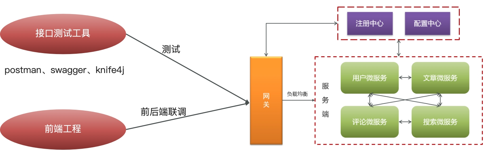
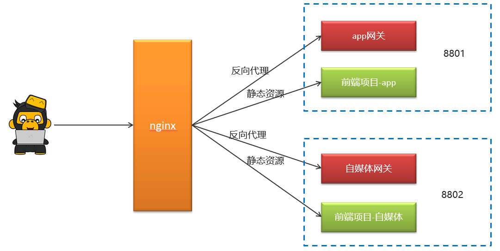
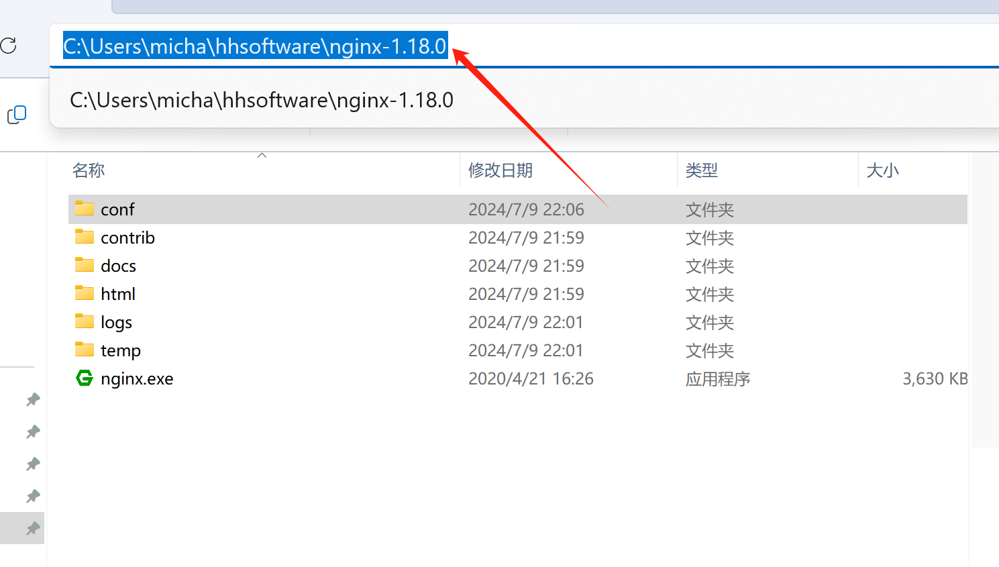

# nginx

## 前后端分离



## 前端项目部署思路

**反向代理及负载均衡**

在一台服务器上部署网站，只有一台服务器，若服务器发生故障，网站就无法运行。

所以在多台服务器上都部署网站。通过访问每个服务器的ip都可以访问网站。



通过nginx来进行配置，功能如下

- 通过nginx的反向代理功能访问后台的网关资源，并且可以设置负载均衡。
- 通过nginx的静态服务器功能访问前端静态页面。

## 配置nginx

1、解压nginx-1.18.0.zip

在下面的地址中输入cmd回车，输入nginx，没报错就说明成功。



2、解压资料文件夹中的前端项目app-web.zip

3、配置nginx.conf文件

在nginx安装的conf目录下新建一个文件夹`leadnews.conf`，在当前文件夹中新建`heima-leadnews-app.conf`文件

heima-leadnews-app.conf配置如下：

```
# 配置反向代理
upstream  heima-app-gateway{
    server localhost:51601; # 网关地址修改（localhost:51601）
}

server {
	listen 8801; # 访问端口修改(8801)
	location / {
		root C:/Users/micha/Documents/java_demo/heima-leadnews/app-web/; #前端项目目录修改
		index index.html;
	}
	
	location ~/app/(.*) {
		proxy_pass http://heima-app-gateway/$1;
		proxy_set_header HOST $host;  # 不改变源请求头的值
		proxy_pass_request_body on;  #开启获取请求体
		proxy_pass_request_headers on;  #开启获取请求头
		proxy_set_header X-Real-IP $remote_addr;   # 记录真实发出请求的客户端IP
		proxy_set_header X-Forwarded-For $proxy_add_x_forwarded_for;  #记录代理信息
	}
}
```

nginx.conf   把里面注释的内容和静态资源配置相关删除，引入heima-leadnews-app.conf文件加载

```
#user  nobody;
worker_processes  1;

events {
    worker_connections  1024;
}
http {
    include       mime.types;
    default_type  application/octet-stream;
    sendfile        on;
    keepalive_timeout  65;
	# 引入自定义配置文件
	include leadnews.conf/*.conf;
}
```

4、启动nginx

​    在nginx安装包中使用命令提示符打开，输入命令nginx启动项目

​    可查看进程，检查nginx是否启动

​    重新加载配置文件：`nginx -s reload`

5、启动app微服务和对应网关

6、打开前端项目进行测试  -- >  http://localhost:8801

​     用谷歌浏览器打开，调试移动端模式进行访问

**通过nginx的虚拟主机功能，使用同一个nginx访问多个项目，其它前端项目配置和上面一样，只是修改对应的网关、端口、前端项目目录。**
