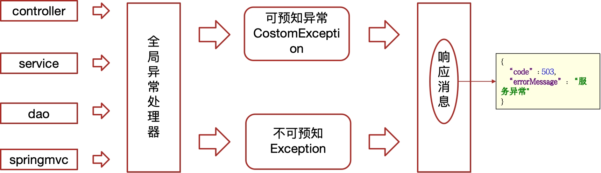

# 工程结构

Create New Project --> Empty Project

Empty Project：作为一个工作空间，相当于一个大文件夹容器，里面放所有的项目（Module模块）。

手动导入jar包的位置：Empty Project|Module|lib|mysql-connector-java-8.0.11.jar|然后右键jar包|Add as Library|

## maven war项目

> Project
>
> - Module
>   - src
>     - main（所有业务代码都放在main下。）
>       - java 源码都放在java里。java文件夹下创建Package（例com.hh.controller），包下面创建类。
>         - com.hh
>           - controller：接受前端的请求，调用service去操作数据库，将数据返回给前端。
>           - mapper
>             - BookMapper.java（接口类）
>           - pojo：实体类pojo包
>             - Book.java（实体类）
>           - service
>             - BookService接口
>             - impl	
>               - BookServiceImpl接口实现类，里面调BookMapper查询数据库
>       - resources （配置文件.properties、.xml资源文件）
>         - com.hh.mapper 映射文件
>           - BookMapper.xml（映射文件）
>         - applicationContext.xml
>         - log4j.properties
>         - mybatis.xml
>         - springmvc.xml
>       - webapp
>         - WEB-INF
>           - web.xml
>         - index.jsp
>     - test 测试代码
>       - java 类似main下的java
>         - com.hh.test
>           - test.java
>       - resources 类似main下的resources
>   - pom.xml 导包的坐标写在这里面。

## 工程主体结构

## xxx父工程

父工程，统一管理项目依赖版本，集成springboot。

### xxx-basic

存放通用的starter

- xxx-file-starter  文件管理starter，MinIO文件管理。

### xxx-common

一些通用的配置（例如：全局异常）

#### constants

常量

#### exception

全局异常



可预知异常：程序员抛出的异常

不可预知异常：系统异常，500、404、空指针等。

### xxx-feign-api

feign对外的接口

- 定义远程接口都在这里面定义，供其它微服务使用。

### xxx-model

- dtos：接口请求的参数
- pojos：数据库实体类
- vo：pc、app、h5等前端传的查询参数个数不一样，pc可能多一点（例如：v1，v2，v3，v4，v5），app少一点（例如：v1，v2，v3）。后端controller根据不同的vo定义不同的接口，service用同一个即可（按照参数最多的定义）。

#### AppHttpCodeEnum

AppHttpCodeEnum.java里面给code和errorMessage赋值。一般结合ResponseResult使用。

#### ResponseResult

ResponseResult是接口开发统一的返回，开发规范，可以表示所有接口返回的规范。

```java
package com.heima.model.common.dtos;

import com.alibaba.fastjson.JSON;
import com.heima.model.common.enums.AppHttpCodeEnum;

import java.io.Serializable;
import java.util.ArrayList;
import java.util.List;

/**
 * 通用的结果返回类，泛型
 * @param <T>
 */
public class ResponseResult<T> implements Serializable {

    private String host;

    private Integer code;

    private String errorMessage;
    //一个是对象，多个是列表
    private T data;

    public ResponseResult() {
        this.code = 200;
    }

    public ResponseResult(Integer code, T data) {
        this.code = code;
        this.data = data;
    }

    public ResponseResult(Integer code, String msg, T data) {
        this.code = code;
        this.errorMessage = msg;
        this.data = data;
    }

    public ResponseResult(Integer code, String msg) {
        this.code = code;
        this.errorMessage = msg;
    }

    public static ResponseResult errorResult(int code, String msg) {
        ResponseResult result = new ResponseResult();
        return result.error(code, msg);
    }

    public static ResponseResult okResult(int code, String msg) {
        ResponseResult result = new ResponseResult();
        return result.ok(code, null, msg);
    }

    public static ResponseResult okResult(Object data) {
        ResponseResult result = setAppHttpCodeEnum(AppHttpCodeEnum.SUCCESS, AppHttpCodeEnum.SUCCESS.getErrorMessage());
        if (data != null) {
            result.setData(data);
        }
        return result;
    }

    public static ResponseResult errorResult(AppHttpCodeEnum enums) {
        return setAppHttpCodeEnum(enums, enums.getErrorMessage());
    }

    public static ResponseResult errorResult(AppHttpCodeEnum enums, String errorMessage) {
        return setAppHttpCodeEnum(enums, errorMessage);
    }

    public static ResponseResult setAppHttpCodeEnum(AppHttpCodeEnum enums) {
        return okResult(enums.getCode(), enums.getErrorMessage());
    }

    private static ResponseResult setAppHttpCodeEnum(AppHttpCodeEnum enums, String errorMessage) {
        return okResult(enums.getCode(), errorMessage);
    }

    public ResponseResult<?> error(Integer code, String msg) {
        this.code = code;
        this.errorMessage = msg;
        return this;
    }

    public ResponseResult<?> ok(Integer code, T data) {
        this.code = code;
        this.data = data;
        return this;
    }

    public ResponseResult<?> ok(Integer code, T data, String msg) {
        this.code = code;
        this.data = data;
        this.errorMessage = msg;
        return this;
    }

    public ResponseResult<?> ok(T data) {
        this.data = data;
        return this;
    }

    public Integer getCode() {
        return code;
    }

    public void setCode(Integer code) {
        this.code = code;
    }

    public String getErrorMessage() {
        return errorMessage;
    }

    public void setErrorMessage(String errorMessage) {
        this.errorMessage = errorMessage;
    }

    public T getData() {
        return data;
    }

    public void setData(T data) {
        this.data = data;
    }

    public String getHost() {
        return host;
    }

    public void setHost(String host) {
        this.host = host;
    }

    public static void main(String[] args) {
        //前置
        /*AppHttpCodeEnum success = AppHttpCodeEnum.SUCCESS;
        System.out.println(success.getCode());
        System.out.println(success.getErrorMessage());*/

        //查询一个对象
        /*Map map = new HashMap();
        map.put("name","zhangsan");
        map.put("age",18);
        ResponseResult result = ResponseResult.okResult(map);
        System.out.println(JSON.toJSONString(result));*/

        //新增，修改，删除  在项目中统一返回成功即可
        /*ResponseResult result = ResponseResult.okResult(AppHttpCodeEnum.SUCCESS);
        System.out.println(JSON.toJSONString(result));*/

        //根据不用的业务返回不同的提示信息  比如：当前操作需要登录、参数错误
        /*ResponseResult result = ResponseResult.errorResult(AppHttpCodeEnum.NEED_LOGIN,"自定义提示信息");
        System.out.println(JSON.toJSONString(result));*/

        //查询分页信息
        PageResponseResult responseResult = new PageResponseResult(1, 5, 50);
        List list = new ArrayList();
        list.add("itcast");
        list.add("itheima");
        responseResult.setData(list);
        System.out.println(JSON.toJSONString(responseResult));
    }
}
```

失败1

```java
{
    "host": null,
    "code": 2,
    "errorMessage": "密码错误",
    "data": null
}
```

失败2

```java
{
    "host": null,
    "code": 1002,
    "errorMessage": "用户不存在",
    "data": null
}
```

成功

```java
{
    "host": null,
    "code": 200,
    "errorMessage": "操作成功",
    "data": {
        "user": {
            "id": 4,
            "name": "admin",
            "phone": "13511223456"
        },
        "token": "eyJhbGciOiJIUzUxMiIsInppcCI6IkdaSVAifQ.H4sIAAAAAAAAAC2L0QrDIAwA_yXPFaqxavs3SQ3MQkGIhY2xf28Ke7vjuC8co8EGKLjvdanOoxQXQ57dmhkdcw6ccSGqESZoNGDzyZc5leRxAr3Ybv3okPPpqqYvaSeZ0VXNqHdjeff_mUN4zmYt_m786DRJgAAAAA.RcSqR7Ii6sNkB-OUSTu6-BgMO5qw5Xu2pVq9s1L2CVe727goJZjp0PdaFUEbWavGu3JhZg-plTuIOGRzZcEVnw"
    }
}
```

##### PageResponseResult

PageResponseResult继承了ResponseResult。

```java
package com.heima.model.common.dtos;

import java.io.Serializable;

public class PageResponseResult extends ResponseResult implements Serializable {
    private Integer currentPage;
    private Integer size;
    private Integer total;

    public PageResponseResult(Integer currentPage, Integer size, Integer total) {
        this.currentPage = currentPage;
        this.size = size;
        this.total = total;
    }

    public PageResponseResult() {

    }


    public int getCurrentPage() {
        return currentPage;
    }

    public void setCurrentPage(int currentPage) {
        this.currentPage = currentPage;
    }

    public int getSize() {
        return size;
    }

    public void setSize(int size) {
        this.size = size;
    }

    public int getTotal() {
        return total;
    }

    public void setTotal(int total) {
        this.total = total;
    }
}
```

### xxx-utils

通用的工具类

### xxx-gateway

管理网关微服务工程。

- xxx-admin-gateway
- xxx-wemedia-gateway
- xxx-app-gateway

右键XxGatewayApplication.java启动某一个网关。

### xxx-service

管理所有微服务工程

- 项目会创建很多的微服务，统一管理微服务
- bootstrap.yml微服务配置，通过Nacos管理。

所有的微服务都是下面结构：

例如heima-leadnews-user微服务：

> src/main/java/com.heima.user
>
> - config
> - interceptor
> - controller.v1
> - mapper
> - service
> - UserApplication.java：每一个微服务都有一个XXXApplication引导类，左键引导类debug启动工程。
>
> src/main/resources
>
> - bootstrap.yml：微服务配置文件。
> - logback.xml：日志文件
> - application.yml：配置类
>

### xxx-test

测试案例
