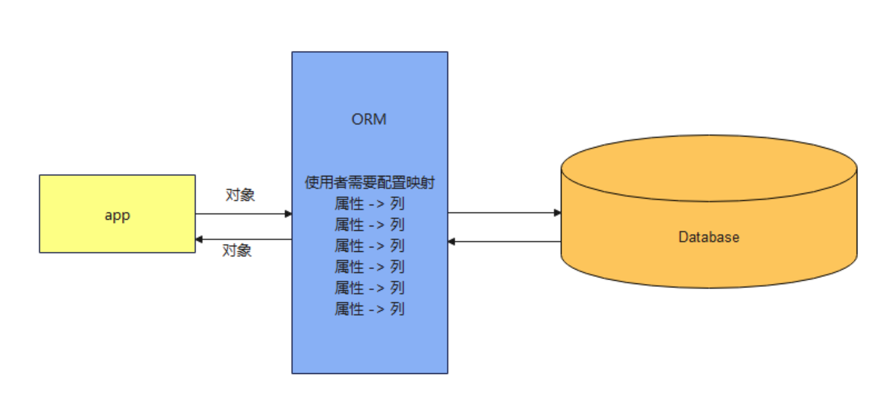

# MyBatis

https://github.com/mybatis/mybatis-3/tree/master?tab=readme-ov-file

mybaits中文网址：https://mybatis.org/mybatis-3/zh_CN/index.html

等效于对之前学习JDBC的MyBatis框架。

每次对数据库增删改操作，都得手动写一大串SQL语句，不仅麻烦还容易出错，此时就需要MyBatis。

MyBatis功能：

- 对SQL语句进行管理。
  - 把SQL语句和Java代码分离开来，放置在单独的配置文件里。管理比较清晰。当程序需要和数据库交互时，只需要告诉MyBatis要做什么，MyBatis就会根据配置文件里的SQL语句去数据库里执行相应的操作。
- 对象关系映射（ORM）

## MyBatis是持久层框架

**持久层**是分层开发中专门负责访问数据源的一层。

把访问数据源的代码和业务逻辑代码分离开，有利于后期维护和团队分工开发。同时也增加了数据访问代码的复用性。

## MyBatis是ORM框架

**ORM**(Object Relation Mapping)，中文名称：**对象关系映射**。是一种解决数据库发展和面向对象编程语言发展不匹配问题而出现的技术。

把数据库中的表和Java中的对象对应起来，数据库中的每一行记录都可以映射成Java中的一个对象。



## MyBatis架构

- SqlSessionFactoryBuilder：负责根据配置文件创建SqlSessionFactory。
- SqlSessionFactory：生产SqlSession。
- SqlSession：负责和数据库进行具体的交互。它可以执行SQL语句（增删改查）。

**Mapper接口和Mapper XML文件**

- Mapper接口：Mapper接口定义了一系列方法。
- Mapper XML文件：里面写着具体的SQL语句。

当程序调用Mapper接口的方法时，MyBatis会根据Mapper XML文件里的SQL语句去数据库里执行相应的操作。

**MyBatis插件扩展功能**

例如：通过插件实现分页查询，性能监控等功能。

## 搭建MyBatis框架

### 1、创建数据库表

直接在MySQL中，创建表和数据。

### 2、创建Maven项目

通过Maven导入对应框架。

### 3、添加依赖

```xml
<!--MySQL依赖，mybatis链接数据库需要mysql驱动-->
<dependency>
    <groupId>mysql</groupId>
    <artifactId>mysql-connector-java</artifactId>
    <version>8.0.28</version>
</dependency>
<!--Mybatis依赖-->
<dependency>
    <groupId>org.mybatis</groupId>
    <artifactId>mybatis</artifactId>
    <version>3.5.6</version>
</dependency>
```

### 4、实体类

Mybatis查询到的数据要封装成对象，对象要依托于类。

### 5、Mapper数据库连接层

 [Mapper数据库连接层](../Java分层/Mapper数据库连接层.md) 

### 6、创建MyBatis全局配置文件

6.1、配置数据库属性文件

在`项目|模块|src|main|resources`中创建`db.properties`文件，后缀名必须是`.properties`。

里面放数据库的配置信息。

数据库的参数和核心配置文件解耦。改数据库的参数在`db.properties`里面改。

```properties
url=jdbc:mysql://localhost:3306/msb?useUnicode=true&characterEncoding=utf-8&useSSL=false&serverTimezone=GMT%2B8&allowPublicKeyRetrieval=true
driver=com.mysql.cj.jdbc.Driver
username=数据库名字
password=数据库密码
```

6.2、在`项目|模块|src|main|resources`中创建`mybatis.xml`文件

```xml
<?xml version="1.0" encoding="UTF-8" ?>
<!--标签约束，xml的标签不能随便写，一旦随便写，代码会出错-->
<!DOCTYPE configuration
        PUBLIC "-//mybatis.org//DTD Config 3.0//EN"
        "https://mybatis.org/dtd/mybatis-3-config.dtd">
<configuration>
    <!--    加载数据库配置文件-->
    <properties resource="db.properties"></properties>
    <!--    别名设置-->
    <typeAliases>
        <typeAlias type="com.hh.pojo.Book" alias="b"></typeAlias>
        <package name="com.hh.pojo"/>
    </typeAliases>

    <!--数据库配置信息-->
    <environments default="mysql">
        <!--链接MySQL数据库的数据源配置-->
        <environment id="mysql">
            <!--配置mybatis中的事务管理-->
            <transactionManager type="JDBC"></transactionManager>
            <dataSource type="POOLED">
                <property name="driver" value="${driver}"/>
                <property name="url" value="${url}"/>
                <property name="username" value="${username}"/>
                <property name="password" value="${password}"/>
            </dataSource>
        </environment>
    </environments>
  
    <!--资源扫描、接口对应的实现类-->
    <mappers>
        <mapper resource="com/hh/mapper/BookMapper.xml"></mapper>
    </mappers>

</configuration>
```

#### 别名设置

MyBatis提供了别名机制可以给**某个类**或**某个包下所有类**起别名，简化resultType取值的写法。

在核心配置文件mybatis.xml中，通过`<typeAlias>`标签明确设置类型的别名。

- type:类型全限定路径
- alias:别名名称

#### 1、具体的类起别名

```xml
<typeAliases>  
    <typeAlias type="com.hh.pojo.Book" alias="b"></typeAlias>
</typeAliases>
```

#### 2、指定的包起别名

当类个数较多时，明确指定别名工作量较大，可以通过`<package>`标签指定包下全部类的别名。指定后所有类的别名就是类名。（也不区分大小写）

```xml
<typeAliases> 
    <package name="com.msb.pojo"/>
</typeAliases>
```

PS:明确指定别名和指定包的方式可以同时存在。

**内置别名**

MyBatis框架中内置了一些常见类型的别名。这些别名不需要配置

| 别名     | 映射的类型 |      | 别名    | 映射的类型 |      | 别名       | 映射的类型 |
| -------- | ---------- | ---- | ------- | ---------- | ---- | ---------- | ---------- |
| _byte    | byte       |      | string  | String     |      | date       | Date       |
| _long    | long       |      | byte    | Byte       |      | decimal    | BigDecimal |
| _short   | short      |      | long    | Long       |      | bigdecimal | BigDecimal |
| _int     | int        |      | short   | Short      |      | object     | Object     |
| _Integer | int        |      | int     | Integer    |      | map        | Map        |
| _double  | double     |      | integer | Integer    |      | hashmap    | HashMap    |
| _float   | float      |      | double  | Double     |      | list       | List       |
| _boolean | boolean    |      | float   | Float      |      | arraylist  | ArrayList  |
|          |            |      | boolean | Boolean    |      | collection | Collection |
|          |            |      |         |            |      | iterator   | Iterator   |

### 7、测试类，启动项目

```java
import com.hh.mapper.BookMapper;
import com.hh.pojo.Book;
import org.apache.ibatis.io.Resources;
import org.apache.ibatis.session.SqlSession;
import org.apache.ibatis.session.SqlSessionFactory;
import org.apache.ibatis.session.SqlSessionFactoryBuilder;

import java.io.IOException;
import java.io.InputStream;
import java.util.List;

public class test {
    public static void main(String[] args) throws IOException {
        //指定核心配置文件的路径：从resources下开始加载，mybatis.xml在resources根目录下，所以直接写mybatis.xml。
        String resource = "mybatis.xml";
        //获取加载配置文件的输入流：
        InputStream inputStream = Resources.getResourceAsStream(resource);
        //加载配置文件，创建工厂类
        SqlSessionFactory sqlSessionFactory = new SqlSessionFactoryBuilder().build(inputStream);
        //通过工厂类获取一个会话：
        SqlSession sqlSession = sqlSessionFactory.openSession();
      
      
	    	/// 1、不使用接口类的情况：
        //执行查询：
        List list0 = sqlSession.selectList("com.hh.mapper.BookMapper.selectAllBooks");
        /// 2、使用接口类的情况：
        //动态代理模式：通过接口找到接口对应的实现类 BookMapper mapper = BookMapper实现类BookMapper.xml
        BookMapper mapper = sqlSession.getMapper(BookMapper.class);
        List list = mapper.selectAllBooks();
        //遍历：
        for (int i = 0; i <= list.size() - 1; i++) {
            Book b = (Book) list.get(i);
            System.out.println(b.getName() + "---" + b.getAuthor());
        }

        Book book = mapper.selectOneBook("java", "jj");
        System.out.println(book.getName());

        //参数传一个对象
        Book b = new Book();
        b.setName("java");
        b.setAuthor("jj");
        Book book1 = mapper.selectOneBook2(b);
        System.out.println(book1.getAuthor());

        Book book2 = mapper.selectOneBook3("java", b);
        System.out.println(book2.getAuthor());

        //插入数据
        Book book3 = new Book();
        book3.setId(3);
        book3.setName("flutter");
        book3.setAuthor("msb");
        book3.setPrice(89);
        int n = mapper.insertBook(book3);
        if (n > 0) {
            System.out.println("插入成功");
        }
        //事务相关操作
        sqlSession.commit();
        //关闭资源：
        sqlSession.close();
    }
}
```

### 参数传递

**使用接口绑定方案之前：**

- 一个参数：直接传递
- 多个参数：封装为对象、集合

**使用接口绑定方法之后：**

可以直接调用方法传递参数即可。

在BookMapper接口文件中定义接口，在BookMapper.xml映射文件中写参数的名字和接口中的要对应。

**获取数据方式-使用内置名称进行调用**

使用符号： `#{}`进行获取

{}中名字使用规则：

- arg0、arg1、argM(M为从0开始的数字，和方法参数顺序对应)
- param1、param2、paramN（N为从1开始的数字，和方法参数顺序对应）。

**一个参数且参数为对象，获取参数如何处理呢？**

使用符号： **#{}**进行获取

直接利用属性名即可

**多个参数且参数有对象，获取参数如何处理呢？**

使用符号： **#{}**进行获取

- argM.属性名
- paramN.属性名

PS：`argM.`或者`paramN.`不可以省略不写

先写接口、再写映射文件。

## 配置

在引导类中添mybatis-plus的分页拦截器

```java
/**
 * 创建并返回一个 MybatisPlusInterceptor 实例。
 * MybatisPlusInterceptor 是 MyBatis-Plus 的插件拦截器，用于添加各种功能插件。
 * PaginationInnerInterceptor 插件用于分页功能，配置了数据库类型为 MySQL。
 */
@Bean
public MybatisPlusInterceptor mybatisPlusInterceptor() {
    MybatisPlusInterceptor interceptor = new MybatisPlusInterceptor();
    interceptor.addInnerInterceptor(new PaginationInnerInterceptor(DbType.MYSQL));
    return interceptor;
}
```
