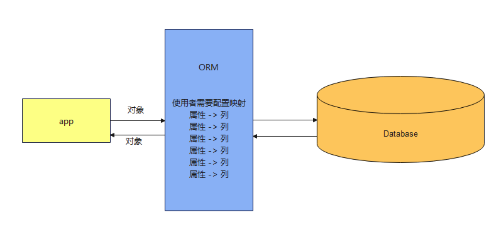

# MyBatis

## hhjava 用户服务中的 MyBatis

`hhjava-user` 使用 MyBatis-Plus 3.5.7，并通过三个 Mapper 访问最小 RBAC 数据模型：

| 表 | Mapper | 当前用途 |
| --- | --- | --- |
| `user` | `UserMapper` | 按用户名查询、插入用户 |
| `user_role` | `UserRoleMapper` | 查询用户的角色关联、插入默认关联 |
| `role` | `RoleMapper` | 按角色 ID 集合加载角色名 |

登录查询链是：

```text
username -> user -> user_role.role_id -> role -> SimpleGrantedAuthority
```

Mapper XML 的外部参数均使用 `#{...}` 绑定，没有把请求值直接拼入 SQL。注册时 `BaseMapper.insert(user)` 依赖自增主键回填 `user.id`，再写入 `user_role`。

当前实现不能直接作为推荐事务模板：

- 插入 `user` 与 `user_role` 没有 `@Transactional`，第二次写入失败会留下无角色用户；
- 默认 `roleId=2L` 硬编码，源码不验证角色是否存在，也没有定义它的业务语义；
- 仓库没有 Flyway/Liquibase/SQL 初始化脚本，不能仅凭实体和 Mapper 保证表、唯一约束及预置角色存在；
- “先查重再插入”不能替代数据库唯一约束，并发注册仍应由唯一键兜底；
- 无角色用户会得到 `roles=null`，后续权限映射可能空指针。

完整注册/登录流程见 [hhjava 项目业务与代码逻辑](../hhjava项目业务与代码逻辑.md)。

[MyBatis 源码](https://github.com/mybatis/mybatis-3)；[MyBatis 中文文档](https://mybatis.org/mybatis-3/zh_CN/index.html)。

等效于对之前学习JDBC的MyBatis框架。

每次对数据库增删改操作，都得手动写一大串SQL语句，不仅麻烦还容易出错，此时就需要MyBatis。

MyBatis功能：

- 对SQL语句进行管理。
  - 把SQL语句和Java代码分离开来，放置在单独的配置文件里。当程序需要和数据库交互时，只需要告诉MyBatis要做什么，MyBatis就会根据配置文件里的SQL语句去数据库里执行相应的操作。
- 对象关系映射（ORM）

## MyBatis是持久层框架

**持久层**是分层开发中专门负责访问数据源的一层。

把访问数据源的代码和业务逻辑代码分离开，有利于后期维护和团队分工开发。同时也增加了数据访问代码的复用性。

## MyBatis是ORM框架

**ORM**（Object Relation Mapping）**对象关系映射**。是一种解决数据库发展和面向对象编程语言发展不匹配问题而出现的技术。

把数据库中的表和Java中的对象对应起来，数据库中的每一行记录都可以映射成Java中的一个对象。



## MyBatis架构

- SqlSessionFactoryBuilder：负责根据配置文件创建SqlSessionFactory。
- SqlSessionFactory：生产SqlSession。
- SqlSession：负责和数据库进行具体的交互，它可以执行SQL语句。

**Mapper接口和Mapper XML文件**

- Mapper接口：定义了一系列方法。
- Mapper XML文件：里面写着具体的SQL语句。

当程序调用Mapper接口的方法时，MyBatis会根据Mapper XML文件里的SQL语句去数据库里执行相应的操作。

**MyBatis插件扩展功能**

例如：通过插件实现分页查询，性能监控等功能。

## 类型别名

MyBatis提供了别名机制可以给**某个类**或**某个包下所有类**起别名，简化resultType取值的写法。

在核心配置文件mybatis.xml中，通过`<typeAlias>`标签明确设置类型的别名。

- type:类型全限定路径
- alias:别名名称

### 1、为具体类设置别名

```xml
<typeAliases>  
    <typeAlias type="com.hh.user.domain.User" alias="user"></typeAlias>
</typeAliases>
```

### 2、为包设置别名

当类个数较多时，明确指定别名工作量较大，可以通过`<package>`标签指定包下全部类的别名。指定后所有类的别名就是类名。（也不区分大小写）

```xml
<typeAliases> 
    <package name="com.hh.user.domain"/>
</typeAliases>
```

PS:明确指定别名和指定包的方式可以同时存在。

**内置别名**

MyBatis框架中内置了一些常见类型的别名。这些别名不需要配置

| 别名     | 映射的类型 |      | 别名    | 映射的类型 |      | 别名       | 映射的类型 |
| -------- | ---------- | ---- | ------- | ---------- | ---- | ---------- | ---------- |
| _byte    | byte       |      | string  | String     |      | date       | Date       |
| _long    | long       |      | byte    | Byte       |      | decimal    | BigDecimal |
| _short   | short      |      | long    | Long       |      | bigdecimal | BigDecimal |
| _int     | int        |      | short   | Short      |      | object     | Object     |
| _Integer | int        |      | int     | Integer    |      | map        | Map        |
| _double  | double     |      | integer | Integer    |      | hashmap    | HashMap    |
| _float   | float      |      | double  | Double     |      | list       | List       |
| _boolean | boolean    |      | float   | Float      |      | arraylist  | ArrayList  |
|          |            |      | boolean | Boolean    |      | collection | Collection |
|          |            |      |         |            |      | iterator   | Iterator   |

## 参数绑定

**使用接口绑定方案之前：**

- 一个参数：直接传递
- 多个参数：封装为对象、集合

**使用接口绑定方法之后：**

可以直接调用方法传递参数即可。

在Mapper接口文件中定义接口，在Mapper.xml映射文件中写参数的名字和接口中的要对应。

**获取数据方式-使用内置名称进行调用**

使用符号： `#{}`进行获取

{}中名字使用规则：

- arg0、arg1、argM(M为从0开始的数字，和方法参数顺序对应)
- param1、param2、paramN（N为从1开始的数字，和方法参数顺序对应）。

**一个参数且参数为对象，获取参数如何处理呢？**

使用符号： **#{}**进行获取

直接利用属性名即可

**多个参数且参数有对象，获取参数如何处理呢？**

使用符号： **#{}**进行获取

- argM.属性名
- paramN.属性名

PS：`argM.`或者`paramN.`不可以省略不写

先写接口、再写映射文件。

## hhjava MyBatis-Plus 分页配置

在引导类中添mybatis-plus的分页拦截器

```java
/**
 * 创建并返回一个 MybatisPlusInterceptor 实例。
 * MybatisPlusInterceptor 是 MyBatis-Plus 的插件拦截器，用于添加各种功能插件。
 * PaginationInnerInterceptor 插件用于分页功能，配置了数据库类型为 MySQL。
 */
@Bean
public MybatisPlusInterceptor mybatisPlusInterceptor() {
    MybatisPlusInterceptor interceptor = new MybatisPlusInterceptor();
    // 显式添加分页插件
    interceptor.addInnerInterceptor(new PaginationInnerInterceptor(DbType.MYSQL));
    return interceptor;
}
```
