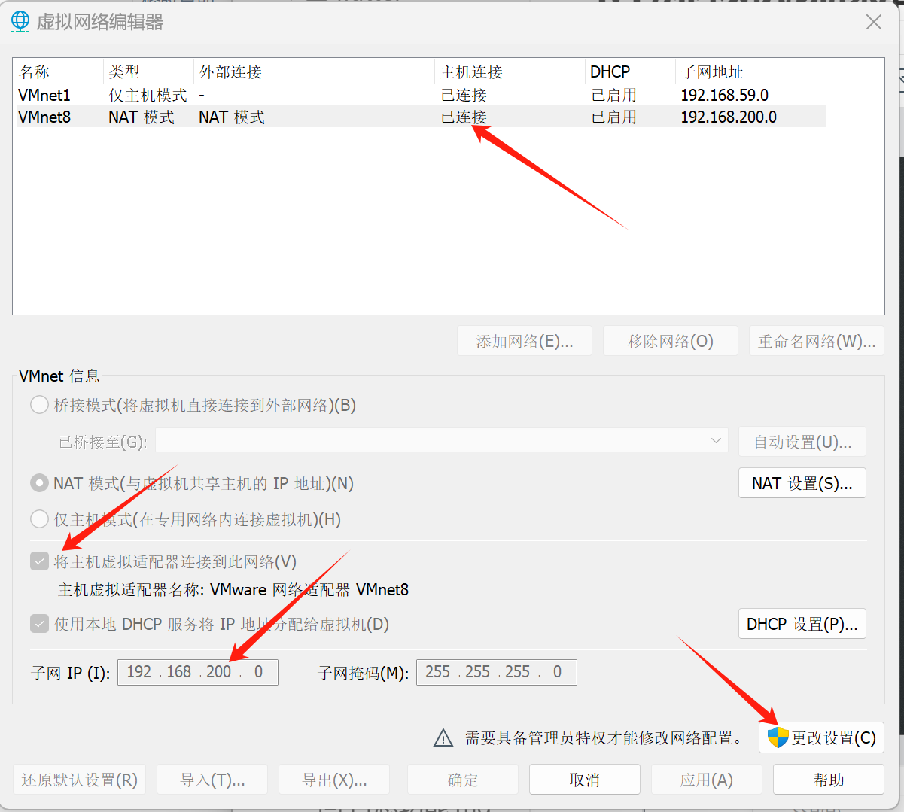

# 环境搭建

| 开发工具           | 版本号             | 安装位置 |
| ------------------ | ------------------ | -------- |
| IntelliJ-IDEA      | 2021.x以上版本     | 个人电脑 |
| JDK                | 1.8.x              | 个人电脑 |
| Maven              | 3.8.x以上版本      | 个人电脑 |
| Git                | 2.37.x             | 个人电脑 |
| VMware-workstation | 16.x               | 个人电脑 |
| CentOS             | 7.x                | 虚拟机   |
| Docker             | 18.09.0            | 虚拟机   |
| Mysql              | 8.x                | docker   |
| nacos              | 1.4.1              | docker   |
| rabbitmq           | 3.8.34             | docker   |
| redis              | 6.2.7              | docker   |
| xxl-job-admin      | 2.3.1              | docker   |
| minio              | RELEASE.2022-09-07 | docker   |
| elasticsearch      | 7.12.1             | docker   |
| kibana             | 7.12.1             | docker   |
| gogs               | 0.13.0             | docker   |
| nginx              | 1.12.2             | docker   |

## 虚拟机

1. 安装VMware

2. VMware打开虚拟机，选择ContOS7-hmtt.vmx文件，先挂载上。

3. VMware-编辑-虚拟网络编辑器，修改虚拟网络地址（NAT），把网段改为200（当前挂载的虚拟机已固定ip地址）

   

4. 指定系统的网络为刚才设置的网络（NAT）。

5. 修改虚拟机的网络模式为NAT

​	

6. 启动虚拟机，**用户名：root  密码：itcast**，当前虚拟机的ip已手动固定（静态IP), 地址为：**192.168.200.130**
7. 使用FinalShell客户端链接

​	

## docker

## 安装Docker

### 1. 更新系统

`sudo yum update -y` 是用来更新系统中所有已安装的软件包和依赖项。具体作用如下：

1. **更新软件包**：下载并安装最新版本的软件包，修复已知的漏洞和错误。
2. **提高系统安全性**：通过应用安全补丁来保护系统免受已知漏洞的攻击。
3. **增强稳定性**：更新可能包含性能改进和功能增强。
4. **自动确认**：`-y` 选项自动确认所有提示，省去手动输入 `yes` 的步骤。

使用这个命令可以确保系统软件处于最新和最安全的状态。

### 2. 安装必要的软件包

```bash
sudo yum install -y yum-utils
```

### 3. 设置 Docker 仓库

```bash
sudo yum-config-manager --add-repo https://download.docker.com/linux/centos/docker-ce.repo
```

### 4. 安装 Docker 引擎

```bash
sudo yum install -y docker-ce docker-ce-cli containerd.io
```

### 5. 启动并设置 Docker 开机自启

```bash
sudo systemctl start docker
sudo systemctl enable docker
```

### 6. 验证安装

运行以下命令确认 Docker 安装成功：

```bash
sudo docker run hello-world
```

### 7. 配置非 root 用户使用 Docker（可选）

如果希望以非 root 用户运行 Docker：

```bash
sudo usermod -aG docker $USER
```

然后退出并重新登录以应用更改。

完成这些步骤后，Docker 应该已经在您的 Alibaba Cloud Linux 3.2104 LTS 系统上成功安装并运行。

启动docker

```sh
systemctl start docker
```

```sh
sh /data/soft/restart.sh
```

### 查看所有镜像

列出所有本地 Docker 镜像的信息，包括镜像仓库、标签、镜像ID、创建时间和大小等。

```shell
docker images
```

该命令用于列出当前正在运行的 Docker 容器。

```sh
docker ps
```

### 搜索容器

xxl-job-admin

```shell
docker search xxl-job-admin
```

### 配置 Docker 使用镜像加速器

由于网络问题，可能需要配置 Docker 使用国内的镜像加速器。例如，使用阿里云的加速器：

1. 登录阿里云，`容器镜像服务--镜像工具--镜像加速器`，获取专属加速器地址。
2. 修改 Docker 配置文件 `/etc/docker/daemon.json`，添加以下内容：

   ```json
   {
     "registry-mirrors": ["https://<your-accelerator-id>.mirror.aliyuncs.com"]
   }
   ```

3. 重启 Docker 服务：

   ```bash
   sudo systemctl daemon-reload
   sudo systemctl restart docker
   ```

## MySQL

在 Docker 中安装 MySQL。

### 1. 拉取 MySQL 镜像

从 Docker Hub 拉取 MySQL 官方镜像：

```bash
docker pull mysql:latest
```

### 2. 运行 MySQL 容器

使用以下命令启动一个 MySQL 容器：

```bash
docker run --name mysql-container -e MYSQL_ROOT_PASSWORD=my-secret-pw -d mysql:latest
```

- `--name mysql-container`：为容器命名。
- `-e MYSQL_ROOT_PASSWORD=my-secret-pw`：设置 MySQL root 用户的密码。
- `-d`：创建一个守护式容器在后台运行，后台运行容器。
- `mysql:latest`：使用最新的 MySQL 镜像。

### 3. 连接到 MySQL 容器

**进入MySQL 容器**

```bash
docker exec -it mysql-container
```

**登录MySQL**

```sh
mysql -u root -p
```

输入密码 `my-secret-pw`。

`exit`：退出连接。

**设置并修改root 可以通过任何客户端连接**

```sh
ALTER USER 'root'@'%' IDENTIFIED WITH mysql_native_password BY 'my-secret-pw';
```

### 4. 持久化数据

为了持久化数据，可以使用卷挂载：

```bash
docker run --name mysql-container -v /my/own/datadir:/var/lib/mysql -e MYSQL_ROOT_PASSWORD=my-secret-pw -d mysql:latest
```

- `/my/own/datadir`：用于存储 MySQL 数据的本地目录。

### 5. 端口映射（可选）

MySQL 只在容器内部的默认端口 3306 上运行，如果需要从主机访问 MySQL，可以映射端口：

```bash
docker run --name mysql-container -p 3306:3306 -e MYSQL_ROOT_PASSWORD=my-secret-pw -d mysql:latest
```

- `-p 3306:3306`：映射端口，将容器的 3306 端口映射到主机的 3306 端口。

可以通过服务器的 IP 地址和端口 3306 访问 MySQL。

## Nacos

Nacos 是一个开源的动态服务发现、配置管理和服务管理平台，由阿里巴巴开源。Nacos 是 "Dynamic Naming and Configuration Service" 的缩写，它为微服务架构提供了关键的基础设施支持。

Nacos 的主要功能包括：

1. **服务发现和服务健康监测**：
   - Nacos 可以帮助服务在注册中心进行注册和发现。服务实例可以通过 Nacos 注册自己，并且其他服务可以通过 Nacos 查找这些服务实例。
   - Nacos 提供了服务健康检查机制，确保服务实例的可用性。

2. **动态配置管理**：
   - Nacos 提供集中化的配置管理功能，允许开发者在一个地方管理所有的配置项。配置的变更可以实时推送到应用程序中。
   - 支持配置的版本管理和灰度发布，方便进行配置的管理和控制。

3. **动态 DNS 服务**：
   - Nacos 提供 DNS 服务，可以将服务发现和 DNS 解析结合起来，方便服务的调用。

4. **服务管理**：
   - 提供服务的元数据管理、流量管理、熔断降级等功能，帮助提升系统的稳定性和可靠性。

Nacos 支持多种服务发现协议（如 HTTP、gRPC、Dubbo 等）和多种配置格式（如 YAML、Properties、JSON 等），并且可以与 Spring Cloud、Kubernetes 等生态系统集成。

**Nacos 的典型应用场景包括微服务架构中的服务注册与发现、配置管理，以及分布式系统中的服务治理。**

Nacos通常安装在Linux服务器上。

Nacos作用：

- 作为注册中心
- 作为配置中心

### Nacos安装

1、docker拉取镜像 

```shell
docker pull nacos/nacos-server:1.2.0
```

2、创建容器

针对nacos镜像创建容器

```shell
docker run --env MODE=standalone --name nacos --restart=always  -d -p 8848:8848 nacos/nacos-server:1.2.0
```

- docker run 启动容器
- MODE=standalone 单机版
- --restart=always 开机启动

3、访问nacos地址：http://192.168.200.130:8848/nacos 

重启容器：

```shell
docker restart 容器id
```

