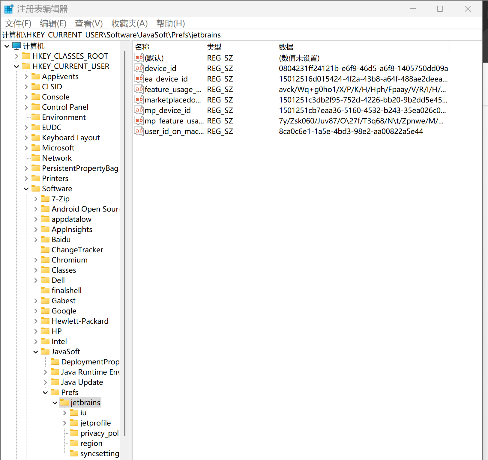

# 环境搭建

| 开发工具           | 版本号             | 安装位置 |
| ------------------ | ------------------ | -------- |
| IntelliJ-IDEA      | 2024               | 个人电脑 |
| JDK                | 1.8.x              | 个人电脑 |
| Maven              | 3.8.8              | 个人电脑 |
| Git                | 2.37.x             | 个人电脑 |
| VMware-workstation | 16.x               | 个人电脑 |
| CentOS             | 7.x                | 虚拟机   |
| Docker             | 18.09.0            | 虚拟机   |
| Mysql              | 8.x                | docker   |
| nacos              | 1.4.1              | docker   |
| rabbitmq           | 3.8.34             | docker   |
| redis              | 6.2.7              | docker   |
| xxl-job-admin      | 2.3.1              | docker   |
| minio              | RELEASE.2022-09-07 | docker   |
| elasticsearch      | 7.12.1             | docker   |
| kibana             | 7.12.1             | docker   |
| gogs               | 0.13.0             | docker   |
| nginx              | 1.12.2             | docker   |

## JDK

https://www.oracle.com/java/technologies/downloads/

https://www.oracle.com/java/technologies/javase-jdk11-downloads.html

Java Development Kit (JDK) 是 Sun 公司（已被 Oracle 收购）针对 Java 开发员的**软件开发工具包**。

Java SE 8（LTS）、Java SE 11（LTS）、Java SE 17（LTS）企业用的比较多，长期支持版本。

JDK（Java Development Kit）是 Java 开发工具包，它是用于开发和运行 Java 程序的核心工具。JDK 包含以下组件：

1. **Java 编译器（javac）**：
   - 将 Java 源代码编译为字节码（.class 文件），这些字节码可以在 Java 虚拟机（JVM）上运行。

2. **Java 运行时环境（JRE）**：
   - 包含 JVM 和 Java 类库，允许你运行 Java 应用程序。

3. **Java 类库**：
   - 一组预定义的类和接口，提供丰富的功能供开发者使用，如数据结构、网络和文件 I/O 等。

4. **开发工具**：
   - 包括调试器（jdb）、文档生成工具（javadoc）、打包工具（jar）等，帮助开发者编写、调试和打包 Java 应用。

JDK 是 Java 开发人员的基本工具，必须安装在开发环境中以编译和运行 Java 程序。

### Mac配置JDK

1. **访问 Oracle 或其他 JDK 提供商的网站**：
   下载所需版本的 JDK 安装包。例如，访问 [Oracle JDK Archive](https://www.oracle.com/java/technologies/javase-jdk11-downloads.html) 找到旧版本。

2. **安装 JDK**：
   下载完成后，双击 `.dmg` 文件并按照安装向导进行安装。

3. **配置环境变量**：
   同样，需要在 `~/.zshrc` 或 `~/.bash_profile` 中设置 `JAVA_HOME`，例如：

   ```bash
   export JAVA_HOME=/Library/Java/JavaVirtualMachines/jdk-11.jdk/Contents/Home
   export PATH="$JAVA_HOME/bin:$PATH"
   ```

4. **刷新配置**：
   运行以下命令以应用更改：

   ```bash
   source ~/.zshrc
   ```

完成这些步骤后，你应该能够使用所需版本的 JDK。可以通过 `java -version` 和 `javac -version` 来验证安装是否成功。

## idea

写代码的工具。https://www.jetbrains.com/

Mac激活：https://flyeric.top/archives/macos-idea-2024-active

卸载：

注册表清理



https://www.exception.site/article/1723

### 快捷键

- ctrl+d：复制一行
- ctrl+y：删除一行
- sout：`System.out.println();`
- alt+Insert：类构造器，可以选择多个属性
- ctrl+i：service的imp类中，实现接口方法。
- alt+enter：为选中的ServiceImpl类，创建测试类。
- alt+shift+t：选中service接口类，会创建对应的测试文件。
- ctrl+alt+m：选中的代码，提取为方法。

## 虚拟机

1. 安装VMware

2. VMware打开虚拟机，选择ContOS7-hmtt.vmx文件，先挂载上。

3. VMware-编辑-虚拟网络编辑器，修改虚拟网络地址（NAT），把网段改为200（当前挂载的虚拟机已固定ip地址）

   

4. 指定系统的网络为刚才设置的网络（NAT）。

5. 修改虚拟机的网络模式为NAT	

6. 启动虚拟机，**用户名：root  密码：itcast**，当前虚拟机的ip已手动固定（静态IP)，地址为：**192.168.200.130**
7. 使用FinalShell客户端链接

   输入虚拟主机ip、端口、用户名、密码，进行连接。

## docker

### 安装Docker

### 1. 更新系统

`sudo yum update -y` 是用来更新系统中所有已安装的软件包和依赖项。具体作用如下：

1. **更新软件包**：下载并安装最新版本的软件包，修复已知的漏洞和错误。
2. **提高系统安全性**：通过应用安全补丁来保护系统免受已知漏洞的攻击。
3. **增强稳定性**：更新可能包含性能改进和功能增强。
4. **自动确认**：`-y` 选项自动确认所有提示，省去手动输入 `yes` 的步骤。

使用这个命令可以确保系统软件处于最新和最安全的状态。

### 2. 安装必要的软件包

```bash
sudo yum install -y yum-utils
```

### 3. 设置 Docker 仓库

```bash
sudo yum-config-manager --add-repo https://download.docker.com/linux/centos/docker-ce.repo
```

### 4. 安装 Docker 引擎

```bash
sudo yum install -y docker-ce docker-ce-cli containerd.io
```

### 5. 启动并设置 Docker 开机自启

```bash
sudo systemctl start docker
sudo systemctl enable docker
```

### 6. 验证安装

运行以下命令确认 Docker 安装成功：

```bash
sudo docker run hello-world
```

### 7. 配置非 root 用户使用 Docker（可选）

如果希望以非 root 用户运行 Docker：

```bash
sudo usermod -aG docker $USER
```

然后退出并重新登录以应用更改。

完成这些步骤后，Docker 应该已经在虚拟机系统上成功安装并运行。

### 启动docker

```sh
systemctl start docker
```

```sh
sh /data/soft/restart.sh
```

### 查看所有镜像

列出所有本地 Docker 镜像的信息，包括镜像仓库、标签、镜像ID、创建时间和大小等。

```shell
docker images
```

该命令用于列出当前正在运行的 Docker 容器。

```sh
docker ps
```

### 搜索容器

xxl-job-admin

```shell
docker search xxl-job-admin
```

### 重启容器

```shell
docker restart 容器id
```

### 配置 Docker 使用镜像加速器

由于网络问题，可能需要配置 Docker 使用国内的镜像加速器。例如，使用阿里云的加速器：

1. 登录阿里云，`容器镜像服务--镜像工具--镜像加速器`，获取专属加速器地址。
2. 修改 Docker 配置文件 `/etc/docker/daemon.json`，添加以下内容：

   ```json
   {
     "registry-mirrors": ["https://<your-accelerator-id>.mirror.aliyuncs.com"]
   }
   ```

3. 重启 Docker 服务：

   ```bash
   sudo systemctl daemon-reload
   sudo systemctl restart docker
   ```

## MySQL

在 Docker 中安装 MySQL。

### 1. 拉取 MySQL 镜像

从 Docker Hub 拉取 MySQL 官方镜像：

```bash
docker pull mysql:latest
```

### 2. 运行 MySQL 容器

使用以下命令启动一个 MySQL 容器：

```bash
docker run --name mysql-container -e MYSQL_ROOT_PASSWORD=my-secret-pw -d mysql:latest
```

- `--name mysql-container`：为容器命名。
- `-e MYSQL_ROOT_PASSWORD=my-secret-pw`：设置 MySQL root 用户的密码。
- `-d`：创建一个守护式容器在后台运行，后台运行容器。
- `mysql:latest`：使用最新的 MySQL 镜像。

### 3. 连接到 MySQL 容器

**进入MySQL 容器**

```bash
docker exec -it mysql-container
```

**登录MySQL**

```sh
mysql -u root -p
```

输入密码 `my-secret-pw`。

`exit`：退出连接。

**设置并修改root 可以通过任何客户端连接**

```sh
ALTER USER 'root'@'%' IDENTIFIED WITH mysql_native_password BY 'my-secret-pw';
```

### 4. 持久化数据

为了持久化数据，可以使用卷挂载：

```bash
docker run --name mysql-container -v /my/own/datadir:/var/lib/mysql -e MYSQL_ROOT_PASSWORD=my-secret-pw -d mysql:latest
```

- `/my/own/datadir`：用于存储 MySQL 数据的本地目录。

### 5. 端口映射

MySQL 只在容器内部的默认端口 3306 上运行，如果需要从主机访问 MySQL，可以映射端口：

**停止并删除现有容器**：

```sh
docker stop mysql-container
docker rm mysql-container
```

**重新启动容器并映射端口**：

```sh
docker run -d --name mysql-container -p 3306:3306 -e MYSQL_ROOT_PASSWORD=my-secret-pw mysql:latest
```

```bash
docker run --name mysql-container -p 3306:3306 -e MYSQL_ROOT_PASSWORD=my-secret-pw -d mysql:latest
```

- `-p 3306:3306`：映射端口，将容器的 3306 端口映射到主机的 3306 端口。

可以通过服务器的 IP 地址和端口 3306 访问 MySQL。

### 连接docker mysql报错

**2003 - Can't connect to MySQL server on 'xx.xxx.xx.xxx' (10061 "Unknown error")**

原因是没有映射端口。

**2059 - Authentication plugin 'caching_sha2_password' cannot be loaded:**

这个错误通常是因为客户端不支持 MySQL 8.0 默认的 `caching_sha2_password` 身份验证插件。你可以通过以下方法解决：

1. **更改 MySQL 用户的身份验证插件**：
   
   在 MySQL 容器中执行以下命令，将用户的身份验证插件改为 `mysql_native_password`：

   ```bash
   docker exec -it mysql-container mysql -u root -p
   ```

   然后在 MySQL 提示符下执行：

   ```sql
   ALTER USER 'youruser'@'%' IDENTIFIED WITH mysql_native_password BY 'yourpassword';
   FLUSH PRIVILEGES;
   ```

   确保替换 `youruser` 和 `yourpassword` 为实际的用户名和密码。

2. **重新配置 MySQL 以使用 `mysql_native_password`**：

   如果你希望新创建的用户默认使用 `mysql_native_password`，可以在 MySQL 配置文件中设置默认身份验证插件。编辑 MySQL 配置文件（如 `my.cnf`），添加以下内容：

   ```ini
   [mysqld]
   default_authentication_plugin=mysql_native_password
   ```

   然后重启 MySQL 容器。

3. **更新客户端**：

   如果可能，更新你的 MySQL 客户端到支持 `caching_sha2_password` 的版本。

完成以上步骤后，重新尝试连接到数据库。

### MySQL自带的系统数据库

1. **information_schema**：提供数据库元数据的访问，比如数据库、表、列的数据类型和访问权限等。

2. **mysql**：包含MySQL服务器的核心数据，比如用户账户、权限设置、系统设置等。

3. **performance_schema**：用于收集数据库服务器性能参数和执行情况的数据。

4. **sys**：提供了一组视图，帮助用户更容易地理解performance_schema中的数据。

这些数据库是MySQL系统正常运行所必需的，不建议修改。

## Nacos

Nacos 是一个开源的动态服务发现、配置管理和服务管理平台，由阿里巴巴开源。Nacos 是 "Dynamic Naming and Configuration Service" 的缩写，它为微服务架构提供了关键的基础设施支持。

Nacos 的主要功能包括：

1. **服务发现和服务健康监测**：
   - Nacos 可以帮助服务在注册中心进行注册和发现。服务实例可以通过 Nacos 注册自己，并且其他服务可以通过 Nacos 查找这些服务实例。
   - Nacos 提供了服务健康检查机制，确保服务实例的可用性。

2. **动态配置管理**：
   - Nacos 提供集中化的配置管理功能，允许开发者在一个地方管理所有的配置项。配置的变更可以实时推送到应用程序中。
   - 支持配置的版本管理和灰度发布，方便进行配置的管理和控制。

3. **动态 DNS 服务**：
   - Nacos 提供 DNS 服务，可以将服务发现和 DNS 解析结合起来，方便服务的调用。

4. **服务管理**：
   - 提供服务的元数据管理、流量管理、熔断降级等功能，帮助提升系统的稳定性和可靠性。

Nacos 支持多种服务发现协议（如 HTTP、gRPC、Dubbo 等）和多种配置格式（如 YAML、Properties、JSON 等），并且可以与 Spring Cloud、Kubernetes 等生态系统集成。

**Nacos 的典型应用场景包括微服务架构中的服务注册与发现、配置管理，以及分布式系统中的服务治理。**

Nacos通常安装在Linux服务器上。

Nacos作用：

- 作为注册中心
- 作为配置中心

### Nacos安装

1、docker拉取镜像 

```shell
docker pull nacos/nacos-server:1.2.0
```

2、创建容器

针对nacos镜像创建容器

```shell
docker run --env MODE=standalone --name nacos --restart=always  -d -p 8848:8848 nacos/nacos-server:1.2.0
```

- docker run 启动容器
- MODE=standalone 单机版
- --restart=always 开机启动

3、访问nacos地址：http://192.168.200.130:8848/nacos 
