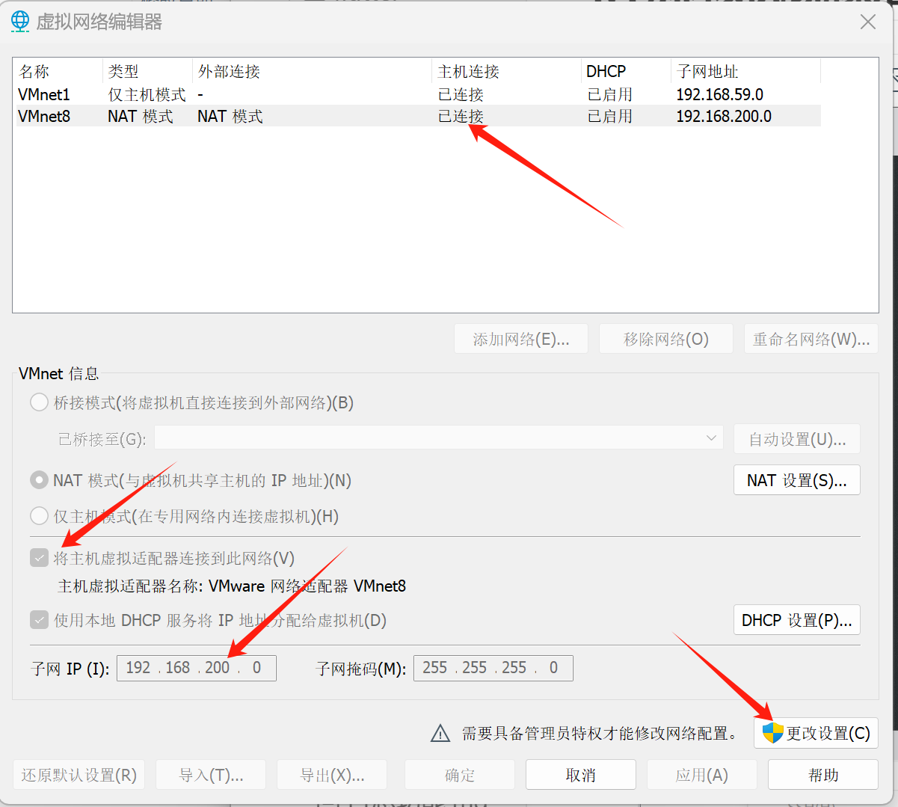
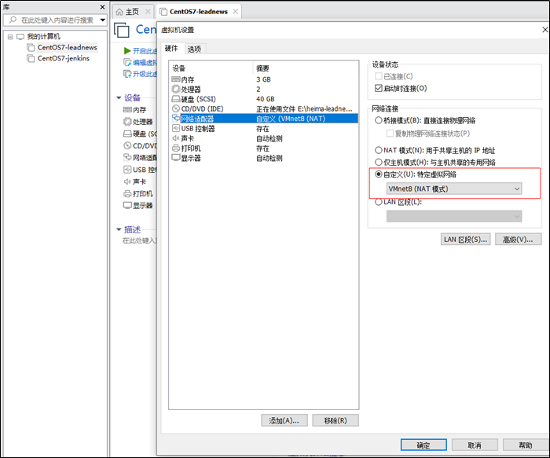

# 环境搭建

| 开发工具           | 版本号             | 安装位置 |
| ------------------ | ------------------ | -------- |
| IntelliJ-IDEA      | 2024               | 个人电脑 |
| JDK                | 17                 | 个人电脑 |
| Maven              | 3.8.8              | 个人电脑 |
| Git                | latest             | 个人电脑 |
| Alibaba Cloud Linux | 4 LTS              | 阿里云 ECS |
| Docker（Moby）     | 系统软件源当前版本 | 阿里云 ECS |
| MySQL              | 8.0                | Docker |
| nacos              | 1.4.1              | Docker |
| rabbitmq           | 3.8.34             | Docker |
| redis              | 6.2.7              | Docker |
| xxl-job-admin      | 2.3.1              | Docker |
| minio              | RELEASE.2022-09-07 | Docker |
| elasticsearch      | 7.12.1             | Docker |
| kibana             | 7.12.1             | Docker |
| gogs               | 0.13.0             | Docker |
| nginx              | 1.12.2             | Docker |

## JDK

https://www.oracle.com/java/technologies/downloads/

`Java Development Kit`是 Sun 公司（已被 Oracle 收购）针对 Java 开发员的**软件开发工具包**，它是用于开发和运行 Java 程序的核心工具。

Java SE 8（LTS）、Java SE 11（LTS）、Java SE 17（LTS）企业用的比较多，长期支持版本。

JDK 包含以下组件：

1. **Java 编译器（javac）**：
   - 将 Java 源代码编译为字节码（.class 文件），这些字节码可以在 Java 虚拟机（JavaVirtualMachines）上运行。

2. **Java 运行时环境（JRE）**：
   - 包含 JVM 和 Java 类库，允许你运行 Java 应用程序。

3. **Java 类库**：
   - 一组预定义的类和接口，提供丰富的功能供开发者使用，如数据结构、网络和文件 I/O 等。

4. **开发工具**：
   - 包括调试器（jdb）、文档生成工具（javadoc）、打包工具（jar）等，帮助开发者编写、调试和打包 Java 应用。

JDK 是 Java 开发人员的基本工具，必须安装在开发环境中以编译和运行 Java 程序。

### Mac配置JDK

1. 下载和安装 JDK。例如，访问 [Oracle JDK Archive](https://www.oracle.com/java/technologies/javase-jdk11-downloads.html) 找到旧版本。

3. **配置环境变量**：
   在 `~/.zshrc` 或 `~/.bash_profile` 中设置 `JAVA_HOME`，例如：

   ```bash
   export JAVA_HOME=/Library/Java/JavaVirtualMachines/jdk-11.jdk/Contents/Home
   export PATH="$JAVA_HOME/bin:$PATH"
   ```

4. 运行以下命令以应用更改：

   ```bash
   source ~/.zshrc
   ```

完成这些步骤后，你应该能够使用所需版本的 JDK。可以通过 `java -version` 和 `javac -version` 来验证安装是否成功。

## idea

写代码的工具。https://www.jetbrains.com/

Mac激活：https://www.quanxiaoha.com/idea-pojie/idea-pojie-202621.html

### 快捷键

- ctrl+d：复制一行
- ctrl+y：删除一行
- sout：`System.out.println();`
- alt+Insert：类构造器，可以选择多个属性
- ctrl+i：service的imp类中，实现接口方法。
- alt+enter：为选中的ServiceImpl类，创建测试类。
- alt+shift+t：选中service接口类，会创建对应的测试文件。
- ctrl+alt+m：选中的代码，提取为方法。

## 虚拟机

1. 安装VMware

2. VMware打开虚拟机，选择ContOS7-hmtt.vmx文件，先挂载上。

3. VMware-编辑-虚拟网络编辑器，修改虚拟网络地址（NAT），把网段改为200（当前挂载的虚拟机已固定ip地址）

   

4. 指定系统的网络为刚才设置的网络（NAT）。

5. 修改虚拟机的网络模式为NAT	

6. 启动虚拟机，**用户名：root  密码：itcast**，当前虚拟机的ip已手动固定（静态IP)，地址为：**192.168.200.130**
7. 使用FinalShell客户端链接

   输入虚拟主机ip、端口、用户名、密码，进行连接。

## 登录 ECS 服务器

下面的 SSH 命令在个人电脑终端中执行；其中 `ECS_PUBLIC_IP` 需要替换为 ECS 实例的实际公网 IP。

### 使用密码登录

在 Mac 中打开“终端”，执行：

```bash
ssh root@ECS_PUBLIC_IP
```

首次连接时会显示服务器指纹确认信息：

```text
Are you sure you want to continue connecting (yes/no/[fingerprint])?
```

确认公网 IP 无误后输入 `yes`，再输入 ECS 操作系统的 `root` 登录密码。输入密码时终端不会显示字符，这是正常现象。

看到类似以下的提示符，说明已进入服务器：

```text
[root@iZxxxxxxxxxxxx ~]#
```

### 使用私钥登录

如果创建 ECS 时选择了密钥对，先将私钥文件权限设置为仅当前用户可读，再连接服务器。以下命令假定私钥文件名为 `ecs-login.pem`：

```bash
chmod 600 ~/Downloads/ecs-login.pem
ssh -i ~/Downloads/ecs-login.pem root@ECS_PUBLIC_IP
```

私钥文件名和保存位置不同时，应相应修改命令。不要把私钥或登录密码提交到 Git 仓库。

### 退出和连接排查

执行以下命令或按 `Control+D` 退出 ECS：

```bash
exit
```

如果连接失败，按错误信息检查：

- `Connection timed out`：确认 ECS 正在运行且公网 IP 正确，并在阿里云安全组入方向允许当前电脑的公网 IP 访问 TCP `22` 端口。不要为了排查而长期允许所有公网地址访问 `22` 端口。
- `Connection refused`：确认 ECS 中的 SSH 服务正在运行，并确认连接端口是否仍为默认的 `22`。
- `Permission denied`：确认用户名、ECS 登录密码或私钥是否正确。本文按 `root` 用户编写；如果实例禁用了 `root` 远程登录，应使用创建实例时配置的实际系统用户。

也可以使用 ECS 控制台的“远程连接”登录服务器。

## Docker

Docker 的安装命令取决于宿主机操作系统；安装完成后的镜像、容器和 Docker Compose 命令基本一致。先确认系统，再选择对应的安装方式。以 `root` 用户登录时可以省略命令中的 `sudo`。

### 不同系统安装部分

#### 确认操作系统

```bash
cat /etc/os-release
```

重点查看 `NAME`、`VERSION_ID` 和 `VERSION_CODENAME`。不要把一个发行版的软件源配置照搬到另一个发行版。

#### Alibaba Cloud Linux 4

##### 安装 Moby（推荐）

Alibaba Cloud Linux 4 默认通过 Moby 提供容器引擎。Moby 提供的 `docker`、`dockerd`、镜像、容器和 API 与 Docker Engine 的日常用法一致。

先删除可能配置错误的 Docker CE 仓库，再通过系统软件源安装：

```bash
sudo rm -f /etc/yum.repos.d/docker*.repo
sudo dnf clean all
sudo dnf makecache
sudo dnf install -y moby docker-compose-plugin
```

##### 安装 Docker CE（可选）

Moby 与 Docker CE 二选一即可，不要同时安装。Alibaba Cloud Linux 4 的 `$releasever` 为 `4`，不能直接使用 Docker 的 CentOS 仓库，否则会访问不存在的 `centos/4` 路径。

需要 Docker CE 时，使用阿里云 ECS 内网镜像，并将仓库版本固定为 Docker 支持的 CentOS 9：

```bash
sudo rm -f /etc/yum.repos.d/docker*.repo
sudo wget -O /etc/yum.repos.d/docker-ce.repo \
  http://mirrors.cloud.aliyuncs.com/docker-ce/linux/centos/docker-ce.repo

sudo sed -i \
  's|https://mirrors.aliyun.com|http://mirrors.cloud.aliyuncs.com|g' \
  /etc/yum.repos.d/docker-ce.repo

sudo sed -i \
  's|$releasever|9|g' \
  /etc/yum.repos.d/docker-ce.repo

sudo dnf clean all
sudo dnf makecache
sudo dnf install -y \
  docker-ce \
  docker-ce-cli \
  containerd.io \
  docker-buildx-plugin \
  docker-compose-plugin
```

如果之前已经安装 Moby，应先卸载 Moby 相关软件包再安装 Docker CE。卸载软件包不会自动删除 `/var/lib/docker/` 中已有的镜像、容器和存储卷，但切换前仍应备份重要数据。

#### Ubuntu

以下命令适用于 Docker 官方当前支持的 64 位 Ubuntu LTS 版本：

```bash
sudo apt update
sudo apt install -y ca-certificates curl
sudo install -m 0755 -d /etc/apt/keyrings
sudo curl -fsSL https://download.docker.com/linux/ubuntu/gpg \
  -o /etc/apt/keyrings/docker.asc
sudo chmod a+r /etc/apt/keyrings/docker.asc

sudo tee /etc/apt/sources.list.d/docker.sources > /dev/null <<EOF
Types: deb
URIs: https://download.docker.com/linux/ubuntu
Suites: $(. /etc/os-release && echo "${UBUNTU_CODENAME:-$VERSION_CODENAME}")
Components: stable
Architectures: $(dpkg --print-architecture)
Signed-By: /etc/apt/keyrings/docker.asc
EOF

sudo apt update
sudo apt install -y \
  docker-ce \
  docker-ce-cli \
  containerd.io \
  docker-buildx-plugin \
  docker-compose-plugin
```

#### Debian

Debian 使用独立的软件源，不要把 Ubuntu 的仓库地址直接用于 Debian：

```bash
sudo apt update
sudo apt install -y ca-certificates curl
sudo install -m 0755 -d /etc/apt/keyrings
sudo curl -fsSL https://download.docker.com/linux/debian/gpg \
  -o /etc/apt/keyrings/docker.asc
sudo chmod a+r /etc/apt/keyrings/docker.asc

sudo tee /etc/apt/sources.list.d/docker.sources > /dev/null <<EOF
Types: deb
URIs: https://download.docker.com/linux/debian
Suites: $(. /etc/os-release && echo "$VERSION_CODENAME")
Components: stable
Architectures: $(dpkg --print-architecture)
Signed-By: /etc/apt/keyrings/docker.asc
EOF

sudo apt update
sudo apt install -y \
  docker-ce \
  docker-ce-cli \
  containerd.io \
  docker-buildx-plugin \
  docker-compose-plugin
```

#### CentOS Stream

Docker 官方当前支持 CentOS Stream 9 和 10，不应在已经停止维护的 CentOS 7 上继续搭建新环境：

```bash
sudo dnf -y install dnf-plugins-core
sudo dnf config-manager --add-repo \
  https://download.docker.com/linux/centos/docker-ce.repo
sudo dnf install -y \
  docker-ce \
  docker-ce-cli \
  containerd.io \
  docker-buildx-plugin \
  docker-compose-plugin
```

Rocky Linux、AlmaLinux 等兼容发行版不应仅根据“兼容 RHEL”就直接照搬命令，应优先查看该发行版和 Docker 的当前支持说明。

### 通用部分

下面的内容适用于已经安装 Docker Engine、Moby 或 Docker Desktop 的环境。Linux 服务器通常由 systemd 管理 Docker 服务；Docker Desktop 的启动和更新由桌面应用管理。

#### 启动与验证

在使用 systemd 的 Linux 中启动 Docker，并设置开机自启：

```bash
sudo systemctl enable --now docker
```

验证 Engine、Compose 和容器运行能力：

```bash
docker version
docker compose version
sudo docker run --rm hello-world
```

如果拉取 `hello-world` 失败，先按照后文配置镜像加速器，再重新执行。

#### 配置镜像加速器

以下 `/etc/docker/daemon.json` 配置适用于 Linux Docker Engine 和 Moby。Docker Desktop 应在应用设置的 Docker Engine 配置中添加同一 JSON 选项。

1. 登录阿里云控制台，进入`容器镜像服务 -> 镜像工具 -> 镜像加速器`，取得账号专属地址。
2. 如果 `/etc/docker/daemon.json` 已存在，先备份并合并配置，不要直接覆盖其中的其他选项。
3. 创建或修改配置：

```bash
sudo mkdir -p /etc/docker
sudo vi /etc/docker/daemon.json
```

```json
{
  "registry-mirrors": [
    "https://<your-accelerator-id>.mirror.aliyuncs.com"
  ]
}
```

重启 Docker 并检查配置：

```bash
# 先检查 JSON 语法，避免因配置错误导致 Docker 无法启动
python3 -m json.tool /etc/docker/daemon.json > /dev/null

sudo systemctl daemon-reload
sudo systemctl restart docker
docker info | sed -n '/Registry Mirrors/,+5p'
```

在输出的 `Registry Mirrors` 中看到专属地址，说明配置已生效。

> 阿里云 ACR 官方说明当前镜像加速器已停止同步最新镜像，因此已配置加速器也不能保证所有新标签都能拉取。生产环境应将已验证的镜像同步到自己的 ACR 仓库，不要长期依赖 Docker Hub 实时拉取。

#### 配置非 root 用户（可选）

`docker` 用户组可以控制具有 root 权限的 Docker daemon，因此加入该组基本等同于获得 root 权限，只应添加可信用户。

```bash
sudo usermod -aG docker <username>
```

退出并重新登录，或者执行 `newgrp docker`，使用户组变更生效。当前已经使用 `root` 用户时不需要执行这一步。

#### 常用命令

```bash
# 查看镜像
docker image ls

# 查看运行中的容器
docker container ls

# 查看全部容器
docker container ls -a

# 查看并持续跟踪日志
docker logs -f <container_name>

# 启动、停止、重启和删除指定容器
docker start <container_name>
docker stop <container_name>
docker restart <container_name>
docker rm <container_name>

# 查看 Docker 服务状态
systemctl status docker
```

不要在未确认影响范围时批量重启所有容器。生产或长期运行的服务应使用 Docker Compose 管理。

#### Docker Compose

常用操作：

```bash
# 创建并在后台启动服务
docker compose up -d

# 查看服务状态和日志
docker compose ps
docker compose logs -f

# 重启指定服务
docker compose restart <service_name>

# 停止并删除容器和网络，默认保留命名卷
docker compose down
```

## MySQL

### 选择安装方式

MySQL 安装在 ECS 服务器上，可以原生运行，也可以运行在 Docker 容器中。

| 方案 | 适用场景 | 注意事项 |
| --- | --- | --- |
| Alibaba Cloud Linux 4 原生安装 | 单台 ECS、个人项目、Java 服务直接运行在宿主机 | 使用系统仓库的 MySQL 8.0，不依赖 Docker Hub，当前推荐 |
| Docker Compose 安装 | 应用和数据库都用容器管理 | 使用 MySQL 8.0，当前已在阿里云镜像加速环境验证 |
| RDS MySQL | 正式业务、希望减少备份和运维工作 | 费用更高，但备份、监控和可用性由云服务管理 |

### 方案一：Alibaba Cloud Linux 4 原生安装（推荐）

阿里云当前在 Alibaba Cloud Linux 4 软件源中维护 MySQL 8.0。先确认操作系统和仓库中的实际版本：

```bash
cat /etc/os-release
sudo dnf makecache
sudo dnf info mysql-server
```

如果能查到 `mysql-server` 包，直接安装并启动：

```bash
sudo dnf install -y mysql-server
sudo systemctl enable --now mysqld

mysql --version
sudo systemctl status mysqld --no-pager
```

如果 `dnf info mysql-server` 提示找不到软件包，先检查当前启用的 Alibaba Cloud Linux 4 软件源，不要改用 CentOS 仓库：

```bash
sudo dnf repolist
sudo dnf search mysql-server
```

完成 MySQL 安全初始化：

```bash
sudo mysql_secure_installation
```

不同软件包的 root 账号初始方式可能不同。如果命令要求输入初始密码，可先查看日志：

```bash
sudo grep -i 'temporary password' /var/log/mysqld.log
```

为业务创建独立数据库和账号，不要让 Java 程序使用 root：

```bash
mysql -uroot -p
```

```sql
CREATE DATABASE app CHARACTER SET utf8mb4 COLLATE utf8mb4_0900_ai_ci;
CREATE USER 'app'@'127.0.0.1' IDENTIFIED BY '请替换为高强度密码';
GRANT ALL PRIVILEGES ON app.* TO 'app'@'127.0.0.1';
EXIT;
```

这组账号设置假定 Java 服务直接运行在 ECS 宿主机，连接地址为：

```text
jdbc:mysql://127.0.0.1:3306/app
```

ECS 安全组不要向公网开放 `3306`。如果 Java 服务在 Docker 容器中，优先使用后面的 Compose 方案将应用与 MySQL 加入同一个 Docker 网络，或者使用 RDS。

### 方案二：Docker Compose 安装 MySQL 8.0（可选）

MySQL 在 ECS 的 Docker 容器中运行，数据保存在 ECS 的 Docker 数据卷中。在正式创建容器前，必须先确认 ECS 能从 Docker Hub 或可信的自有 ACR 仓库获取 MySQL 镜像。

**本节后面的所有命令都在 ECS 服务器中执行。** 可先检查 Docker 和 Compose 是否已安装：

```bash
docker version
docker compose version
```

如果命令不存在，先按前文“Docker -> Alibaba Cloud Linux 4 -> 安装 Moby”完成安装，再继续本节。

#### 安装方式

本节不会在 ECS 宿主机上执行 `yum install mysql`。`docker compose pull` 会在 ECS 上下载 MySQL 官方镜像，`docker compose up -d` 会在 ECS 上创建数据卷、网络和容器，并初始化数据库。

不要使用 `mysql:latest`，避免重新部署时意外升级到不兼容的 MySQL 大版本。

#### 1. 创建配置目录

```bash
sudo mkdir -p /opt/mysql
sudo chown "$USER":"$USER" /opt/mysql
cd /opt/mysql
```

MySQL 配置、环境变量和备份都统一放在 `/opt/mysql`；数据本身保存在后面定义的 Docker 命名卷中。

#### 2. 创建和使用 `.env`

`.env` 是普通文本文件，用于将密码等可变配置与 `compose.yaml` 分开。在 `/opt/mysql` 中创建文件并限制读取权限：

```bash
cd /opt/mysql
touch .env
chmod 600 .env
vi .env
```

可以先执行两次以下命令，分别生成 root 密码和业务账号密码：

```bash
openssl rand -base64 24
```

将生成的密码填入 `.env`：

```dotenv
MYSQL_ROOT_PASSWORD=请替换为高强度root密码
MYSQL_DATABASE=app
MYSQL_USER=app
MYSQL_PASSWORD=请替换为高强度业务密码
```

注意：

- 变量名与值之间使用 `=`，两侧不要加空格。
- Docker Compose 会自动读取与 `compose.yaml` 同目录的 `.env`，并用其中的值替换 `${变量名}`。
- `.env` 保存的是明文密码，不要共享、不要提交到 Git 仓库。如果将这套配置放入仓库，应在 `.gitignore` 中加入 `.env`。
- 可以使用 `docker compose config --quiet` 检查配置和必填变量。不要共享 `docker compose config` 的完整输出，其中可能包含已解析的密码。

#### 3. 创建 Compose 配置

创建 `/opt/mysql/compose.yaml`：

```yaml
services:
  mysql:
    image: ${MYSQL_IMAGE:-mysql:8.0}
    container_name: mysql
    restart: unless-stopped
    environment:
      MYSQL_ROOT_PASSWORD: ${MYSQL_ROOT_PASSWORD:?请在.env中设置MYSQL_ROOT_PASSWORD}
      MYSQL_DATABASE: ${MYSQL_DATABASE:-app}
      MYSQL_USER: ${MYSQL_USER:-app}
      MYSQL_PASSWORD: ${MYSQL_PASSWORD:?请在.env中设置MYSQL_PASSWORD}
      TZ: Asia/Shanghai
    volumes:
      - mysql_data:/var/lib/mysql
    healthcheck:
      test: ["CMD-SHELL", "mysqladmin ping -h localhost -uroot -p$$MYSQL_ROOT_PASSWORD"]
      interval: 10s
      timeout: 5s
      retries: 10
      start_period: 30s
    networks:
      - backend

volumes:
  mysql_data:

networks:
  backend:
```

这个配置不会把 MySQL 端口暴露到公网。Java 服务也部署在 Docker 中时，将它加入同一个 `backend` 网络，并使用以下地址连接：

```text
jdbc:mysql://mysql:3306/app
```

如果只需要在 Mac 的 IDEA Database 工具中通过 ECS 公网 IP 直接连接 MySQL，可以在 MySQL 服务中增加以下端口映射：

```yaml
ports:
  - "0.0.0.0:3306:3306"
```

端口映射格式为 `ECS监听地址:ECS端口:容器端口`：

- `0.0.0.0`：监听 ECS 的所有网络接口，使公网 IP 在安全组放行后能够访问该端口。
- 第一个 `3306`：ECS 对外提供的端口。
- 第二个 `3306`：Docker 容器内 MySQL 监听的端口。

`ports` 必须位于 `mysql` 服务内部，并与 `image`、`environment`、`volumes` 等配置保持同一级缩进。

该配置会让 MySQL 监听 ECS 的所有网络接口。必须在阿里云安全组中只允许当前 Mac 的公网 IP（`IP/32`）访问 TCP `3306`，禁止将来源设置为 `0.0.0.0/0`，并且不要使用 MySQL `root` 用户远程连接。

#### 4. 安装、启动和检查 MySQL

```bash
cd /opt/mysql

# 检查 Compose 配置和 .env 必填变量
docker compose config --quiet

# 下载 MySQL 8.0 官方镜像
docker compose pull mysql

# 创建并启动 MySQL 容器
docker compose up -d

# 查看容器状态和初始化日志
docker compose ps
docker compose logs -f mysql
```

首次启动时，MySQL 会创建 `MYSQL_DATABASE`、`MYSQL_USER` 和对应密码。日志显示服务就绪后，按 `Ctrl+C` 退出日志跟踪，不会停止容器。

健康检查通过后，进入 MySQL 客户端：

```bash
docker compose exec mysql mysql -uapp -p app
```

输入 `.env` 中的 `MYSQL_PASSWORD`。使用 `exit` 退出 MySQL 客户端。

#### 5. IDEA Database 工具通过公网 IP 直接连接

先确认 `compose.yaml` 已按前文配置 `0.0.0.0:3306:3306`，然后在 ECS 中重新应用配置并检查端口映射：

```bash
cd /opt/mysql
docker compose up -d mysql
docker compose ps
docker compose port mysql 3306
```

端口映射正常时，`docker compose ps` 的 `PORTS` 列会包含：

```text
0.0.0.0:3306->3306/tcp
```

`docker compose port mysql 3306` 会显示：

```text
0.0.0.0:3306
```

如果 `PORTS` 列只有 `3306/tcp, 33060/tcp`，并且端口查询返回 `:0`，说明容器内的 MySQL 虽然已经监听 `3306`，但端口尚未发布到 ECS。检查 `ports` 的位置和缩进后，再次执行 `docker compose up -d mysql`。不要执行 `docker compose down -v`，因为 `-v` 会删除 MySQL 数据卷。

在阿里云 ECS 安全组中添加入方向规则：

- 协议：TCP
- 目的端口：`3306`
- 来源：当前 Mac 的公网 IP，并使用 `/32` 掩码
- 授权策略：允许

家庭或办公网络的公网 IP 发生变化后，需要同步更新安全组规则。不要使用 `0.0.0.0/0` 向整个公网开放 MySQL。

在 IDEA 的 Database 工具中创建 MySQL 数据源，并填写：

- Host：ECS 的实际公网 IP
- Port：`3306`
- Authentication：`User & Password`
- User：`app`
- Password：ECS `/opt/mysql/.env` 中的 `MYSQL_PASSWORD`
- Database：`app`
- URL：`jdbc:mysql://ECS_PUBLIC_IP:3306/app?sslMode=REQUIRED`

URL 中的 `ECS_PUBLIC_IP` 需要替换为 ECS 的实际公网 IP。如果 IDEA 提示 URL 会覆盖上方设置，应确保 URL 中的公网 IP、端口和数据库名与上方字段一致。

在 `SSH/SSL` 页面中不要启用 SSH tunnel；应启用 SSL，并将 SSL mode 设置为 `Require`。然后返回 `General` 页面，点击 `Test Connection` 测试连接。公网直连不应通过设置 `sslMode=DISABLED` 来绕过 TLS 错误；如果 TLS 连接失败，应先为 MySQL 正确配置服务器证书。

常见错误：

- `Communications link failure` 或连接超时：检查容器端口映射、ECS 安全组来源 IP 和 ECS 系统防火墙。
- `Access denied for user`：检查 `app` 用户密码。MySQL 数据卷已初始化后，仅修改 `.env` 不会改变数据库中的现有密码。
- SSL 连接错误：检查 MySQL 服务端 TLS 配置和 IDEA 的 SSL mode，不要改用无加密的公网连接。

#### `.env` 修改后如何生效

- 首次启动前：修改 `.env` 后执行 `docker compose up -d` 即可。
- 普通 Compose 配置变更：修改 `.env` 后再次执行 `docker compose up -d`，Compose 会在需要时重建容器。
- MySQL 已经初始化后：`MYSQL_ROOT_PASSWORD` 和 `MYSQL_PASSWORD` 只用于空数据目录的首次初始化。数据卷中已有数据时，只修改 `.env` 不会修改数据库账号密码，应先在 MySQL 中使用 `ALTER USER` 修改密码，再同步更新 `.env`。

不要为了修改密码执行 `docker compose down -v`；`-v` 会删除 MySQL 数据卷及其中的数据。

#### 认证插件错误

MySQL 8.0 默认使用 `caching_sha2_password`。如果客户端出现以下错误：

```text
Authentication plugin 'caching_sha2_password' cannot be loaded
```

应升级 MySQL 客户端或 Java 的 MySQL Connector/J 驱动，不要为了兼容旧客户端而把账号降级为 `mysql_native_password`。该插件在 MySQL 8.0.34 开始弃用，在 MySQL 8.4 中默认禁用，并已在 MySQL 9.0 中移除。

#### 备份数据库

云盘快照不能替代数据库逻辑备份。创建备份目录并导出业务数据库：

```bash
sudo mkdir -p /opt/mysql/backups
cd /opt/mysql

docker compose exec -T mysql sh -c \
  'exec mysqldump --single-transaction -uapp -p"$MYSQL_PASSWORD" app' \
  > "backups/app-$(date +%F-%H%M%S).sql"
```

应通过定时任务执行备份，并将备份文件复制到其他存储位置；不要只保存在同一块 ECS 云盘中。

### 官方资料

- [阿里云：在 Linux 上安装 Docker 和 Docker Compose](https://help.aliyun.com/zh/ecs/user-guide/install-and-use-docker)
- [Docker：选择操作系统安装 Docker Engine](https://docs.docker.com/engine/install/)
- [Docker：在 Ubuntu 上安装](https://docs.docker.com/engine/install/ubuntu/)
- [Docker：在 Debian 上安装](https://docs.docker.com/engine/install/debian/)
- [Docker：在 CentOS Stream 上安装](https://docs.docker.com/engine/install/centos/)
- [Docker：Linux 安装后的配置](https://docs.docker.com/engine/install/linux-postinstall/)
- [Docker：配置 Docker Hub 镜像缓存](https://docs.docker.com/docker-hub/image-library/mirror/)
- [Docker Compose：`.env` 变量插值](https://docs.docker.com/compose/how-tos/environment-variables/variable-interpolation/)
- [阿里云 ACR：配置镜像加速器](https://help.aliyun.com/zh/acr/user-guide/accelerate-the-pulls-of-docker-official-images)
- [阿里云 ACR：通过制品订阅获取海外源镜像](https://help.aliyun.com/zh/acr/user-guide/subscribe-to-image-tags)
- [阿里云：Alibaba Cloud Linux 4 与 3 的区别](https://help.aliyun.com/zh/alinux/getting-started/differences-between-alinux-4-and-3)
- [阿里云：Alibaba Cloud Linux 4 镜像发布记录](https://help.aliyun.com/zh/alinux/product-overview/alibaba-cloud-linux-4-image-release-notes)
- [Docker Hub：MySQL 官方镜像](https://hub.docker.com/_/mysql/)
- [MySQL：认证插件说明](https://dev.mysql.com/doc/refman/8.0/en/native-pluggable-authentication.html)

### MySQL自带的系统数据库

1. **information_schema**：提供数据库元数据的访问，比如数据库、表、列的数据类型和访问权限等。

2. **mysql**：包含MySQL服务器的核心数据，比如用户账户、权限设置、系统设置等。

3. **performance_schema**：用于收集数据库服务器性能参数和执行情况的数据。

4. **sys**：提供了一组视图，帮助用户更容易地理解performance_schema中的数据。

这些数据库是MySQL系统正常运行所必需的，不建议修改。
