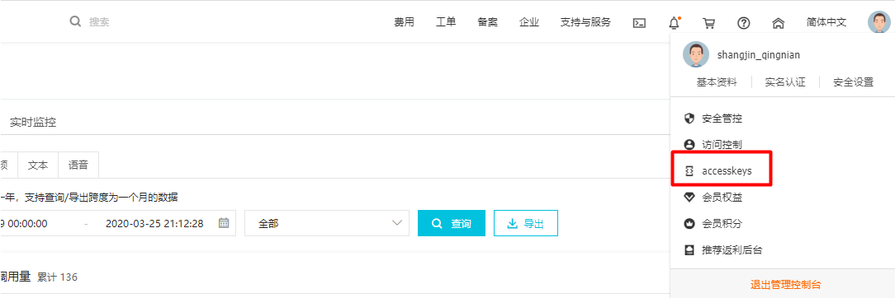
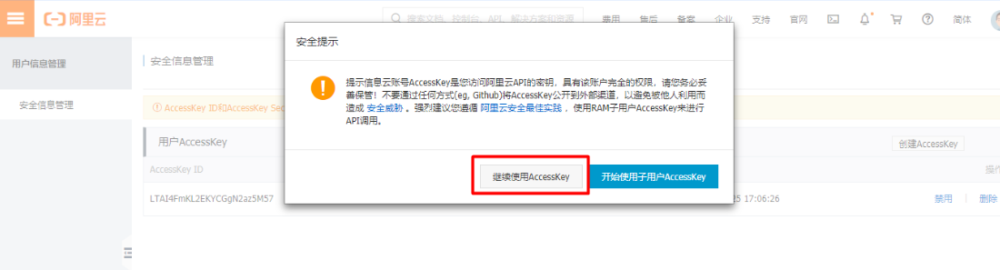
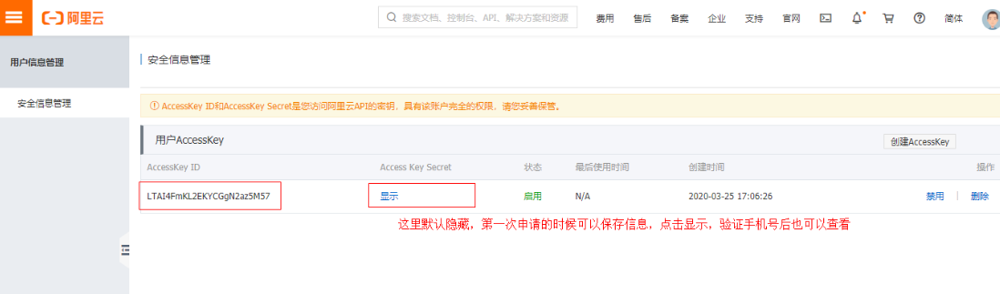
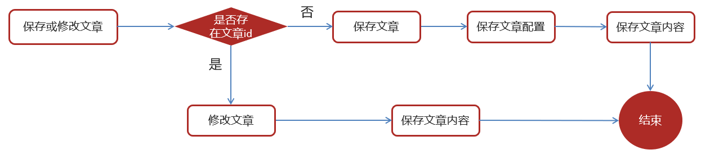
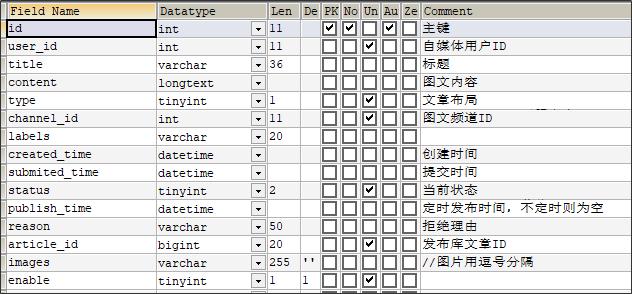
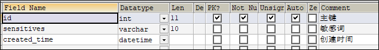
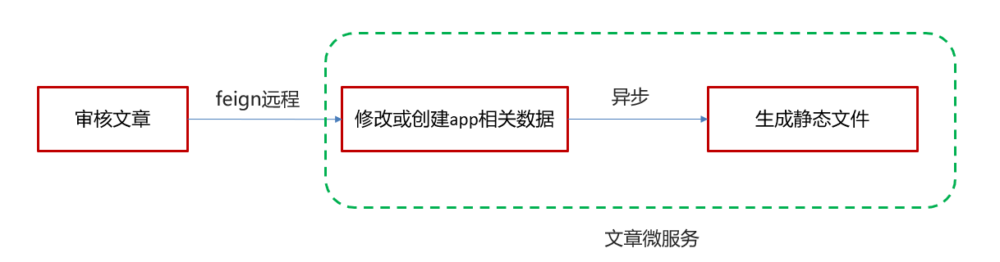

# 自媒体文章-自动审核

## 文章数据流

1. 自媒体微服务：自媒体端发布文章。
2. 提交审核，通过文本和图片的审核，审核成功之后。
3. 文章微服务：用户就可以查看文章。

## 内容安全第三方接口

### 概述

内容安全是识别服务，支持对图片、视频、文本、语音等对象进行多样化场景检测，有效降低内容违规风险。

目前很多平台都支持内容检测，如阿里云、腾讯云、百度AI、网易云等国内大型互联网公司都对外提供了API。

### 准备工作

在使用内容检测API之前，需要先注册阿里云账号，添加Access Key并签约云盾内容安全。

**操作步骤**

1. 前往[阿里云官网](https://www.aliyun.com/)注册登录账号。

2. 打开[云盾内容安全产品试用页面](https://promotion.aliyun.com/ntms/act/lvwangdemo.html)，单击立即开通，正式开通服务。

3. 在[AccessKey管理页面](https://ak-console.aliyun.com/#/accesskey)管理您的AccessKeyID和AccessKeySecret。后期调用接口的时候需要用到。

   

   管理自己的AccessKey,可以新建和删除AccessKey

   

   查看自己的AccessKey，

   AccessKey默认是隐藏的，第一次申请的时候可以保存AccessKey，点击显示，通过验证手机号后也可以查看

   

### 文本内容审核接口

文本垃圾内容检测：https://help.aliyun.com/document_detail/70439.html?spm=a2c4g.11186623.6.659.35ac3db3l0wV5k 

文本垃圾内容Java SDK: https://help.aliyun.com/document_detail/53427.html?spm=a2c4g.11186623.6.717.466d7544QbU8Lr 

### 图片审核接口

图片垃圾内容检测：https://help.aliyun.com/document_detail/70292.html?spm=a2c4g.11186623.6.616.5d7d1e7f9vDRz4 

图片垃圾内容Java SDK: https://help.aliyun.com/document_detail/53424.html?spm=a2c4g.11186623.6.715.c8f69b12ey35j4 

### 项目集成阿里云内容安全接口

1、heima-leadnews-common的pom.xml中导入依赖

```xml
        <dependency>
            <groupId>com.aliyun</groupId>
            <artifactId>aliyun-java-sdk-core</artifactId>
        </dependency>
        <dependency>
            <groupId>com.aliyun</groupId>
            <artifactId>aliyun-java-sdk-green</artifactId>
        </dependency>
```

2、拷贝资料文件夹aliyun中的类到common模块下面，包括了GreenImageScan和GreenTextScan及对应的工具类。

并添加到`heima-leadnews\heima-leadnews\heima-leadnews-common\src\main\resources\META-INF\spring.factories`自动配置中

```properties
org.springframework.boot.autoconfigure.EnableAutoConfiguration=\
  com.heima.common.exception.ExceptionCatch,\
  com.heima.common.aliyun.GreenTextScan,\
  com.heima.common.aliyun.GreenImageScan
```

3、accessKeyId和secret（需自己申请）

在heima-leadnews-wemedia中的nacos配置中心添加以下配置：

```yaml
aliyun:
 accessKeyId:
 secret:
#aliyun.scenes=porn,terrorism,ad,qrcode,live,logo
 scenes: terrorism
```

4、在自媒体微服务中测试类中注入审核文本和图片的bean进行测试

```java
package com.heima.wemedia;

import com.heima.common.aliyun.GreenImageScan;
import com.heima.common.aliyun.GreenTextScan;
import com.heima.file.service.FileStorageService;
import org.junit.Test;
import org.junit.runner.RunWith;
import org.springframework.beans.factory.annotation.Autowired;
import org.springframework.boot.test.context.SpringBootTest;
import org.springframework.test.context.junit4.SpringRunner;

import java.util.Arrays;
import java.util.Map;

@SpringBootTest(classes = WemediaApplication.class)
@RunWith(SpringRunner.class)
public class AliyunTest {

    @Autowired
    private GreenTextScan greenTextScan;

    @Autowired
    private GreenImageScan greenImageScan;

    @Autowired
    private FileStorageService fileStorageService;

    @Test
    public void testScanText() throws Exception {
        Map map = greenTextScan.greeTextScan("我是一个好人,冰毒");
        System.out.println(map);
    }

    @Test
    public void testScanImage() throws Exception {
        byte[] bytes = fileStorageService.downLoadFile("http://192.168.200.130:9000/leadnews/2021/04/26/ef3cbe458db249f7bd6fb4339e593e55.jpg");
        Map map = greenImageScan.imageScan(Arrays.asList(bytes));
        System.out.println(map);
    }
}
```

## app端文章保存接口

### 表结构说明

下面三张表一对一的关系。

ap_article 文章信息表


ap_article_config  文章配置表


ap_article_content 文章内容表


### 分布式id

 [分布式id](分布式id.md) 

### 思路分析

在文章审核成功以后需要在app的article库中新增文章数据

1. 保存文章信息 ap_article
2. 保存文章配置信息 ap_article_config
3. 保存文章内容 ap_article_content

实现思路：



### feign接口

因为是供自媒体微服务远程调用的，所以需要提供一个接口。

|          | **说明**             |
| -------- | -------------------- |
| 接口路径 | /api/v1/article/save |
| 请求方式 | POST                 |
| 参数     | ArticleDto           |
| 响应结果 | ResponseResult       |

ArticleDto

```java
package com.heima.model.article.dtos;

import com.heima.model.article.pojos.ApArticle;
import lombok.Data;

@Data
public class ArticleDto  extends ApArticle {
    /**
     * 文章内容
     */
    private String content;
}
```

成功：

data是文章id

```json
{
  "code": 200,
  "errorMessage" : "操作成功",
  "data":"1302864436297442242"
 }
```

失败：

```json
{
  "code":501,
  "errorMessage":"参数失效",
 }
```

```json
{
  "code":501,
  "errorMessage":"文章没有找到",
 }
```

#### 功能实现：

①：在heima-leadnews-feign-api中新增接口

第一：导入feign的依赖

```xml
<dependency>
    <groupId>org.springframework.cloud</groupId>
    <artifactId>spring-cloud-starter-openfeign</artifactId>
</dependency>
```

第二：定义文章端的接口

```json
package com.heima.apis.article;

import com.heima.model.article.dtos.ArticleDto;
import com.heima.model.common.dtos.ResponseResult;
import org.springframework.cloud.openfeign.FeignClient;
import org.springframework.web.bind.annotation.PostMapping;
import org.springframework.web.bind.annotation.RequestBody;

import java.io.IOException;


@FeignClient(value = "leadnews-article")//远程接口，指定服务的名称
public interface IArticleClient {

    @PostMapping("/api/v1/article/save")
    public ResponseResult saveArticle(@RequestBody ArticleDto dto) ;
}
```

②：在heima-leadnews-article文章微服务中实现该方法

```java
package com.heima.article.feign;

import com.heima.apis.article.IArticleClient;
import com.heima.article.service.ApArticleService;
import com.heima.model.article.dtos.ArticleDto;
import com.heima.model.common.dtos.ResponseResult;
import org.springframework.beans.factory.annotation.Autowired;
import org.springframework.web.bind.annotation.*;

import java.io.IOException;

@RestController
public class ArticleClient implements IArticleClient {

    @Autowired
    private ApArticleService apArticleService;

    @Override
    @PostMapping("/api/v1/article/save")
    public ResponseResult saveArticle(@RequestBody ArticleDto dto) {
        return apArticleService.saveArticle(dto);
    }

}
```

③：拷贝mapper

在资料文件夹中拷贝ApArticleConfigMapper类到mapper文件夹中

同时，修改ApArticleConfig类，添加如下构造函数

```java
package com.heima.model.article.pojos;

import com.baomidou.mybatisplus.annotation.IdType;
import com.baomidou.mybatisplus.annotation.TableField;
import com.baomidou.mybatisplus.annotation.TableId;
import com.baomidou.mybatisplus.annotation.TableName;
import lombok.Data;
import lombok.NoArgsConstructor;

import java.io.Serializable;

/**
 * <p>
 * APP已发布文章配置表
 * </p>
 *
 * @author itheima
 */

@Data
@NoArgsConstructor	//没有参数的构造函数
@TableName("ap_article_config")
public class ApArticleConfig implements Serializable {

  	//有参数的构造函数
    public ApArticleConfig(Long articleId){
        this.articleId = articleId;
        this.isComment = true;
        this.isForward = true;
        this.isDelete = false;
        this.isDown = false;
    }

    @TableId(value = "id",type = IdType.ID_WORKER)
    private Long id;

    /**
     * 文章id
     */
    @TableField("article_id")
    private Long articleId;

    /**
     * 是否可评论
     * true: 可以评论   1
     * false: 不可评论  0
     */
    @TableField("is_comment")
    private Boolean isComment;

    /**
     * 是否转发
     * true: 可以转发   1
     * false: 不可转发  0
     */
    @TableField("is_forward")
    private Boolean isForward;

    /**
     * 是否下架
     * true: 下架   1
     * false: 没有下架  0
     */
    @TableField("is_down")
    private Boolean isDown;

    /**
     * 是否已删除
     * true: 删除   1
     * false: 没有删除  0
     */
    @TableField("is_delete")
    private Boolean isDelete;
}
```

④：在ApArticleService中新增方法

```java
/**
 * 保存app端相关文章
 * @param dto
 * @return
 */
ResponseResult saveArticle(ArticleDto dto) ;
```

ApArticleServiceImpl实现类：

```java
@Autowired
private ApArticleConfigMapper apArticleConfigMapper;

@Autowired
private ApArticleContentMapper apArticleContentMapper;

/**
 * 保存app端相关文章
 * @param dto
 * @return
 */
@Override
public ResponseResult saveArticle(ArticleDto dto) {
    //1.检查参数
    if(dto == null){
        return ResponseResult.errorResult(AppHttpCodeEnum.PARAM_INVALID);
    }

    ApArticle apArticle = new ApArticle();
    BeanUtils.copyProperties(dto,apArticle);

    //2.判断是否存在id
    if(dto.getId() == null){
        //2.1 不存在id  保存  文章+文章配置+文章内容

        //保存文章
        save(apArticle);

        //保存配置
        ApArticleConfig apArticleConfig = new ApArticleConfig(apArticle.getId());
        apArticleConfigMapper.insert(apArticleConfig);

        //保存 文章内容
        ApArticleContent apArticleContent = new ApArticleContent();
        apArticleContent.setArticleId(apArticle.getId());
        apArticleContent.setContent(dto.getContent());
        apArticleContentMapper.insert(apArticleContent);

    }else {
        //2.2 存在id   修改  文章  文章内容

        //修改  文章
        updateById(apArticle);

        //修改文章内容
        ApArticleContent apArticleContent = apArticleContentMapper.selectOne(Wrappers.<ApArticleContent>lambdaQuery().eq(ApArticleContent::getArticleId, dto.getId()));
        apArticleContent.setContent(dto.getContent());
        apArticleContentMapper.updateById(apArticleContent);
    }

    //3.结果返回  文章的id
    return ResponseResult.okResult(apArticle.getId());
}
```

⑤：测试

编写junit单元测试，或使用postman进行测试

```json
{
	"id":1390209114747047938,
    "title":"黑马头条项目背景22222222222222",
    "authoId":1102,
    "layout":1,
    "labels":"黑马头条",
    "publishTime":"2028-03-14T11:35:49.000Z",
    "images": "http://192.168.200.130:9000/leadnews/2021/04/26/5ddbdb5c68094ce393b08a47860da275.jpg",
    "content":"22222222222222222黑马头条项目背景,黑马头条项目背景,黑马头条项目背景,黑马头条项目背景，黑马头条项目背景"
}
```

## 自媒体文章自动审核功能实现

### 表结构说明

wm_news 自媒体文章表



status字段：0 草稿  1 待审核  2 审核失败  3 人工审核  4 人工审核通过  8 审核通过（待发布） 9 已发布

### 实现

自动审核是多端调用参与的：

- 自媒体微服务
- 文章微服务
- 阿里云（提供接口）
- MinIO

自动审核流程：

- **自媒体端**发布文章后（status=1），开始审核文章
- 审核的主要是审核文章的文本和图片
- 借助第三方提供的接口审核文本
- 如果审核失败，则需要修改自媒体文章的状态，status:2  审核失败    status:3  转到人工审核。
- 借助第三方提供的接口审核图片，由于图片存储到minIO中，需要先下载才能审核。
- 如果审核失败，则需要修改自媒体文章的状态，status:2  审核失败    status:3  转到人工审核。
- 如果审核成功，则需要在**文章微服务**中创建app端需要的文章，保存到文章数据库。
- 最后status改为9（已发布）。

在heima-leadnews-wemedia中的service新增接口

```java
package com.heima.wemedia.service;

public interface WmNewsAutoScanService {

    /**
     * 自媒体文章审核
     * @param id  自媒体文章id
     */
    public void autoScanWmNews(Integer id);
}
```

实现类：

```java
package com.heima.wemedia.service.impl;

import com.alibaba.fastjson.JSONArray;
import com.heima.apis.article.IArticleClient;
import com.heima.common.aliyun.GreenImageScan;
import com.heima.common.aliyun.GreenTextScan;
import com.heima.file.service.FileStorageService;
import com.heima.model.article.dtos.ArticleDto;
import com.heima.model.common.dtos.ResponseResult;
import com.heima.model.wemedia.pojos.WmChannel;
import com.heima.model.wemedia.pojos.WmNews;
import com.heima.model.wemedia.pojos.WmUser;
import com.heima.wemedia.mapper.WmChannelMapper;
import com.heima.wemedia.mapper.WmNewsMapper;
import com.heima.wemedia.mapper.WmUserMapper;
import com.heima.wemedia.service.WmNewsAutoScanService;
import lombok.extern.slf4j.Slf4j;
import org.apache.commons.lang3.StringUtils;
import org.springframework.beans.BeanUtils;
import org.springframework.beans.factory.annotation.Autowired;
import org.springframework.stereotype.Service;
import org.springframework.transaction.annotation.Transactional;

import java.util.*;
import java.util.stream.Collectors;


@Service
@Slf4j
@Transactional//调用数据库使用
public class WmNewsAutoScanServiceImpl implements WmNewsAutoScanService {

    @Autowired
    private WmNewsMapper wmNewsMapper;

    /**
     * 自媒体文章审核
     *
     * @param id 自媒体文章id
     */
    @Override
    public void autoScanWmNews(Integer id) {
        //1.查询自媒体文章
        WmNews wmNews = wmNewsMapper.selectById(id);
        if(wmNews == null){
            throw new RuntimeException("WmNewsAutoScanServiceImpl-文章不存在");
        }

        //status是待审核
        if(wmNews.getStatus().equals(WmNews.Status.SUBMIT.getCode())){
            //从内容中提取纯文本内容和图片
            Map<String,Object> textAndImages = handleTextAndImages(wmNews);

            //2.审核文本内容  阿里云接口
            boolean isTextScan = handleTextScan((String) textAndImages.get("content"),wmNews);
            if(!isTextScan)return;

            //3.审核图片  阿里云接口
            boolean isImageScan =  handleImageScan((List<String>) textAndImages.get("images"),wmNews);
            if(!isImageScan)return;

            //4.审核成功，保存app端的相关的文章数据
            ResponseResult responseResult = saveAppArticle(wmNews);
            if(!responseResult.getCode().equals(200)){
                throw new RuntimeException("WmNewsAutoScanServiceImpl-文章审核，保存app端相关文章数据失败");
            }
            //回填article_id
            wmNews.setArticleId((Long) responseResult.getData());
            updateWmNews(wmNews,(short) 9,"审核成功");

        }
    }

    @Autowired
    private IArticleClient articleClient;

    @Autowired
    private WmChannelMapper wmChannelMapper;

    @Autowired
    private WmUserMapper wmUserMapper;

    /**
     * 保存app端相关的文章数据
     * @param wmNews
     */
    private ResponseResult saveAppArticle(WmNews wmNews) {

        ArticleDto dto = new ArticleDto();
        //属性的拷贝，因为很多dto的属性和xmNews的属性是一样的
        BeanUtils.copyProperties(wmNews,dto);
        
        //不一样的需要下面单独赋值：
        //文章的布局
        dto.setLayout(wmNews.getType());
        //频道
        WmChannel wmChannel = wmChannelMapper.selectById(wmNews.getChannelId());
        if(wmChannel != null){
            dto.setChannelName(wmChannel.getName());
        }
        //作者
        dto.setAuthorId(wmNews.getUserId().longValue());
        WmUser wmUser = wmUserMapper.selectById(wmNews.getUserId());
        if(wmUser != null){
            dto.setAuthorName(wmUser.getName());
        }
        //设置文章id
        if(wmNews.getArticleId() != null){
            dto.setId(wmNews.getArticleId());
        }
        dto.setCreatedTime(new Date());
	
        ResponseResult responseResult = articleClient.saveArticle(dto);
        return responseResult;
    }

    //注入 
    @Autowired
    private FileStorageService fileStorageService;//下载图片的

    @Autowired
    private GreenImageScan greenImageScan;

    /**
     * 审核图片
     * @param images
     * @param wmNews
     * @return
     */
    private boolean handleImageScan(List<String> images, WmNews wmNews) {

        boolean flag = true;

        //图片为空，不需要审核
        if(images == null || images.size() == 0){
            return flag;
        }

        //下载图片 minIO
        //图片去重（内容和封面可能有重复的图片）
        images = images.stream().distinct().collect(Collectors.toList());

        List<byte[]> imageList = new ArrayList<>();

        for (String image : images) {
            byte[] bytes = fileStorageService.downLoadFile(image);
            imageList.add(bytes);
        }

        //审核图片
        try {
            Map map = greenImageScan.imageScan(imageList);
            if(map != null){
                //审核失败
                if(map.get("suggestion").equals("block")){
                    flag = false;
                    updateWmNews(wmNews, (short) 2, "当前文章中存在违规内容");
                }

                //不确定信息  需要人工审核
                if(map.get("suggestion").equals("review")){
                    flag = false;
                    updateWmNews(wmNews, (short) 3, "当前文章中存在不确定内容");
                }
            }

        } catch (Exception e) {
            flag = false;
            e.printStackTrace();
        }
        return flag;
    }

    @Autowired
    private GreenTextScan greenTextScan;

    /**
     * 审核纯文本内容
     * @param content
     * @param wmNews
     * @return
     */
    private boolean handleTextScan(String content, WmNews wmNews) {

        boolean flag = true;

        //内容为空
        if((wmNews.getTitle()+"-"+content).length() == 0){
            return flag;
        }

        try {
            Map map = greenTextScan.greeTextScan((wmNews.getTitle()+"-"+content));
            if(map != null){
                //审核失败
                if(map.get("suggestion").equals("block")){
                    flag = false;
                    updateWmNews(wmNews, (short) 2, "当前文章中存在违规内容");
                }

                //不确定信息  需要人工审核
                if(map.get("suggestion").equals("review")){
                    flag = false;
                    updateWmNews(wmNews, (short) 3, "当前文章中存在不确定内容");
                }
            }
        } catch (Exception e) {
            flag = false;
            e.printStackTrace();
        }

        return flag;

    }

    /**
     * 修改文章内容
     * @param wmNews
     * @param status
     * @param reason
     */
    private void updateWmNews(WmNews wmNews, short status, String reason) {
        wmNews.setStatus(status);
        wmNews.setReason(reason);
        wmNewsMapper.updateById(wmNews);
    }

    /**
     * 1.从自媒体文章的内容中提取文本和图片
     * 2.提取文章的封面图片
     * @param wmNews
     * @return
     */
    private Map<String, Object> handleTextAndImages(WmNews wmNews) {

        //存储纯文本内容
        StringBuilder stringBuilder = new StringBuilder();

        List<String> images = new ArrayList<>();

        //1.从自媒体文章的内容中提取文本和图片
        if(StringUtils.isNotBlank(wmNews.getContent())){
            List<Map> maps = JSONArray.parseArray(wmNews.getContent(), Map.class);
            for (Map map : maps) {
                if (map.get("type").equals("text")){
                    stringBuilder.append(map.get("value"));
                }

                if (map.get("type").equals("image")){
                    images.add((String) map.get("value"));
                }
            }
        }
        //2.提取文章的封面图片
        if(StringUtils.isNotBlank(wmNews.getImages())){
            String[] split = wmNews.getImages().split(",");
            images.addAll(Arrays.asList(split));
        }

        Map<String, Object> resultMap = new HashMap<>();
        resultMap.put("content",stringBuilder.toString());
        resultMap.put("images",images);
        return resultMap;

    }
}
```

### 单元测试

```java
package com.heima.wemedia.service;

import com.heima.wemedia.WemediaApplication;
import org.junit.Test;
import org.junit.runner.RunWith;
import org.springframework.beans.factory.annotation.Autowired;
import org.springframework.boot.test.context.SpringBootTest;
import org.springframework.test.context.junit4.SpringRunner;

import static org.junit.Assert.*;


@SpringBootTest(classes = WemediaApplication.class)
@RunWith(SpringRunner.class)
public class WmNewsAutoScanServiceTest {

    @Autowired
    private WmNewsAutoScanService wmNewsAutoScanService;

    @Test
    public void autoScanWmNews() {
		//参数传文章id
        wmNewsAutoScanService.autoScanWmNews(6238);
    }
}
```

### feign远程接口调用方式

**feign中定义保存文章的接口，文章微服务实现接口，自媒体微服务中需要使用保存文章获取文章在数据库中存的article_id。**


在heima-leadnews-wemedia服务中已经依赖了heima-leadnews-feign-apis工程

`heima-leadnews\heima-leadnews\heima-leadnews-service\pom.xml`

```xml
    <dependency>
        <groupId>com.heima</groupId>
        <artifactId>heima-leadnews-feign-api</artifactId>
    </dependency>
```

只需要在自媒体微服务的**引导类**中开启feign的远程调用即可。

注解为：`@EnableFeignClients(basePackages = "com.heima.apis")` 需要指向apis这个包。

```java
@SpringBootApplication
@EnableDiscoveryClient
@MapperScan("com.heima.wemedia.mapper")
@EnableFeignClients(basePackages = "com.heima.apis")
@EnableAsync  //开启异步调用
@EnableScheduling  //开启调度任务
public class WemediaApplication {

    public static void main(String[] args) {
        SpringApplication.run(WemediaApplication.class,args);
    }

    //TODO：在引导类中添mybatis-plus的分页拦截器
}
```

### 服务降级处理

自媒体微服务负责审核文章，文章微服务负责保存app端文章，中间发生远程的调用。如果量非常的大，文章微服务不能支持那么大量的请求了，文章微服务有可能会中断服务。就需要服务降级的方式处理。

目前涉及的是两个微服务，后期业务越来越复杂，调用关系越来越多，如果不做降级处理的话，有可能导致整个服务群体都不能用。

- 服务降级是**服务**自我保护的一种方式，或者保护下游服务的一种方式，用于确保服务不会受请求突增影响变得不可用，确保服务不会崩溃

- 服务降级虽然会导致请求失败，但是不会导致阻塞。

#### 实现步骤：

1、在heima-leadnews-feign-api编写降级逻辑

远程的接口

```java
package com.heima.apis.article.fallback;

import com.heima.apis.article.IArticleClient;
import com.heima.model.article.dtos.ArticleDto;
import com.heima.model.common.dtos.ResponseResult;
import com.heima.model.common.enums.AppHttpCodeEnum;
import org.springframework.stereotype.Component;

/**
 * feign失败配置
 * @author itheima
 */
@Component//被spring管理
public class IArticleClientFallback implements IArticleClient {
    @Override
    public ResponseResult saveArticle(ArticleDto dto)  {
        return ResponseResult.errorResult(AppHttpCodeEnum.SERVER_ERROR,"获取数据失败");
    }
}
```

在自媒体微服务中添加类，扫描降级代码类的包

```java
package com.heima.wemedia.config;

import org.springframework.context.annotation.ComponentScan;
import org.springframework.context.annotation.Configuration;

@Configuration
@ComponentScan("com.heima.apis.article.fallback")
public class InitConfig {
}
```

2、远程接口中指向降级代码

```java
package com.heima.apis.article;

import com.heima.apis.article.fallback.IArticleClientFallback;
import com.heima.model.article.dtos.ArticleDto;
import com.heima.model.common.dtos.ResponseResult;
import org.springframework.cloud.openfeign.FeignClient;
import org.springframework.web.bind.annotation.PostMapping;
import org.springframework.web.bind.annotation.RequestBody;

@FeignClient(value = "leadnews-article",fallback = IArticleClientFallback.class)
public interface IArticleClient {

    @PostMapping("/api/v1/article/save")
    public ResponseResult saveArticle(@RequestBody ArticleDto dto);
}
```

3、客户端开启降级heima-leadnews-wemedia

在wemedia的nacos配置中心里添加如下内容，开启服务降级，也可以指定服务响应的超时的时间

```yaml
feign:
  # 开启feign对hystrix熔断降级的支持
  hystrix:
    enabled: true
  # 修改调用超时时间
  client:
    config:
      default:
        connectTimeout: 2000
        readTimeout: 2000
```

4、测试

在ApArticleServiceImpl类中saveArticle方法添加代码

```java
try {
    Thread.sleep(3000);
} catch (InterruptedException e) {
    e.printStackTrace();
}
```

在自媒体端进行审核测试，超时就会出现服务降级的现象：走到IArticleClientFallback方法，返回`获取数据失败`。

## 发布文章提交审核集成

### 同步调用与异步调用

同步：就是在发出一个调用时，在没有得到结果之前， 该调用就不返回（实时处理）

异步：调用在发出之后，这个调用就直接返回了，没有返回结果（分时处理）

审核的时机：文章发布之后 **异步调用** 进行审核。

异步线程的方式审核文章

### Springboot集成异步线程调用

1、在自动审核的方法上加上@Async注解（标明要异步调用）

```java
@Override
@Async  //标明当前方法是一个异步方法
public void autoScanWmNews(Integer id) {
	//代码略
}
```

2、在文章发布成功后调用审核的方法

```java
@Autowired
private WmNewsAutoScanService wmNewsAutoScanService;

/**
 * 发布修改文章或保存为草稿
 * @param dto
 * @return
 */
@Override
public ResponseResult submitNews(WmNewsDto dto) {

    //代码略

    //审核文章
    wmNewsAutoScanService.autoScanWmNews(wmNews.getId());

    return ResponseResult.okResult(AppHttpCodeEnum.SUCCESS);

}
```

3、在自媒体**引导类**中使用@EnableAsync注解开启异步调用

```java
@SpringBootApplication
@EnableDiscoveryClient
@MapperScan("com.heima.wemedia.mapper")
@EnableFeignClients(basePackages = "com.heima.apis")
@EnableAsync  //开启异步调用
public class WemediaApplication {

    public static void main(String[] args) {
        SpringApplication.run(WemediaApplication.class,args);
    }

    //TODO：在引导类中添mybatis-plus的分页拦截器
}
```

## 文章审核功能-综合测试

### 服务启动列表

1. nacos服务端
2. article微服务
3. wemedia微服务
4. 启动wemedia网关微服务
5. 启动nginx前端系统wemedia

### 测试情况列表

- 自媒体前端发布一篇正常的文章

  审核成功后，app端的article相关数据是否可以正常保存，自媒体文章状态和app端文章id是否回显

- 自媒体前端发布一篇包含敏感词的文章

  正常是审核失败， wm_news表中的状态是否改变，成功和失败原因正常保存

- 自媒体前端发布一篇包含敏感图片的文章

  正常是审核失败， wm_news表中的状态是否改变，成功和失败原因正常保存

## 新需求-自管理敏感词

### 需求分析

文章审核功能已经交付了，文章也能正常发布审核。突然，产品经理过来说要开会。

会议的内容核心有以下内容：

- 文章审核不能过滤一些敏感词：

    私人侦探、针孔摄象、信用卡提现、广告代理、代开发票、刻章办、出售答案、小额贷款…

需要完成的功能：

需要自己维护一套敏感词，在文章审核的时候，需要验证文章是否包含这些敏感词

### 敏感词-过滤

技术选型

| **方案**               | **说明**                     |
| ---------------------- | ---------------------------- |
| 数据库模糊查询         | 效率太低                     |
| String.indexOf("")查找 | 数据库量大的话也是比较慢     |
| 全文检索               | 分词再匹配                   |
| DFA算法                | 确定有穷自动机(一种数据结构) |

### DFA实现原理

DFA全称为：Deterministic Finite Automaton，即确定有穷自动机。

存储：一次性的把所有的敏感词存储到了多个map中，每一个字都是一个key。

敏感词：冰毒、大麻、大坏蛋

```json
{
    "冰": {
        "毒": {
            "isEnd":1
        },
        "isEnd":0
    },
    "大": {
        "麻": {
            "isEnd":1
        },
        "isEnd":0,
        "坏": {
            "蛋": {
                "isEnd":1
            },
            "isEnd":0
        }
    }
}
```

- isEnd->1：敏感词结尾。
- isEnd->0：不是敏感词结尾。

检索的过程


### 自管理敏感词集成到文章审核中

1、创建敏感词表，导入资料中wm_sensitive到leadnews_wemedia库中



```java
package com.heima.model.wemedia.pojos;

import com.baomidou.mybatisplus.annotation.IdType;
import com.baomidou.mybatisplus.annotation.TableField;
import com.baomidou.mybatisplus.annotation.TableId;
import com.baomidou.mybatisplus.annotation.TableName;
import lombok.Data;

import java.io.Serializable;
import java.util.Date;

/**
 * <p>
 * 敏感词信息表
 * </p>
 *
 * @author itheima
 */
@Data
@TableName("wm_sensitive")
public class WmSensitive implements Serializable {

    private static final long serialVersionUID = 1L;

    /**
     * 主键
     */
    @TableId(value = "id", type = IdType.AUTO)
    private Integer id;

    /**
     * 敏感词
     */
    @TableField("sensitives")
    private String sensitives;

    /**
     * 创建时间
     */
    @TableField("created_time")
    private Date createdTime;

}
```

2、拷贝对应的wm_sensitive的mapper到项目中

```java
package com.heima.wemedia.mapper;

import com.baomidou.mybatisplus.core.mapper.BaseMapper;
import com.heima.model.wemedia.pojos.WmSensitive;
import org.apache.ibatis.annotations.Mapper;

@Mapper
public interface WmSensitiveMapper extends BaseMapper<WmSensitive> {
}
```

3、在文章审核的代码中添加自管理敏感词审核

第一：在WmNewsAutoScanServiceImpl中的autoScanWmNews方法上添加如下代码

```java
//从内容中提取纯文本内容和图片
//.....省略

//自管理的敏感词过滤
boolean isSensitive = handleSensitiveScan((String) textAndImages.get("content"), wmNews);
if(!isSensitive) return;

//2.审核文本内容  阿里云接口
//.....省略
```

新增自管理敏感词审核代码

```java
@Autowired
private WmSensitiveMapper wmSensitiveMapper;

/**
 * 自管理的敏感词审核
 * @param content
 * @param wmNews
 * @return
 */
private boolean handleSensitiveScan(String content, WmNews wmNews) {

    boolean flag = true;

    //获取所有的敏感词
    List<WmSensitive> wmSensitives = wmSensitiveMapper.selectList(Wrappers.<WmSensitive>lambdaQuery().select(WmSensitive::getSensitives));
    List<String> sensitiveList = wmSensitives.stream().map(WmSensitive::getSensitives).collect(Collectors.toList());

    //初始化敏感词库
    SensitiveWordUtil.initMap(sensitiveList);

    //查看文章中是否包含敏感词
    Map<String, Integer> map = SensitiveWordUtil.matchWords(content);
    if(map.size() >0){
        //当前文章存在违规内容，status改为2，map是找到的违规敏感词。
        updateWmNews(wmNews,(short) 2,"当前文章中存在违规内容"+map);
        flag = false;
    }

    return flag;
}
```

## 新需求-图片识别文字审核敏感词

### 需求分析

文章中包含的图片要识别文字，过滤掉图片文字的敏感词。

### 图片文字识别

OCR （Optical Character Recognition，光学字符识别）是指电子设备（例如扫描仪或数码相机）检查纸上打印的字符，通过检测暗、亮的模式确定其形状，然后用字符识别方法将形状翻译成计算机文字的过程

| **方案**      | **说明**                                            |
| ------------- | --------------------------------------------------- |
| 百度OCR       | 收费                                                |
| Tesseract-OCR | Google维护的开源OCR引擎，支持Java，Python等语言调用 |
| Tess4J        | 封装了Tesseract-OCR  ，支持Java调用                 |

Tesseract-OCR 特点：

- Tesseract支持UTF-8编码格式，并且可以“开箱即用”地识别100多种语言。
- Tesseract支持多种输出格式：纯文本，hOCR（HTML），PDF等
- 官方建议，为了获得更好的OCR结果，最好提供给高质量的图像。
- Tesseract进行识别其他语言的训练
  - 具体的训练方式，请参考官方提供的文档：https://tesseract-ocr.github.io/tessdoc/

### Tess4j案例

①：创建项目导入tess4j对应的依赖

```xml
<dependency>
    <groupId>net.sourceforge.tess4j</groupId>
    <artifactId>tess4j</artifactId>
    <version>4.1.1</version>
</dependency>
```

②：导入中文字体库， clone https://github.com/tesseract-ocr/tessdata_fast拷贝tessdata文件夹到自己的工作空间下。

③：编写测试类进行测试

```java
package com.heima.tess4j;

import net.sourceforge.tess4j.ITesseract;
import net.sourceforge.tess4j.Tesseract;

import java.io.File;

public class Application {

    public static void main(String[] args) {
        try {
            //获取本地图片
            File file = new File("D:\\26.png");
            //创建Tesseract对象
            ITesseract tesseract = new Tesseract();
            //设置字体库路径
            tesseract.setDatapath("D:\\workspace\\tessdata");
            //简体中文识别
            tesseract.setLanguage("chi_sim");
            //执行ocr识别
            String result = tesseract.doOCR(file);
            //替换回车和tal键为-  使结果为一行
            result = result.replaceAll("\\r|\\n","-").replaceAll(" ","");
            System.out.println("识别的结果为："+result);
        } catch (Exception e) {
            e.printStackTrace();
        }
    }
}
```

### 管理敏感词和图片文字识别集成到文章审核

①：在heima-leadnews-common中创建工具类，简单封装一下tess4j

需要先导入pom

```xml
<dependency>
    <groupId>net.sourceforge.tess4j</groupId>
    <artifactId>tess4j</artifactId>
    <version>4.1.1</version>
</dependency>
```

工具类

```java
package com.heima.common.tess4j;

import lombok.Getter;
import lombok.Setter;
import net.sourceforge.tess4j.ITesseract;
import net.sourceforge.tess4j.Tesseract;
import net.sourceforge.tess4j.TesseractException;
import org.springframework.boot.context.properties.ConfigurationProperties;
import org.springframework.stereotype.Component;

import java.awt.image.BufferedImage;

@Getter
@Setter
@Component
@ConfigurationProperties(prefix = "tess4j")
public class Tess4jClient {

    private String dataPath;
    private String language;

    public String doOCR(BufferedImage image) throws TesseractException {
        //创建Tesseract对象
        ITesseract tesseract = new Tesseract();
        //设置字体库路径
        tesseract.setDatapath(dataPath);
        //中文识别
        tesseract.setLanguage(language);
        //执行ocr识别
        String result = tesseract.doOCR(image);
        //替换回车和tal键  使结果为一行
        result = result.replaceAll("\\r|\\n", "-").replaceAll(" ", "");
        return result;
    }

}
```

在spring.factories配置中添加该类,完整如下：

```properties
org.springframework.boot.autoconfigure.EnableAutoConfiguration=\
  com.heima.common.exception.ExceptionCatch,\
  com.heima.common.aliyun.GreenTextScan,\
  com.heima.common.aliyun.GreenImageScan,\
  com.heima.common.tess4j.Tess4jClient
```

②：在heima-leadnews-wemedia中的配置中添加两个属性

```yaml
tess4j:
  data-path: D:\workspace\tessdata
  language: chi_sim
```

③：在WmNewsAutoScanServiceImpl中的handleImageScan方法上添加如下代码

修改审核文章中的图片审核逻辑

```java
try {
    for (String image : images) {
        byte[] bytes = fileStorageService.downLoadFile(image);

        //图片识别文字审核---begin-----

        //从byte[]转换为butteredImage
        ByteArrayInputStream in = new ByteArrayInputStream(bytes);
        BufferedImage imageFile = ImageIO.read(in);
        //识别图片的文字
        String result = tess4jClient.doOCR(imageFile);
        //审核是否包含自管理的敏感词
        boolean isSensitive = handleSensitiveScan(result, wmNews);
        if(!isSensitive){
            return isSensitive;
        }

        //图片识别文字审核---end-----

        imageList.add(bytes);
    } 
}catch (Exception e){
    e.printStackTrace();
}
```

最后附上文章审核的完整代码如下：

```java
package com.heima.wemedia.service.impl;

import com.alibaba.fastjson.JSONArray;
import com.baomidou.mybatisplus.core.toolkit.Wrappers;
import com.heima.apis.article.IArticleClient;
import com.heima.common.aliyun.GreenImageScan;
import com.heima.common.aliyun.GreenTextScan;
import com.heima.common.tess4j.Tess4jClient;
import com.heima.file.service.FileStorageService;
import com.heima.model.article.dtos.ArticleDto;
import com.heima.model.common.dtos.ResponseResult;
import com.heima.model.wemedia.pojos.WmChannel;
import com.heima.model.wemedia.pojos.WmNews;
import com.heima.model.wemedia.pojos.WmSensitive;
import com.heima.model.wemedia.pojos.WmUser;
import com.heima.utils.common.SensitiveWordUtil;
import com.heima.wemedia.mapper.WmChannelMapper;
import com.heima.wemedia.mapper.WmNewsMapper;
import com.heima.wemedia.mapper.WmSensitiveMapper;
import com.heima.wemedia.mapper.WmUserMapper;
import com.heima.wemedia.service.WmNewsAutoScanService;
import lombok.extern.slf4j.Slf4j;
import org.apache.commons.lang3.StringUtils;
import org.springframework.beans.BeanUtils;
import org.springframework.beans.factory.annotation.Autowired;
import org.springframework.scheduling.annotation.Async;
import org.springframework.stereotype.Service;
import org.springframework.transaction.annotation.Transactional;

import javax.imageio.ImageIO;
import java.awt.image.BufferedImage;
import java.io.ByteArrayInputStream;
import java.util.*;
import java.util.stream.Collectors;


@Service
@Slf4j
@Transactional
public class WmNewsAutoScanServiceImpl implements WmNewsAutoScanService {

    @Autowired
    private WmNewsMapper wmNewsMapper;

    /**
     * 自媒体文章审核
     *
     * @param id 自媒体文章id
     */
    @Override
    @Async  //标明当前方法是一个异步方法
    public void autoScanWmNews(Integer id) {

//        int a = 1/0;

        //1.查询自媒体文章
        WmNews wmNews = wmNewsMapper.selectById(id);
        if (wmNews == null) {
            throw new RuntimeException("WmNewsAutoScanServiceImpl-文章不存在");
        }

        if (wmNews.getStatus().equals(WmNews.Status.SUBMIT.getCode())) {
            //从内容中提取纯文本内容和图片
            Map<String, Object> textAndImages = handleTextAndImages(wmNews);

            //自管理的敏感词过滤
            boolean isSensitive = handleSensitiveScan((String) textAndImages.get("content"), wmNews);
            if(!isSensitive) return;

            //2.审核文本内容  阿里云接口
            boolean isTextScan = handleTextScan((String) textAndImages.get("content"), wmNews);
            if (!isTextScan) return;

            //3.审核图片  阿里云接口
            boolean isImageScan = handleImageScan((List<String>) textAndImages.get("images"), wmNews);
            if (!isImageScan) return;

            //4.审核成功，保存app端的相关的文章数据
            ResponseResult responseResult = saveAppArticle(wmNews);
            if (!responseResult.getCode().equals(200)) {
                throw new RuntimeException("WmNewsAutoScanServiceImpl-文章审核，保存app端相关文章数据失败");
            }
            //回填article_id
            wmNews.setArticleId((Long) responseResult.getData());
            updateWmNews(wmNews, (short) 9, "审核成功");

        }
    }

    @Autowired
    private WmSensitiveMapper wmSensitiveMapper;

    /**
     * 自管理的敏感词审核
     * @param content
     * @param wmNews
     * @return
     */
    private boolean handleSensitiveScan(String content, WmNews wmNews) {

        boolean flag = true;

        //获取所有的敏感词
        List<WmSensitive> wmSensitives = wmSensitiveMapper.selectList(Wrappers.<WmSensitive>lambdaQuery().select(WmSensitive::getSensitives));
        List<String> sensitiveList = wmSensitives.stream().map(WmSensitive::getSensitives).collect(Collectors.toList());

        //初始化敏感词库
        SensitiveWordUtil.initMap(sensitiveList);

        //查看文章中是否包含敏感词
        Map<String, Integer> map = SensitiveWordUtil.matchWords(content);
        if(map.size() >0){
            updateWmNews(wmNews,(short) 2,"当前文章中存在违规内容"+map);
            flag = false;
        }

        return flag;
    }

    @Autowired
    private IArticleClient articleClient;

    @Autowired
    private WmChannelMapper wmChannelMapper;

    @Autowired
    private WmUserMapper wmUserMapper;

    /**
     * 保存app端相关的文章数据
     *
     * @param wmNews
     */
    private ResponseResult saveAppArticle(WmNews wmNews) {

        ArticleDto dto = new ArticleDto();
        //属性的拷贝
        BeanUtils.copyProperties(wmNews, dto);
        //文章的布局
        dto.setLayout(wmNews.getType());
        //频道
        WmChannel wmChannel = wmChannelMapper.selectById(wmNews.getChannelId());
        if (wmChannel != null) {
            dto.setChannelName(wmChannel.getName());
        }

        //作者
        dto.setAuthorId(wmNews.getUserId().longValue());
        WmUser wmUser = wmUserMapper.selectById(wmNews.getUserId());
        if (wmUser != null) {
            dto.setAuthorName(wmUser.getName());
        }

        //设置文章id
        if (wmNews.getArticleId() != null) {
            dto.setId(wmNews.getArticleId());
        }
        dto.setCreatedTime(new Date());

        ResponseResult responseResult = articleClient.saveArticle(dto);
        return responseResult;

    }

    @Autowired
    private FileStorageService fileStorageService;

    @Autowired
    private GreenImageScan greenImageScan;

    @Autowired
    private Tess4jClient tess4jClient;

    /**
     * 审核图片
     *
     * @param images
     * @param wmNews
     * @return
     */
    private boolean handleImageScan(List<String> images, WmNews wmNews) {

        boolean flag = true;

        if (images == null || images.size() == 0) {
            return flag;
        }

        //下载图片 minIO
        //图片去重
        images = images.stream().distinct().collect(Collectors.toList());

        List<byte[]> imageList = new ArrayList<>();

        try {
            for (String image : images) {
                byte[] bytes = fileStorageService.downLoadFile(image);

                //图片识别文字审核---begin-----

                //从byte[]转换为butteredImage
                ByteArrayInputStream in = new ByteArrayInputStream(bytes);
                BufferedImage imageFile = ImageIO.read(in);
                //识别图片的文字
                String result = tess4jClient.doOCR(imageFile);

                //审核是否包含自管理的敏感词
                boolean isSensitive = handleSensitiveScan(result, wmNews);
                if(!isSensitive){
                    return isSensitive;
                }

                //图片识别文字审核---end-----

                imageList.add(bytes);

            }
        }catch (Exception e){
            e.printStackTrace();
        }

        //审核图片
        try {
            Map map = greenImageScan.imageScan(imageList);
            if (map != null) {
                //审核失败
                if (map.get("suggestion").equals("block")) {
                    flag = false;
                    updateWmNews(wmNews, (short) 2, "当前文章中存在违规内容");
                }

                //不确定信息  需要人工审核
                if (map.get("suggestion").equals("review")) {
                    flag = false;
                    updateWmNews(wmNews, (short) 3, "当前文章中存在不确定内容");
                }
            }

        } catch (Exception e) {
            flag = false;
            e.printStackTrace();
        }
        return flag;
    }

    @Autowired
    private GreenTextScan greenTextScan;

    /**
     * 审核纯文本内容
     *
     * @param content
     * @param wmNews
     * @return
     */
    private boolean handleTextScan(String content, WmNews wmNews) {

        boolean flag = true;

        if ((wmNews.getTitle() + "-" + content).length() == 0) {
            return flag;
        }
        try {
            Map map = greenTextScan.greeTextScan((wmNews.getTitle() + "-" + content));
            if (map != null) {
                //审核失败
                if (map.get("suggestion").equals("block")) {
                    flag = false;
                    updateWmNews(wmNews, (short) 2, "当前文章中存在违规内容");
                }

                //不确定信息  需要人工审核
                if (map.get("suggestion").equals("review")) {
                    flag = false;
                    updateWmNews(wmNews, (short) 3, "当前文章中存在不确定内容");
                }
            }
        } catch (Exception e) {
            flag = false;
            e.printStackTrace();
        }

        return flag;

    }

    /**
     * 修改文章内容
     *
     * @param wmNews
     * @param status
     * @param reason
     */
    private void updateWmNews(WmNews wmNews, short status, String reason) {
        wmNews.setStatus(status);
        wmNews.setReason(reason);
        wmNewsMapper.updateById(wmNews);
    }

    /**
     * 1。从自媒体文章的内容中提取文本和图片
     * 2.提取文章的封面图片
     *
     * @param wmNews
     * @return
     */
    private Map<String, Object> handleTextAndImages(WmNews wmNews) {

        //存储纯文本内容
        StringBuilder stringBuilder = new StringBuilder();

        List<String> images = new ArrayList<>();

        //1。从自媒体文章的内容中提取文本和图片
        if (StringUtils.isNotBlank(wmNews.getContent())) {
            List<Map> maps = JSONArray.parseArray(wmNews.getContent(), Map.class);
            for (Map map : maps) {
                if (map.get("type").equals("text")) {
                    stringBuilder.append(map.get("value"));
                }

                if (map.get("type").equals("image")) {
                    images.add((String) map.get("value"));
                }
            }
        }
        //2.提取文章的封面图片
        if (StringUtils.isNotBlank(wmNews.getImages())) {
            String[] split = wmNews.getImages().split(",");
            images.addAll(Arrays.asList(split));
        }

        Map<String, Object> resultMap = new HashMap<>();
        resultMap.put("content", stringBuilder.toString());
        resultMap.put("images", images);
        return resultMap;

    }
}
```

## 文章详情-静态文件生成

### 思路分析

文章端创建app相关文章时，生成文章详情静态页上传到MinIO中



### 实现步骤

1.新建ArticleFreemarkerService创建静态文件并上传到minIO中

```java
package com.heima.article.service;

import com.heima.model.article.pojos.ApArticle;

public interface ArticleFreemarkerService {

    /**
     * 生成静态文件上传到minIO中
     * @param apArticle
     * @param content
     */
    public void buildArticleToMinIO(ApArticle apArticle,String content);
}
```

实现

```java
package com.heima.article.service.impl;

import com.alibaba.fastjson.JSON;
import com.alibaba.fastjson.JSONArray;
import com.baomidou.mybatisplus.core.toolkit.Wrappers;
import com.heima.article.mapper.ApArticleContentMapper;
import com.heima.article.service.ApArticleService;
import com.heima.article.service.ArticleFreemarkerService;
import com.heima.file.service.FileStorageService;
import com.heima.model.article.pojos.ApArticle;
import freemarker.template.Configuration;
import freemarker.template.Template;
import lombok.extern.slf4j.Slf4j;
import org.apache.commons.lang3.StringUtils;
import org.springframework.beans.BeanUtils;
import org.springframework.beans.factory.annotation.Autowired;
import org.springframework.scheduling.annotation.Async;
import org.springframework.stereotype.Service;
import org.springframework.transaction.annotation.Transactional;

import java.io.ByteArrayInputStream;
import java.io.InputStream;
import java.io.StringWriter;
import java.util.HashMap;
import java.util.Map;

@Service
@Slf4j
@Transactional
public class ArticleFreemarkerServiceImpl implements ArticleFreemarkerService {

    @Autowired
    private ApArticleContentMapper apArticleContentMapper;

    @Autowired
    private Configuration configuration;

    @Autowired
    private FileStorageService fileStorageService;

    @Autowired
    private ApArticleService apArticleService;

    /**
     * 生成静态文件上传到minIO中
     * @param apArticle
     * @param content
     */
    @Async
    @Override
    public void buildArticleToMinIO(ApArticle apArticle, String content) {
        //已知文章的id
        //4.1 获取文章内容
        if(StringUtils.isNotBlank(content)){
            //4.2 文章内容通过freemarker生成html文件
            Template template = null;
            StringWriter out = new StringWriter();
            try {
                template = configuration.getTemplate("article.ftl");
                //数据模型
                Map<String,Object> contentDataModel = new HashMap<>();
                contentDataModel.put("content", JSONArray.parseArray(content));
                //合成
                template.process(contentDataModel,out);
            } catch (Exception e) {
                e.printStackTrace();
            }

            //4.3 把html文件上传到minio中
            InputStream in = new ByteArrayInputStream(out.toString().getBytes());
            String path = fileStorageService.uploadHtmlFile("", apArticle.getId() + ".html", in);


            //4.4 修改ap_article表，保存static_url字段
            apArticleService.update(Wrappers.<ApArticle>lambdaUpdate().eq(ApArticle::getId,apArticle.getId())
                    .set(ApArticle::getStaticUrl,path));


        }
    }

}
```

2.在ApArticleService的saveArticle实现方法中添加调用生成文件的方法

```java
/**
     * 保存app端相关文章
     * @param dto
     * @return
     */
@Override
public ResponseResult saveArticle(ArticleDto dto) {

    //        try {
    //            Thread.sleep(3000);
    //        } catch (InterruptedException e) {
    //            e.printStackTrace();
    //        }
    //1.检查参数
    if(dto == null){
        return ResponseResult.errorResult(AppHttpCodeEnum.PARAM_INVALID);
    }

    ApArticle apArticle = new ApArticle();
    BeanUtils.copyProperties(dto,apArticle);

    //2.判断是否存在id
    if(dto.getId() == null){
        //2.1 不存在id  保存  文章  文章配置  文章内容

        //保存文章
        save(apArticle);

        //保存配置
        ApArticleConfig apArticleConfig = new ApArticleConfig(apArticle.getId());
        apArticleConfigMapper.insert(apArticleConfig);

        //保存 文章内容
        ApArticleContent apArticleContent = new ApArticleContent();
        apArticleContent.setArticleId(apArticle.getId());
        apArticleContent.setContent(dto.getContent());
        apArticleContentMapper.insert(apArticleContent);

    }else {
        //2.2 存在id   修改  文章  文章内容

        //修改  文章
        updateById(apArticle);

        //修改文章内容
        ApArticleContent apArticleContent = apArticleContentMapper.selectOne(Wrappers.<ApArticleContent>lambdaQuery().eq(ApArticleContent::getArticleId, dto.getId()));
        apArticleContent.setContent(dto.getContent());
        apArticleContentMapper.updateById(apArticleContent);
    }

    //异步调用 生成静态文件上传到minio中
    articleFreemarkerService.buildArticleToMinIO(apArticle,dto.getContent());


    //3.结果返回  文章的id
    return ResponseResult.okResult(apArticle.getId());
}
```

3.文章微服务开启异步调用

```java
@SpringBootApplication
@EnableDiscoveryClient
@MapperScan("com.heima.article.mapper")
@EnableAsync	//异步调用
@EnableFeignClients(basePackages = "com.heima.apis")
public class ArticleApplication {

    public static void main(String[] args) {
        SpringApplication.run(ArticleApplication.class,args);
    }

	  //TODO：在引导类中添mybatis-plus的分页拦截器
}
```
